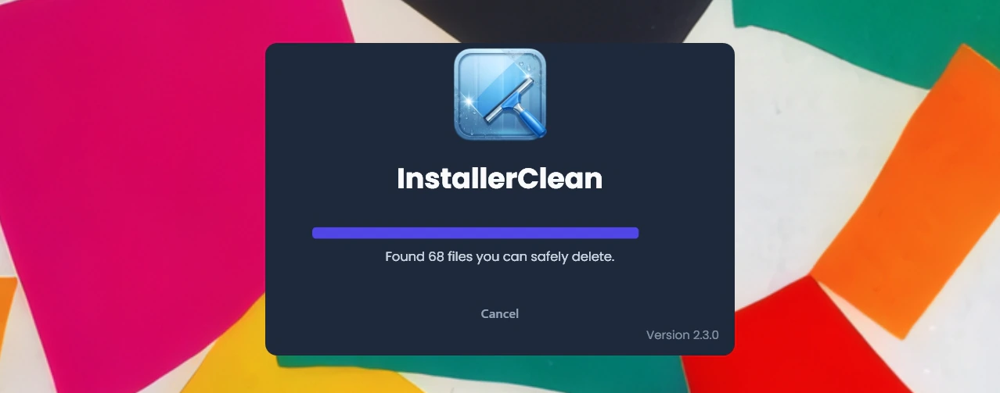
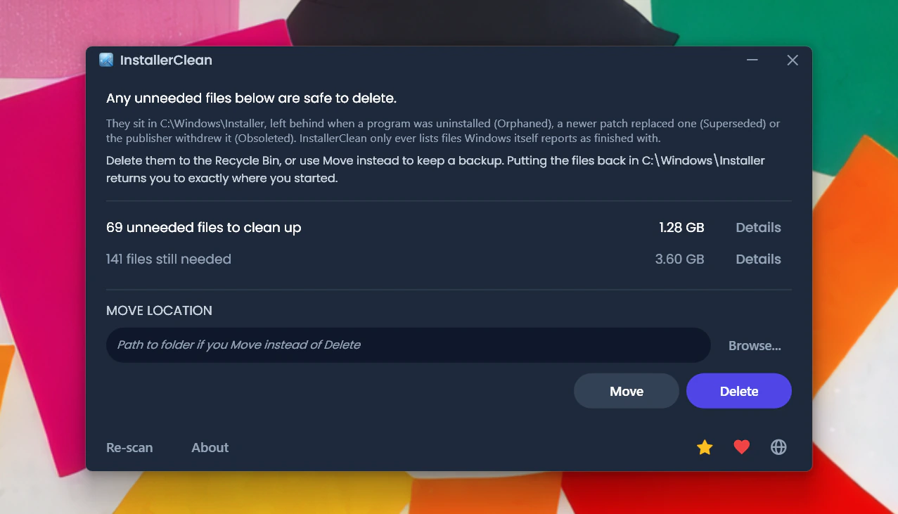
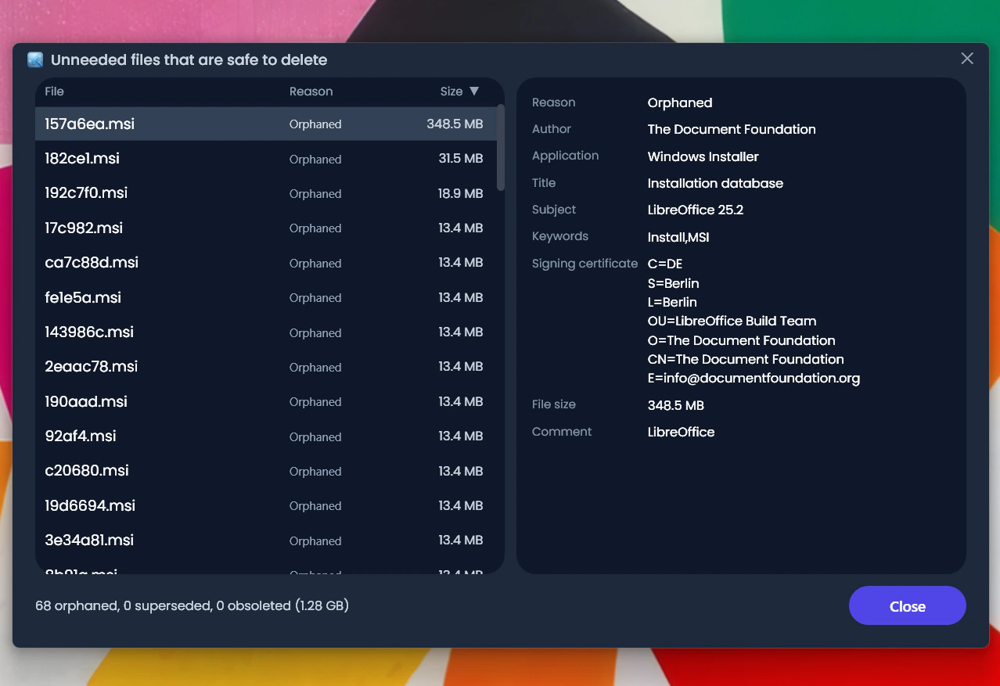
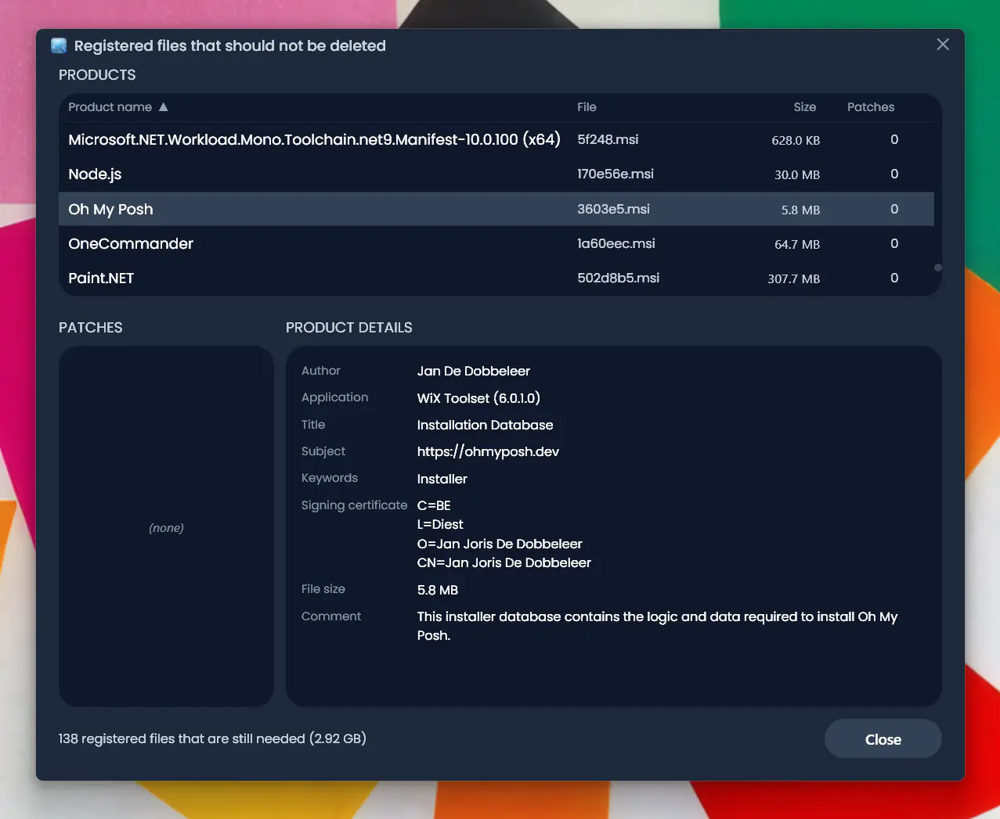
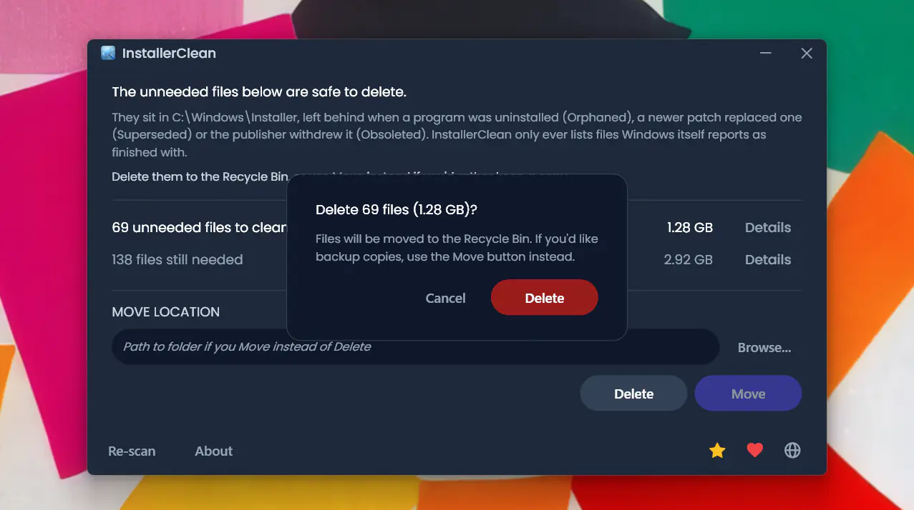
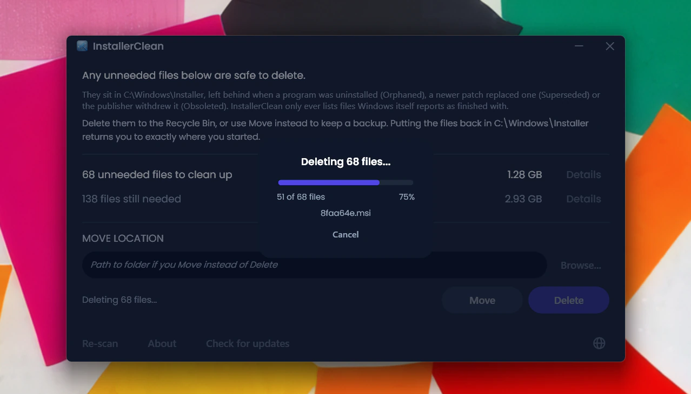
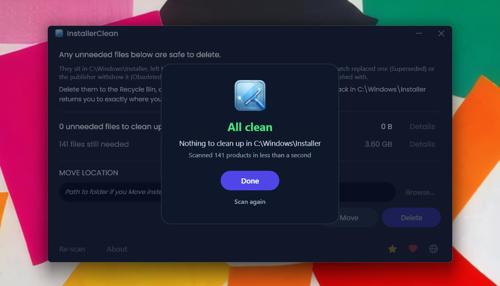
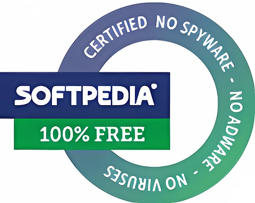
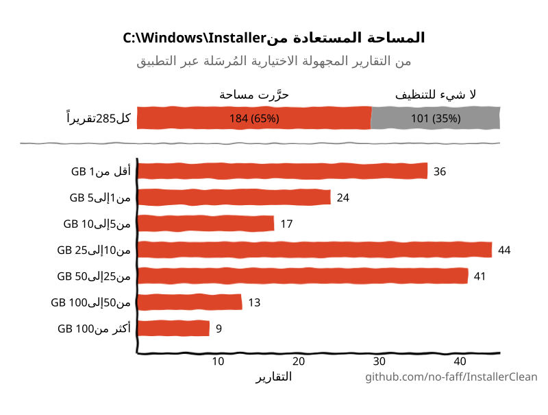
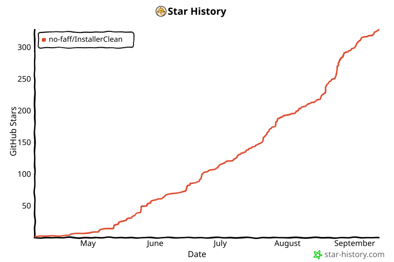

<p align="center">
  <a href="README.md">English</a> · <a href="README.zh-CN.md">简体中文</a> · <a href="README.ru.md">Русский</a> · <a href="README.es.md">Español</a> · <strong>العربية</strong> · <a href="README.ja.md">日本語</a> · <a href="README.pt-BR.md">Português (BR)</a> · <a href="README.pl.md">Polski</a> · <a href="README.tr.md">Türkçe</a> · <a href="README.ko.md">한국어</a> · <a href="README.fr.md">Français</a> · <a href="README.it.md">Italiano</a> · <a href="README.de.md">Deutsch</a> · <a href="README.id.md">Bahasa Indonesia</a> · <a href="README.vi.md">Tiếng Việt</a> · <a href="README.uk.md">Українська</a> · <a href="README.nl.md">Nederlands</a>
</p>

<p align="center"><em>البرنامج نفسه بالإنجليزية؛ ولم يُترجَم إلى العربية سوى هذا الملف التعريفي، لأن جعل الواجهة تعمل من اليمين إلى اليسار مهمة مستقلة ليوم آخر.</em></p>

<p align="center">
  
</p>

<p align="center"><em>🎶 What's my line? I'm happy <a href="https://www.youtube.com/watch?v=HM-jHhUZfFI">cleaning Windows</a></em></p>

<h1 align="center">InstallerClean</h1>

<p align="center"><strong>أداة مفتوحة المصدر لتنظيف <code>C:\Windows\Installer</code> بأمان، ذلك المجلد المخفي في Windows الذي يلتهم مساحة قرصك بهدوء.</strong></p>

<p align="center"><em>استخدمه بين الفينة والأخرى. ربما توفّر بعض المساحة. ثم امضِ في يومك نظيفاً مرتاحاً.</em></p>

<p align="center">
  <a href="LICENSE"></a>
  <a href="https://dotnet.microsoft.com/download/dotnet/10.0"></a>
  <a href="https://github.com/no-faff/InstallerClean/actions/workflows/ci.yml"></a>
  <a href="https://github.com/no-faff/InstallerClean/releases"></a>
  <a href="https://github.com/no-faff/InstallerClean/releases/latest"></a>
  <a href="https://github.com/no-faff/InstallerClean/releases"></a>
</p>


- **ما هو:** يفعل InstallerClean شيئاً واحداً: يزيل الملفات غير الضرورية من `C:\Windows\Installer`، وهو مجلد مخفي لا ينظفه Windows أبداً. بعد فحص شبه فوري يخبرك إن كان لديك أي منها، ويعرض مزيداً من التفاصيل للفضوليين، ويتيح لك حذفها لتحرير مساحة على قرص C:. تستخدمه مرة واحدة ثم تمضي في طريقك.
- **قد تكون هنا لأنك:** استخدمت [WinDirStat](https://github.com/windirstat/windirstat) أو WizTree أو TreeSize، فرأيت `C:\Windows\Installer` يشغل مساحة كبيرة ولم تعرف ما بداخله. وInstallerClean هو ما تحتاج إليه تماماً. فهو يعرف ما بداخل تلك الملفات ذات الأسماء التي تبدو عشوائية مثل `9f05cba.msi`، ويخبرك بسرعة أيّها يمكنك حذفه بأمان.
- **كم من المساحة:** تُظهر التقارير (الاختيارية والمجهولة) الواردة حتى الآن أن <!-- reports-freedpct-start -->65%<!-- reports-freedpct-end --> من الأجهزة كان فيها ملفات غير ضرورية للتنظيف. ومن بين هذه الأجهزة، بلغ الوسيط المُحرَّر <!-- reports-median-start -->14.5 GB<!-- reports-median-end --><!-- reports-biggest-start -->، وأكبر نتيجة كانت 462 GB كاملة<!-- reports-biggest-end -->. أما الـ <!-- reports-nothingpct-start -->35%<!-- reports-nothingpct-end --> الباقية فلم تجد شيئاً لإزالته، وهذا يعني ببساطة أن مجلد Installer لديها كان نظيفاً بالفعل. مزيد من التفاصيل في [الأسئلة الشائعة](#الأسئلة-الشائعة) أدناه.
- **هل هو آمن:** نعم. فهو يسأل واجهة Windows Installer البرمجية نفسها عن الملفات التي لا تزال مطلوبة، ولا يُدرج إلا ما يفيد Windows بأنه انتهى منه. إنه مفتوح المصدر (Apache 2.0) ولا يسأل عنك شيئاً: لا حساب، ولا إعلانات، ولا تتبع، ولا قياس عن بُعد، ولا شيء يعمل في الخلفية. والشيء الوحيد الذي يفعله عبر الإنترنت من تلقاء نفسه هو التحقق من GitHub بحثاً عن إصدار أحدث عند تشغيله، ويمكنك إيقاف ذلك.
- **احصل عليه:** [نزّل أحدث إصدار](../../releases/latest). شغّله؛ وتجاوز [تحذير «ناشر غير معروف»](#unknown-publisher) و[طلب صلاحيات المسؤول](#admin). احذف أي ملفات غير ضرورية. تم.

## المحتويات

- [المجلد الذي لا يخبرك عنه أحد](#المجلد-الذي-لا-يخبرك-عنه-أحد)
- [البحث عن حل](#البحث-عن-حل)
- [ما الذي يفعله](#ما-الذي-يفعله)
- [لقطات الشاشة](#لقطات-الشاشة)
- [كيف يعمل](#كيف-يعمل)
- [هل هو آمن؟](#هل-هو-آمن)
- [سياسة توقيع الشيفرة البرمجية](#سياسة-توقيع-الشيفرة-البرمجية)
- [إذا فقدت بالفعل ملفاً من C:\Windows\Installer](#recovery)
- [إمكانية الوصول](#إمكانية-الوصول)
- [ما الذي لا يفعله](#ما-الذي-لا-يفعله)
- [الأسئلة الشائعة](#الأسئلة-الشائعة)
- [التنزيل](#التنزيل)
- [مقارنة مع PatchCleaner](#مقارنة-مع-patchcleaner)
- [سطر الأوامر](#سطر-الأوامر)
- [المتطلبات](#المتطلبات)
- [البناء من المصدر](#البناء-من-المصدر)
- [المساهمة](#المساهمة)
- [ادعم المشروع](#ادعم-المشروع)
- [سجل النجوم](#سجل-النجوم)
- [الترخيص](#الترخيص)

---

## المجلد الذي لا يخبرك عنه أحد

على كل جهاز يعمل بنظام Windows مجلد مخفي اسمه `C:\Windows\Installer`. في كل مرة تثبّت فيها برنامجاً يستخدم نظام Windows Installer، أو تطبّق تصحيحاً (patch) على Microsoft Office أو Adobe Acrobat أو Visual Studio أو أي تطبيق آخر قائم على `.msi`، تذهب نسخة من ذلك المثبّت أو من ملف التصحيح `.msp` إلى هذا المجلد، وتبقى فيه.

وعندما تلغي تثبيت البرنامج، تبقى الملفات. وعندما يحل تصحيح أحدث محل تصحيح أقدم، يبقى الاثنان. لا ينظفها Windows أبداً. ولا يمسّها تنظيف القرص (Disk Cleanup). وأداة DISM مخصصة لمجلد مختلف تماماً. ومع الوقت ينمو المجلد: 1 GB، ثم 5 GB، ثم 20 GB، ثم 50 GB. وعلى الأجهزة المثقلة بالبرامج التي تكثر من استخدام MSI (وAcrobat مذنب متكرر)، قد [يتجاوز 100 GB](https://www.reddit.com/r/sysadmin/comments/1oxcrmh/acrobat_filling_up_the_cwindowsinstaller_folder/).

وهذه ليست ملفات مؤقتة تعود من تلقاء نفسها. إنها ثقل ميت حقيقي: مثبّتات قديمة لبرامج ألغيت تثبيتها منذ سنوات، وتصحيحات استُبدلت عدة مرات. وحين تزول، لا تعود.

**إن كنت تبحث عن طريقة سهلة لتحرير مساحة على قرص Windows، فهذا المجلد نقطة بداية جيدة.** يعثر InstallerClean على الملفات غير الضرورية ويزيلها بأمان.

## البحث عن حل

إن سبق أن بحثت عن حل لمشكلة هذا المجلد، فأنت على الأرجح تعرف كيف تسير الأمور. شخص لديه 180 GB في `C:\Windows\Installer` يسأل كيف ينظفه. [يُنصح بتشغيل تنظيف القرص](https://learn.microsoft.com/en-us/answers/questions/4238108/windows-installer-folder-has-occupied-180gb). يجرّبه. فيحرر 600 MB، لا شيء منها من ذلك المجلد (لأن تنظيف القرص لا يمسّ `C:\Windows\Installer`). ثم يخفت النقاش.

> *«كل النقاشات التي وجدتها تميل إلى اقتراح الأشياء نفسها التي لا تحل المشكلة، ثم تموت.»*
>
> [ksparks519, r/Windows10](https://www.reddit.com/r/Windows10/comments/1bt8c5p/anyone_ever_figure_out_giant_installer_folders/) (مترجمة عن الأصل الإنجليزي)

أو يُقال لهم ألا يلمسوه إطلاقاً. في أحد النقاشات، قيل لشخص لديه مجلد Installer بحجم 60 GB: [«لا تعبث به.»](https://www.reddit.com/r/techsupport/comments/1hw4suq/my_windows_installer_folder_is_like_60gb_so_i/) وعندما سأل عمّا ينبغي أن يفعله بدلاً من ذلك، كان الرد: *«لقد أخبرتك للتو.»*

تخلط النصيحة المعتادة بين حذف الملفات عشوائياً (وهو خطر حقاً) وبين إزالة الملفات التي يقول Windows نفسه إنه لم يعد يحتاجها (وهو ليس بخطر). يفعل InstallerClean الأمر الثاني.

## ما الذي يفعله

1. **يفحص** `C:\Windows\Installer` بحثاً عن ملفات `.msi` و`.msp`
2. **يستعلم** من واجهة Windows Installer البرمجية لمعرفة الملفات التي لا تزال مسجّلة
3. **يعرض** مقدار ما يمكنك تحريره ومقدار ما لا يزال مطلوباً، مع نوافذ تفصيلية اختيارية تسرد كل ملف
4. **يزيل** الملفات غير الضرورية: حذفاً إلى سلة المحذوفات، أو نقلاً إلى مجلد تختاره

## لقطات الشاشة

<p>
  <br>
  <em>الفحص الأولي. وهو سريع جداً.</em>
  <br><br>
</p>

<p>
  <br>
  <em>النتائج: كم لا يزال مطلوباً، وكم يمكن إزالته.</em>
  <br><br>
</p>

<p>
  <br>
  <em>تفاصيل الملفات التي لم تعد مطلوبة.</em>
  <br><br>
</p>

<p>
  <br>
  <em>تفاصيل الملفات التي لا تزال مطلوبة، مع بيانات وصفية مقروءة من قاعدة بيانات المثبّت.</em>
  <br><br>
</p>

<p>
  <br>
  <em>تأكيد قبل أي من الإجراءين. الحذف ينقل إلى سلة المحذوفات؛ والنقل يضع الملفات في مكان تختاره.</em>
  <br><br>
</p>

<p>
  <br>
  <em>أثناء تنفيذ الحذف. يمكن إلغاؤه في منتصف الطريق.</em>
  <br><br>
</p>

<p>
  <br>
  <em>بعد عملية حذف ناجحة.</em>
  <br><br>
</p>

<p>
  <br>
  <em>بعد إعادة الفحص. لم يبق شيء للتنظيف.</em>
  <br><br>
</p>

## كيف يعمل

يحدد InstallerClean ثلاثة أنواع من الملفات غير الضرورية.

**الملفات اليتيمة** هي مثبّتات `.msi` (وأي تصحيحات `.msp`) المتروكة بعد إلغاء تثبيت البرامج. لم يعد Windows يشير إليها، لكنها تظل في المجلد تشغل مساحة.

**التصحيحات المستبدَلة** هي تصحيحات `.msp` قديمة حلّت محلها أخرى أحدث. يضع Windows علامة «مستبدَل» عليها في قاعدة بياناته الخاصة لكنه لا يحذفها أبداً. وسبب تكرار هذه المسألة إلى هذا الحد هو Adobe تحديداً: فكل تحديث من تحديثات Acrobat يصدر في صورة تصحيح على المثبّت الأصلي نفسه، لا في صورة مثبّت جديد مستقل، فينتهي الأمر بالجهاز إلى الاحتفاظ بتصحيح عن كل تحديث مرّ به. وOffice وأدوات التطوير الكبيرة تتراكم بالطريقة نفسها، لكن ببطء أكبر.

**التصحيحات المُلغاة** هي تصحيحات `.msp` سحبها الناشر أو أوقف العمل بها بدلاً من استبدالها بنسخة أحدث. يسجّل Windows هذه الحالة أيضاً، ويترك الملف في المجلد كذلك.

للعثور عليها، يستدعي InstallerClean واجهة COM الخاصة بـ Windows Installer مباشرة عبر P/Invoke:

- `MsiEnumProductsEx` لتعداد كل منتج مثبّت
- `MsiEnumPatchesEx` للعثور على كل التصحيحات المسجّلة لكل منتج
- `MsiGetPatchInfoEx` لقراءة حالة التصحيح (مُطبَّق أو مستبدَل أو مُلغى)

أي ملف `.msi` أو `.msp` في `C:\Windows\Installer` لا يطالب به منتج مسجّل يكون يتيماً ويوسَم بأنه قابل للإزالة. وكذلك أي تصحيح تضع قاعدة البيانات علامة «مستبدَل» أو «مُلغى» عليه ولا يكون مطلوباً لإلغاء التثبيت.

يقرأ التطبيق كذلك السجلات نفسها مباشرة من السجل (registry) في كل فحص، كمصدر ثانٍ مستقل. وإذا عادت إحدى القراءتين ناقصة (نادر، لكنه قد يحدث مع حالة مثبّت تالفة)، يحتفظ InstallerClean بالملفات أو يرفض الفحص بدل أن يخمّن. ولا تضيف هذه القراءة الثانية الملفات إلا إلى مجموعة «ما زال مطلوباً»، ولا تضيفها أبداً إلى مجموعة «القابل للإزالة».

بعد اكتمال النقل أو الحذف، تُزال في الجولة نفسها المجلدات الفرعية الفارغة داخل `C:\Windows\Installer` (الأدلة التي يخلّفها المخزن المؤقت بعد زوال محتواها).

<a id="is-it-safe"></a>
## هل هو آمن؟

نعم. يستعلم InstallerClean من قاعدة بيانات Windows Installer البرمجية نفسها التي يستخدمها Windows لتتبع ما هو مثبّت. فإذا قال Windows إن ملفاً لم يعد مطلوباً، وثق التطبيق بذلك؛ وهو لا يخمّن بناءً على أسماء الملفات أو تواريخها.

**عن الحذف والنقل.** الملفات التي يحذفها InstallerClean آمنة للحذف نهائياً. زر **الحذف** ينقلها إلى سلة المحذوفات (وسيُنبَّهك إن لم تكن متاحة)؛ وتستعيد المساحة على قرص C: عندما تفرّغ سلة المحذوفات.

لكنك لست مضطراً إلى تصديقي في أن الملفات آمنة للحذف. فما دامت في سلة المحذوفات، أمامك فرصة للتحقق من أن التطبيقات التي تستخدم هذا المجلد، مثل Office وAcrobat وVisual Studio وما شابهها، لا تزال تُحدَّث ويُلغى تثبيتها دون مشكلة. وإن وجدت شيئاً معطّلاً (وهذا احتمال ضئيل للغاية، ولم يرد أي بلاغ حتى الآن بعد <!-- downloads-start -->70,000+<!-- downloads-end --> عملية تنزيل)، فاستعد الملفات من سلة المحذوفات لإصلاحه. ولمزيد من الأمان، يمكنك بدلاً من ذلك استخدام **النقل** لعمل نسخة احتياطية من الملفات في مجلد تختاره (واختر بالطبع مجلداً على قسم أو قرص آخر إن كنت تريد تحرير مساحة على C:). ولإعادة كل شيء إلى ما كان عليه، ما عليك إلا نسخ الملفات مرة أخرى إلى `C:\Windows\Installer` (وإن كان يكاد يكون مؤكداً أنك لن تحتاج إلى ذلك أبداً). وإن حمل أحد الملفات «(1)» في اسمه (ويحدث ذلك إن نقلت الملفات إلى المجلد نفسه مرتين)، فاحذفها من الاسم قبل نسخ الملف مرة أخرى.

إذا كان Windows Installer يكتب حالياً إلى المخزن المؤقت، أو لديه معاملة سابقة معلّقة، أو لديه عملية إعادة تسمية مجدولة بعد إعادة التشغيل تستهدف المخزن المؤقت، فإن النقل والحذف يُعطَّلان ويُعرَض السبب المحدد.

خدمات الفحص والاستعلام والنقل والحذف والإعدادات وإعادة التشغيل المعلّقة مغطاة بمجموعة اختبارات آلية تعمل مع كل commit (انظر شارة CI أعلاه).

**التحقق من الملف الثنائي.** InstallerClean غير موقّع، لكن لست مضطراً إلى الوثوق بأنه آمن:

- بصمات SHA-256 لكل إصدار مدرجة في [صفحة الإصدارات](../../releases/latest).
- VirusTotal: تُفحص كل نسخة، مع روابط للنتائج الكاملة لكل محرك على صفحة إصدارها لتتمكن من رؤية كيف صُنِّف كل ملف وإعادة فحصه بنفسك. والإنذار الكاذب القائم وقت صدور إصدار ما يُذكر ويُشرح في صفحة ذلك الإصدار، وتُحدَّث الصفحة بمجرد أن يتراجع عنه المورّد.
- الشيفرة المصدرية على [github.com/no-faff/InstallerClean](https://github.com/no-faff/InstallerClean)، وتقوم CI ببناء واختبار كل commit (انظر شارة CI الخضراء أعلاه).
- بناء الإصدارات حتمي: إعدادات المُصرِّف تجعل الشيفرة نفسها والـ SDK نفسه يُنتجان البايتات نفسها، وعملية الإصدار ترفض وضع tag على أي إصدار ما لم تكن ملفات exe المنشورة قد بُنيت من شجرة عمل نظيفة عند ذلك الـ tag تحديداً. لذا يمكنك جلب الشيفرة عند ذلك الـ tag وبناءها بنفسك ومقارنة البصمات بالبصمات المنشورة: فيثبت بذلك أن ما نزّلته يطابق الشيفرة المصدرية العلنية. طابِق إصدار الـ SDK أولاً (ملاحظات كل إصدار تذكر إصدار الـ SDK الذي بُني به)؛ إصدار تصحيحي مختلف من الـ SDK يُنتج بايتات مختلفة، وهذا يبدو وكأنه عدم تطابق، لكنه ليس كذلك.
- <!-- downloads-start -->70,000+<!-- downloads-end --> عملية تنزيل عبر GitHub وMajorGeeks وSoftpedia.
- يختبر [MajorGeeks](https://www.majorgeeks.com/files/details/installerclean.html) كل إصدار مُرسَل في جهاز افتراضي ولا يدرجه إلا إذا اجتاز مراجعتهم.<br><a href="https://www.majorgeeks.com/files/details/installerclean.html"></a>
- يفحص [Softpedia](https://www.softpedia.com/get/System/Hard-Disk-Utils/InstallerClean.shtml) كل إصدار بحثاً عن الفيروسات وبرامج التجسس والإعلانات.<br><a href="https://www.softpedia.com/get/System/Hard-Disk-Utils/InstallerClean.shtml"></a>

## سياسة توقيع الشيفرة البرمجية

قدّم InstallerClean طلباً إلى [SignPath Foundation](https://signpath.org) للحصول على توقيع مجاني للشيفرة، وهو برنامج يوقّع البرمجيات مفتوحة المصدر حتى تكفّ عن الوصول إلى جهازك من ناشر غير معروف. والطلب قيد النظر، فالتنزيلات هنا غير موقّعة في الوقت الحالي وسينبّهك Windows بشأنها.

وإن قُبل الطلب، فسيحمل كل إصدار السطر الذي تطلبه SignPath: «free code signing provided by SignPath.io, certificate by SignPath Foundation». والشهادة ملك للمؤسسة لا لي، لأن الشهادة لا بد أن تُصدر باسم كيان قانوني، ومشروع يديره شخص واحد ليس كذلك. وهذا لا يعني أن InstallerClean ملكهم، ولا أنهم يشاركون فيه بما يتجاوز التوقيع.

**الأدوار.** يتولّى InstallerClean شخص واحد، هو أنا، وكلها بيدي:

- المساهمون بالشيفرة ومراجعوها، أي من يمكنه إدخال شيفرة إلى المشروع: أنا. ويُراجَع كل طلب سحب قبل دمجه.
- المعتمِدون، أي من يمكنه الإذن بتوقيع إصدار: أنا.

**الخصوصية.** لا أعرف عنك ولا عن ملفاتك شيئاً، إلا أن تختار أنت إرسال ذلك التقرير المجهول الاختياري تماماً، وهو لا يفعل سوى أن يخبرني بأن التطبيق يعمل. لا إعلانات ولا قياس عن بُعد. والاتصالات الأخرى الوحيدة هي فحص الإصدار عند تشغيل التطبيق (طلب واحد إلى GitHub يمكنك إيقافه من نافذة «حول») وأزرار تحيل إلى GitHub وإلى صفحة يمكنك التبرع فيها إن طابت نفسك بذلك. [سياسة الخصوصية](PRIVACY.md) كاملةً (بالإنجليزية).

<a id="recovery"></a>
## إذا فقدت بالفعل ملفاً من `C:\Windows\Installer`

لا يزيل InstallerClean إلا الملفات التي يفيد Windows نفسه بأنها لم تعد مطلوبة، فلا يمكن أن يكون أبداً سبب فقدان ملف. لكن إن كان أحدها قد فُقد بالفعل، يرصده InstallerClean وينبّه إليه. وإليك الحل.

نزّل مثبّت ذلك البرنامج من صانعه وشغّله فوق تثبيتك الحالي؛ ولا تلغِ التثبيت أولاً. واستخدم النسخة التي لديك الآن إن أمكن، لأن Windows قد يرفض نسخة مختلفة. هذا يعيد الملف في العادة ويترك إعداداتك دون مساس. أعد الفحص في InstallerClean وسيختفي التحذير إن نجح الأمر.

هذا ينجح في العادة. وما يلي هو رواية Microsoft نفسها الأوفى: التفاصيل الرسمية، والحالات الأصعب حين لا يكون الأمر بهذه البساطة. لا شيء من ذلك من فعل InstallerClean، ولا أستطيع تحسين إرشادات Microsoft، فأنا أنقلها فحسب.

<details>
<summary>موقف Microsoft الأوفى</summary>

*اقتباسات Microsoft التالية بالنص الإنجليزي الأصلي.*

الإرشادات الكاملة: [Restore missing Windows Installer cache files](https://learn.microsoft.com/en-us/troubleshoot/windows-client/application-management/missing-windows-installer-cache).

*قد لا يظهر فوراً:*
> "If the installer cache is compromised, you may not immediately see problems until you take an action such as uninstalling, repairing, or updating a product."

*الملفات فريدة لكل جهاز، فلا يمكنك نسخ ملف من حاسوب آخر:*
> "Missing files cannot be copied between computers because the files are unique."

*ولا يمكنك أيضاً سحب الملف وحده من نسخة احتياطية:*
> "To restore the missing files, a full system state restoration is required. It is not possible to replace only the missing files from a previous backup."

*طريقة الاسترداد الموصى بها، وحدودها الصريحة:*
> "If application files are missing from the Windows Installer Cache, ask the vendor or support team for the application about the missing files. You must follow the procedures or steps recommended by the application vendor to restore the files. In some cases, you may have to rebuild the operating system and reinstall the application to fix the problem."
>
> "Windows support engineers cannot help you recover missing application files from the Windows Installer cache."

*لماذا تهم النسخة نفسها:*
> "The upgrade cannot be installed by the Windows Installer service because the program to be upgraded may be missing, or the upgrade may update a different version of the program."

</details>

## إمكانية الوصول

صُمّم InstallerClean ليكون قابلاً للاستخدام بالكامل من لوحة المفاتيح ومع قارئ الشاشة.

- **قابل للتشغيل بالكامل من لوحة المفاتيح.** يصل مفتاح Tab إلى كل عنصر تحكم، وتُرتَّب أعمدة نوافذ التفاصيل من لوحة المفاتيح، فلا شيء هنا يحتاج إلى فأرة. ويبقى مؤشر تركيز لوحة المفاتيح مرئياً أينما حلّ.
- **الراوي والوصول الصوتي.** كل عنصر تحكم موسوم، والكلمة الظاهرة على الزر هي الكلمة التي تفعّله بالصوت. وعند انتهاء عملية نقل أو حذف، تُقرأ النتيجة بصوت مسموع.
- **مصمَّم ليُقرأ.** يفي النص بتباين WCAG AA في جميع أنحاء المظهر الداكن.

إن اعترض شيء هنا طريقك، [افتح مشكلة (issue)](../../issues). مشكلات إمكانية الوصول عيوب برمجية، لا حالات هامشية.

## ما الذي لا يفعله

- WinSxS (`C:\Windows\WinSxS`) مجلد مختلف بقواعد مختلفة. ولأجله، شغّل `Dism /Online /Cleanup-Image /StartComponentCleanup` من موجّه أوامر بصلاحيات مرتفعة.
- لا خدمة في الخلفية، ولا مهمة مجدولة، ولا تنظيف تلقائي. يعمل التطبيق حين تشغّله.
- لا يغيّر برامجك المثبّتة ولا قاعدة بيانات Windows Installer، بل يقرؤها فقط. الشيء الوحيد الذي يكتبه إلى السجل هو تسجيل مصدر الأحداث لمرة واحدة، الذي تحتاجه أداة سطر الأوامر كي تظهر عمليات تشغيلها في سجل أحداث Windows.
- يُجري اتصالاً واحداً من تلقاء نفسه: فحص سريع لصفحة الإصدارات على GitHub بحثاً عن إصدار أحدث عند تشغيله، ويمكنك إيقافه من نافذة «حول». وكل ما عدا ذلك لا يحدث إلا حين تطلب منه: التقرير المجهول الاختياري (فقط ليعلمني أنه يعمل)، وروابط إلى وثائق GitHub وصفحة تبرع، تُفتح في متصفحك إن نقرت عليها. وهو لا ينزّل أي شيء من تلقاء نفسه أبداً.
- لا أشرطة أدوات، ولا برامج مرفقة، ولا برامج إعلانية.

## الأسئلة الشائعة

<a id="reports-stats"></a>
**هل سأحرّر فعلاً غيغابايتات من المساحة؟** يعتمد ذلك على جهازك. تثبيت Windows 11 نظيف دون برامج إضافية لا شيء فيه للإزالة. أما محطة عمل مطوّر تعمل منذ زمن طويل، أو أي جهاز مثقل ببرامج قائمة على MSI (Acrobat وOffice وLibreOffice وأدوات التطوير الكبيرة)، فقد يكون فيها عشرات الغيغابايتات. وفي الحالتين، سترى المقدار بالضبط لحظة تشغيله.

<!-- reports-stats-start (generated; do not hand-edit between these markers) -->
منذ الإصدار v1.8.0 صار بالإمكان إرسال تقرير مختصر ومجهول عن النتيجة. وصل حتى الآن 270 تقريراً (شكراً للجميع 🙏)، ومن بين الأجهزة التي كان لديها ما تنظّفه، وهي 65%، بلغ الوسيط المُحرَّر 14.5 GB. واستعاد أحد الأجهزة 462 GB، وهو رقم مذهل. وفيما يلي ملخّص النتائج.

<p align="center">
  <picture>
    <source media="(prefers-color-scheme: dark)" srcset="docs/reports-ar-dark.svg" />
    <source media="(prefers-color-scheme: light)" srcset="docs/reports-ar-light.svg" />
    
  </picture>
</p>

إرسال التقرير هو نقرة واحدة على زر في التطبيق، وهو اختياري تماماً. لا يتضمّن أي شيء شخصي، ويعرض لك بالضبط ما سيُرسَل، هكذا:


<!-- reports-stats-end -->

<a id="admin"></a>

**لماذا يطلب صلاحيات المسؤول؟** `C:\Windows\Installer` مقيّد للمسؤولين. قراءته، والاستعلام من قاعدة بيانات المثبّت، ونقل الملفات أو حذفها، كلها تتطلب ذلك، فلا بد أن يعمل التطبيق بصلاحيات المسؤول.

<a id="unknown-publisher"></a>

**لماذا يقول Windows «ناشر غير معروف»؟** لأن InstallerClean ليس موقّعاً رقمياً، ولأن Windows يضع علامة على الملفات المنزّلة من الإنترنت، فعند أول تشغيل يعرض SmartScreen عادةً رسالة «قام Windows بحماية الكمبيوتر الخاص بك» مع إدراج الناشر على أنه غير معروف. شهادة التوقيع المدفوعة تكلّف مالاً كل عام، وأفضّل أن أبقي التطبيق مجانياً على أن أدفع ثمنها، فتقدّمت بطلب إلى SignPath Foundation، وهي توقّع البرمجيات مفتوحة المصدر بلا مقابل (انظر [سياسة توقيع الشيفرة البرمجية](#سياسة-توقيع-الشيفرة-البرمجية)). وريثما يتم ذلك، انقر **مزيد من المعلومات**، ثم **التشغيل على أي حال**. وهذا آمن: الشيفرة المصدرية علنية، ولكل إصدار روابط VirusTotal وبصمات SHA-256 يمكنك التحقق منها أولاً.

**هل يمكنني التراجع عن الحذف؟** نعم في العادة. فحين تكون سلة المحذوفات متاحة للقرص، ينقل الحذف الملفات إليها ويمكنك استعادتها منها. وإن لم تكن السلة متاحة، فإن التطبيق لا يحذف نهائياً من تلقاء نفسه أبداً (انظر [هل هو آمن؟](#هل-هو-آمن)). وإن كنت تفضّل طريق عودة تتحكم فيه بنفسك، فإن النقل يضع الملفات في مجلد تختاره؛ احذفها من هناك متى اطمأننت.

**هل يشتكي Windows إن أزلت هذه الملفات؟** لا. لا يزيل InstallerClean إلا الملفات التي يفيد Windows نفسه بأنه انتهى منها، فليس فيما يزيله شيء مطلوب لإصلاح برنامج أو تحديثه أو إلغاء تثبيته. وإن فُقد ملف مطلوب من `C:\Windows\Installer` بطريقة أخرى، فانظر [إذا فقدت بالفعل ملفاً من C:\Windows\Installer](#recovery).

**لماذا لا يُستخدَم `Win32_Product` (WMI)؟** [`Win32_Product` يطلق عمليات إصلاح MSI على كل منتج أثناء التعداد](https://gregramsey.net/2012/02/20/win32_product-is-evil/)، وهو ما قد يستغرق دقائق ويحمّل القرص بشدة. يستدعي InstallerClean واجهة COM الخاصة بـ Windows Installer مباشرة دون آثار جانبية.

**ولماذا لا يكتفى بسكربت PowerShell؟** سكربت قصير يستدعي `MsiEnumPatchesEx` يكفي *لسرد* التصحيحات، لكن الأجزاء الجوهرية في InstallerClean هي ما يمر عليه السكربت مرور الكرام: التصنيف بين اليتيم والمستبدَل، والرجوع إلى السجل الذي لا يضيف الملفات إلا إلى مجموعة «ما زال مطلوباً» (لا إلى «القابل للإزالة» أبداً)، وحجب العمل عند وجود إعادة تشغيل معلّقة، وشبكة أمان النقل إلى مكان آخر، وتتبع التقدم لكل ملف مع إمكانية الإلغاء، والإعداد الافتراضي بالحذف إلى سلة المحذوفات لا الحذف النهائي. والحالات الهامشية على الأجهزة المثقلة فعلاً بـ MSI (تسجيلات تالفة، ووصلات (junctions) داخل المخزن المؤقت، ومنتجات في `HKU\.DEFAULT`، ومعاملات مثبّت معلّقة) يسهل أن يخطئ في معالجتها سكربت لمرة واحدة. وأداة `installerclean-cli` هي الواجهة بلا رسوميات إن كان ما تريده هو البرمجة النصية.

**هل يعمل على Windows 7 أو 8؟** غير مُختبَر وغير مدعوم. يستهدف Windows 10 و11.

**هل يصلح لإدارة الأجهزة عن بُعد (RMM) أو النشر الواسع؟** نعم. تنتهي الأداة الطرفية برموز مميزة لكل نتيجة (0 نجاح، 2 جزئي، 1 فشل تام، 75 عارض، 130 لـ Ctrl+C قبل معالجة أي ملف؛ وCtrl+C يقع في منتصف الدفعة ينتهي بالرمز 2، لأن عملاً قد نُفّذ)، حتى تتمكن مهمة مجدولة من إعادة المحاولة عند الرمز 75 دون خلطه بالأعطال الجسيمة. وتكتب ملخصاً لكل تشغيل في سجل أحداث التطبيقات، وتحترم قفل المثيل الواحد نفسه الذي تحترمه الواجهة الرسومية. كما يثبّت المُثبِّت بصمت باستخدام مفاتيح Inno Setup المعتادة (`/SILENT` أو `/VERYSILENT`)؛ ويُتخطّى التشغيل بعد التثبيت في التثبيتات الصامتة. انظر قسم سطر الأوامر.

## التنزيل

ثلاث نسخ، اختر واحدة:

- **Setup** (`InstallerClean-2.3.0-setup.exe`): مثبّت Windows عادي مع تضمين بيئة تشغيل .NET 10. يضيف إدخالاً في قائمة ابدأ ويُلغى تثبيته بنظافة. مُدرَج ضمن البرامج ليسهل العثور عليه بعد ستة أشهر.
- **Portable** (`InstallerClean-2.3.0-portable.exe`): ملف exe واحد مكتفٍ ذاتياً مع تضمين بيئة التشغيل. بلا تثبيت وبلا أداة إلغاء تثبيت. شغّله، استخدمه، احذفه. وأعد تشغيله متى شئت.
- **CLI** (`installerclean-cli.exe`): نسخة سطر الأوامر وحدها، ملف exe واحد مكتفٍ ذاتياً. بلا تثبيت، ولا يبقى شيء على الجهاز بعده. ضعه على جهاز عميل، شغّل فحصاً أو تنظيفاً، ثم احذفه. مبني للبرمجة النصية والمهام المجدولة والنشر الواسع، حيث تريد العمليات دون تطبيق سطح مكتب على العميل. انظر [سطر الأوامر](#سطر-الأوامر) للوسائط ورموز الخروج.

بدءاً من الإصدار 2.2.0، يحمل اسما ملف التثبيت والنسخة المحمولة رقم الإصدار، فتقول النسخة المُنزَّلة دائماً ما هي؛ أما أداة سطر الأوامر فتحتفظ باسمها البسيط `installerclean-cli.exe` كي تستمر المهام المجدولة والبرامج النصية التي تشير إليه في العمل عبر التحديثات.

نزّله من [صفحة الإصدارات](../../releases/latest)، ثم شغّله. وهو غير موقّع، فيعرض Windows تحذير «ناشر غير معروف»؛ وتشرح [الأسئلة الشائعة](#unknown-publisher) ما ستراه ولماذا هو آمن.

يفحص التطبيق تلقائياً عند بدء التشغيل. راجع النتائج، ثم انقر **حذف** أو **نقل**.

أو ثبّته عبر [winget](https://learn.microsoft.com/windows/package-manager/winget/):

```
winget install NoFaff.InstallerClean
```

أو ثبّته عبر [Scoop](https://scoop.sh):

```
scoop install installerclean
```

## مقارنة مع PatchCleaner

إن سبق أن بحثت عن هذا المجلد، فالأداة التي على الأرجح وجدتها هي [PatchCleaner](https://www.homedev.com.au/free/patchcleaner). لا تزال تعمل بقوة، لكنني صنعت InstallerClean لأن PatchCleaner مغلق المصدر، ولم يحصل على تحديث منذ مارس 2016، ولا يمسّ منتجات Adobe افتراضياً. فقد كان فحصه لليتامى يسم تصحيحات Adobe خطأً، وكانت إزالتها تعطّل تحديثات Adobe، لذا يترك كل ملفات Adobe دون مساس ما لم تُعطّل المرشّح. وعلى الأجهزة التي تكون فيها Adobe أسوأ مذنب، هناك تكمن معظم المساحة:

> *«حمّلت PatchCleaner لحذف ملفات `.msp` اليتيمة، لكن يبدو أن ذلك لن يحرّر سوى 250 MB من المساحة. فـ 29 GB من الملفات "مستبعَدة بالمرشّحات"، فلا يبدو أن PatchCleaner يساعد.»*
>
> HeatherBunny1111, [r/techsupport](https://www.reddit.com/r/techsupport/comments/1qc4tcf/how_to_delete_msp_files_safely/) (مترجمة عن الأصل الإنجليزي)

يقرأ InstallerClean سجلات التصحيحات الخاصة بـ Windows Installer نفسه، فبدلاً من إخفاء كل ملفات Adobe خلف مرشّح شامل، يستطيع تمييز التصحيحات التي وسمها Windows بأنها مستبدَلة، ويصنّفها على هذا النحو بالضبط. وإليك كيف تتقارن الأداتان:

| | **InstallerClean** | **PatchCleaner** |
|---|---|---|
| آخر تحديث | 2026 (نشط) | 3 مارس 2016 |
| الشيفرة المصدرية | مفتوحة المصدر (Apache 2.0) | مغلقة المصدر |
| بيئة التشغيل | .NET 10 (مكتفية ذاتياً) | .NET + VBScript |
| الواجهة البرمجية | Windows Installer COM (داخل العملية) | Windows Installer COM (خارج العملية عبر VBScript) |
| كشف التصحيحات المستبدَلة | نعم | لا |
| التعامل مع Adobe | يكشف التصحيحات المستبدَلة | يستبعدها افتراضياً |
| الواجهة | مظهر داكن (WPF) | Windows Forms |
| جمع البيانات | لا شيء | لا شيء |
| أمان الحذف | سلة المحذوفات. إن لم تكن متاحة، يسأل: انقل بدلاً من ذلك أو احذف نهائياً | نهائي، بلا سلة محذوفات |

> **ملاحظة عن `Win32_Product`:** النهج الشائع المعيب لسرد المنتجات المثبّتة هو `Win32_Product` (WMI)، الذي [يطلق عمليات إصلاح MSI](https://gregramsey.net/2012/02/20/win32_product-is-evil/) على كل منتج أثناء التعداد. وكلٌّ من InstallerClean وPatchCleaner يتجنّبه. وكلاهما يستخدم واجهة Windows Installer COM. واسم الملف `WMIProducts.vbs` في سكربت PatchCleaner مضلّل؛ فالسكربت يستخدم MSI COM لا WMI.

كما تقدّم [Ultra Virus Killer (UVK)](https://www.carifred.com/uvk/) تنظيف مجلد Installer ضمن وحدة System Booster، لكنها أداة مدفوعة (15-25 دولاراً) والتنظيف ميزة صغيرة واحدة داخل تطبيق أكبر بكثير. أما InstallerClean فمجاني ومركّز ومفتوح المصدر.

منظّفات النظام العامة مثل [CCleaner](https://www.ccleaner.com/) و[BleachBit](https://www.bleachbit.org/) لا تمسّ `C:\Windows\Installer`. فالمجلد يحتاج إلى استعلامات من واجهة Windows Installer البرمجية للتمييز بين الحزم المسجّلة وغير الضرورية، ومنظّف عام يكتفي بالمرور على شجرة الملفات قد يعطّل التطبيقات المثبّتة. وInstallerClean هو الأداة التي تلجأ إليها حين يكون هذا هو المجلد الذي تريد تنظيفه فعلاً.

## سطر الأوامر

يدعم InstallerClean التشغيل بلا واجهة للبرمجة النصية واستخدام مسؤولي النظام:

```
Usage:
  installerclean-cli --help   Show this help (also accepts /?, -h)
  installerclean-cli --version  Print the version (also accepts -v)
  installerclean-cli /s       Scan only - list removable files
  installerclean-cli /d       Delete removable files (Recycle Bin)
  installerclean-cli /m       Move to saved default location
  installerclean-cli /m PATH  Move to specified path
```

مُخرَجات الأداة الطرفية نفسها بالإنجليزية، فكتلة الاستخدام أعلاه معروضة كما تطبعها الأداة بالضبط. وفيما يلي معنى كل خيار: `--help` يُظهر هذه المساعدة (ويقبل أيضاً `/?` و`-h`)؛ `--version` يطبع الإصدار (ويقبل أيضاً `-v`)؛ `/s` يفحص فقط ويسرد الملفات القابلة للإزالة؛ `/d` يحذف الملفات القابلة للإزالة (إلى سلة المحذوفات)؛ `/m` ينقل إلى الموقع الافتراضي المحفوظ؛ و`/m PATH` ينقل إلى المسار المحدد.

لتشغيل الواجهة الرسومية، شغّل `InstallerClean.exe` (أو استخدم اختصار قائمة ابدأ من تثبيت Setup).

إذا شُغّل `installerclean-cli` دون وسيط، أو بخيار غير معروف، طبع هذا الاستخدام وانتهى بالرمز `1`، حتى تفشل مهمة مجدولة فقدت خيارها فشلاً ظاهراً بدلاً من أن تنجح بصمت دون أن تفعل شيئاً. أما `--help` أو `/?` أو `-h` الصريحة فتطبع الاستخدام نفسه وتنتهي بالرمز `0`.

`/s` تشغيل تجريبي: يفحص، ويسرد ما سيزيله بأسماء الملفات وأحجامها، ثم ينتهي. مفيد للتدقيق قبل التنظيف. رمز الخروج `0` عند فحص ناجح، و`1` إن فشل الفحص، و`130` عند Ctrl+C. وكل الملفات في `C:\Windows\Installer`.

`/d` و`/m` يفحصان ثم يتصرّفان. `/d` ينقل الملفات القابلة للإزالة إلى سلة المحذوفات. `/m` ينقلها إلى مجلد (إما واحد تحدّده في سطر الأوامر، أو الافتراضي المحفوظ من الواجهة الرسومية). هذا الافتراضي المحفوظ يُخزَّن لكل مستخدم، لذا لن تراه مهمة مجدولة تعمل بحساب SYSTEM أو حساب خدمة؛ على هذه التشغيلات أن تُمرِّر المجلد صراحةً عبر `/m PATH`. رموز الخروج: `0` للنجاح التام، و`2` للنجاح الجزئي (نجحت بعض الملفات وفشل بعضها)، و`1` للفشل التام (فشل الفحص، أو وسائط خاطئة، أو فشل كل ملف في الدفعة)، و`75` لحالة عارضة حجبت التشغيل (تشرح الرسالة المطبوعة أيّها وما إذا كانت إعادة المحاولة ستفيد)، و`130` لـ Ctrl+C قبل معالجة أي ملف (وCtrl+C يقع في منتصف الدفعة ينتهي بالرمز `2`، جزئي، لأن عملاً قد نُفّذ).

كل مُخرَجات الأداة الطرفية، بما فيها رسائل الأخطاء والتشخيص، تذهب إلى stdout؛ ولا يوجد تدفق stderr منفصل. ورمز الخروج هو الإشارة المقروءة آلياً (ويعكسه إدخال سجل أحداث التطبيقات لكل تشغيل)، فينبغي أن يعتمد السكربت على رمز الخروج بدلاً من تحليل النص، و`installerclean-cli /s > audit.txt` يلتقط التشغيل كاملاً بما في ذلك أي سطر خطأ.

تتطلب الثلاثة جميعاً موجّه أوامر بصلاحيات مرتفعة (مسؤول). وإذا حجب نهج المجموعة موجّه رفع صلاحيات UAC، رفض العمليةُ البدءَ وأعاد Windows الخطأ 740 إلى الصدفة الأم (`$LASTEXITCODE = 740` في PowerShell). و`taskkill /pid <pid>` لا يطلق إلغاءً سلساً؛ ويُستعاد قفل المثيل الواحد في التشغيل التالي عبر مسار AbandonedMutexException.

### جدولة تنظيف دوري

للتنظيف وفق جدول منتظم، وجّه «برنامج جدولة المهام» إلى `installerclean-cli`. شغّله بحساب SYSTEM أو بحساب خدمة وبأعلى الامتيازات، ليحصل على رفع الصلاحيات الذي يحتاجه دون موجّه تفاعلي، وحدّد مجلد النقل في سطر الأوامر، لأن الافتراضي المحفوظ من الواجهة الرسومية يُخزَّن لكل مستخدم ولا ينطبق على تشغيل بحساب SYSTEM أو حساب خدمة. ولنقل شهري إلى `D:\InstallerBackup`، مع نسخة من الأداة الطرفية موضوعة في `C:\Tools`:

```
schtasks /create /tn "InstallerClean monthly" /tr "C:\Tools\installerclean-cli.exe /m D:\InstallerBackup" /sc monthly /ru SYSTEM /rl highest
```

تنتظر المهمة حتى ينتهي التشغيل وتسجّل رمز الخروج بوصفه «نتيجة آخر تشغيل» لديها، فيستطيع نظام RMM لديك أن يعتمد على الرموز أعلاه (`0` نجاح تام، و`2` جزئي، و`75` حالة عارضة، و`1` فشل تام) تماماً كما يفعل أي سكربت.

### لماذا `installerclean-cli` وليس `installerclean.exe`؟

`InstallerClean.exe` هو الواجهة الرسومية WPF؛ وهو لا يستجيب لوسائط سطر الأوامر. أما `installerclean-cli.exe` فهو ملف تنفيذي طرفي منفصل يُشحَن في مجلد التثبيت نفسه ويتيح عمليات الفحص والنقل والحذف نفسها لـ PowerShell وcmd والمهام المجدولة. ولأنه عملية طرفية حقيقية، فإنه يحجب الموجّه حتى ينتهي؛ أعد توجيه مُخرَجاته أو مرّرها بالأنبوب كأي ملف تنفيذي طرفي آخر.

يحتوي تنزيل Portable على ملف الواجهة الرسومية فقط. إن أردت سطر الأوامر دون الواجهة الرسومية، فنزّل `installerclean-cli.exe` من [صفحة الإصدارات](../../releases/latest) وشغّله مباشرة. كما يثبّته Setup إلى جانب الواجهة الرسومية أيضاً.

## المتطلبات

- Windows 10 (الإصدار 1607 / البنية 14393 أو أحدث، وهو الأقدم الذي تدعمه بيئة تشغيل .NET 10) أو Windows 11
- صلاحيات المسؤول (`C:\Windows\Installer` للمسؤولين فقط)

انظر [التنزيل](#التنزيل) لخيارات نسخ Setup وPortable وCLI.

## البناء من المصدر

```
git clone https://github.com/no-faff/InstallerClean.git
cd InstallerClean
dotnet build src/InstallerClean.sln
```

شغّل الاختبارات:

```
dotnet test src/InstallerClean.Tests/
```

## المساهمة

وجدت عيباً أو لديك اقتراح؟ [افتح مشكلة (issue)](../../issues) أو ابدأ [نقاشاً](../../discussions). طلبات السحب مرحَّب بها. ويُرجى تشغيل `dotnet test` قبل الإرسال.

هذا الملف التعريفي هو أفضل ما استطعته من ترجمة آلية، لذا لن يكون مثالياً. وإن كنت تتحدث الإنجليزية ولاحظت ما يمكن تحسينه، فيسعدني أن تخبرني، في مشكلة (issue) أو طلب سحب أو نقاش.

## ادعم المشروع

إن ساعدك InstallerClean، ففكّر في [دعم No Faff](https://nofaff.netlify.app/support) أو ترك نجمة على GitHub.

## سجل النجوم

<picture>
  <source media="(prefers-color-scheme: dark)" srcset="docs/star-history-dark.svg" />
  <source media="(prefers-color-scheme: light)" srcset="docs/star-history-light.svg" />
  
</picture>

## الترخيص

[Apache 2.0](LICENSE)

---

🎶 [George Formby - When I'm Cleaning Windows](https://www.youtube.com/watch?v=P183Uo5Ust4). استمتع!
