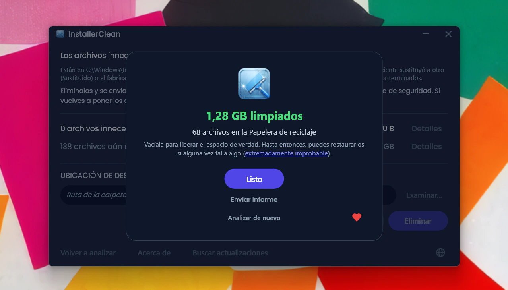
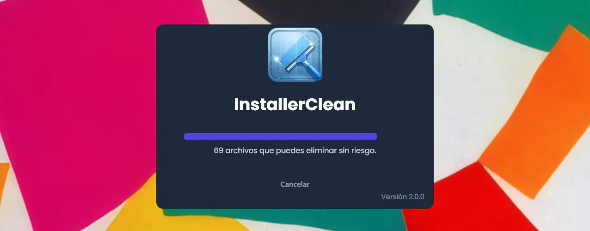
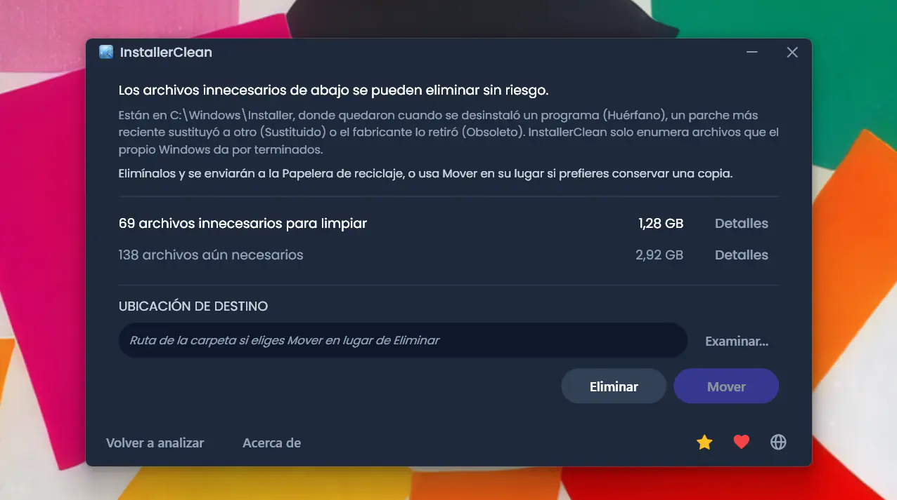
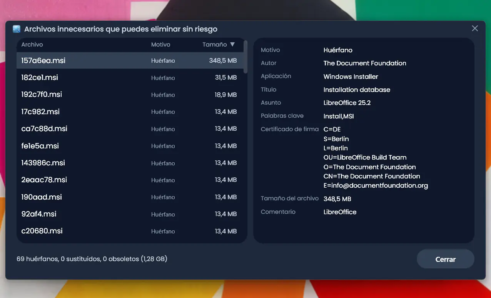
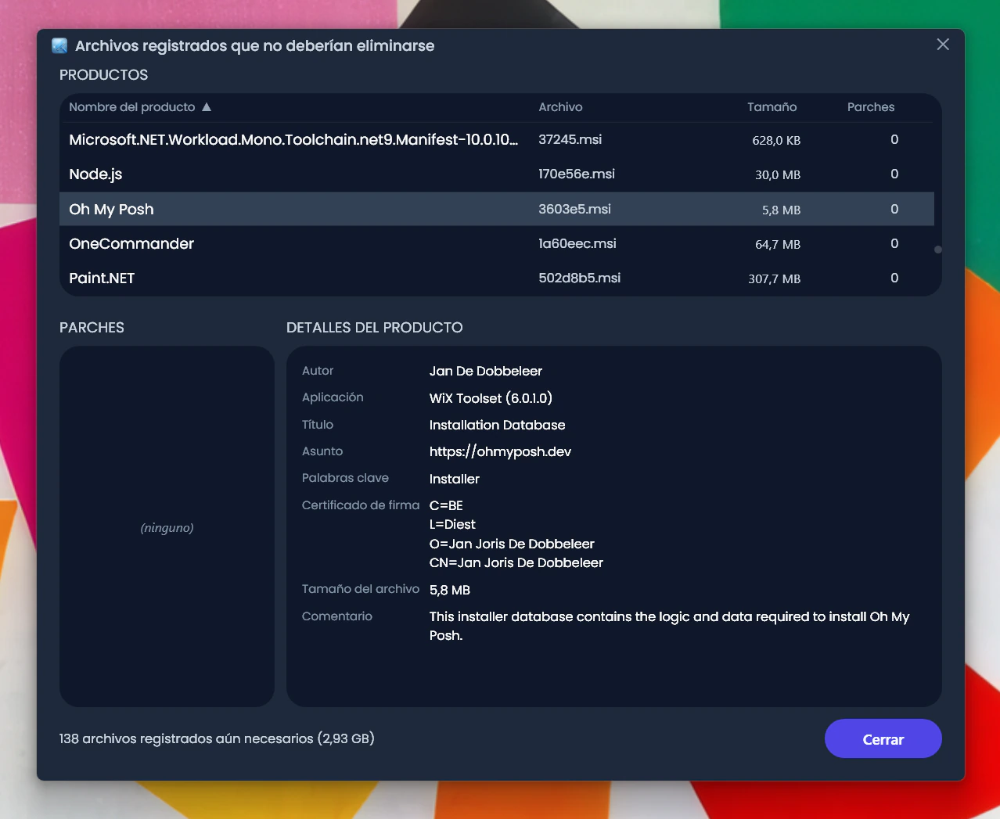
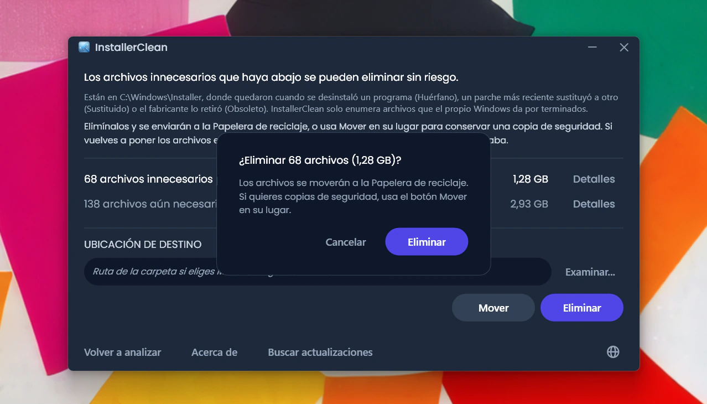
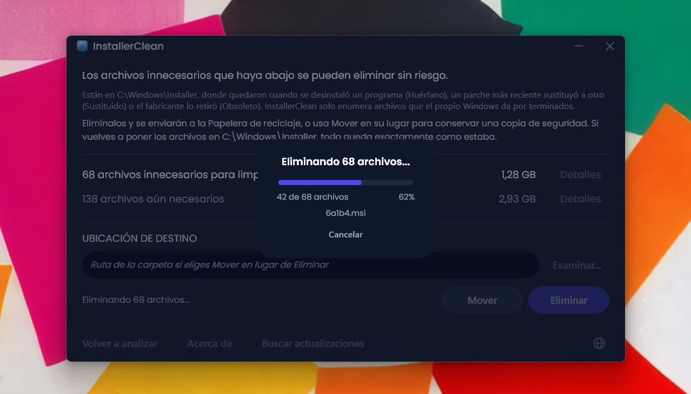
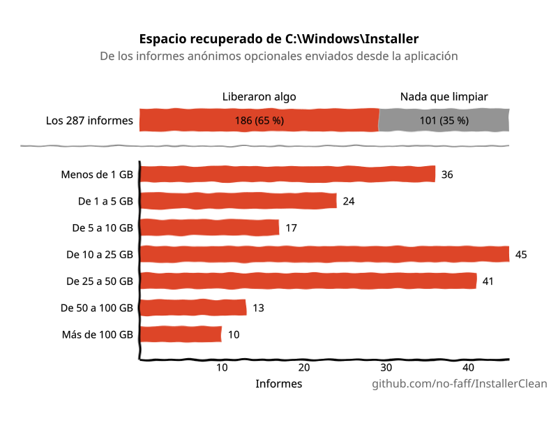

<p align="center">
  <a href="README.md">English</a> · <a href="README.zh-CN.md">简体中文</a> · <a href="README.ru.md">Русский</a> · <strong>Español</strong> · <a href="README.ar.md">العربية</a> · <a href="README.ja.md">日本語</a> · <a href="README.pt-BR.md">Português (BR)</a> · <a href="README.pl.md">Polski</a> · <a href="README.tr.md">Türkçe</a> · <a href="README.ko.md">한국어</a> · <a href="README.fr.md">Français</a> · <a href="README.it.md">Italiano</a> · <a href="README.de.md">Deutsch</a> · <a href="README.id.md">Bahasa Indonesia</a> · <a href="README.vi.md">Tiếng Việt</a> · <a href="README.uk.md">Українська</a> · <a href="README.nl.md">Nederlands</a>
</p>

<p align="center">
  
</p>

<p align="center"><em>🎶 What's my line? I'm happy <a href="https://www.youtube.com/watch?v=HM-jHhUZfFI">cleaning Windows</a></em></p>

<h1 align="center">InstallerClean</h1>

<p align="center"><strong>Una herramienta de código abierto para limpiar con seguridad <code>C:\Windows\Installer</code>, la carpeta oculta de Windows que se va comiendo tu espacio en disco sin que te des cuenta.</strong></p>

<p align="center"><em>Úsala de Pascuas a Ramos. Quizá liberes algo de espacio. Sigue adelante, todo limpio.</em></p>

<p align="center">
  <a href="LICENSE"></a>
  <a href="https://dotnet.microsoft.com/download/dotnet/10.0"></a>
  <a href="https://github.com/no-faff/InstallerClean/actions/workflows/ci.yml"></a>
  <a href="https://github.com/no-faff/InstallerClean/releases"></a>
  <a href="https://github.com/no-faff/InstallerClean/releases/latest"></a>
  <a href="https://github.com/no-faff/InstallerClean/releases"></a>
</p>



- **Qué hace:** InstallerClean hace una sola cosa: elimina archivos innecesarios de `C:\Windows\Installer`, una carpeta oculta que Windows nunca limpia. Tras un análisis casi instantáneo te dice si tienes alguno, muestra más detalle para los curiosos y te deja eliminarlos para liberar espacio en tu unidad C:. Lo usas una vez y a otra cosa.
- **Quizá estés aquí porque:** Usaste [WinDirStat](https://github.com/windirstat/windirstat), WizTree o TreeSize, viste que `C:\Windows\Installer` ocupaba mucho espacio y no sabías qué había dentro. InstallerClean es justo lo que necesitas. Sabe qué contienen esos archivos con nombres que parecen aleatorios como `9f05cba.msi` y te dice enseguida cuáles puedes eliminar sin riesgo.
- **Cuánto espacio:** Los informes (opcionales y anónimos) enviados hasta ahora muestran que el <!-- reports-freedpct-start -->64 %<!-- reports-freedpct-end --> de los equipos tenían archivos innecesarios que limpiar. De esos, la mediana liberada es de <!-- reports-median-start -->14,0 GB<!-- reports-median-end --><!-- reports-biggest-start --> y un equipo llegó a liberar la friolera de 462 GB<!-- reports-biggest-end -->. El otro <!-- reports-nothingpct-start -->36 %<!-- reports-nothingpct-end --> no encontró nada que eliminar, lo que solo significa que su carpeta Installer ya estaba limpia. Más detalle en las [Preguntas frecuentes](#preguntas-frecuentes) más abajo.
- **¿Es seguro?** Sí. Le pregunta a la propia API de Windows Installer qué archivos siguen haciendo falta y solo enumera los que Windows da por terminados. Es de código abierto (Apache 2.0) y no pregunta nada sobre ti: sin cuenta, sin anuncios, sin seguimiento, sin telemetría, nada corriendo en segundo plano. Lo único que hace en línea por su cuenta es comprobar en GitHub si hay una versión más reciente cuando lo ejecutas, y eso puedes desactivarlo.
- **Cómo obtenerlo:** [Descarga la última versión](../../releases/latest). Ejecútala; pasa [el aviso de «editor desconocido»](#unknown-publisher) y [la solicitud de permisos de administrador](#admin). Elimina los archivos innecesarios. Listo.

## Contenido

- [La carpeta de la que nadie te habla](#la-carpeta-de-la-que-nadie-te-habla)
- [La búsqueda de ayuda](#la-búsqueda-de-ayuda)
- [Qué hace](#qué-hace)
- [Capturas de pantalla](#capturas-de-pantalla)
- [Cómo funciona](#cómo-funciona)
- [¿Es seguro?](#es-seguro)
- [Política de firma de código](#política-de-firma-de-código)
- [Si te llega a faltar un archivo de C:\Windows\Installer](#recovery)
- [Accesibilidad](#accesibilidad)
- [Lo que no hace](#lo-que-no-hace)
- [Preguntas frecuentes](#preguntas-frecuentes)
- [Descarga](#descarga)
- [Comparativa con PatchCleaner](#comparativa-con-patchcleaner)
- [Línea de comandos](#línea-de-comandos)
- [Requisitos](#requisitos)
- [Compilar desde el código fuente](#compilar-desde-el-código-fuente)
- [Contribuir](#contribuir)
- [Apoyar el proyecto](#apoyar-el-proyecto)
- [Historial de estrellas](#historial-de-estrellas)
- [Licencia](#licencia)

---

## La carpeta de la que nadie te habla

En todo PC con Windows existe una carpeta oculta llamada `C:\Windows\Installer`. Cada vez que instalas software que usa el sistema Windows Installer, o aplicas un parche a Microsoft Office, Adobe Acrobat, Visual Studio o cualquier otra aplicación basada en `.msi`, una copia de ese instalador o de ese archivo de parche `.msp` va a parar a esta carpeta, y allí se queda.

Cuando desinstalas el software, los archivos siguen ahí. Cuando un parche nuevo sustituye a uno antiguo, los dos siguen ahí. Windows nunca los limpia. El Liberador de espacio en disco no los toca. DISM se ocupa de otra carpeta distinta. Con el tiempo, la carpeta crece: 1 GB, 5 GB, 20 GB, 50 GB. En equipos con mucho software basado en MSI (Acrobat es un sospechoso habitual), puede [superar los 100 GB](https://www.reddit.com/r/sysadmin/comments/1oxcrmh/acrobat_filling_up_the_cwindowsinstaller_folder/).

No son archivos temporales que vuelvan por su cuenta. Son peso muerto de verdad: instaladores antiguos de software que desinstalaste hace años y parches que se han sustituido varias veces. Una vez fuera, no vuelven.

**Si buscas una manera sencilla de liberar espacio en disco en Windows, esta carpeta es un buen sitio por donde empezar.** InstallerClean encuentra los archivos innecesarios y los elimina con seguridad.

## La búsqueda de ayuda

Si alguna vez has buscado ayuda con esta carpeta, seguramente ya sabes cómo va la cosa. Alguien con 180 GB en `C:\Windows\Installer` pregunta cómo limpiarla. Le [dicen que ejecute el Liberador de espacio en disco](https://learn.microsoft.com/en-us/answers/questions/4238108/windows-installer-folder-has-occupied-180gb). Lo prueba. Libera 600 MB, ninguno de ellos de esa carpeta (porque el Liberador de espacio en disco no toca `C:\Windows\Installer`). El hilo se apaga.

> *«Todos los hilos que he encontrado suelen recomendar las mismas cosas, que no resuelven el problema, y luego mueren.»*
>
> [ksparks519, r/Windows10](https://www.reddit.com/r/Windows10/comments/1bt8c5p/anyone_ever_figure_out_giant_installer_folders/) (traducido del inglés)

O bien le dicen que ni la toque. En un hilo, a alguien con una carpeta Installer de 60 GB le dijeron que [«no la toques»](https://www.reddit.com/r/techsupport/comments/1hw4suq/my_windows_installer_folder_is_like_60gb_so_i/). Cuando preguntó qué debía hacer en su lugar, la respuesta fue: *«Acabo de decírtelo.»*

El consejo habitual confunde borrar archivos al azar (lo cual sí es peligroso) con eliminar archivos que el propio Windows da por innecesarios (lo cual no lo es). InstallerClean hace lo segundo.

## Qué hace

1. **Analiza** `C:\Windows\Installer` en busca de archivos `.msi` y `.msp`
2. **Consulta** la API de Windows Installer para identificar qué archivos siguen registrados
3. **Muestra** cuánto puedes liberar y cuánto sigue haciendo falta, con ventanas de detalle opcionales que enumeran cada archivo
4. **Elimina** los archivos innecesarios: los mueve a la Papelera de reciclaje, o a una carpeta que tú elijas

## Capturas de pantalla

<p>
  <br>
  <em>Análisis inicial. Es muy rápido.</em>
  <br><br>
</p>

<p>
  <br>
  <em>Resultados: cuánto sigue haciendo falta y cuánto se puede eliminar.</em>
  <br><br>
</p>

<p>
  <br>
  <em>Detalle de los archivos que ya no hacen falta.</em>
  <br><br>
</p>

<p>
  <br>
  <em>Detalle de los archivos que siguen haciendo falta, con los metadatos leídos de la base de datos del instalador.</em>
  <br><br>
</p>

<p>
  <br>
  <em>Confirmación antes de cada acción. Eliminar mueve a la Papelera de reciclaje; Mover coloca los archivos donde tú elijas.</em>
  <br><br>
</p>

<p>
  <br>
  <em>La eliminación en curso. Cancelar la detiene a medio camino.</em>
  <br><br>
</p>

<p>
  <br>
  <em>Tras una eliminación correcta.</em>
  <br><br>
</p>

<p>
  <br>
  <em>Tras un nuevo análisis. No queda nada que limpiar.</em>
  <br><br>
</p>

## Cómo funciona

InstallerClean identifica tres tipos de archivos innecesarios.

**Los archivos huérfanos** son los instaladores `.msi` (y cualquier parche `.msp`) que quedan tras desinstalar un programa. Windows ya no los referencia, pero siguen en la carpeta ocupando espacio.

**Los parches sustituidos** son parches `.msp` antiguos que han sido reemplazados por otros más nuevos. Windows los marca como sustituidos en su propia base de datos, pero nunca los borra. Si esto sale tanto es por Adobe: cada actualización de Acrobat se publica como un parche sobre el mismo instalador original, y no como un instalador nuevo propio, así que un equipo acaba guardando uno por cada actualización que ha recibido desde el principio. Office y las grandes herramientas de desarrollo se acumulan igual, solo que más despacio.

**Los parches obsoletos** son parches `.msp` que el fabricante ha retirado o dado de baja en lugar de reemplazarlos por una versión más reciente. Windows también registra ese estado y, de igual modo, deja el archivo en la carpeta.

Para encontrarlos, InstallerClean llama directamente a la interfaz COM de Windows Installer mediante P/Invoke:

- `MsiEnumProductsEx` para enumerar todos los productos instalados
- `MsiEnumPatchesEx` para encontrar todos los parches registrados de cada producto
- `MsiGetPatchInfoEx` para leer el estado de cada parche (aplicado, sustituido u obsoleto)

Todo archivo `.msi` o `.msp` de `C:\Windows\Installer` que no pertenezca a ningún producto registrado es huérfano y se marca como eliminable. Lo mismo ocurre con cualquier parche que la base de datos marque como sustituido u obsoleto y que no haga falta para la desinstalación.

La aplicación también lee esos mismos datos directamente del registro en cada análisis, como segunda fuente independiente. Si cualquiera de las dos lecturas vuelve incompleta (algo raro, pero que puede ocurrir si el estado del instalador está dañado), InstallerClean retiene archivos o rechaza el análisis en lugar de adivinar. Esa segunda lectura solo añade archivos al conjunto de «aún necesarios», nunca al de «eliminables».

Tras completar un Mover o un Eliminar, las subcarpetas vacías que haya dentro de `C:\Windows\Installer` (los directorios que la caché deja atrás cuando su contenido desaparece) se podan en la misma pasada.

<a id="is-it-safe"></a>
## ¿Es seguro?

Sí. InstallerClean consulta la misma base de datos de la API de Windows Installer que el propio Windows usa para llevar el control de lo que está instalado. Si Windows dice que un archivo ya no hace falta, la aplicación se fía; no adivina a partir de nombres de archivo ni fechas.

**Sobre Eliminar y Mover.** Los archivos que InstallerClean elimina se pueden borrar de forma permanente sin riesgo. **Eliminar** los mueve a la Papelera de reciclaje (se te avisará si no está disponible); recuperas el espacio en tu unidad C: cuando vacías la Papelera de reciclaje.

Aun así, no tienes que fiarte de mi palabra de que se pueden borrar sin riesgo. Mientras están en la Papelera de reciclaje, tienes ocasión de comprobar que las aplicaciones que usan esta carpeta (Office, Acrobat, Visual Studio y similares) siguen actualizándose y desinstalándose sin problemas. Si encuentras algo que falla (extremadamente improbable, y tras <!-- downloads-start -->68.000+<!-- downloads-end --> descargas nadie ha informado de nada hasta ahora), restaura los archivos desde la Papelera de reciclaje para arreglarlo. Para mayor seguridad todavía, puedes usar **Mover** en su lugar, para hacer una copia de seguridad de los archivos en una carpeta que tú elijas (obviamente, elige una carpeta en otra partición o unidad si lo que buscas es liberar espacio en C:). Solo tienes que volver a copiar los archivos a `C:\Windows\Installer` para dejar las cosas como estaban (aunque es casi seguro que nunca te hará falta). Si algún archivo ha acabado con un «(1)» en el nombre (eso pasa si moviste archivos a la misma carpeta dos veces), quítaselo antes de copiarlo de vuelta.

Si Windows Installer está escribiendo en la caché en ese momento, tiene una transacción anterior suspendida o tiene un renombrado pendiente tras reiniciar que apunta a la caché, Mover y Eliminar quedan desactivados y se muestra el motivo concreto.

Los servicios de análisis, consulta, movimiento, eliminación, configuración y comprobación de reinicio pendiente están cubiertos por una batería de pruebas automatizadas que se ejecuta en cada commit (consulta la insignia de CI más arriba).

**Verificación del binario.** InstallerClean no está firmado, pero no tienes que fiarte de que sea seguro:

- Los hashes SHA-256 de cada versión están listados en la [página de versiones](../../releases/latest).
- VirusTotal: cada build se analiza, con los resultados completos por motor enlazados en su página de versión para que puedas ver cómo ha puntuado cada archivo y volver a analizarlo tú mismo. Un falso positivo que siga activo cuando sale una versión se nombra y se explica en la página de esa versión, y la página se actualiza en cuanto el fabricante lo retira.
- El código fuente está en [github.com/no-faff/InstallerClean](https://github.com/no-faff/InstallerClean) y la CI compila y prueba cada commit (consulta la insignia verde de CI más arriba).
- Las versiones publicadas se compilan de forma determinista: la configuración del compilador hace que el mismo código fuente y el mismo SDK produzcan exactamente los mismos bytes, y el proceso de publicación se niega a etiquetar una versión si los exe que se distribuyen no se compilaron desde un árbol limpio en esa misma etiqueta. Así que puedes hacer checkout de la etiqueta, compilarla tú mismo y comparar los hashes con los publicados: la descarga coincide de forma demostrable con el código fuente público. Iguala primero la versión del SDK (las notas de cada versión indican con cuál se compiló); un parche distinto del SDK produce bytes distintos, lo que parece una discrepancia y no lo es.
- <!-- downloads-start -->68.000+<!-- downloads-end --> descargas entre GitHub, MajorGeeks y Softpedia.
- [MajorGeeks](https://www.majorgeeks.com/files/details/installerclean.html) prueba cada envío en una máquina virtual y solo lo publica si pasa su revisión.<br><a href="https://www.majorgeeks.com/files/details/installerclean.html"></a>
- [Softpedia](https://www.softpedia.com/get/System/Hard-Disk-Utils/InstallerClean.shtml) analiza cada versión en busca de virus, spyware y adware.<br><a href="https://www.softpedia.com/get/System/Hard-Disk-Utils/InstallerClean.shtml"></a>

## Política de firma de código

InstallerClean ha solicitado la firma de código gratuita a la [SignPath Foundation](https://signpath.org), un programa que firma software de código abierto para que deje de llegar a tu equipo de un editor desconocido. La solicitud está pendiente, así que por ahora las descargas de aquí no están firmadas y Windows te avisará de ello.

Si la aprueban, cada versión llevará la línea que pide SignPath: «free code signing provided by SignPath.io, certificate by SignPath Foundation». El certificado es de la fundación y no mío, porque un certificado tiene que emitirse a nombre de una entidad jurídica y un proyecto de una sola persona no lo es. Eso no significa que InstallerClean sea suyo, ni que participen en él más allá de la firma.

**Roles.** InstallerClean lo mantiene una sola persona, yo, y los tengo todos:

- Quienes hacen commits y quienes revisan, es decir, quién puede meter código en el proyecto: yo. Toda pull request se revisa antes de fusionarse.
- Quienes aprueban, es decir, quién puede autorizar que se firme una versión: yo.

**Privacidad.** No me entero de nada sobre ti ni sobre tus archivos, salvo que decidas enviar ese informe anónimo, que es totalmente opcional y solo sirve para que yo sepa que funciona. Sin anuncios, sin telemetría. Las únicas conexiones aparte de esa son la comprobación de versión al arrancar la aplicación (una petición a GitHub que puedes desactivar en Acerca de) y los botones que enlazan a GitHub y a una página donde puedes donar si te sientes generoso. La [política de privacidad](PRIVACY.md) completa (en inglés).

<a id="recovery"></a>
## Si te llega a faltar un archivo de `C:\Windows\Installer`

InstallerClean solo elimina los archivos que el propio Windows da por innecesarios, así que nunca puede ser la causa de que falte un archivo. Pero si ya ha desaparecido alguno, InstallerClean lo detecta y lo señala. Aquí tienes la solución.

Descarga el instalador de ese programa desde su fabricante y ejecútalo sobre tu instalación existente; no desinstales primero. Usa la versión que tienes ahora si puedes, porque Windows puede rechazar una distinta. Eso normalmente devuelve el archivo a su sitio y deja tu configuración intacta. Vuelve a analizar en InstallerClean y, si ha funcionado, el aviso habrá desaparecido.

Eso suele funcionar. Lo que sigue es la versión más completa de la propia Microsoft: el detalle oficial, y los casos más difíciles para cuando no es tan sencillo. Nada de esto tiene que ver con InstallerClean, y no puedo mejorar las indicaciones de Microsoft, así que me limito a transmitírtelas.

<details>
<summary>La posición más completa de Microsoft</summary>

*Las citas de Microsoft que aparecen a continuación se reproducen en su versión original en inglés.*

Guía completa: [Restore missing Windows Installer cache files](https://learn.microsoft.com/en-us/troubleshoot/windows-client/application-management/missing-windows-installer-cache).

*Puede que no se manifieste de inmediato:*
> "If the installer cache is compromised, you may not immediately see problems until you take an action such as uninstalling, repairing, or updating a product."

*Los archivos son únicos en cada equipo, así que no puedes copiar uno desde otro PC:*
> "Missing files cannot be copied between computers because the files are unique."

*Tampoco puedes recuperar solo el archivo de una copia de seguridad:*
> "To restore the missing files, a full system state restoration is required. It is not possible to replace only the missing files from a previous backup."

*La recuperación recomendada, y sus límites sin rodeos:*
> "If application files are missing from the Windows Installer Cache, ask the vendor or support team for the application about the missing files. You must follow the procedures or steps recommended by the application vendor to restore the files. In some cases, you may have to rebuild the operating system and reinstall the application to fix the problem."
>
> "Windows support engineers cannot help you recover missing application files from the Windows Installer cache."

*Por qué importa usar la misma versión:*
> "The upgrade cannot be installed by the Windows Installer service because the program to be upgraded may be missing, or the upgrade may update a different version of the program."

</details>

## Accesibilidad

InstallerClean está pensado para ser plenamente utilizable con el teclado y con un lector de pantalla.

- **Totalmente operable con el teclado.** El tabulador llega a cada control, y las columnas de las ventanas de detalle se ordenan con el teclado: aquí nada necesita ratón. El foco del teclado permanece visible dondequiera que esté.
- **Narrador y Acceso por voz.** Cada control está etiquetado, y la palabra visible en un botón es exactamente la que lo activa por voz. Cuando termina una operación de mover o eliminar, el resultado se anuncia en voz alta.
- **Hecho para leerse.** El texto cumple el contraste WCAG AA en todo el tema oscuro.

Si algo aquí te estorba, [abre un issue](../../issues). Los problemas de accesibilidad son bugs, no casos límite.

## Lo que no hace

- WinSxS (`C:\Windows\WinSxS`) es una carpeta distinta con reglas distintas. Para esa, ejecuta `Dism /Online /Cleanup-Image /StartComponentCleanup` desde un símbolo del sistema elevado.
- Sin servicio en segundo plano, sin tarea programada, sin limpieza automática. La aplicación se ejecuta cuando tú la inicias.
- No cambia tus programas instalados ni la base de datos de Windows Installer, solo los consulta. Lo único que llega a escribir en el registro es el alta única de la fuente de eventos que la herramienta de línea de comandos necesita para que sus ejecuciones aparezcan en el registro de eventos de Windows.
- Hay un solo tipo de conexión que hace por su cuenta: una comprobación rápida de la página de versiones de GitHub para ver si hay una más reciente cuando lo ejecutas, que puedes desactivar en Acerca de. Todo lo demás solo ocurre cuando se lo pides: el informe anónimo opcional (solo para que yo sepa que funciona) y enlaces a la documentación de GitHub y a una página de donaciones, que se abren en tu navegador si los pulsas. Nunca descarga nada por su cuenta.
- Sin barras de herramientas, sin software incluido, sin adware.

## Preguntas frecuentes

<a id="reports-stats"></a>
**¿Realmente voy a liberar GB de espacio?** Depende de tu equipo. Una instalación limpia de Windows 11 sin software adicional no tiene nada que eliminar. Una estación de trabajo de desarrollo de larga vida, o cualquier equipo con mucho software basado en MSI (Acrobat, Office, LibreOffice, grandes herramientas de desarrollo), puede tener decenas de GB. En cualquier caso, verás exactamente cuánto en cuanto lo ejecutes.

<!-- reports-stats-start (generated; do not hand-edit between these markers) -->
Desde la v1.8.0 se puede enviar un breve informe anónimo del resultado. Han llegado 262 hasta ahora (gracias a todos 🙏) y, del 64 % de equipos que tenían algo que limpiar, la mediana liberada es de 14,0 GB. Un equipo recuperó nada menos que 462 GB. Este es el resumen de los resultados.

<p align="center">
  <picture>
    <source media="(prefers-color-scheme: dark)" srcset="docs/reports-es-dark.svg" />
    <source media="(prefers-color-scheme: light)" srcset="docs/reports-es-light.svg" />
    
  </picture>
</p>

Enviar un informe es pulsar un botón en la aplicación, del todo opcional. No incluye nada personal y te muestra exactamente lo que se enviará, así:


<!-- reports-stats-end -->

<a id="admin"></a>

**¿Por qué pide Administrador?** `C:\Windows\Installer` está restringido a los administradores. Leer la carpeta, consultar la base de datos del Installer y mover o eliminar archivos lo requieren, así que la aplicación tiene que ejecutarse como administrador.

<a id="unknown-publisher"></a>

**¿Por qué dice Windows «Editor desconocido»?** InstallerClean no está firmado digitalmente y Windows marca los archivos descargados de internet, así que en la primera ejecución SmartScreen suele mostrar «Windows protegió su PC» con el editor como desconocido. Un certificado de firma de pago cuesta dinero todos los años y prefiero mantener la aplicación gratuita antes que pagar por uno, así que he solicitado el de la SignPath Foundation, que firma software de código abierto sin cobrar nada (consulta [Política de firma de código](#política-de-firma-de-código)). Hasta que llegue, pulsa **Más información** y luego **Ejecutar de todas formas**. Hacerlo es seguro: el código fuente es público, y cada versión incluye enlaces a VirusTotal y hashes SHA-256 que puedes comprobar antes.

**¿Puedo deshacer una eliminación?** Normalmente, sí. Cuando la Papelera está disponible para la unidad, Eliminar mueve los archivos ahí y puedes restaurarlos desde la Papelera. Si no está disponible, la aplicación nunca borra para siempre por su cuenta (consulta [¿Es seguro?](#es-seguro)). Y si prefieres tener una vía de vuelta que tú controlas, Mover coloca los archivos en una carpeta que tú elijas; bórralos de ahí cuando te quedes tranquilo.

**¿Va a quejarse Windows si quito estos archivos?** No. InstallerClean solo elimina los archivos que el propio Windows da por terminados, así que nada de lo que elimina hace falta para reparar, actualizar o desinstalar un programa. Si un archivo necesario llega a desaparecer de `C:\Windows\Installer` por algún otro medio, consulta [Si te llega a faltar un archivo de C:\Windows\Installer](#recovery).

**¿Por qué no `Win32_Product` (WMI)?** [`Win32_Product` desencadena operaciones de reparación de MSI en cada producto durante la enumeración](https://gregramsey.net/2012/02/20/win32_product-is-evil/), lo cual puede tardar minutos y cargar mucho el disco. InstallerClean llama a la API COM de Windows Installer directamente, sin efectos colaterales.

**¿Por qué no simplemente un script de PowerShell?** Un script corto que llame a `MsiEnumPatchesEx` basta para *listar* parches, pero las partes que sostienen InstallerClean son las que un script pasa por alto: la clasificación de huérfano frente a sustituido, la lectura de reserva del registro que solo añade archivos al conjunto de «aún necesarios» (nunca al de «eliminables»), el bloqueo por reinicio pendiente, la red de seguridad de mover a otra ubicación, el progreso por archivo con cancelación y el uso de la Papelera de reciclaje en lugar del borrado permanente por defecto. Los casos límite en equipos reales con mucho MSI (registros de productos dañados, uniones dentro de la caché, productos en `HKU\.DEFAULT`, transacciones del Installer suspendidas) son fáciles de gestionar mal en un script improvisado. La `installerclean-cli` es la cara sin interfaz si lo que buscas es scripting.

**¿Funciona en Windows 7 u 8?** Sin probar y sin soporte. Está pensado para Windows 10 y 11.

**¿Sirve para RMM o despliegue masivo?** Sí. La CLI sale con códigos distintos por resultado (0 éxito, 2 parcial, 1 fallo total, 75 transitorio, 130 para un Ctrl+C antes de procesar ningún archivo; un Ctrl+C que cae a mitad del lote sale con 2, parcial, porque ya se había hecho trabajo), de modo que una tarea programada puede reintentar en 75 sin confundirlo con un fallo total. Escribe un resumen por ejecución en el registro de eventos de Aplicación y respeta el mismo mutex de instancia única que la interfaz gráfica. El programa de instalación también se instala en silencio con los modificadores estándar de Inno Setup (`/SILENT` o `/VERYSILENT`); el lanzamiento posterior a la instalación se omite en las instalaciones silenciosas. Consulta la sección Línea de comandos.

## Descarga

Tres variantes, elige una:

- **Setup** (`InstallerClean-2.3.0-setup.exe`): un instalador clásico de Windows con el runtime de .NET 10 incluido. Añade una entrada en el menú Inicio y se desinstala sin dejar rastro. Bien guardado en Programas, fácil de encontrar dentro de seis meses.
- **Portable** (`InstallerClean-2.3.0-portable.exe`): un único exe autónomo con el runtime incluido. Sin instalación, sin desinstalador. Ejecútalo, úsalo, bórralo. Vuelve a ejecutarlo cuando quieras.
- **CLI** (`installerclean-cli.exe`): la versión de línea de comandos por sí sola, un único exe autónomo. Sin instalación, sin dejar nada en la máquina después. Déjalo en un equipo cliente, ejecuta un análisis o una limpieza, y bórralo. Pensado para scripting, tareas programadas y despliegue masivo, cuando quieres las operaciones sin una aplicación de escritorio en el cliente. Consulta [Línea de comandos](#línea-de-comandos) para los argumentos y los códigos de salida.

Desde la 2.2.0, los nombres de archivo del instalador y de la versión portátil llevan su número de versión, así que una copia descargada siempre dice lo que es; la versión de línea de comandos conserva su nombre llano `installerclean-cli.exe` para que las tareas programadas y los scripts que apuntan a ella sigan funcionando entre actualizaciones.

Descárgala desde la [página de versiones](../../releases/latest) y ejecútala. No está firmada, así que Windows muestra un aviso de «editor desconocido»; las [Preguntas frecuentes](#unknown-publisher) explican lo que verás y por qué es seguro.

La aplicación analiza automáticamente al arrancar. Revisa los resultados y pulsa **Eliminar** o **Mover**.

O instálalo con [winget](https://learn.microsoft.com/windows/package-manager/winget/):

```
winget install NoFaff.InstallerClean
```

O instálalo con [Scoop](https://scoop.sh):

```
scoop install installerclean
```

## Comparativa con PatchCleaner

Si ya has buscado esta carpeta antes, la herramienta que con más probabilidad habrás encontrado es [PatchCleaner](https://www.homedev.com.au/free/patchcleaner). Sigue funcionando bien, pero hice InstallerClean porque PatchCleaner es de código cerrado, no se actualiza desde marzo de 2016 y, por defecto, no toca los productos de Adobe. Su comprobación de huérfanos marcaba por error los parches de Adobe, y quitarlos rompía las actualizaciones de Adobe, así que deja en paz todos los archivos de Adobe a menos que desactives el filtro. En los equipos donde Adobe es el mayor responsable, ahí está la mayor parte del espacio:

> *«He descargado PatchCleaner para borrar los archivos `.msp` huérfanos, pero al parecer esto solo liberaría 250 MB de espacio. 29 GB de los archivos están "excluidos por filtros", así que PatchCleaner no parece servir de ayuda.»*
>
> HeatherBunny1111, [r/techsupport](https://www.reddit.com/r/techsupport/comments/1qc4tcf/how_to_delete_msp_files_safely/) (traducido del inglés)

InstallerClean lee los propios registros de parches de Windows Installer, así que en vez de esconder todos los archivos de Adobe tras un filtro general, distingue qué parches ha marcado Windows como sustituidos y los etiqueta exactamente así. Así es como se comparan las dos:

| | **InstallerClean** | **PatchCleaner** |
|---|---|---|
| Última actualización | 2026 (activo) | 3 de marzo de 2016 |
| Código fuente | Código abierto (Apache 2.0) | Código cerrado |
| Runtime | .NET 10 (autónomo) | .NET + VBScript |
| API | Windows Installer COM (en proceso) | Windows Installer COM (fuera de proceso, mediante VBScript) |
| Detección de parches sustituidos | Sí | No |
| Gestión de Adobe | Detecta los parches sustituidos | Excluye por defecto |
| Interfaz | Tema oscuro (WPF) | Windows Forms |
| Recopilación de datos | Ninguna | Ninguna |
| Seguridad al eliminar | Papelera de reciclaje. Si no está disponible, pregunta: mover en su lugar o borrar de forma permanente | Permanente, sin Papelera |

> **Nota sobre `Win32_Product`:** El enfoque común pero defectuoso para listar productos instalados es `Win32_Product` (WMI), que [desencadena operaciones de reparación de MSI](https://gregramsey.net/2012/02/20/win32_product-is-evil/) en cada producto durante la enumeración. Tanto InstallerClean como PatchCleaner lo evitan. Ambos usan la interfaz COM de Windows Installer. El nombre de archivo `WMIProducts.vbs` del script de PatchCleaner resulta engañoso; el script usa COM de MSI, no WMI.

[Ultra Virus Killer (UVK)](https://www.carifred.com/uvk/) también ofrece limpieza del Installer como parte de su módulo System Booster, pero es una herramienta de pago (15-25 USD) y la limpieza es una pequeña función dentro de una aplicación mucho mayor. InstallerClean es gratuito, especializado y de código abierto.

Los limpiadores generalistas como [CCleaner](https://www.ccleaner.com/) y [BleachBit](https://www.bleachbit.org/) no tocan `C:\Windows\Installer`. La carpeta necesita consultas a la API de Windows Installer para distinguir los paquetes registrados de los innecesarios, y un limpiador genérico que se limitara a recorrer el árbol de archivos podría romper aplicaciones instaladas. InstallerClean es la herramienta a la que recurrir cuando esa es precisamente la carpeta que quieres limpiar.

## Línea de comandos

InstallerClean admite el funcionamiento sin interfaz, para scripting y administración de sistemas:

```
Uso:
  installerclean-cli --help     Muestra esta ayuda (acepta también /?, -h)
  installerclean-cli --version  Muestra la versión (acepta también -v)
  installerclean-cli /s         Solo análisis - enumera los archivos innecesarios
  installerclean-cli /d         Elimina los archivos innecesarios (Papelera de reciclaje)
  installerclean-cli /m         Mueve a la ubicación predeterminada guardada
  installerclean-cli /m RUTA    Mueve a la ruta especificada
```

Para abrir la interfaz gráfica, ejecuta `InstallerClean.exe` (o usa el acceso directo del menú Inicio si lo instalaste con Setup).

Ejecutado sin argumentos, o con una opción no reconocida, `installerclean-cli` muestra esta ayuda y sale con el código `1`, de modo que una tarea programada que pierda su opción falla de forma visible en lugar de tener éxito en silencio sin hacer nada. Un `--help`, `/?` o `-h` explícito muestra la misma ayuda y sale con el código `0`.

`/s` es una ejecución en seco: analiza, enumera lo que eliminaría con nombres y tamaños, y sale. Útil para auditar antes de limpiar. El código de salida es `0` si el análisis tiene éxito, `1` si falla y `130` con Ctrl+C. Todos los archivos están en `C:\Windows\Installer`.

`/d` y `/m` analizan y luego actúan. `/d` mueve los archivos innecesarios a la Papelera de reciclaje. `/m` los mueve a una carpeta (la que indiques en la línea de comandos, o la guardada por defecto desde la interfaz gráfica). Ese valor por defecto guardado se almacena por usuario, así que una tarea programada que se ejecute como SYSTEM o con una cuenta de servicio no lo verá; esas ejecuciones tienen que indicar la carpeta explícitamente con `/m PATH`. Códigos de salida: `0` éxito completo, `2` parcial (algunos archivos correctos, otros fallidos), `1` fallo total (análisis fallido, argumentos incorrectos o todos los archivos del lote han fallado), `75` una condición transitoria bloqueó la ejecución (el mensaje mostrado indica cuál y si reintentar servirá de algo), `130` para un Ctrl+C antes de procesar ningún archivo (un Ctrl+C que cae a mitad del lote sale con `2`, parcial, porque ya se había hecho trabajo).

Toda la salida de la CLI, incluidos los mensajes de error y de diagnóstico, va a stdout; no hay un flujo stderr aparte. El código de salida es la señal legible por máquina (y la entrada por ejecución en el registro de eventos de Aplicación lo refleja), así que un script debería basarse en el código de salida en lugar de analizar el texto, y `installerclean-cli /s > audit.txt` captura toda la ejecución, incluida cualquier línea de error.

Las tres requieren un símbolo del sistema elevado (administrador). Si una directiva de grupo bloquea el aviso de elevación de UAC, el proceso se niega a iniciarse y Windows devuelve el error 740 al shell que lo invocó (`$LASTEXITCODE = 740` en PowerShell). `taskkill /pid <pid>` no provoca una cancelación controlada; el mutex de instancia única se recupera en la siguiente ejecución mediante la vía AbandonedMutexException.

### Programar una limpieza periódica

Para limpiar de forma periódica, apunta el Programador de tareas a `installerclean-cli`. Ejecútalo como SYSTEM o con una cuenta de servicio y con los privilegios más altos, para que consiga la elevación que necesita sin un aviso interactivo, e indica la carpeta de destino en la línea de comandos, porque el valor por defecto guardado desde la interfaz gráfica se almacena por usuario y no se aplica a una ejecución como SYSTEM o con una cuenta de servicio. Para un traslado mensual a `D:\InstallerBackup`, con una copia de la CLI dejada en `C:\Tools`:

```
schtasks /create /tn "InstallerClean monthly" /tr "C:\Tools\installerclean-cli.exe /m D:\InstallerBackup" /sc monthly /ru SYSTEM /rl highest
```

La tarea espera a que la ejecución termine y anota el código de salida como su Resultado de la última ejecución, así que tu RMM puede guiarse por los códigos de arriba (`0` éxito completo, `2` parcial, `75` transitorio, `1` fallo total) igual que lo haría un script.

### ¿Por qué `installerclean-cli` y no `installerclean.exe`?

`InstallerClean.exe` es la interfaz gráfica WPF; no responde a argumentos de línea de comandos. `installerclean-cli.exe` es un ejecutable de consola aparte que se incluye en el mismo directorio de instalación y expone las mismas operaciones de análisis / movimiento / eliminación a PowerShell, cmd y tareas programadas. Como es un proceso de consola real, bloquea la consola hasta que termina; redirige o canaliza su salida igual que con cualquier otro exe de consola.

La descarga portable solo contiene el exe de la interfaz gráfica. Si quieres la línea de comandos sin la interfaz, descarga `installerclean-cli.exe` desde la [página de versiones](../../releases/latest) y ejecútalo directamente. El programa de instalación también lo instala junto a la interfaz gráfica.

## Requisitos

- Windows 10 (versión 1607 / compilación 14393 o posterior, la más antigua que admite el runtime de .NET 10) o Windows 11
- Privilegios de administrador (a `C:\Windows\Installer` solo pueden acceder los administradores)

Consulta [Descarga](#descarga) para ver las variantes setup, portable y CLI.

## Compilar desde el código fuente

```
git clone https://github.com/no-faff/InstallerClean.git
cd InstallerClean
dotnet build src/InstallerClean.sln
```

Ejecutar las pruebas:

```
dotnet test src/InstallerClean.Tests/
```

## Contribuir

¿Has encontrado un bug o tienes una sugerencia? [Abre un issue](../../issues) o inicia una [discusión](../../discussions). Las pull requests son bienvenidas. Ejecuta `dotnet test` antes de enviar.

InstallerClean ya está disponible por completo en español: la aplicación, el instalador, la línea de comandos y este README. Todas son traducciones automáticas hechas lo mejor que he podido; no serán perfectas, así que las he publicado tal cual en lugar de esperar a que un hablante nativo las revise. Si ves algo que se pueda mejorar, me encantaría saberlo, en un [issue](../../issues/new?template=translation_review.md), una pull request o una discusión. La aplicación se abre de forma predeterminada en el idioma de tu Windows; puedes cambiar a inglés en cualquier momento con el icono del globo terráqueo.

## Apoyar el proyecto

Si InstallerClean te ha sido útil, considera [apoyar a No Faff](https://nofaff.netlify.app/support) o dejar una estrella en GitHub.

## Historial de estrellas

<picture>
  <source media="(prefers-color-scheme: dark)" srcset="docs/star-history-dark.svg" />
  <source media="(prefers-color-scheme: light)" srcset="docs/star-history-light.svg" />
  
</picture>

## Licencia

[Apache 2.0](LICENSE)

---

🎶 [George Formby - When I'm Cleaning Windows](https://www.youtube.com/watch?v=P183Uo5Ust4). ¡A disfrutarla!
