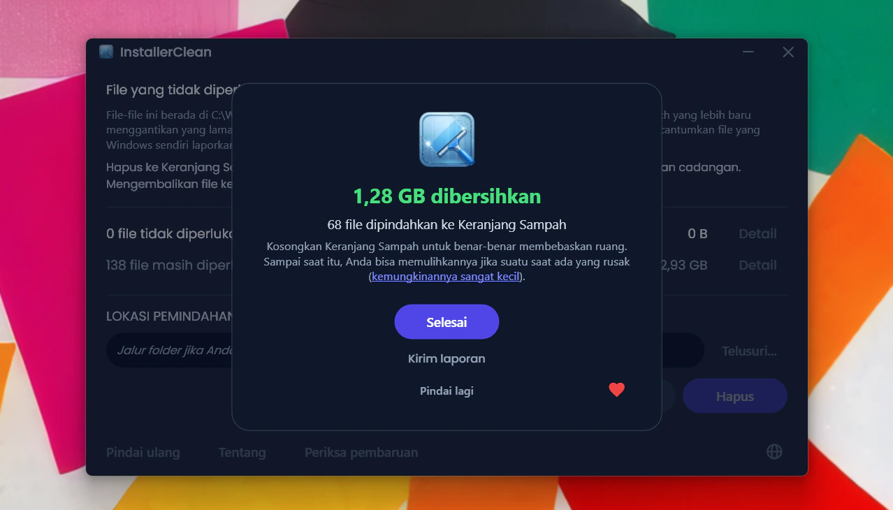
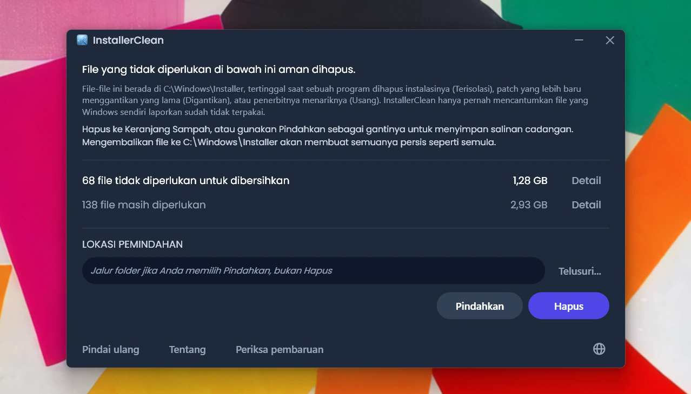
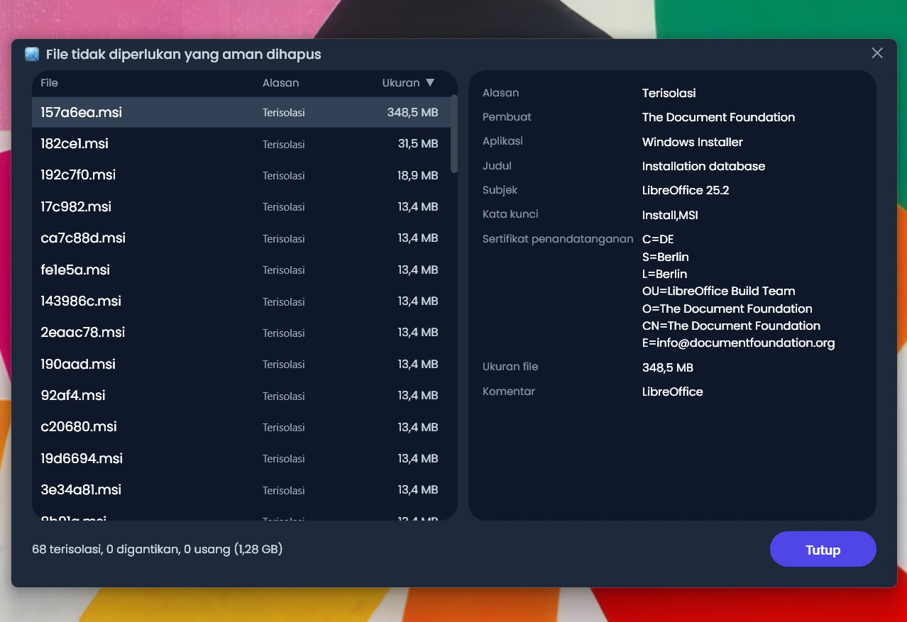
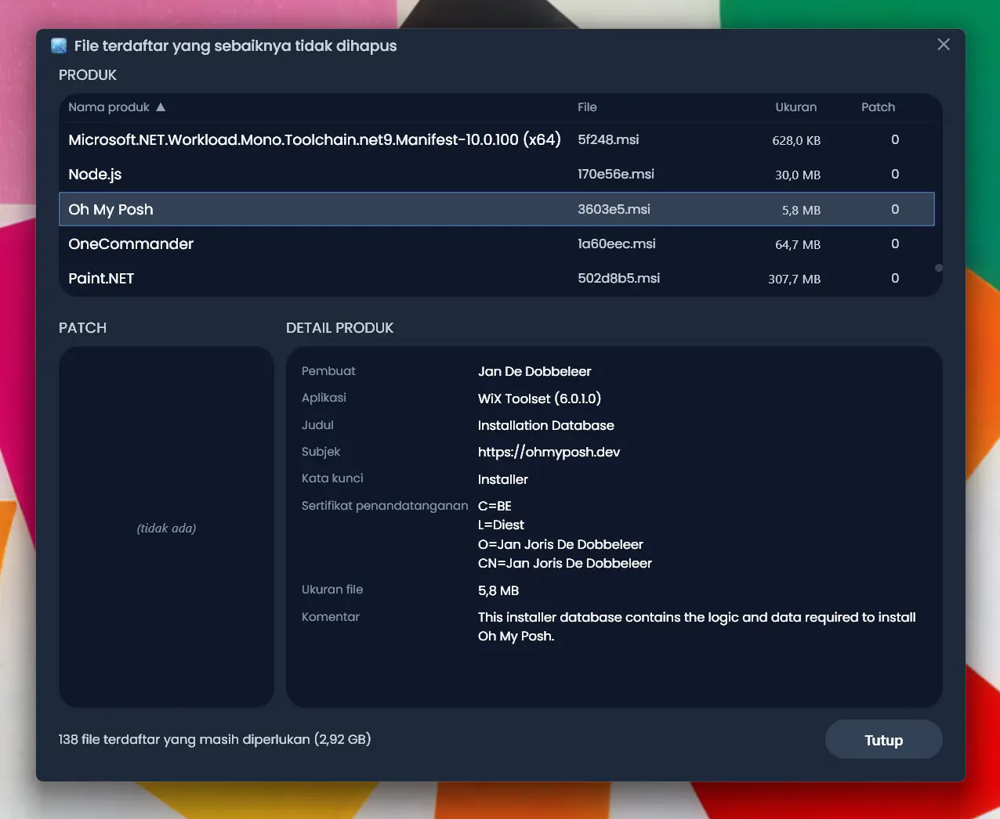
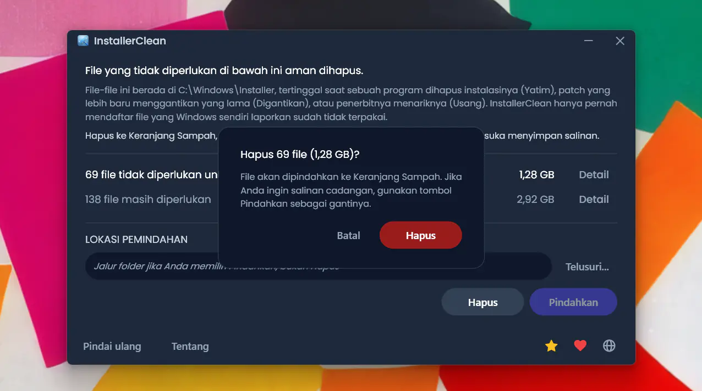
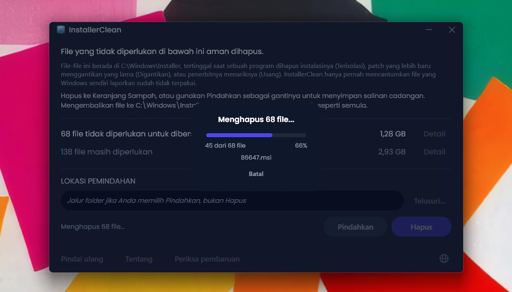
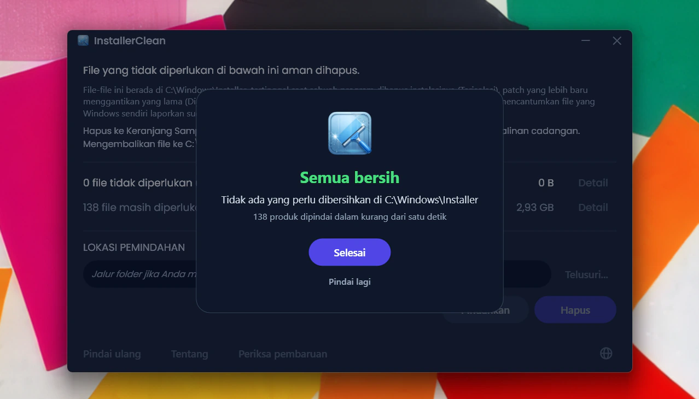
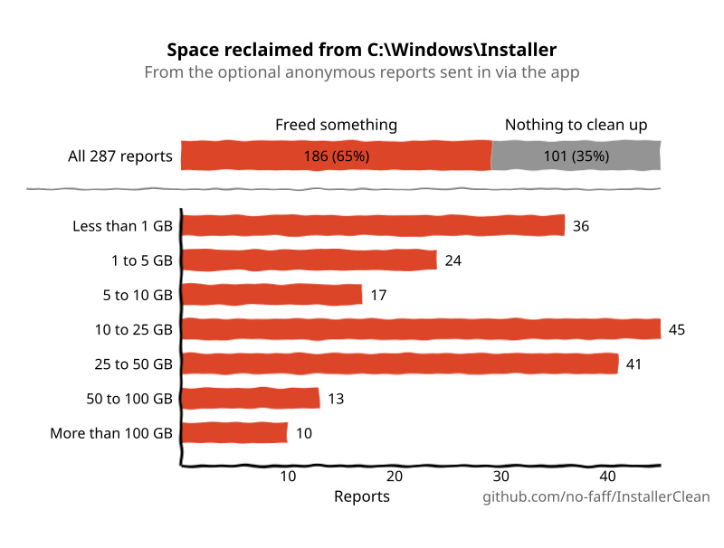

<p align="center">
  <a href="README.md">English</a> · <a href="README.zh-CN.md">简体中文</a> · <a href="README.ru.md">Русский</a> · <a href="README.es.md">Español</a> · <a href="README.ar.md">العربية</a> · <a href="README.ja.md">日本語</a> · <a href="README.pt-BR.md">Português (BR)</a> · <a href="README.pl.md">Polski</a> · <a href="README.tr.md">Türkçe</a> · <a href="README.ko.md">한국어</a> · <a href="README.fr.md">Français</a> · <a href="README.it.md">Italiano</a> · <a href="README.de.md">Deutsch</a> · <strong>Bahasa Indonesia</strong> · <a href="README.vi.md">Tiếng Việt</a> · <a href="README.uk.md">Українська</a> · <a href="README.nl.md">Nederlands</a>
</p>

<p align="center">
  
</p>

<p align="center"><em>🎶 What's my line? I'm happy <a href="https://www.youtube.com/watch?v=HM-jHhUZfFI">cleaning Windows</a></em></p>

<h1 align="center">InstallerClean</h1>

<p align="center"><strong>Alat sumber terbuka untuk membersihkan <code>C:\Windows\Installer</code> dengan aman, folder Windows tersembunyi yang diam-diam menggerogoti ruang disk Anda.</strong></p>

<p align="center"><em>Pakai sesekali saja. Mungkin sedikit ruang jadi lega. Lalu lanjutkan harimu, terasa bersih.</em></p>

<p align="center">
  <a href="LICENSE"></a>
  <a href="https://dotnet.microsoft.com/download/dotnet/10.0"></a>
  <a href="https://github.com/no-faff/InstallerClean/actions/workflows/ci.yml"></a>
  <a href="https://github.com/no-faff/InstallerClean/releases"></a>
  <a href="https://github.com/no-faff/InstallerClean/releases/latest"></a>
  <a href="https://github.com/no-faff/InstallerClean/releases"></a>
</p>



- **Apa:** InstallerClean melakukan satu hal: menghapus file yang tidak diperlukan dari `C:\Windows\Installer`, folder tersembunyi yang tidak pernah dibersihkan Windows. Setelah pemindaian yang hampir seketika, aplikasi memberi tahu Anda apakah ada file seperti itu, menampilkan detail lebih lanjut bagi yang penasaran, dan memungkinkan Anda menghapusnya untuk mengosongkan ruang di drive C: Anda. Anda cukup memakainya sekali lalu lanjut.
- **Mungkin Anda di sini karena:** Anda memakai [WinDirStat](https://github.com/windirstat/windirstat), WizTree, atau TreeSize, melihat `C:\Windows\Installer` memakan banyak ruang, dan tidak tahu apa isinya. InstallerClean justru yang Anda butuhkan. Aplikasi ini tahu isi file dengan nama yang tampak acak seperti `9f05cba.msi` dan dengan cepat memberi tahu Anda mana yang aman dihapus.
- **Berapa banyak ruang:** Laporan (opsional dan anonim) yang masuk sejauh ini menunjukkan bahwa <!-- reports-freedpct-start -->54%<!-- reports-freedpct-end --> mesin memiliki file tidak diperlukan untuk dibersihkan. Dari mesin-mesin itu, median yang dikosongkan adalah <!-- reports-median-start -->19,9 GB<!-- reports-median-end --><!-- reports-biggest-start --> dan yang terbesar adalah 327 GB<!-- reports-biggest-end -->. Bagi saya jumlahnya 1,28 GB. Sisanya, <!-- reports-nothingpct-start -->46%<!-- reports-nothingpct-end -->, tidak menemukan apa pun untuk dihapus, yang berarti folder Installer mereka memang sudah bersih. Detail lebih lanjut ada di [FAQ](#faq) di bawah.
- **Apakah aman:** Ya. Aplikasi menanyakan langsung ke Windows Installer API sendiri file mana yang masih diperlukan dan hanya pernah mendaftar file yang dilaporkan Windows sudah tidak terpakai. Aplikasi ini sumber terbuka (Apache 2.0) dan tidak menanyakan apa pun tentang Anda: tanpa akun, tanpa iklan, tanpa pelacakan, tanpa telemetri, tidak ada yang berjalan di latar belakang. Satu-satunya hal yang dilakukannya secara daring atas inisiatifnya sendiri adalah memeriksa GitHub untuk versi yang lebih baru saat Anda menjalankannya, dan itu bisa Anda matikan.
- **Dapatkan:** [Unduh rilis terbaru](../../releases/latest). Jalankan; lewati [peringatan "unknown publisher"](#unknown-publisher) dan [permintaan administrator](#admin). Hapus file yang tidak diperlukan. Selesai.

## Daftar Isi

- [Folder yang tak pernah diberitahukan kepada Anda](#folder-yang-tak-pernah-diberitahukan-kepada-anda)
- [Mencari bantuan](#mencari-bantuan)
- [Apa yang dilakukannya](#apa-yang-dilakukannya)
- [Tangkapan layar](#tangkapan-layar)
- [Cara kerjanya](#cara-kerjanya)
- [Apakah aman?](#apakah-aman)
- [Jika Anda memang punya file yang hilang dari C:\Windows\Installer](#recovery)
- [Aksesibilitas](#aksesibilitas)
- [Apa yang tidak dilakukannya](#apa-yang-tidak-dilakukannya)
- [FAQ](#faq)
- [Unduh](#unduh)
- [Dibandingkan dengan PatchCleaner](#dibandingkan-dengan-patchcleaner)
- [Baris perintah](#baris-perintah)
- [Persyaratan](#persyaratan)
- [Membangun dari kode sumber](#membangun-dari-kode-sumber)
- [Berkontribusi](#berkontribusi)
- [Dukung proyek ini](#dukung-proyek-ini)
- [Riwayat bintang](#riwayat-bintang)
- [Lisensi](#lisensi)

---

## Folder yang tak pernah diberitahukan kepada Anda

Di setiap PC Windows ada folder tersembunyi bernama `C:\Windows\Installer`. Setiap kali Anda memasang perangkat lunak yang menggunakan sistem Windows Installer, atau menerapkan patch untuk Microsoft Office, Adobe Acrobat, Visual Studio atau aplikasi berbasis `.msi` lainnya, satu salinan penginstal atau file patch `.msp` itu masuk ke folder ini, dan menetap di sana.

Saat Anda menghapus instalasi perangkat lunak itu, file-nya tetap ada. Saat patch yang lebih baru menggantikan yang lama, keduanya tetap ada. Windows tidak pernah membersihkannya. Disk Cleanup tidak menyentuhnya. DISM ditujukan untuk folder yang sama sekali berbeda. Seiring waktu, folder ini membesar: 1 GB, 5 GB, 20 GB, 50 GB. Pada mesin dengan banyak perangkat lunak berbasis MSI (Acrobat sering jadi biang keladinya), ukurannya bisa [melampaui 100 GB](https://www.reddit.com/r/sysadmin/comments/1oxcrmh/acrobat_filling_up_the_cwindowsinstaller_folder/).

Ini bukan file sementara yang muncul kembali dengan sendirinya. Ini benar-benar cuma beban: penginstal lama dari perangkat lunak yang Anda hapus instalasinya bertahun-tahun lalu dan patch yang sudah diganti berkali-kali. Begitu hilang, file-file ini tidak akan kembali.

**Jika Anda mencari cara mudah untuk mengosongkan ruang disk di Windows, folder ini tempat yang baik untuk memulai.** InstallerClean menemukan file yang tidak diperlukan dan menghapusnya dengan aman.

## Mencari bantuan

Jika Anda pernah mencari bantuan soal folder ini, Anda mungkin tahu bagaimana ceritanya. Seseorang dengan 180 GB di `C:\Windows\Installer` bertanya cara membersihkannya. Dia [disuruh menjalankan Disk Cleanup](https://learn.microsoft.com/en-us/answers/questions/4238108/windows-installer-folder-has-occupied-180gb). Dia mencobanya. Cara itu mengosongkan 600 MB, tidak satu pun dari folder tersebut (karena Disk Cleanup tidak menyentuh `C:\Windows\Installer`). Utasnya pun sepi.

> *"Semua utas yang saya temukan cenderung menyarankan hal-hal yang sama yang tidak menyelesaikan masalah, lalu mati begitu saja."*
>
> [ksparks519, r/Windows10](https://www.reddit.com/r/Windows10/comments/1bt8c5p/anyone_ever_figure_out_giant_installer_folders/) (diterjemahkan dari teks asli bahasa Inggris)

Atau mereka disuruh untuk tidak menyentuhnya sama sekali. Di satu utas, seseorang dengan folder Installer 60 GB disuruh untuk ["jangan utak-atik."](https://www.reddit.com/r/techsupport/comments/1hw4suq/my_windows_installer_folder_is_like_60gb_so_i/) Ketika dia bertanya apa yang sebaiknya dilakukan, jawabannya: *"Barusan sudah saya bilang."*

Nasihat standar mencampuradukkan penghapusan file secara sembarangan (yang memang berbahaya) dengan penghapusan file yang Windows sendiri nyatakan sudah tidak diperlukan (yang tidak berbahaya). InstallerClean melakukan yang kedua.

## Apa yang dilakukannya

1. **Memindai** `C:\Windows\Installer` untuk file `.msi` dan `.msp`
2. **Menanyakan** ke Windows Installer API untuk mengetahui file mana yang masih terdaftar
3. **Menampilkan** berapa banyak yang bisa Anda kosongkan dan berapa banyak yang masih diperlukan, dengan jendela detail opsional yang mendaftar setiap file
4. **Menghapus** file yang tidak diperlukan: hapus ke Keranjang Sampah, atau pindahkan ke folder pilihan Anda

## Tangkapan layar

<p>
  <br>
  <em>Pemindaian awal. Ini sangat cepat.</em>
  <br><br>
</p>

<p>
  <br>
  <em>Hasil: berapa banyak yang masih diperlukan, berapa banyak yang bisa dihapus.</em>
  <br><br>
</p>

<p>
  <br>
  <em>Detail file yang sudah tidak diperlukan lagi.</em>
  <br><br>
</p>

<p>
  <br>
  <em>Detail file yang masih diperlukan, dengan metadata yang dibaca dari basis data penginstal.</em>
  <br><br>
</p>

<p>
  <br>
  <em>Konfirmasi sebelum kedua tindakan. Hapus memindahkan ke Keranjang Sampah; Pindahkan menaruh file di tempat pilihan Anda.</em>
  <br><br>
</p>

<p>
  <br>
  <em>Penghapusan sedang berjalan. Batal menghentikannya di tengah jalan.</em>
  <br><br>
</p>

<p>
  <br>
  <em>Setelah Hapus yang berhasil.</em>
  <br><br>
</p>

<p>
  <br>
  <em>Setelah pemindaian ulang. Tidak ada lagi yang perlu dibersihkan.</em>
  <br><br>
</p>

## Cara kerjanya

InstallerClean mengenali tiga jenis file yang tidak diperlukan.

**File yatim** adalah penginstal `.msi` (dan patch `.msp` apa pun) yang tertinggal setelah Anda menghapus instalasi perangkat lunak. Windows tidak lagi merujuknya, tetapi file-file itu tetap berada di folder dan memakan ruang.

**Patch yang digantikan** adalah patch `.msp` lama yang telah diganti oleh yang lebih baru. Windows menandainya sebagai digantikan di basis datanya sendiri tetapi tidak pernah menghapusnya. Adobe-lah alasan hal ini begitu sering muncul: setiap pembaruan Acrobat dirilis sebagai patch atas penginstal asli yang sama, bukan sebagai penginstal baru tersendiri, sehingga sebuah mesin akhirnya menyimpan satu patch untuk setiap pembaruan yang pernah diterimanya. Office dan alat pengembangan besar menumpuk dengan cara yang sama, hanya lebih lambat.

**Patch usang** adalah patch `.msp` yang telah ditarik atau ditinggalkan oleh penerbitnya alih-alih diganti dengan versi yang lebih baru. Windows mencatat keadaan itu juga, dan sama-sama membiarkan file-nya di folder.

Untuk menemukannya, InstallerClean memanggil antarmuka COM Windows Installer secara langsung melalui P/Invoke:

- `MsiEnumProductsEx` untuk mendata setiap produk yang terpasang
- `MsiEnumPatchesEx` untuk menemukan semua patch terdaftar bagi setiap produk
- `MsiGetPatchInfoEx` untuk membaca keadaan patch (diterapkan, digantikan atau usang)

Setiap file `.msi` atau `.msp` di `C:\Windows\Installer` yang tidak diklaim oleh produk terdaftar mana pun berarti yatim dan ditandai bisa dihapus. Demikian pula setiap patch yang ditandai digantikan atau usang oleh basis data dan tidak diperlukan untuk penghapusan instalasi.

Aplikasi juga membaca catatan yang sama langsung dari registri pada setiap pemindaian, sebagai sumber kedua yang berdiri sendiri. Jika salah satu dari kedua pembacaan itu kembali tidak lengkap (jarang, tetapi bisa terjadi pada keadaan penginstal yang rusak), InstallerClean menahan file atau menolak pemindaian alih-alih menebak. Pembacaan kedua ini hanya menambahkan file ke kumpulan "masih diperlukan", tidak pernah ke kumpulan "bisa dihapus".

Setelah Pindahkan atau Hapus selesai, subfolder kosong di dalam `C:\Windows\Installer` (direktori yang ditinggalkan cache setelah isinya hilang) dipangkas dalam satu proses yang sama.

<a id="is-it-safe"></a>
## Apakah aman?

Ya. InstallerClean menanyakan ke basis data Windows Installer API yang sama dengan yang dipakai Windows sendiri untuk melacak apa yang terpasang. Jika Windows menyatakan suatu file sudah tidak diperlukan, aplikasi memercayainya; aplikasi tidak menebak berdasarkan nama file atau tanggal.

**Tentang Hapus dan Pindahkan.** File yang dihapus InstallerClean aman untuk dihapus permanen. **Hapus** memindahkannya ke Keranjang Sampah (Anda akan diperingatkan jika Keranjang Sampah tidak tersedia); Anda mendapatkan kembali ruang di drive C: saat mengosongkan Keranjang Sampah.

Namun, Anda tidak harus percaya begitu saja pada saya bahwa file-file itu aman dihapus. Selama berada di Keranjang Sampah, Anda berkesempatan memeriksa apakah aplikasi yang memakai folder ini, Office, Acrobat, Visual Studio dan sejenisnya, masih bisa diperbarui dan dihapus instalasinya tanpa masalah. Jika Anda menemukan ada yang rusak (kemungkinannya sangat kecil, dan sejauh ini belum ada laporan setelah <!-- downloads-start -->47.000+<!-- downloads-end --> unduhan), pulihkan file dari Keranjang Sampah untuk memperbaikinya. Agar benar-benar aman, Anda bisa menggunakan **Pindahkan** sebagai gantinya, untuk mencadangkan file ke folder pilihan Anda (tentu pilih folder di partisi/drive lain jika Anda ingin mengosongkan ruang di C:). Cukup salin kembali file ke `C:\Windows\Installer` untuk mengembalikan semuanya seperti semula (meskipun hampir pasti Anda tidak akan pernah memerlukannya). Jika ada file yang namanya jadi berisi "(1)" (itu terjadi kalau Anda memindahkan file ke folder yang sama dua kali), hapus bagian itu sebelum menyalin file kembali.

Jika Windows Installer sedang menulis ke cache, memiliki transaksi sebelumnya yang ditangguhkan, atau memiliki antrean penggantian nama setelah mulai ulang yang menyasar cache, Pindahkan dan Hapus dinonaktifkan dan alasan spesifiknya ditampilkan.

Layanan pemindaian, kueri, pemindahan, penghapusan, pengaturan, dan mulai-ulang-tertunda dicakup oleh rangkaian pengujian otomatis yang berjalan pada setiap commit (lihat lencana CI di atas).

**Memverifikasi biner.** InstallerClean tidak ditandatangani, tetapi Anda tidak perlu percaya begitu saja bahwa aplikasi ini aman:

- Hash SHA-256 untuk tiap rilis tercantum di [halaman rilis](../../releases/latest).
- VirusTotal: setiap build dipindai, dengan hasil lengkap per mesin pemindai ditautkan di halaman rilisnya sehingga Anda bisa melihat skor tiap file dan memindai ulang sendiri. Positif palsu yang masih aktif saat sebuah rilis keluar disebutkan namanya dan dijelaskan di halaman rilis tersebut, dan halaman itu diperbarui begitu vendornya mencabutnya.
- Kode sumber ada di [github.com/no-faff/InstallerClean](https://github.com/no-faff/InstallerClean) dan CI membangun serta menguji setiap commit (lihat lencana CI hijau di atas).
- Build rilis bersifat deterministik: pengaturan kompiler membuat kode sumber yang sama dan SDK yang sama menghasilkan byte yang sama persis, dan proses rilis menolak memberi tag pada sebuah versi jika berkas exe yang dirilis tidak dibangun dari pohon kerja yang bersih tepat pada tag itu. Jadi Anda bisa checkout tag tersebut, membangunnya sendiri, lalu membandingkan hash-nya dengan yang dipublikasikan: unduhan Anda terbukti cocok dengan kode sumber yang terbuka. Samakan dulu versi SDK-nya (catatan tiap rilis menyebutkan SDK mana yang dipakai); patch SDK yang berbeda menghasilkan byte yang berbeda, yang terlihat seperti ketidakcocokan padahal bukan.
- <!-- downloads-start -->47.000+<!-- downloads-end --> unduhan di GitHub, MajorGeeks, dan Softpedia.
- [MajorGeeks](https://www.majorgeeks.com/files/details/installerclean.html) menguji tiap kiriman di mesin virtual dan hanya mendaftarkannya jika lolos tinjauan mereka.<br><a href="https://www.majorgeeks.com/files/details/installerclean.html"></a>
- [Softpedia](https://www.softpedia.com/get/System/Hard-Disk-Utils/InstallerClean.shtml) menguji tiap rilis dari virus, spyware, dan adware.<br><a href="https://www.softpedia.com/get/System/Hard-Disk-Utils/InstallerClean.shtml"></a>

<a id="recovery"></a>
## Jika Anda memang punya file yang hilang dari `C:\Windows\Installer`

InstallerClean hanya menghapus file yang dilaporkan Windows sendiri sudah tidak diperlukan, jadi aplikasi ini tidak akan pernah menjadi penyebab hilangnya suatu file. Namun jika ada file yang memang sudah hilang, InstallerClean mendeteksinya dan menandainya. Berikut cara memperbaikinya.

Unduh penginstal program tersebut dari pembuatnya dan jalankan di atas instalasi yang sudah ada; jangan menghapus instalasi terlebih dahulu. Gunakan versi yang Anda miliki sekarang jika bisa, karena Windows mungkin menolak versi yang berbeda. Cara ini biasanya mengembalikan file tersebut dan membiarkan pengaturan Anda tetap utuh. Pindai ulang di InstallerClean dan peringatannya akan hilang jika berhasil.

Cara itu biasanya berhasil. Yang berikut ini adalah penjelasan Microsoft sendiri yang lebih lengkap: detail resminya, dan kasus-kasus yang lebih sulit ketika persoalannya tidak sesederhana itu. Tidak ada satu pun yang merupakan perbuatan InstallerClean, dan saya tidak bisa memperbaiki panduan Microsoft, jadi saya hanya meneruskannya.

<details>
<summary>Penjelasan Microsoft yang lebih lengkap</summary>

*Kutipan Microsoft berikut tetap dalam teks asli bahasa Inggris.*

Panduan lengkap: [Restore missing Windows Installer cache files](https://learn.microsoft.com/en-us/troubleshoot/windows-client/application-management/missing-windows-installer-cache).

*Mungkin tidak langsung muncul:*
> "If the installer cache is compromised, you may not immediately see problems until you take an action such as uninstalling, repairing, or updating a product."

*File bersifat unik per mesin, jadi Anda tidak bisa menyalinnya dari PC lain:*
> "Missing files cannot be copied between computers because the files are unique."

*Anda juga tidak bisa mengambil hanya file itu dari cadangan:*
> "To restore the missing files, a full system state restoration is required. It is not possible to replace only the missing files from a previous backup."

*Pemulihan yang disarankan, dan batas-batasnya yang gamblang:*
> "If application files are missing from the Windows Installer Cache, ask the vendor or support team for the application about the missing files. You must follow the procedures or steps recommended by the application vendor to restore the files. In some cases, you may have to rebuild the operating system and reinstall the application to fix the problem."
>
> "Windows support engineers cannot help you recover missing application files from the Windows Installer cache."

*Mengapa versi yang sama itu penting:*
> "The upgrade cannot be installed by the Windows Installer service because the program to be upgraded may be missing, or the upgrade may update a different version of the program."

</details>

## Aksesibilitas

InstallerClean dibuat agar sepenuhnya bisa digunakan dari keyboard dan dengan pembaca layar.

- **Bisa dioperasikan sepenuhnya dengan keyboard.** Tab menjangkau setiap kontrol, dan kolom jendela detail bisa diurutkan dari keyboard, jadi tidak ada yang memerlukan mouse di sini. Fokus keyboard tetap terlihat di mana pun ia berada.
- **Narator dan Akses Suara.** Setiap kontrol diberi label, dan kata yang terlihat pada sebuah tombol adalah kata yang mengaktifkannya lewat suara. Saat Pindahkan atau Hapus selesai, hasilnya dibacakan.
- **Dirancang untuk dibaca.** Teks memenuhi kontras WCAG AA di seluruh tema gelap.

Jika ada sesuatu di sini yang menghalangi Anda, [buka sebuah issue](../../issues). Masalah aksesibilitas adalah bug, bukan kasus pinggiran.

## Apa yang tidak dilakukannya

- WinSxS (`C:\Windows\WinSxS`) adalah folder berbeda dengan aturan berbeda. Untuk folder itu, jalankan `Dism /Online /Cleanup-Image /StartComponentCleanup` dari prompt perintah yang ditinggikan.
- Tanpa layanan latar belakang, tanpa tugas terjadwal, tanpa pembersihan otomatis. Aplikasi berjalan ketika Anda menjalankannya.
- Aplikasi tidak mengubah program yang terpasang atau basis data Windows Installer, hanya membacanya. Satu-satunya hal yang pernah ditulisnya ke registri adalah pendaftaran sumber peristiwa sekali saja yang dibutuhkan alat baris perintah agar proses jalannya muncul di Log Peristiwa Windows.
- Ada satu jenis sambungan yang dibuatnya atas inisiatifnya sendiri: pemeriksaan cepat ke halaman rilis GitHub untuk versi yang lebih baru saat Anda menjalankannya, yang bisa Anda matikan di jendela Tentang. Selebihnya hanya terjadi ketika Anda memerintahkannya: laporan anonim opsional (sekadar memberi tahu saya bahwa aplikasi berfungsi) serta tautan ke dokumentasi GitHub dan halaman donasi, yang terbuka di peramban Anda jika Anda mengekliknya. Aplikasi tidak pernah mengunduh apa pun dengan sendirinya.
- Tanpa bilah alat, tanpa perangkat lunak yang dibundel, tanpa adware.

## FAQ

<a id="reports-stats"></a>
**Apakah saya benar-benar akan mengosongkan ruang sebesar GB?** Tergantung mesin Anda. Instalasi Windows 11 yang bersih tanpa perangkat lunak tambahan tidak punya apa pun untuk dihapus. Workstation pengembang yang sudah lama berjalan, atau mesin mana pun dengan banyak perangkat lunak berbasis MSI (Acrobat, Office, LibreOffice, alat pengembangan besar), bisa menyimpan puluhan GB. Apa pun keadaannya, Anda akan melihat persis berapa banyak begitu menjalankannya.

<!-- reports-stats-start (generated; do not hand-edit between these markers) -->
Dari 156 laporan yang dikirimkan orang-orang (terima kasih 🙏) sejak opsi ini ditambahkan di v1.8.0, 54% mesin punya sesuatu untuk dibersihkan. Ini rinciannya:

<picture>
  <source media="(prefers-color-scheme: dark)" srcset="docs/reports-en-dark.svg" />
  <source media="(prefers-color-scheme: light)" srcset="docs/reports-en-light.svg" />
  
</picture>
<!-- reports-stats-end -->

<details>
<summary>Laporan itu berasal dari tombol opsional "Kirim laporan". Inilah yang akan Anda lihat sebelum apa pun dikirim.</summary>


</details>

<a id="admin"></a>

**Mengapa aplikasi meminta hak Administrator?** `C:\Windows\Installer` dikunci hanya untuk administrator. Membacanya, menanyakan basis data Installer, dan memindahkan atau menghapus file semuanya memerlukan hak itu, jadi aplikasi harus berjalan sebagai admin.

<a id="unknown-publisher"></a>

**Mengapa Windows mengatakan "Unknown publisher"?** Karena InstallerClean tidak ditandatangani secara digital, dan Windows menandai file yang diunduh dari internet, sehingga pada kali pertama dijalankan Windows SmartScreen biasanya menampilkan "Windows protected your PC" dengan penerbit tertera sebagai tidak dikenal. Sertifikat penandatanganan membutuhkan biaya setiap tahun, dan saya lebih memilih membuat aplikasi tetap gratis daripada membayarnya. Klik **More info**, lalu **Run anyway**. Aman untuk dilakukan: kode sumbernya publik, dan tiap rilis memiliki tautan VirusTotal serta hash SHA-256 yang bisa Anda periksa lebih dulu.

**Bisakah saya membatalkan Hapus?** Biasanya, ya. Ketika Keranjang Sampah tersedia untuk drive tersebut, Hapus memindahkan file ke sana dan Anda bisa memulihkannya dari Keranjang Sampah. Jika Keranjang Sampah tidak tersedia, aplikasi tidak akan pernah menghapus secara permanen dengan sendirinya (lihat [Apakah aman?](#apakah-aman)). Dan jika Anda lebih suka punya jalan kembali yang Anda kendalikan, Pindahkan menaruh file di folder pilihan Anda; hapus dari sana kapan pun Anda sudah yakin.

**Akankah Windows mengeluh jika saya menghapus file-file ini?** Tidak. InstallerClean hanya pernah menghapus file yang dilaporkan Windows sendiri sudah tidak terpakai, jadi tidak ada yang dihapusnya yang diperlukan untuk memperbaiki, memperbarui, atau menghapus instalasi suatu program. Jika suatu file yang diperlukan memang hilang dari `C:\Windows\Installer` lewat cara lain, lihat [Jika Anda memang punya file yang hilang dari C:\Windows\Installer](#recovery).

**Mengapa tidak `Win32_Product` (WMI)?** [`Win32_Product` memicu operasi perbaikan MSI pada setiap produk selama enumerasi](https://gregramsey.net/2012/02/20/win32_product-is-evil/), yang bisa memakan waktu beberapa menit dan membebani disk dengan berat. InstallerClean memanggil Windows Installer COM API secara langsung tanpa efek samping.

**Mengapa tidak cukup skrip PowerShell saja?** Skrip pendek yang memanggil `MsiEnumPatchesEx` sudah cukup untuk *mendaftar* patch, tetapi bagian-bagian penting InstallerClean justru yang dilewati skrip seperti itu: klasifikasi yatim-versus-digantikan, cadangan registri yang hanya pernah menambahkan file ke kumpulan "masih diperlukan" (tidak pernah ke "bisa dihapus"), blokir saat mulai ulang tertunda, jaring pengaman Pindahkan-ke-tempat-lain, kemajuan per file dengan pembatalan, dan default Recycle-Bin-bukan-hapus-permanen. Kasus pinggiran pada mesin nyata yang penuh MSI (registrasi rusak, junction di dalam cache, produk di `HKU\.DEFAULT`, transaksi Installer yang ditangguhkan) mudah salah ditangani dalam skrip sekali pakai. `installerclean-cli` adalah wajah tanpa antarmuka jika yang Anda inginkan adalah membuat skrip.

**Apakah berfungsi di Windows 7 atau 8?** Belum diuji dan tidak didukung. Ditujukan untuk Windows 10 dan 11.

**Apakah cocok untuk RMM / penyebaran massal?** Ya. CLI keluar dengan kode yang berbeda untuk tiap hasil (0 berhasil, 2 sebagian, 1 kegagalan total, 75 sementara, 130 untuk Ctrl+C sebelum ada file yang diproses; Ctrl+C yang terjadi di tengah batch keluar dengan 2, karena pekerjaan sudah dijalankan) sehingga tugas terjadwal bisa mencoba ulang pada 75 tanpa mencampuradukkannya dengan kegagalan total. CLI menulis ringkasan tiap proses ke log peristiwa Application dan menghormati mutex instans-tunggal yang sama dengan GUI. Penginstal setup juga memasang secara senyap dengan sakelar standar Inno Setup (`/SILENT` atau `/VERYSILENT`); peluncuran pascainstalasi dilewati pada pemasangan senyap. Lihat bagian Baris perintah.

## Unduh

Tiga varian, pilih salah satu:

- **Setup** (`InstallerClean-2.3.0-setup.exe`): penginstal Windows biasa dengan runtime .NET 10 yang sudah dibundel. Menambahkan entri di menu Mulai dan bisa dihapus instalasinya dengan bersih. Tertata di daftar Program agar mudah ditemukan enam bulan dari sekarang.
- **Portable** (`InstallerClean-2.3.0-portable.exe`): satu file exe mandiri dengan runtime yang sudah dibundel. Tanpa instalasi, tanpa penghapus instalasi. Jalankan, pakai, hapus. Jalankan lagi kapan pun.
- **CLI** (`installerclean-cli.exe`): versi baris perintah tersendiri, satu file exe mandiri. Tanpa instalasi, tidak ada yang tertinggal di mesin sesudahnya. Taruh di komputer klien, jalankan pemindaian atau pembersihan, lalu hapus. Dibuat untuk skrip, tugas terjadwal, dan penyebaran massal, ketika Anda menginginkan operasinya tanpa aplikasi desktop di klien. Lihat [Baris perintah](#baris-perintah) untuk argumen dan kode keluar.

Mulai 2.2.0, nama file versi setup dan portabel memuat nomor versinya, sehingga salinan yang diunduh selalu menyebutkan dirinya apa; alat baris perintah tetap memakai nama polos `installerclean-cli.exe` agar tugas terjadwal dan skrip yang menunjuk ke sana tetap berjalan setelah pembaruan.

Unduh dari [halaman rilis](../../releases/latest), lalu jalankan. Aplikasi ini tidak ditandatangani, jadi Windows menampilkan peringatan "unknown publisher"; [FAQ](#unknown-publisher) menjelaskan apa yang akan Anda lihat dan mengapa itu aman.

Aplikasi memindai secara otomatis saat dimulai. Tinjau hasilnya, lalu klik **Hapus** atau **Pindahkan**.

Atau pasang melalui [winget](https://learn.microsoft.com/windows/package-manager/winget/):

```
winget install NoFaff.InstallerClean
```

Atau pasang melalui [Scoop](https://scoop.sh):

```
scoop install installerclean
```

## Dibandingkan dengan PatchCleaner

Jika Anda pernah mencari folder ini sebelumnya, alat yang paling mungkin Anda temukan adalah [PatchCleaner](https://www.homedev.com.au/free/patchcleaner). Alat ini masih bertahan kuat, tetapi saya membuat InstallerClean karena PatchCleaner bersumber tertutup, tidak mendapat pembaruan sejak Maret 2016 dan, secara default, tidak menyentuh produk Adobe. Pemeriksaan yatim-nya keliru menandai patch Adobe, dan menghapusnya merusak pembaruan Adobe, jadi alat itu membiarkan semua file Adobe kecuali Anda mematikan filternya. Pada mesin tempat Adobe menjadi biang keladi terparah, di situlah sebagian besar ruang berada:

> *"Saya sudah mengunduh Patchcleaner untuk menghapus file .msp yang yatim, tetapi tampaknya ini hanya akan mengosongkan 250 MB ruang. 29 GB dari file-nya 'dikecualikan oleh filter', jadi Patchcleaner sepertinya tidak membantu."*
>
> HeatherBunny1111, [r/techsupport](https://www.reddit.com/r/techsupport/comments/1qc4tcf/how_to_delete_msp_files_safely/) (diterjemahkan dari teks asli bahasa Inggris)

InstallerClean membaca catatan patch milik Windows Installer sendiri, jadi alih-alih menyembunyikan semua file Adobe di balik filter menyeluruh, aplikasi bisa mengetahui patch mana yang ditandai Windows sebagai digantikan, dan melabelinya persis seperti itu. Berikut perbandingan keduanya:

| | **InstallerClean** | **PatchCleaner** |
|---|---|---|
| Terakhir diperbarui | 2026 (aktif) | 3 Maret 2016 |
| Kode sumber | Sumber terbuka (Apache 2.0) | Sumber tertutup |
| Runtime | .NET 10 (mandiri) | .NET + VBScript |
| API | Windows Installer COM (dalam proses) | Windows Installer COM (di luar proses, via VBScript) |
| Deteksi patch yang digantikan | Ya | Tidak |
| Penanganan Adobe | Mendeteksi patch yang digantikan | Mengecualikan secara default |
| Antarmuka | Tema gelap (WPF) | Windows Forms |
| Pengumpulan data | Tidak ada | Tidak ada |
| Keamanan penghapusan | Keranjang Sampah. Jika tidak tersedia, aplikasi bertanya: pindahkan saja atau hapus permanen | Permanen, tanpa Keranjang Sampah |

> **Catatan tentang `Win32_Product`:** Pendekatan yang umum tetapi cacat untuk mendaftar produk yang terpasang adalah `Win32_Product` (WMI), yang [memicu operasi perbaikan MSI](https://gregramsey.net/2012/02/20/win32_product-is-evil/) pada setiap produk selama enumerasi. Baik InstallerClean maupun PatchCleaner menghindarinya. Keduanya menggunakan antarmuka COM Windows Installer. Nama file `WMIProducts.vbs` dalam skrip PatchCleaner menyesatkan; skrip itu menggunakan MSI COM, bukan WMI.

[Ultra Virus Killer (UVK)](https://www.carifred.com/uvk/) juga menawarkan pembersihan Installer sebagai bagian dari modul System Booster-nya, tetapi ini alat berbayar (15-25 USD) dan pembersihan hanyalah satu fitur kecil di dalam aplikasi yang jauh lebih besar. InstallerClean gratis, terfokus, dan sumber terbuka.

Pembersih sistem serbaguna seperti [CCleaner](https://www.ccleaner.com/) dan [BleachBit](https://www.bleachbit.org/) tidak menyentuh `C:\Windows\Installer`. Folder ini memerlukan kueri ke Windows Installer API untuk membedakan paket yang terdaftar dari yang tidak diperlukan, dan pembersih umum yang sekadar menelusuri pohon file bisa merusak aplikasi yang terpasang. InstallerClean adalah alat yang Anda andalkan ketika justru folder itulah yang ingin Anda bersihkan.

## Baris perintah

InstallerClean mendukung operasi tanpa antarmuka untuk pembuatan skrip dan penggunaan oleh administrator sistem:

```
Penggunaan:
  installerclean-cli --help   Tampilkan bantuan ini (juga menerima /?, -h)
  installerclean-cli --version  Cetak versi (juga menerima -v)
  installerclean-cli /s       Pindai saja - daftar file tidak diperlukan
  installerclean-cli /d       Hapus file tidak diperlukan (Keranjang Sampah)
  installerclean-cli /m       Pindahkan ke lokasi default tersimpan
  installerclean-cli /m JALUR Pindahkan ke jalur yang ditentukan
```

Untuk meluncurkan GUI, jalankan `InstallerClean.exe` (atau gunakan pintasan menu Mulai dari instalasi setup).

Jalankan tanpa argumen, atau dengan flag yang tidak dikenali, maka `installerclean-cli` mencetak penggunaan ini dan keluar dengan `1`, sehingga tugas terjadwal yang kehilangan flag-nya gagal secara kasatmata alih-alih diam-diam berhasil padahal tidak melakukan apa-apa. `--help`, `/?` atau `-h` yang eksplisit mencetak penggunaan yang sama dan keluar dengan `0`.

`/s` hanya menjalankan simulasi: ia memindai, mendaftar apa yang akan dihapus beserta nama file dan ukurannya, lalu keluar. Berguna untuk audit sebelum pembersihan. Kode keluarnya `0` pada pemindaian yang berhasil, `1` jika pemindaian gagal, dan `130` pada Ctrl+C. Semua file ada di `C:\Windows\Installer`.

`/d` dan `/m` memindai lalu bertindak. `/d` memindahkan file yang bisa dihapus ke Keranjang Sampah. `/m` memindahkannya ke folder (entah yang Anda tentukan di baris perintah, atau default yang tersimpan dari GUI). Default tersimpan itu disimpan per-pengguna, jadi tugas terjadwal yang berjalan sebagai SYSTEM atau akun layanan tidak akan melihatnya; proses seperti itu harus menyebutkan foldernya secara eksplisit dengan `/m PATH`. Kode keluar: `0` untuk berhasil penuh, `2` untuk sebagian (sebagian file berhasil, sebagian gagal), `1` untuk kegagalan total (pemindaian gagal, argumen salah, atau semua file dalam batch gagal), `75` untuk kondisi sementara yang memblokir proses (pesan yang dicetak menjelaskan kondisi mana dan apakah mencoba ulang akan membantu), `130` untuk Ctrl+C sebelum ada file yang diproses (Ctrl+C yang terjadi di tengah batch keluar dengan `2`, sebagian, karena pekerjaan sudah dijalankan).

Semua keluaran CLI, termasuk pesan kesalahan dan diagnostik, masuk ke stdout; tidak ada aliran stderr terpisah. Kode keluar adalah sinyal yang terbaca mesin (dan entri log peristiwa Application per proses mencerminkannya), jadi skrip sebaiknya berpatokan pada kode keluar alih-alih mengurai teksnya, dan `installerclean-cli /s > audit.txt` menangkap seluruh proses termasuk baris kesalahan apa pun.

Ketiganya memerlukan prompt perintah yang ditinggikan (administrator). Jika Group Policy memblokir permintaan elevasi UAC, proses menolak untuk dijalankan dan Windows mengembalikan kesalahan 740 ke shell induk (`$LASTEXITCODE = 740` di PowerShell). `taskkill /pid <pid>` tidak memicu pembatalan yang mulus; mutex instans-tunggal dipulihkan oleh proses berikutnya melalui jalur AbandonedMutexException.

### Menjadwalkan pembersihan berkala

Untuk membersihkan secara berkala, arahkan Task Scheduler ke `installerclean-cli`. Jalankan sebagai SYSTEM atau akun layanan dengan hak tertinggi, supaya ia mendapat elevasi yang dibutuhkannya tanpa permintaan interaktif, dan sebutkan folder tujuan pemindahan di baris perintah, karena default yang tersimpan dari GUI disimpan per-pengguna dan tidak berlaku untuk proses sebagai SYSTEM atau akun layanan. Untuk pemindahan bulanan ke `D:\InstallerBackup`, dengan salinan CLI ditaruh di `C:\Tools`:

```
schtasks /create /tn "InstallerClean monthly" /tr "C:\Tools\installerclean-cli.exe /m D:\InstallerBackup" /sc monthly /ru SYSTEM /rl highest
```

Tugas itu menunggu sampai prosesnya selesai dan mencatat kode keluar sebagai Last Run Result miliknya, jadi RMM Anda bisa berpatokan pada kode-kode di atas (`0` berhasil penuh, `2` sebagian, `75` sementara, `1` kegagalan total) persis seperti yang dilakukan sebuah skrip.

### Mengapa `installerclean-cli` dan bukan `installerclean.exe`?

`InstallerClean.exe` adalah GUI WPF; ia tidak menanggapi argumen baris perintah. `installerclean-cli.exe` adalah executable konsol terpisah yang disertakan dalam direktori instalasi yang sama dan mengekspos operasi pindai / pindah / hapus yang sama ke PowerShell, cmd, dan tugas terjadwal. Karena ia proses konsol sungguhan, ia memblokir prompt sampai selesai; alihkan atau salurkan keluarannya seperti executable konsol lainnya.

Unduhan portable hanya berisi exe GUI. Jika Anda menginginkan baris perintah tanpa GUI, unduh `installerclean-cli.exe` dari [halaman rilis](../../releases/latest) dan jalankan langsung. Setup juga memasangnya bersama GUI.

## Persyaratan

- Windows 10 (versi 1607 / build 14393 atau lebih baru, yang tertua yang didukung runtime .NET 10) atau Windows 11
- Hak istimewa administrator (`C:\Windows\Installer` hanya untuk admin)

Lihat [Unduh](#unduh) untuk opsi build setup, portable, dan CLI.

## Membangun dari kode sumber

```
git clone https://github.com/no-faff/InstallerClean.git
cd InstallerClean
dotnet build src/InstallerClean.sln
```

Jalankan pengujian:

```
dotnet test src/InstallerClean.Tests/
```

## Berkontribusi

Menemukan bug atau punya saran? [Buka sebuah issue](../../issues) atau mulai [diskusi](../../discussions). Pull request dipersilakan. Mohon jalankan `dotnet test` sebelum mengirim.

InstallerClean kini tersedia sepenuhnya dalam bahasa Indonesia: aplikasi, pemasang, baris perintah, dan README ini. Semuanya terjemahan mesin yang sudah saya upayakan sebaik mungkin. Terjemahan ini tentu tidak akan sempurna, jadi saya merilisnya apa adanya daripada menunggu penutur asli memeriksanya. Jika Anda menemukan sesuatu yang bisa diperbaiki, saya akan dengan senang hati mendengarnya, lewat [issue](../../issues/new?template=translation_review.md), pull request, atau diskusi. Aplikasi terbuka dalam bahasa Windows Anda secara bawaan, dan Anda bisa beralih ke bahasa Inggris kapan saja lewat ikon globe.

## Dukung proyek ini

Jika InstallerClean membantu, pertimbangkan untuk [mendukung No Faff](https://nofaff.netlify.app/support) atau memberi bintang di GitHub.

## Riwayat bintang

<picture>
  <source media="(prefers-color-scheme: dark)" srcset="docs/star-history-dark.svg" />
  <source media="(prefers-color-scheme: light)" srcset="docs/star-history-light.svg" />
  
</picture>

## Lisensi

[Apache 2.0](LICENSE)

---

🎶 [George Formby - When I'm Cleaning Windows](https://www.youtube.com/watch?v=sfmAeijj5cM). Selamat menikmati!
