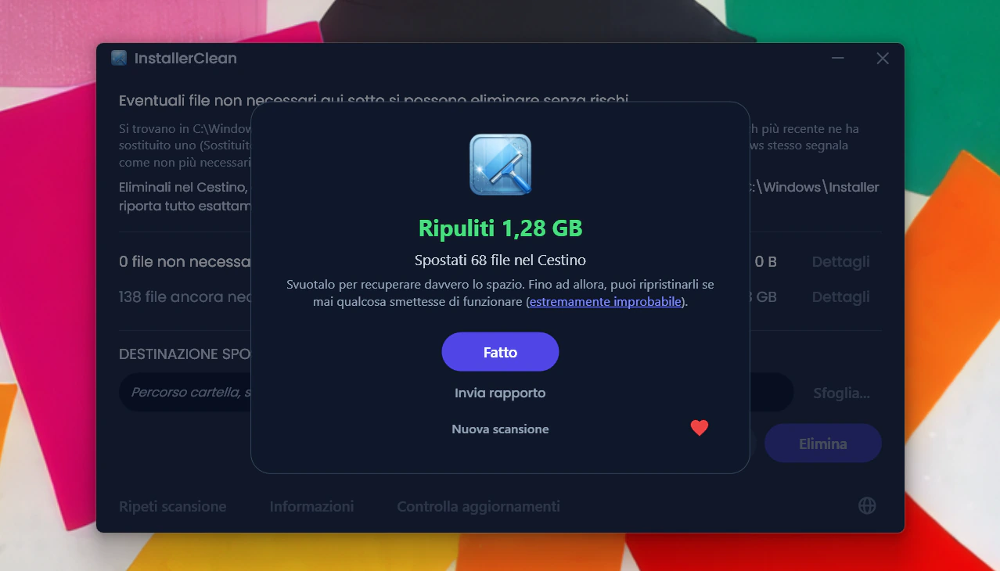
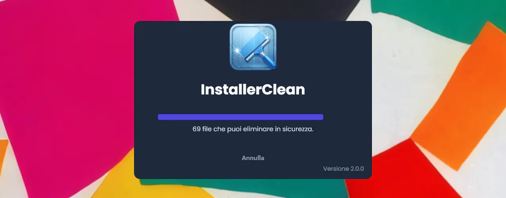
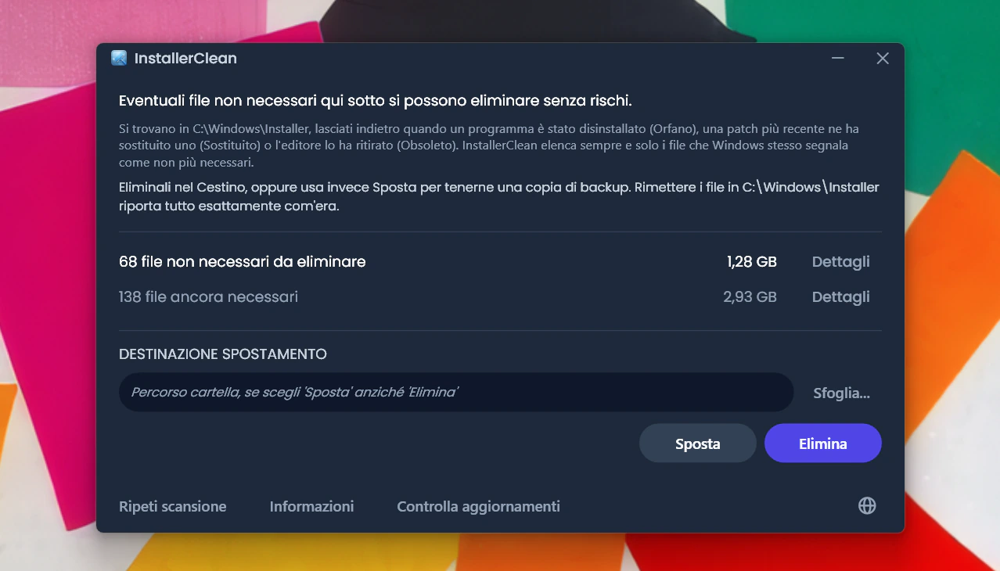
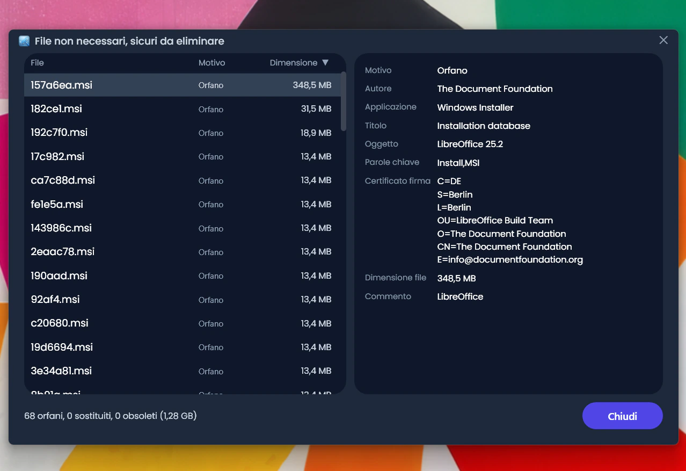
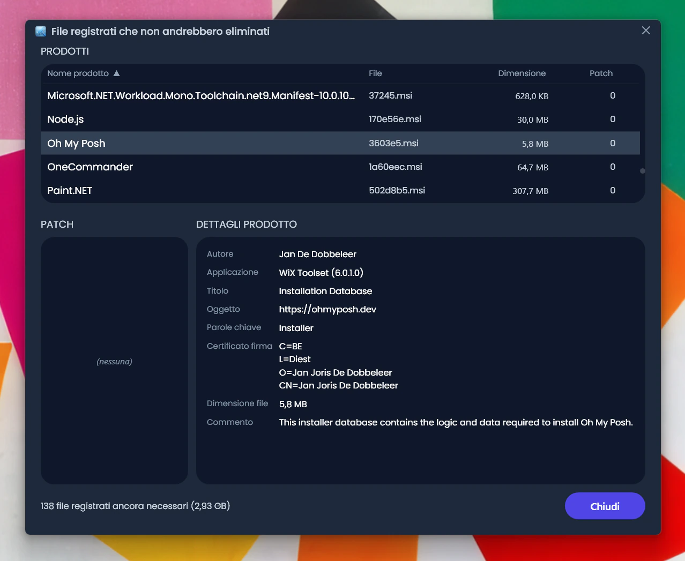
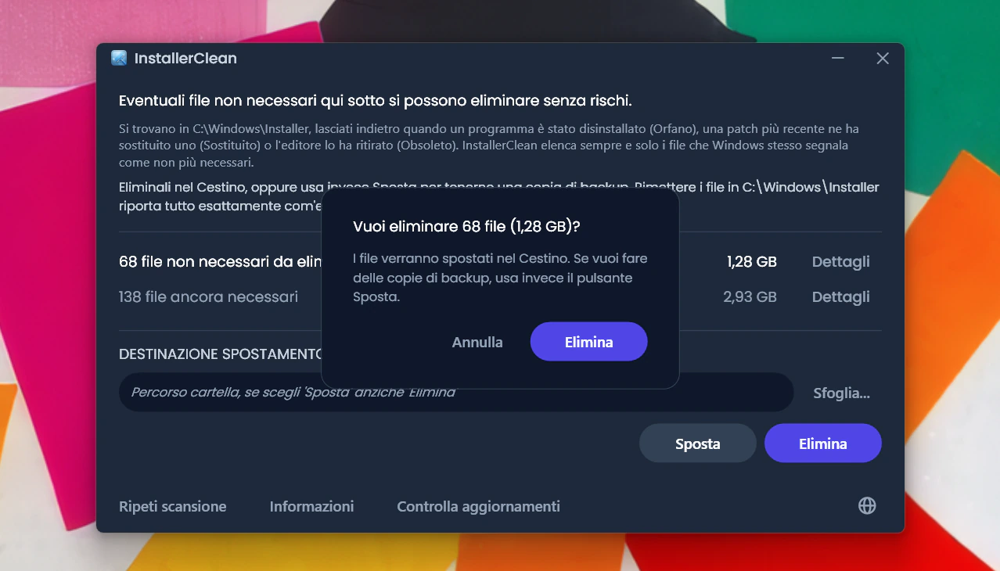
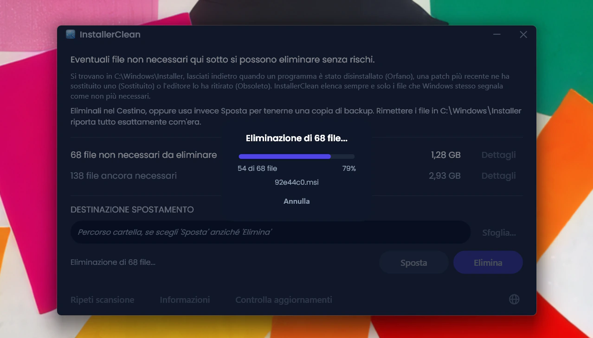
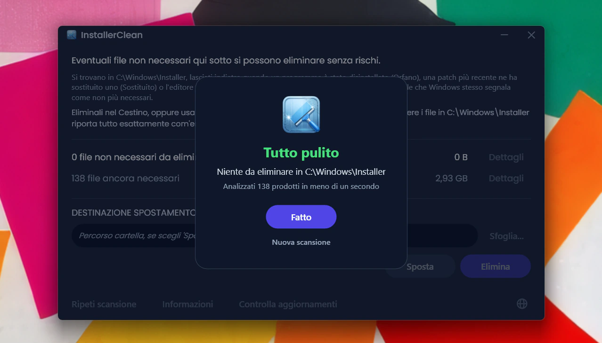
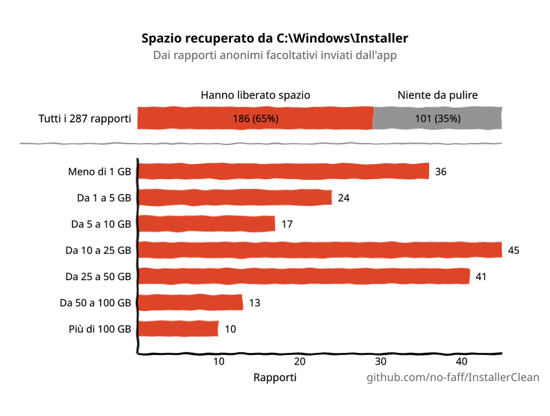

<p align="center">
  <a href="README.md">English</a> · <a href="README.zh-CN.md">简体中文</a> · <a href="README.ru.md">Русский</a> · <a href="README.es.md">Español</a> · <a href="README.ar.md">العربية</a> · <a href="README.ja.md">日本語</a> · <a href="README.pt-BR.md">Português (BR)</a> · <a href="README.pl.md">Polski</a> · <a href="README.tr.md">Türkçe</a> · <a href="README.ko.md">한국어</a> · <a href="README.fr.md">Français</a> · <strong>Italiano</strong> · <a href="README.de.md">Deutsch</a> · <a href="README.id.md">Bahasa Indonesia</a> · <a href="README.vi.md">Tiếng Việt</a> · <a href="README.uk.md">Українська</a> · <a href="README.nl.md">Nederlands</a>
</p>

<p align="center">
  
</p>

<p align="center"><em>🎶 What's my line? I'm happy <a href="https://www.youtube.com/watch?v=HM-jHhUZfFI">cleaning Windows</a></em></p>

<h1 align="center">InstallerClean</h1>

<p align="center"><strong>Uno strumento open source per pulire in sicurezza <code>C:\Windows\Installer</code>, la cartella nascosta di Windows che si mangia in silenzio il tuo spazio su disco.</strong></p>

<p align="center"><em>Usala ogni morte di papa. Magari liberi un po' di spazio. Passa oltre, tutto pulito.</em></p>

<p align="center">
  <a href="LICENSE"></a>
  <a href="https://dotnet.microsoft.com/download/dotnet/10.0"></a>
  <a href="https://github.com/no-faff/InstallerClean/actions/workflows/ci.yml"></a>
  <a href="https://github.com/no-faff/InstallerClean/releases"></a>
  <a href="https://github.com/no-faff/InstallerClean/releases/latest"></a>
  <a href="https://github.com/no-faff/InstallerClean/releases"></a>
</p>



- **Cosa fa:** InstallerClean fa una cosa sola: rimuove i file non necessari da `C:\Windows\Installer`, una cartella nascosta che Windows non pulisce mai. Dopo una scansione quasi istantanea ti dice se ne hai, mostra qualche dettaglio in più per i curiosi e ti lascia eliminarli per liberare spazio sull'unità C:. La usi una volta e passi oltre.
- **Forse sei qui perché:** Hai usato [WinDirStat](https://github.com/windirstat/windirstat), WizTree o TreeSize, hai visto che `C:\Windows\Installer` occupava un sacco di spazio e non sapevi cosa ci fosse dentro. InstallerClean è proprio quello che ti serve. Sa cosa contengono quei file dai nomi all'apparenza casuali come `9f05cba.msi` e ti dice rapidamente quali puoi eliminare in sicurezza.
- **Quanto spazio:** I rapporti (opzionali e anonimi) inviati finora mostrano che il <!-- reports-freedpct-start -->57%<!-- reports-freedpct-end --> dei computer aveva file non necessari da pulire. Di questi, la mediana liberata è di <!-- reports-median-start -->18,8 GB<!-- reports-median-end --><!-- reports-biggest-start --> e uno è arrivato addirittura a 327 GB<!-- reports-biggest-end -->. Nel mio caso, 1,28 GB. Il restante <!-- reports-nothingpct-start -->43%<!-- reports-nothingpct-end --> non ha trovato nulla da rimuovere, il che significa solo che la loro cartella Installer era già pulita. Più dettagli nelle [Domande frequenti](#domande-frequenti) più sotto.
- **È sicuro:** Sì. Chiede alla stessa API di Windows Installer quali file servono ancora ed elenca solo quelli che Windows segnala come non più necessari. È open source (Apache 2.0) e non chiede nulla su di te: nessun account, nessuna pubblicità, nessun tracciamento, nessuna telemetria, niente che giri in background. L'unica cosa che fa online di sua iniziativa è controllare su GitHub se c'è una versione più recente quando lo avvii, e puoi disattivarla.
- **Come ottenerla:** [Scarica l'ultima versione](../../releases/latest). Eseguila; supera [l'avviso di «autore sconosciuto»](#unknown-publisher) e [la richiesta di amministratore](#admin). Elimina i file non necessari. Fatto.

## Indice

- [La cartella di cui nessuno ti parla](#la-cartella-di-cui-nessuno-ti-parla)
- [La ricerca di aiuto](#la-ricerca-di-aiuto)
- [Cosa fa](#cosa-fa)
- [Schermate](#schermate)
- [Come funziona](#come-funziona)
- [È sicuro?](#è-sicuro)
- [Politica di firma del codice](#politica-di-firma-del-codice)
- [Se ti manca un file da C:\Windows\Installer](#recovery)
- [Accessibilità](#accessibilità)
- [Cosa non fa](#cosa-non-fa)
- [Domande frequenti](#domande-frequenti)
- [Download](#download)
- [Confronto con PatchCleaner](#confronto-con-patchcleaner)
- [Riga di comando](#riga-di-comando)
- [Requisiti](#requisiti)
- [Compilare dal codice sorgente](#compilare-dal-codice-sorgente)
- [Contribuire](#contribuire)
- [Sostieni il progetto](#sostieni-il-progetto)
- [Cronologia delle stelle](#cronologia-delle-stelle)
- [Licenza](#licenza)

---

## La cartella di cui nessuno ti parla

Su ogni PC Windows c'è una cartella nascosta chiamata `C:\Windows\Installer`. Ogni volta che installi un software che usa il sistema Windows Installer, o applichi una patch a Microsoft Office, Adobe Acrobat, Visual Studio o a qualunque altra applicazione basata su `.msi`, una copia di quell'installer o di quel file di patch `.msp` finisce in questa cartella, e lì resta.

Quando disinstalli il software, i file restano. Quando una patch più recente ne sostituisce una vecchia, restano entrambe. Windows non li pulisce mai. Pulizia disco non li tocca. DISM si occupa di tutt'altra cartella. Col tempo la cartella cresce: 1 GB, 5 GB, 20 GB, 50 GB. Sui computer con molto software basato su MSI (Acrobat è un colpevole frequente), può [superare i 100 GB](https://www.reddit.com/r/sysadmin/comments/1oxcrmh/acrobat_filling_up_the_cwindowsinstaller_folder/).

Non sono file temporanei che ritornano da soli. Sono peso morto a tutti gli effetti: vecchi installer di software che hai disinstallato anni fa e patch sostituite più volte. Una volta spariti, non tornano più.

**Se cerchi un modo semplice per liberare spazio su disco in Windows, questa cartella è un buon punto di partenza.** InstallerClean trova i file non necessari e li rimuove in sicurezza.

## La ricerca di aiuto

Se hai mai cercato aiuto per questa cartella, probabilmente sai come va a finire. Qualcuno con 180 GB in `C:\Windows\Installer` chiede come pulirla. Gli [dicono di eseguire Pulizia disco](https://learn.microsoft.com/en-us/answers/questions/4238108/windows-installer-folder-has-occupied-180gb). Ci prova. Libera 600 MB, nessuno dei quali da quella cartella (perché Pulizia disco non tocca `C:\Windows\Installer`). La discussione si spegne.

> *«Tutte le discussioni che ho trovato tendono a consigliare le stesse cose, che non risolvono il problema, e poi muoiono.»*
>
> [ksparks519, r/Windows10](https://www.reddit.com/r/Windows10/comments/1bt8c5p/anyone_ever_figure_out_giant_installer_folders/) (tradotto dall'inglese)

Oppure gli dicono di non toccarla affatto. In una discussione, a qualcuno con una cartella Installer da 60 GB è stato detto di [«non metterci mano».](https://www.reddit.com/r/techsupport/comments/1hw4suq/my_windows_installer_folder_is_like_60gb_so_i/) Quando ha chiesto cosa avrebbe dovuto fare invece, la risposta è stata: *«Te l'ho appena detto.»*

Il consiglio abituale confonde l'eliminare file a caso (cosa che è davvero pericolosa) con il rimuovere file che Windows stesso dà per non più necessari (cosa che non lo è). InstallerClean fa la seconda.

## Cosa fa

1. **Scansiona** `C:\Windows\Installer` alla ricerca di file `.msi` e `.msp`
2. **Interroga** l'API di Windows Installer per individuare quali file sono ancora registrati
3. **Mostra** quanto puoi liberare e quanto serve ancora, con finestre di dettaglio opzionali che elencano ogni file
4. **Rimuove** i file non necessari: li elimina nel Cestino, oppure li sposta in una cartella che scegli tu

## Schermate

<p>
  <br>
  <em>Scansione iniziale. È molto rapida.</em>
  <br><br>
</p>

<p>
  <br>
  <em>Risultati: quanto serve ancora, quanto è rimovibile.</em>
  <br><br>
</p>

<p>
  <br>
  <em>Dettagli dei file non più necessari.</em>
  <br><br>
</p>

<p>
  <br>
  <em>Dettagli dei file ancora necessari, con i metadati letti dal database del programma di installazione.</em>
  <br><br>
</p>

<p>
  <br>
  <em>Conferma prima di ogni azione. Elimina sposta nel Cestino; Sposta colloca i file dove scegli tu.</em>
  <br><br>
</p>

<p>
  <br>
  <em>L'eliminazione in corso. Annulla la interrompe a metà.</em>
  <br><br>
</p>

<p>
  <br>
  <em>Dopo un'eliminazione riuscita.</em>
  <br><br>
</p>

<p>
  <br>
  <em>Dopo una nuova scansione. Non resta nulla da pulire.</em>
  <br><br>
</p>

## Come funziona

InstallerClean individua tre tipi di file non necessari.

**I file orfani** sono gli installer `.msi` (e le eventuali patch `.msp`) lasciati indietro dopo aver disinstallato un software. Windows non li referenzia più, ma i file restano nella cartella a occupare spazio.

**Le patch sostituite** sono vecchie patch `.msp` che sono state rimpiazzate da altre più recenti. Windows le contrassegna come sostituite nel proprio database, ma non le elimina mai. Se la cosa salta fuori così spesso è per colpa di Adobe: ogni aggiornamento di Acrobat esce come patch applicata allo stesso installer originale e non come nuovo installer a sé, così un computer finisce per conservarne una per ogni aggiornamento ricevuto fino a oggi. Office e i grandi strumenti di sviluppo si accumulano allo stesso modo, solo più lentamente.

**Le patch obsolete** sono patch `.msp` che l'editore ha ritirato o dichiarato obsolete invece di sostituirle con una versione più recente. Windows registra anche questo stato e, allo stesso modo, lascia il file nella cartella.

Per trovarle, InstallerClean chiama direttamente l'interfaccia COM di Windows Installer tramite P/Invoke:

- `MsiEnumProductsEx` per enumerare ogni prodotto installato
- `MsiEnumPatchesEx` per trovare tutte le patch registrate di ogni prodotto
- `MsiGetPatchInfoEx` per leggere lo stato di ogni patch (applicata, sostituita o obsoleta)

Qualunque file `.msi` o `.msp` in `C:\Windows\Installer` che non sia rivendicato da un prodotto registrato è orfano e viene contrassegnato come rimovibile. Lo stesso vale per qualunque patch che il database segni come sostituita o obsoleta e che non serva per la disinstallazione.

L'app legge gli stessi record anche direttamente dal registro di sistema a ogni scansione, come seconda fonte indipendente. Se una delle due letture torna incompleta (cosa rara, ma che può capitare con uno stato del programma di installazione danneggiato), InstallerClean trattiene i file o rifiuta la scansione anziché tirare a indovinare. Questa seconda lettura aggiunge file solo all'insieme degli «ancora necessari», mai a quello dei «rimovibili».

Una volta completato uno spostamento o un'eliminazione, le sottocartelle vuote dentro `C:\Windows\Installer` (le directory che la cache lascia indietro quando il loro contenuto sparisce) vengono eliminate nella stessa passata.

<a id="is-it-safe"></a>
## È sicuro?

Sì. InstallerClean interroga lo stesso database dell'API di Windows Installer che Windows stesso usa per tenere traccia di ciò che è installato. Se Windows dice che un file non serve più, l'app si fida; non tira a indovinare in base a nomi di file o date.

**Su Elimina e Sposta.** I file che InstallerClean elimina si possono eliminare definitivamente senza rischi. **Elimina** li sposta nel Cestino (verrai avvisato se non è disponibile); recuperi lo spazio sull'unità C: quando svuoti il Cestino.

Non sei comunque costretto a fidarti di me sul fatto che i file si possano eliminare senza rischi. Finché sono nel Cestino, hai modo di verificare che le app che usano questa cartella, Office, Acrobat, Visual Studio e simili, continuino ad aggiornarsi e a disinstallarsi senza problemi. Se trovi qualcosa che non funziona (estremamente improbabile, e finora non è stato segnalato nulla dopo <!-- downloads-start -->49.000+<!-- downloads-end --> download), ripristina i file dal Cestino per sistemare le cose. Per andare ancora più sul sicuro, puoi invece usare **Sposta**, per fare un backup dei file in una cartella che scegli tu (ovviamente scegli una cartella su un'altra partizione o unità se quello che vuoi è liberare spazio su C:). Per tornare com'era basta ricopiare i file in `C:\Windows\Installer` (anche se quasi certamente non ti servirà mai). Se un file si è ritrovato un «(1)» nel nome (succede se hai spostato i file nella stessa cartella due volte), toglilo prima di ricopiare il file.

Se Windows Installer in quel momento sta scrivendo nella cache, ha una transazione precedente sospesa o ha in coda per il prossimo riavvio la ridenominazione di un file che riguarda la cache, allora Sposta ed Elimina sono disattivati e viene mostrato il motivo specifico.

I servizi di scansione, interrogazione, spostamento, eliminazione, impostazioni e controllo del riavvio in sospeso sono coperti da una suite di test automatici che viene eseguita a ogni commit (vedi il badge CI qui sopra).

**Verificare il file binario.** InstallerClean non è firmato, ma non devi crederlo sicuro sulla parola:

- Gli hash SHA-256 di ogni versione sono elencati nella [pagina delle release](../../releases/latest).
- VirusTotal: ogni build viene analizzata, con i risultati completi per ciascun motore collegati alla pagina della relativa versione, così puoi vedere come ha ottenuto ogni file e riscansionarlo tu stesso. Un falso positivo ancora attivo quando esce una versione viene indicato per nome e spiegato nella pagina di quella versione, e la pagina viene aggiornata non appena il produttore lo ritira.
- Il codice sorgente è su [github.com/no-faff/InstallerClean](https://github.com/no-faff/InstallerClean) e la CI compila e testa ogni commit (vedi il badge verde della CI qui sopra).
- Le build di rilascio sono deterministiche: le impostazioni del compilatore fanno sì che lo stesso codice sorgente e lo stesso SDK producano esattamente gli stessi byte, e il processo di rilascio si rifiuta di assegnare il tag a una versione se gli exe distribuiti non sono stati compilati da un albero pulito esattamente su quel tag. Puoi quindi fare il checkout del tag, compilare tu stesso e confrontare gli hash con quelli pubblicati: il file scaricato corrisponde in modo dimostrabile al codice sorgente pubblico. Per prima cosa allinea la versione dell'SDK (le note di ogni versione dicono con quale è stata compilata); una patch diversa dell'SDK produce byte diversi, il che sembra una discrepanza ma non lo è.
- <!-- downloads-start -->49.000+<!-- downloads-end --> download tra GitHub, MajorGeeks e Softpedia.
- [MajorGeeks](https://www.majorgeeks.com/files/details/installerclean.html) prova ogni invio in una macchina virtuale e lo pubblica solo se supera la loro revisione.<br><a href="https://www.majorgeeks.com/files/details/installerclean.html"></a>
- [Softpedia](https://www.softpedia.com/get/System/Hard-Disk-Utils/InstallerClean.shtml) analizza ogni versione alla ricerca di virus, spyware e adware.<br><a href="https://www.softpedia.com/get/System/Hard-Disk-Utils/InstallerClean.shtml"></a>

## Politica di firma del codice

InstallerClean ha fatto domanda alla [SignPath Foundation](https://signpath.org) per la firma del codice gratuita, un programma che firma il software open source perché smetta di arrivare sul tuo computer da un autore sconosciuto. La domanda è in attesa di risposta, quindi per ora i file scaricabili qui non sono firmati e Windows ti avviserà a riguardo.

Se verrà accolta, ogni versione porterà la riga che SignPath chiede di riportare: «free code signing provided by SignPath.io, certificate by SignPath Foundation». Il certificato appartiene alla fondazione e non a me, perché un certificato deve essere intestato a un soggetto giuridico e un progetto di una persona sola non lo è. Questo non significa che InstallerClean sia loro, né che partecipino al progetto oltre alla firma.

**Ruoli.** InstallerClean è mantenuto da una persona sola, io, e li ricopro tutti:

- Chi scrive il codice e chi lo revisiona, cioè chi può inserire codice nel progetto: io. Ogni pull request viene revisionata prima di essere unita.
- Chi approva, cioè chi può autorizzare la firma di una versione: io.

**Privacy.** Non vengo a sapere nulla su di te né sui tuoi file, a meno che non scelga tu di inviare quel rapporto anonimo del tutto facoltativo, che serve solo a farmi sapere che funziona. Nessuna pubblicità, nessuna telemetria. Le uniche altre connessioni sono il controllo della versione all'avvio dell'app (una sola richiesta a GitHub, che puoi disattivare in Informazioni) e i pulsanti che rimandano a GitHub e a una pagina dove puoi fare una donazione, se ti va. L'[informativa sulla privacy](PRIVACY.md) completa (in inglese).

<a id="recovery"></a>
## Se ti manca un file da `C:\Windows\Installer`

InstallerClean rimuove solo i file che Windows stesso segnala come non più necessari, quindi non può mai essere la causa di un file mancante. Ma se uno è già sparito, InstallerClean lo rileva e lo segnala. Ecco come rimediare.

Scarica il programma di installazione di quel software dal suo produttore ed eseguilo sopra l'installazione esistente; non disinstallare prima. Usa la versione che hai adesso, se puoi, perché Windows potrebbe rifiutarne una diversa. Di solito questo rimette a posto il file e lascia intatte le tue impostazioni. Esegui di nuovo la scansione in InstallerClean e, se ha funzionato, l'avviso sarà sparito.

Di solito funziona. Quello che segue è il resoconto più completo di Microsoft stessa: il dettaglio ufficiale e i casi più difficili per quando non è così semplice. Niente di tutto questo dipende da InstallerClean, e non posso migliorare le indicazioni di Microsoft, quindi mi limito a riportartele.

<details>
<summary>La posizione più completa di Microsoft</summary>

*Le citazioni di Microsoft qui sotto sono riportate nella loro versione originale in inglese.*

Guida completa: [Restore missing Windows Installer cache files](https://learn.microsoft.com/en-us/troubleshoot/windows-client/application-management/missing-windows-installer-cache).

*Potrebbe non manifestarsi subito:*
> "If the installer cache is compromised, you may not immediately see problems until you take an action such as uninstalling, repairing, or updating a product."

*I file sono unici per ogni computer, quindi non puoi copiarne uno da un altro PC:*
> "Missing files cannot be copied between computers because the files are unique."

*E non puoi nemmeno recuperare solo il file da un backup:*
> "To restore the missing files, a full system state restoration is required. It is not possible to replace only the missing files from a previous backup."

*Il ripristino consigliato, e i suoi limiti senza giri di parole:*
> "If application files are missing from the Windows Installer Cache, ask the vendor or support team for the application about the missing files. You must follow the procedures or steps recommended by the application vendor to restore the files. In some cases, you may have to rebuild the operating system and reinstall the application to fix the problem."
>
> "Windows support engineers cannot help you recover missing application files from the Windows Installer cache."

*Perché conta usare la stessa versione:*
> "The upgrade cannot be installed by the Windows Installer service because the program to be upgraded may be missing, or the upgrade may update a different version of the program."

</details>

## Accessibilità

InstallerClean è realizzato per essere pienamente utilizzabile da tastiera e con uno screen reader.

- **Utilizzabile interamente da tastiera.** Il tasto Tab raggiunge ogni controllo, e le colonne delle finestre di dettaglio si ordinano da tastiera: qui niente richiede il mouse. Il focus della tastiera resta visibile ovunque si trovi.
- **Assistente vocale e Accesso vocale.** Ogni controllo è etichettato, e la parola visibile su un pulsante è quella che lo attiva con la voce. Quando uno spostamento o un'eliminazione si conclude, l'esito viene letto ad alta voce.
- **Fatto per essere letto.** Il testo rispetta il contrasto WCAG AA in tutto il tema scuro.

Se qualcosa qui ti ostacola, [apri un issue](../../issues). I problemi di accessibilità sono bug, non casi limite.

## Cosa non fa

- WinSxS (`C:\Windows\WinSxS`) è una cartella diversa con regole diverse. Per quella, esegui `Dism /Online /Cleanup-Image /StartComponentCleanup` da un prompt con privilegi elevati.
- Nessun servizio in background, nessuna attività pianificata, nessuna pulizia automatica. L'app gira quando la avvii tu.
- Non modifica i tuoi programmi installati né il database di Windows Installer, li legge soltanto. L'unica cosa che scrive mai nel registro di sistema è la registrazione una tantum dell'origine eventi, che serve allo strumento da riga di comando perché le sue esecuzioni compaiano nel registro eventi di Windows.
- Di sua iniziativa fa un solo tipo di collegamento: un rapido controllo sulla pagina delle release di GitHub per vedere se c'è una versione più recente quando lo avvii, che puoi disattivare in Informazioni. Tutto il resto succede solo quando glielo dici tu: il rapporto anonimo opzionale (solo per farmi sapere che funziona) e i link alla documentazione su GitHub e a una pagina per le donazioni, che si aprono nel tuo browser se li clicchi. Non scarica mai nulla da solo.
- Niente barre degli strumenti, niente software incluso, niente adware.

## Domande frequenti

<a id="reports-stats"></a>
**Libererò davvero GB di spazio?** Dipende dal tuo computer. Un'installazione pulita di Windows 11 senza software aggiuntivo non ha nulla da rimuovere. Una postazione di sviluppo usata da tempo, o qualunque computer con molto software basato su MSI (Acrobat, Office, LibreOffice, grandi strumenti di sviluppo), può averne decine di GB. In ogni caso, vedrai esattamente quanto nel momento in cui la esegui.

<!-- reports-stats-start (generated; do not hand-edit between these markers) -->
Dalla v1.8.0 c'è l'opzione di inviare un breve rapporto anonimo sull'esito. Finora ne sono arrivati 167 (grazie a tutti 🙏) e, sul 57% dei computer che avevano qualcosa da pulire, la mediana liberata è di 18,8 GB. Un computer ha recuperato ben 327 GB. Ecco un riepilogo dei risultati.

<p align="center">
  <picture>
    <source media="(prefers-color-scheme: dark)" srcset="docs/reports-it-dark.svg" />
    <source media="(prefers-color-scheme: light)" srcset="docs/reports-it-light.svg" />
    
  </picture>
</p>

Inviare un rapporto è un clic su un pulsante nell'app, del tutto facoltativo. Non contiene nulla di personale e ti mostra esattamente ciò che verrà inviato, così:


<!-- reports-stats-end -->

<a id="admin"></a>

**Perché richiede i diritti di amministratore?** `C:\Windows\Installer` è riservata agli amministratori. Leggerla, interrogare il database di Windows Installer e spostare o eliminare file lo richiedono tutti, quindi l'app deve essere eseguita come amministratore.

<a id="unknown-publisher"></a>

**Perché Windows dice «Autore sconosciuto»?** InstallerClean non è firmato digitalmente e Windows contrassegna i file scaricati da internet, quindi al primo avvio Windows SmartScreen di solito mostra «PC protetto da Windows» con l'autore indicato come sconosciuto. Un certificato di firma a pagamento ha un costo annuale e preferisco tenere l'app gratuita piuttosto che pagarne uno, così ho fatto domanda alla SignPath Foundation, che firma gratuitamente il software open source (vedi [Politica di firma del codice](#politica-di-firma-del-codice)). Finché non arriva, clicca su **Ulteriori informazioni**, poi su **Esegui comunque**. Farlo è sicuro: il codice sorgente è pubblico, e ogni versione ha link a VirusTotal e hash SHA-256 che puoi controllare prima.

**Posso annullare un'eliminazione?** Di solito sì. Quando il Cestino è disponibile per l'unità, Elimina ci sposta i file e puoi ripristinarli dal Cestino. Se il Cestino non è disponibile, l'app non elimina mai definitivamente di sua iniziativa (vedi [È sicuro?](#è-sicuro)). E se preferisci avere una via di ritorno che controlli tu, Sposta mette i file in una cartella che scegli tu; eliminali da lì quando sei tranquillo.

**Windows si lamenterà se rimuovo questi file?** No. InstallerClean rimuove sempre e solo i file che Windows stesso segnala come non più necessari, quindi niente di ciò che rimuove serve a riparare, aggiornare o disinstallare un programma. Se un file necessario sparisce da `C:\Windows\Installer` per qualche altra via, vedi [Se ti manca un file da C:\Windows\Installer](#recovery).

**Perché non `Win32_Product` (WMI)?** [`Win32_Product` scatena operazioni di riparazione MSI su ogni prodotto durante l'enumerazione](https://gregramsey.net/2012/02/20/win32_product-is-evil/), cosa che può richiedere minuti e mettere sotto sforzo il disco. InstallerClean chiama direttamente l'API COM di Windows Installer, senza effetti collaterali.

**Perché non un semplice script PowerShell?** Un breve script che chiama `MsiEnumPatchesEx` basta a *elencare* le patch, ma le parti portanti di InstallerClean sono quelle che uno script sorvola: la classificazione orfano contro sostituito, il ripiego sul registro che aggiunge file solo all'insieme degli «ancora necessari» (mai a quello dei «rimovibili»), il blocco per riavvio in sospeso, la rete di sicurezza dello spostamento altrove, l'avanzamento per singolo file con annullamento e l'impostazione predefinita Cestino-anziché-eliminazione-definitiva. I casi limite sui computer reali con molto MSI (registrazioni danneggiate, giunzioni dentro la cache, prodotti in `HKU\.DEFAULT`, transazioni del programma di installazione sospese) sono facili da gestire male in uno script improvvisato. La `installerclean-cli` è la versione senza interfaccia, se quello che vuoi è lo scripting.

**Funziona su Windows 7 o 8?** Non testato e non supportato. È pensato per Windows 10 e 11.

**È adatto per RMM o distribuzione di massa?** Sì. La CLI esce con codici distinti per ogni esito (0 successo, 2 parziale, 1 errore grave, 75 transitorio, 130 per un Ctrl+C prima che venga elaborato qualunque file; un Ctrl+C che cade a metà del lotto esce con 2, perché il lavoro era già stato eseguito), così un'attività pianificata può riprovare sul 75 senza confonderlo con un errore grave. Scrive un riepilogo per ogni esecuzione nel registro eventi Applicazione e rispetta lo stesso mutex di istanza singola della GUI. Anche il programma di installazione si installa in modo silenzioso con i parametri standard di Inno Setup (`/SILENT` o `/VERYSILENT`); l'avvio successivo all'installazione viene saltato nelle installazioni silenziose. Vedi la sezione Riga di comando.

## Download

Tre varianti, scegline una:

- **Setup** (`InstallerClean-2.3.0-setup.exe`): un normale programma di installazione di Windows con il runtime .NET 10 incluso. Aggiunge una voce nel menu Start e si disinstalla in modo pulito. Sistemato tra i programmi, così è facile da ritrovare tra sei mesi.
- **Portable** (`InstallerClean-2.3.0-portable.exe`): un singolo exe autonomo con il runtime incluso. Nessuna installazione, nessun programma di disinstallazione. Eseguilo, usalo, eliminalo. Rieseguilo quando vuoi.
- **CLI** (`installerclean-cli.exe`): la versione a riga di comando da sola, un singolo exe autonomo. Nessuna installazione, niente lasciato sulla macchina dopo. Mettilo su un client, esegui una scansione o una pulizia, eliminalo. Pensato per scripting, attività pianificate e distribuzione di massa, quando vuoi le operazioni senza un'app desktop sul client. Vedi [Riga di comando](#riga-di-comando) per gli argomenti e i codici di uscita.

Dalla 2.2.0 i nomi dei file del programma di installazione e della versione portable contengono il numero di versione, così una copia scaricata dice sempre cos'è; lo strumento da riga di comando mantiene il suo nome semplice `installerclean-cli.exe`, perché le attività pianificate e gli script che lo richiamano continuino a funzionare da un aggiornamento all'altro.

Scaricala dalla [pagina delle release](../../releases/latest), poi eseguila. Non è firmato, quindi Windows mostra un avviso di «autore sconosciuto»; le [Domande frequenti](#unknown-publisher) spiegano cosa vedrai e perché è sicuro.

L'app esegue la scansione automaticamente all'avvio. Esamina i risultati, poi clicca su **Elimina** o **Sposta**.

Oppure installala tramite [winget](https://learn.microsoft.com/windows/package-manager/winget/):

```
winget install NoFaff.InstallerClean
```

Oppure installala tramite [Scoop](https://scoop.sh):

```
scoop install installerclean
```

## Confronto con PatchCleaner

Se hai già cercato questa cartella prima d'ora, lo strumento che con ogni probabilità avrai trovato è [PatchCleaner](https://www.homedev.com.au/free/patchcleaner). Funziona ancora bene, ma ho creato InstallerClean perché PatchCleaner è a codice chiuso, non riceve aggiornamenti da marzo 2016 e, per impostazione predefinita, non tocca i prodotti Adobe. Il suo controllo degli orfani contrassegnava per errore le patch di Adobe, e rimuoverle rompeva gli aggiornamenti di Adobe, quindi lascia in pace tutti i file Adobe a meno che tu non disattivi il filtro. Sui computer dove Adobe è il principale responsabile, è lì che si trova la maggior parte dello spazio:

> *«Ho scaricato PatchCleaner per eliminare i file `.msp` orfani, ma a quanto pare questo libererebbe solo 250 MB di spazio. 29 GB dei file sono "esclusi dai filtri", quindi PatchCleaner non sembra essere d'aiuto.»*
>
> HeatherBunny1111, [r/techsupport](https://www.reddit.com/r/techsupport/comments/1qc4tcf/how_to_delete_msp_files_safely/) (tradotto dall'inglese)

InstallerClean legge i registri delle patch di Windows Installer stesso, quindi invece di nascondere ogni file di Adobe dietro un filtro indiscriminato sa distinguere quali patch Windows ha contrassegnato come sostituite, ed è esattamente così che le etichetta. Ecco come si confrontano i due:

| | **InstallerClean** | **PatchCleaner** |
|---|---|---|
| Ultimo aggiornamento | 2026 (attivo) | 3 marzo 2016 |
| Codice sorgente | Open source (Apache 2.0) | Codice chiuso |
| Runtime | .NET 10 (autonomo) | .NET + VBScript |
| API | Windows Installer COM (nello stesso processo) | Windows Installer COM (in un processo separato, tramite VBScript) |
| Rilevamento delle patch sostituite | Sì | No |
| Gestione di Adobe | Rileva le patch sostituite | Esclude per impostazione predefinita |
| Interfaccia | Tema scuro (WPF) | Windows Forms |
| Raccolta dati | Nessuna | Nessuna |
| Sicurezza dell'eliminazione | Cestino. Se non è disponibile, chiede: spostare invece o eliminare definitivamente | Definitiva, senza Cestino |

> **Una nota su `Win32_Product`:** L'approccio comune ma difettoso per elencare i prodotti installati è `Win32_Product` (WMI), che [scatena operazioni di riparazione MSI](https://gregramsey.net/2012/02/20/win32_product-is-evil/) su ogni prodotto durante l'enumerazione. Sia InstallerClean sia PatchCleaner lo evitano. Entrambi usano l'interfaccia COM di Windows Installer. Il nome di file `WMIProducts.vbs` nello script di PatchCleaner è fuorviante; lo script usa COM di MSI, non WMI.

[Ultra Virus Killer (UVK)](https://www.carifred.com/uvk/) offre anch'esso la pulizia dell'Installer come parte del suo modulo System Booster, ma è uno strumento a pagamento (15-25 USD) e la pulizia è una piccola funzione dentro un'applicazione molto più grande. InstallerClean è gratuito, mirato e open source.

I pulitori di sistema generici come [CCleaner](https://www.ccleaner.com/) e [BleachBit](https://www.bleachbit.org/) non toccano `C:\Windows\Installer`. La cartella richiede interrogazioni all'API di Windows Installer per distinguere i pacchetti registrati da quelli non necessari, e un pulitore generico che si limitasse a percorrere l'albero dei file potrebbe rompere le app installate. InstallerClean è lo strumento a cui rivolgerti quando è proprio quella la cartella che vuoi pulire.

## Riga di comando

InstallerClean supporta il funzionamento senza interfaccia, per scripting e uso da amministratore di sistema:

```
Utilizzo:
  installerclean-cli --help   Mostra questa guida (accetta anche /?, -h)
  installerclean-cli --version  Mostra la versione (accetta anche -v)
  installerclean-cli /s       Solo scansione - elenca i file non necessari
  installerclean-cli /d       Elimina i file non necessari (Cestino)
  installerclean-cli /m       Sposta nella destinazione predefinita salvata
  installerclean-cli /m PERCORSO  Sposta nel percorso specificato
```

Per avviare la GUI, esegui `InstallerClean.exe` (o usa il collegamento nel menu Start dell'installazione con Setup).

Eseguito senza argomenti, o con un'opzione non riconosciuta, `installerclean-cli` stampa questo testo d'uso ed esce con `1`, così un'attività pianificata che perde la sua opzione fallisce in modo visibile invece di riuscire in silenzio senza fare nulla. Un `--help`, `/?` o `-h` esplicito stampa lo stesso testo d'uso ed esce con `0`.

`/s` è un'esecuzione di prova: scansiona, elenca ciò che rimuoverebbe con nomi di file e dimensioni, poi esce. Utile per controllare prima di pulire. Il codice di uscita è `0` se la scansione riesce, `1` se fallisce e `130` con Ctrl+C. Tutti i file sono in `C:\Windows\Installer`.

`/d` e `/m` scansionano e poi agiscono. `/d` sposta i file rimovibili nel Cestino. `/m` li sposta in una cartella (quella che indichi sulla riga di comando, oppure quella predefinita salvata dalla GUI). Quella destinazione predefinita salvata è memorizzata per utente, quindi un'attività pianificata eseguita come SYSTEM o con un account di servizio non la vedrà; quelle esecuzioni devono indicare la cartella esplicitamente con `/m PATH`. Codici di uscita: `0` per successo completo, `2` per parziale (alcuni file riusciti, altri falliti), `1` per fallimento totale (scansione fallita, argomenti errati o tutti i file del lotto falliti), `75` per una condizione transitoria che ha bloccato l'esecuzione (il messaggio stampato spiega quale e se riprovare servirà), `130` per un Ctrl+C prima che venga elaborato qualunque file (un Ctrl+C che cade a metà del lotto esce con `2`, parziale, perché il lavoro era già stato eseguito).

Tutto l'output della CLI, compresi i messaggi di errore e di diagnostica, va su stdout; non c'è un flusso stderr separato. Il codice di uscita è il segnale leggibile dalla macchina (e la voce per ogni esecuzione nel registro eventi Applicazione lo rispecchia), quindi uno script dovrebbe basarsi sul codice di uscita anziché analizzare il testo, e `installerclean-cli /s > audit.txt` cattura l'intera esecuzione, compresa qualunque riga di errore.

Tutte e tre richiedono un prompt dei comandi con privilegi elevati (amministratore). Se Criteri di gruppo blocca la richiesta di elevazione UAC, il processo si rifiuta di avviarsi e Windows restituisce l'errore 740 alla shell chiamante (`$LASTEXITCODE = 740` in PowerShell). `taskkill /pid <pid>` non provoca un annullamento controllato; il mutex di istanza singola viene recuperato dall'esecuzione successiva tramite il percorso AbandonedMutexException.

### Pianificare una pulizia periodica

Per fare pulizia a intervalli regolari, punta l'Utilità di pianificazione su `installerclean-cli`. Eseguilo come SYSTEM o con un account di servizio e con i privilegi più elevati, così ottiene l'elevazione che gli serve senza una richiesta interattiva, e indica la cartella di destinazione sulla riga di comando, perché la destinazione predefinita salvata dalla GUI è memorizzata per utente e non vale per un'esecuzione come SYSTEM o con un account di servizio. Per uno spostamento mensile in `D:\InstallerBackup`, con una copia della CLI messa in `C:\Tools`:

```
schtasks /create /tn "InstallerClean monthly" /tr "C:\Tools\installerclean-cli.exe /m D:\InstallerBackup" /sc monthly /ru SYSTEM /rl highest
```

L'attività resta in attesa finché l'esecuzione non termina e registra il codice di uscita come proprio Risultato ultima esecuzione, quindi il tuo RMM può basarsi sui codici qui sopra (`0` successo completo, `2` parziale, `75` transitorio, `1` fallimento totale) esattamente come farebbe uno script.

### Perché `installerclean-cli` e non `installerclean.exe`?

`InstallerClean.exe` è la GUI WPF; non risponde agli argomenti da riga di comando. `installerclean-cli.exe` è un eseguibile da console separato che viene distribuito nella stessa cartella di installazione ed espone le stesse operazioni di scansione / spostamento / eliminazione a PowerShell, cmd e attività pianificate. Essendo un vero processo da console, blocca il prompt finché non termina; redirigi o invia in pipe il suo output come faresti con qualunque altro exe da console.

Il download portable contiene solo l'exe della GUI. Se vuoi la riga di comando senza la GUI, scarica `installerclean-cli.exe` dalla [pagina delle release](../../releases/latest) ed eseguilo direttamente. Anche il programma di installazione lo installa insieme alla GUI.

## Requisiti

- Windows 10 (versione 1607 / build 14393 o successiva, la più vecchia supportata dal runtime .NET 10) o Windows 11
- Privilegi di amministratore (`C:\Windows\Installer` è riservata agli amministratori)

Vedi [Download](#download) per le varianti setup, portable e CLI.

## Compilare dal codice sorgente

```
git clone https://github.com/no-faff/InstallerClean.git
cd InstallerClean
dotnet build src/InstallerClean.sln
```

Esegui i test:

```
dotnet test src/InstallerClean.Tests/
```

## Contribuire

Hai trovato un bug o hai un suggerimento? [Apri un issue](../../issues) o avvia una [discussione](../../discussions). Le pull request sono benvenute. Esegui `dotnet test` prima di inviare.

InstallerClean è ora interamente disponibile in italiano: l'app, il programma di installazione e la riga di comando. [bovirus](https://github.com/bovirus), madrelingua, ha gentilmente corretto e approvato l'app e il programma di installazione, e la riga di comando si basa anch'essa sul suo lavoro. Se noti qualcosa che si può migliorare, sarò felice di saperlo, in un [issue](../../issues/new?template=translation_review.md), una pull request o una discussione. L'app si apre per impostazione predefinita nella lingua di Windows, e puoi passare all'inglese in qualsiasi momento con l'icona del globo. Questo README è il mio miglior tentativo di traduzione automatica: anche in questo caso, ogni suggerimento per migliorarlo è benvenuto.

## Sostieni il progetto

Se InstallerClean ti è stato utile, valuta di [sostenere No Faff](https://nofaff.netlify.app/support) o di lasciare una stella su GitHub.

## Cronologia delle stelle

<picture>
  <source media="(prefers-color-scheme: dark)" srcset="docs/star-history-dark.svg" />
  <source media="(prefers-color-scheme: light)" srcset="docs/star-history-light.svg" />
  
</picture>

## Licenza

[Apache 2.0](LICENSE)

---

🎶 [George Formby - When I'm Cleaning Windows](https://www.youtube.com/watch?v=P183Uo5Ust4). Buon ascolto!
