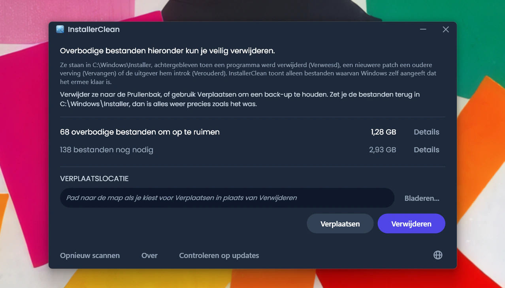
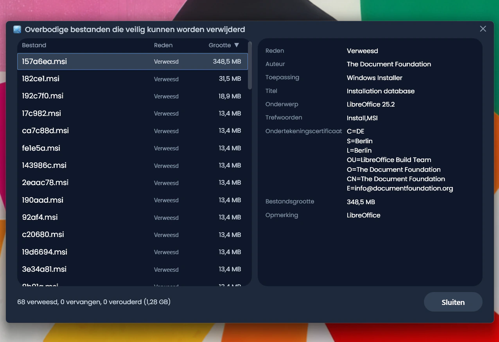
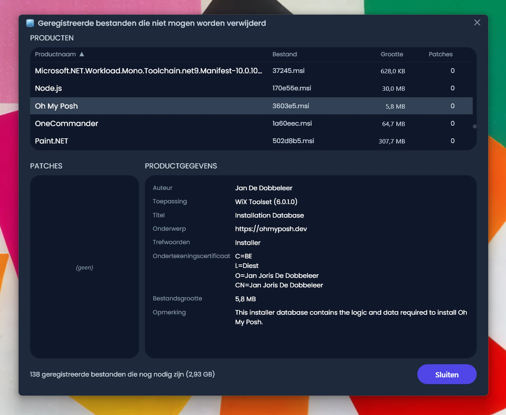
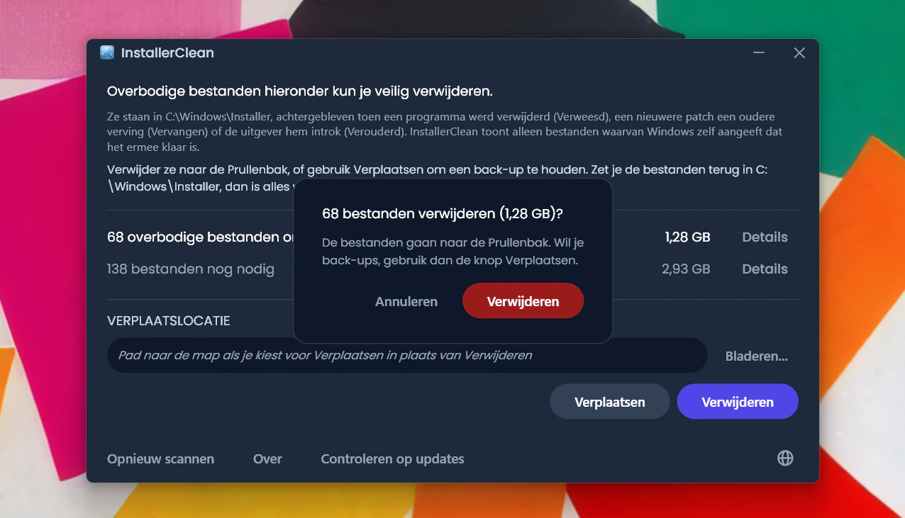
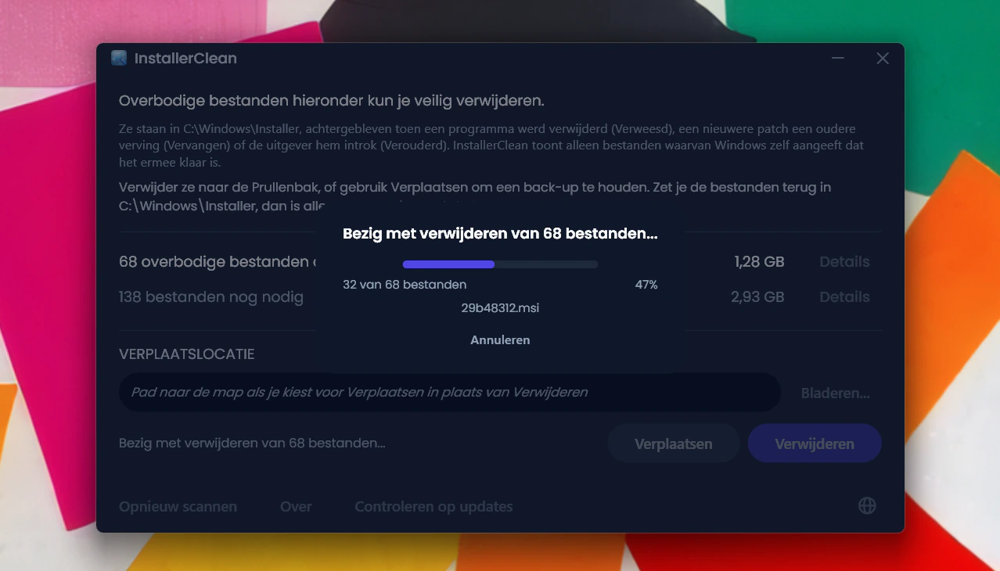
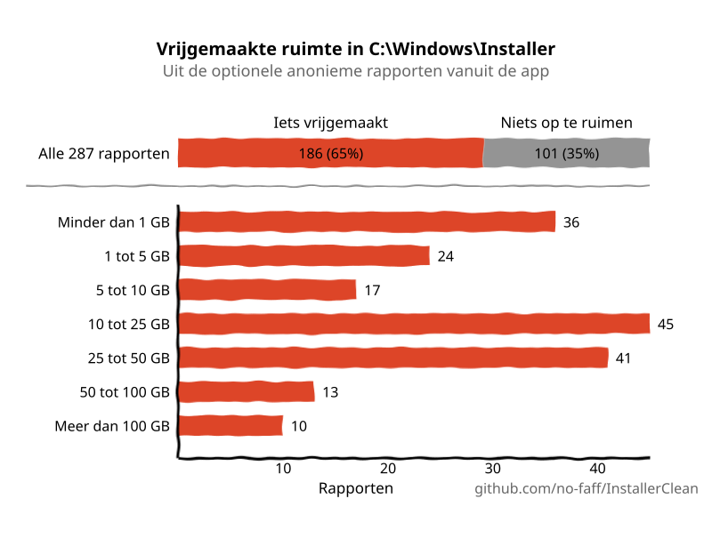

<p align="center">
  <a href="README.md">English</a> · <a href="README.zh-CN.md">简体中文</a> · <a href="README.ru.md">Русский</a> · <a href="README.es.md">Español</a> · <a href="README.ar.md">العربية</a> · <a href="README.ja.md">日本語</a> · <a href="README.pt-BR.md">Português (BR)</a> · <a href="README.pl.md">Polski</a> · <a href="README.tr.md">Türkçe</a> · <a href="README.ko.md">한국어</a> · <a href="README.fr.md">Français</a> · <a href="README.it.md">Italiano</a> · <a href="README.de.md">Deutsch</a> · <a href="README.id.md">Bahasa Indonesia</a> · <a href="README.vi.md">Tiếng Việt</a> · <a href="README.uk.md">Українська</a> · <strong>Nederlands</strong>
</p>

<p align="center">
  
</p>

<p align="center"><em>🎶 What's my line? I'm happy <a href="https://www.youtube.com/watch?v=HM-jHhUZfFI">cleaning Windows</a></em></p>

<h1 align="center">InstallerClean</h1>

<p align="center"><strong>Een opensourcetool om <code>C:\Windows\Installer</code> veilig op te schonen, de verborgen Windows-map die stilletjes je schijfruimte opvreet.</strong></p>

<p align="center"><em>Gebruik het eens in de zoveel tijd. Wie weet levert het wat ruimte op. En dan weer door, lekker opgeruimd.</em></p>

<p align="center">
  <a href="LICENSE"></a>
  <a href="https://dotnet.microsoft.com/download/dotnet/10.0"></a>
  <a href="https://github.com/no-faff/InstallerClean/actions/workflows/ci.yml"></a>
  <a href="https://github.com/no-faff/InstallerClean/releases"></a>
  <a href="https://github.com/no-faff/InstallerClean/releases/latest"></a>
  <a href="https://github.com/no-faff/InstallerClean/releases"></a>
</p>


- **Wat:** InstallerClean doet één ding: het verwijdert overbodige bestanden uit `C:\Windows\Installer`, een verborgen map die Windows nooit opruimt. Na een vrijwel onmiddellijke scan vertelt het je of je die hebt, laat het wie nieuwsgierig is meer detail zien en kun je ze verwijderen om ruimte vrij te maken op je C:-schijf. Je gebruikt het één keer en gaat weer verder.
- **Je bent hier misschien omdat:** Je hebt [WinDirStat](https://github.com/windirstat/windirstat), WizTree of TreeSize gebruikt, zag dat `C:\Windows\Installer` veel ruimte innam en wist niet wat erin zat. InstallerClean is precies wat je nodig hebt. Het weet wat er in die bestanden met willekeurig ogende namen als `9f05cba.msi` zit en vertelt je snel welke je veilig kunt verwijderen.
- **Hoeveel ruimte:** De (optionele en anonieme) rapporten die tot nu toe zijn ingestuurd laten zien dat <!-- reports-freedpct-start -->65%<!-- reports-freedpct-end --> van de machines overbodige bestanden had om op te ruimen. Daarvan is de mediaan van de vrijgemaakte ruimte <!-- reports-median-start -->15,3 GB<!-- reports-median-end --><!-- reports-biggest-start --> en één machine haalde er een slordige 462 GB uit<!-- reports-biggest-end -->. De overige <!-- reports-nothingpct-start -->35%<!-- reports-nothingpct-end --> vond niets om te verwijderen, wat alleen maar betekent dat hun Installer-map al schoon was. Meer detail in de [FAQ](#faq) hieronder.
- **Is het veilig:** Ja. Het vraagt de Windows Installer-API zelf welke bestanden nog nodig zijn en toont alleen de bestanden waarvan Windows aangeeft dat het ermee klaar is. Het is open source (Apache 2.0) en vraagt niets over jou: geen account, geen advertenties, geen tracking, geen telemetrie, niets dat op de achtergrond draait. Het enige wat het uit zichzelf online doet, is bij het starten op GitHub kijken of er een nieuwere versie is, en dat kun je uitzetten.
- **Downloaden:** [Download de nieuwste versie](../../releases/latest). Voer hem uit; klik je door [de melding over een onbekende uitgever](#unknown-publisher) en [de beheerdersvraag](#admin) heen. Verwijder eventuele overbodige bestanden. Klaar.

## Inhoud

- [De map waar niemand het over heeft](#de-map-waar-niemand-het-over-heeft)
- [De zoektocht naar hulp](#de-zoektocht-naar-hulp)
- [Wat het doet](#wat-het-doet)
- [Screenshots](#screenshots)
- [Hoe het werkt](#hoe-het-werkt)
- [Is het veilig?](#is-het-veilig)
- [Beleid voor code-ondertekening](#beleid-voor-code-ondertekening)
- [Als er toch een bestand uit C:\Windows\Installer ontbreekt](#recovery)
- [Toegankelijkheid](#toegankelijkheid)
- [Wat het niet doet](#wat-het-niet-doet)
- [FAQ](#faq)
- [Download](#download)
- [Vergeleken met PatchCleaner](#vergeleken-met-patchcleaner)
- [Opdrachtregel](#opdrachtregel)
- [Vereisten](#vereisten)
- [Bouwen vanaf de broncode](#bouwen-vanaf-de-broncode)
- [Bijdragen](#bijdragen)
- [Het project steunen](#het-project-steunen)
- [Sterrengeschiedenis](#sterrengeschiedenis)
- [Licentie](#licentie)

---

## De map waar niemand het over heeft

Op elke Windows-pc staat een verborgen map met de naam `C:\Windows\Installer`. Elke keer dat je software installeert die het Windows Installer-systeem gebruikt, of een patch toepast op Microsoft Office, Adobe Acrobat, Visual Studio of een andere toepassing op `.msi`-basis, gaat er een kopie van die installer of dat `.msp`-patchbestand naar deze map, en daar blijft hij.

Als je de software verwijdert, blijven de bestanden staan. Als een nieuwere patch een oudere vervangt, blijven ze allebei staan. Windows ruimt ze nooit op. Schijfopruiming komt er niet aan. DISM is voor een heel andere map. Na verloop van tijd groeit de map: 1 GB, 5 GB, 20 GB, 50 GB. Op machines met veel MSI-software (Acrobat is een veelvoorkomende boosdoener) kan hij [de 100 GB passeren](https://www.reddit.com/r/sysadmin/comments/1oxcrmh/acrobat_filling_up_the_cwindowsinstaller_folder/).

Dit zijn geen tijdelijke bestanden die vanzelf terugkomen. Het is echte dode last: oude installers van software die je jaren geleden hebt verwijderd en patches die al meerdere keren zijn vervangen. Eenmaal weg komen ze niet terug.

**Zoek je een makkelijke manier om schijfruimte vrij te maken op Windows, dan is deze map een goed beginpunt.** InstallerClean vindt de overbodige bestanden en verwijdert ze veilig.

## De zoektocht naar hulp

Als je ooit hulp hebt gezocht bij deze map, weet je waarschijnlijk hoe dat gaat. Iemand met 180 GB in `C:\Windows\Installer` vraagt hoe je die opruimt en krijgt [het advies om Schijfopruiming te draaien](https://learn.microsoft.com/en-us/answers/questions/4238108/windows-installer-folder-has-occupied-180gb). Dat probeert diegene. Het levert 600 MB op, waarvan niets uit die map (want Schijfopruiming komt niet aan `C:\Windows\Installer`). De discussie valt stil.

> *“Alle discussies die ik vind, raden steeds dezelfde dingen aan, die het probleem niet oplossen, en daarna bloeden ze dood.”*
>
> [ksparks519, r/Windows10](https://www.reddit.com/r/Windows10/comments/1bt8c5p/anyone_ever_figure_out_giant_installer_folders/) (vertaald uit het Engels)

Of ze krijgen te horen dat ze er helemaal vanaf moeten blijven. In één discussie kreeg iemand met een Installer-map van 60 GB te horen: [“niet aankomen.”](https://www.reddit.com/r/techsupport/comments/1hw4suq/my_windows_installer_folder_is_like_60gb_so_i/) Toen diegene vroeg wat je dan wél moest doen, was het antwoord: *“Dat zei ik je net.”*

Het standaardadvies haalt twee dingen door elkaar: lukraak bestanden verwijderen (wat echt gevaarlijk is) en bestanden verwijderen waarvan Windows zelf zegt dat het ze niet meer nodig heeft (wat dat niet is). InstallerClean doet het tweede.

## Wat het doet

1. **Scant** `C:\Windows\Installer` op `.msi`- en `.msp`-bestanden
2. **Vraagt** de Windows Installer-API welke bestanden nog geregistreerd zijn
3. **Toont** hoeveel je kunt vrijmaken en hoeveel er nog nodig is, met optionele detailvensters die elk bestand laten zien
4. **Verwijdert** de overbodige bestanden: naar de Prullenbak, of verplaats ze naar een map die je zelf kiest

## Screenshots

<p>
  <br>
  <em>De eerste scan. Dit gaat heel snel.</em>
  <br><br>
</p>

<p>
  <br>
  <em>De resultaten: hoeveel er nog nodig is, hoeveel er weg kan.</em>
  <br><br>
</p>

<p>
  <br>
  <em>Details van de bestanden die niet meer nodig zijn.</em>
  <br><br>
</p>

<p>
  <br>
  <em>Details van de bestanden die nog nodig zijn, met metadata uit de installerdatabase.</em>
  <br><br>
</p>

<p>
  <br>
  <em>Bevestiging vóór beide acties. Verwijderen stuurt de bestanden naar de Prullenbak; Verplaatsen zet ze op een plek naar keuze.</em>
  <br><br>
</p>

<p>
  <br>
  <em>Het verwijderen loopt. Annuleren stopt het halverwege.</em>
  <br><br>
</p>

<p>
  <br>
  <em>Na een geslaagd Verwijderen.</em>
  <br><br>
</p>

<p>
  <br>
  <em>Na opnieuw scannen. Niets meer op te ruimen.</em>
  <br><br>
</p>

## Hoe het werkt

InstallerClean herkent drie soorten overbodige bestanden.

**Verweesde bestanden** zijn de `.msi`-installers (en eventuele `.msp`-patches) die achterblijven nadat je software hebt verwijderd. Windows verwijst er niet meer naar, maar de bestanden staan in de map en nemen ruimte in.

**Vervangen patches** zijn oude `.msp`-patches waar nieuwere voor in de plaats zijn gekomen. Windows markeert ze in zijn eigen database als vervangen, maar verwijdert ze nooit. Dat dit zo vaak voorkomt, komt door Adobe: elke Acrobat-update verschijnt als een patch op dezelfde oorspronkelijke installer en niet als een eigen nieuwe installer, dus bewaart een machine uiteindelijk één patch voor elke update die hij ooit heeft gehad. Office en grote ontwikkeltools stapelen zich op dezelfde manier op, alleen langzamer.

**Verouderde patches** zijn `.msp`-patches die de uitgever heeft teruggetrokken of afgeschreven in plaats van vervangen door een nieuwere versie. Windows legt ook die status vast en laat het bestand net zo goed in de map staan.

Om ze te vinden roept InstallerClean de COM-interface van Windows Installer rechtstreeks aan via P/Invoke:

- `MsiEnumProductsEx` om elk geïnstalleerd product op te sommen
- `MsiEnumPatchesEx` om alle geregistreerde patches per product te vinden
- `MsiGetPatchInfoEx` om de status van een patch te lezen (toegepast, vervangen of verouderd)

Elk `.msi`- of `.msp`-bestand in `C:\Windows\Installer` dat niet door een geregistreerd product wordt geclaimd, is verweesd en wordt als verwijderbaar gemarkeerd. Hetzelfde geldt voor elke patch die de database als vervangen of verouderd markeert en die niet nodig is om te kunnen deïnstalleren.

De app leest bij elke scan dezelfde records ook rechtstreeks uit het register, als tweede, onafhankelijke bron. Komt een van de twee lezingen onvolledig terug (zeldzaam, maar het kan bij een beschadigde installerstatus), dan houdt InstallerClean bestanden achter of weigert het de scan, in plaats van te gokken. Die tweede lezing voegt alleen bestanden toe aan de verzameling “nog nodig”, nooit aan de verzameling “verwijderbaar”.

Na een voltooide verplaatsing of verwijdering worden lege submappen in `C:\Windows\Installer` (de mappen die de cache achterlaat zodra hun inhoud weg is) in dezelfde ronde opgeruimd.

<a id="is-it-safe"></a>
## Is het veilig?

Ja. InstallerClean raadpleegt dezelfde Windows Installer-database die Windows zelf gebruikt om bij te houden wat er geïnstalleerd is. Als Windows zegt dat een bestand niet meer nodig is, vertrouwt de app daarop; het gokt niet op basis van bestandsnamen of datums.

**Over Verwijderen en Verplaatsen.** De bestanden die InstallerClean verwijdert, kunnen veilig definitief weg. **Verwijderen** stuurt ze naar de Prullenbak (je krijgt een waarschuwing als die niet beschikbaar is); de ruimte op je C:-schijf krijg je terug zodra je de Prullenbak leegt.

Maar je hoeft mij niet te geloven dat de bestanden veilig weg kunnen. Zolang ze in je Prullenbak zitten, kun je controleren of de apps die deze map gebruiken, Office, Acrobat, Visual Studio en dergelijke, nog gewoon bijwerken en deïnstalleren. Vind je toch iets kapot (uiterst onwaarschijnlijk, en na <!-- downloads-start -->64.000+<!-- downloads-end --> downloads is er nog niets gemeld), dan zet je de bestanden terug vanuit de Prullenbak en is het opgelost. Wil je het extra zeker spelen, gebruik dan **Verplaatsen** om de bestanden als back-up in een map naar keuze te zetten (kies uiteraard een map op een andere schijf of partitie als je ruimte op C: wilt vrijmaken). Kopieer de bestanden gewoon terug naar `C:\Windows\Installer` om alles terug te zetten zoals het was (al zul je dat vrijwel zeker nooit nodig hebben). Heeft een bestand een “(1)” in zijn naam gekregen (dat gebeurt als je twee keer bestanden naar dezelfde map hebt verplaatst), haal dat er dan af voordat je het bestand terugkopieert.

Als Windows Installer op dat moment naar de cache schrijft, een eerdere transactie heeft openstaan of een hernoeming voor na de herstart op de cache heeft klaarstaan, zijn Verplaatsen en Verwijderen uitgeschakeld en zie je de precieze reden.

De services voor scannen, opvragen, verplaatsen, verwijderen, instellingen en een openstaande herstart worden gedekt door een geautomatiseerde testsuite die bij elke commit draait (zie de CI-badge hierboven).

**De binary controleren.** InstallerClean is niet ondertekend, maar je hoeft niet zomaar te vertrouwen dat het veilig is:

- SHA-256-hashes van elke release staan op de [releasepagina](../../releases/latest).
- VirusTotal: elke build wordt gescand, met de volledige resultaten per engine gelinkt op de bijbehorende releasepagina, zodat je kunt zien hoe elk bestand scoorde en het zelf opnieuw kunt scannen. Een vals alarm dat nog actief is wanneer een release uitkomt, wordt op de pagina van die release benoemd en uitgelegd, en de pagina wordt bijgewerkt zodra de leverancier het intrekt.
- De broncode staat op [github.com/no-faff/InstallerClean](https://github.com/no-faff/InstallerClean) en CI bouwt en test elke commit (zie de groene CI-badge hierboven).
- Release-builds zijn deterministisch: door de compilerinstellingen leveren dezelfde broncode en dezelfde SDK dezelfde bytes op, en het releaseproces weigert een versie te taggen tenzij de geleverde exe's uit een schone werkkopie op precies die tag zijn gebouwd. Je kunt de tag dus uitchecken, zelf bouwen en de hashes vergelijken met de gepubliceerde: de download komt aantoonbaar overeen met de openbare broncode. Stem eerst de SDK-versie af (in de release-notes van elke versie staat waarmee is gebouwd); een andere SDK-patch levert andere bytes op, wat op een verschil lijkt maar het niet is.
- <!-- downloads-start -->64.000+<!-- downloads-end --> downloads via GitHub, MajorGeeks en Softpedia.
- [MajorGeeks](https://www.majorgeeks.com/files/details/installerclean.html) test elke inzending in een virtuele machine en neemt haar alleen op als ze hun beoordeling doorstaat.<br><a href="https://www.majorgeeks.com/files/details/installerclean.html"></a>
- [Softpedia](https://www.softpedia.com/get/System/Hard-Disk-Utils/InstallerClean.shtml) test elke release op virussen, spyware en adware.<br><a href="https://www.softpedia.com/get/System/Hard-Disk-Utils/InstallerClean.shtml"></a>

## Beleid voor code-ondertekening

InstallerClean heeft zich aangemeld bij de [SignPath Foundation](https://signpath.org) voor gratis code-ondertekening, een programma dat opensourcesoftware ondertekent zodat ze niet langer van een onbekende uitgever op je machine aankomt. De aanmelding loopt nog, dus voorlopig zijn de downloads hier niet ondertekend en waarschuwt Windows ervoor.

Wordt ze goedgekeurd, dan draagt elke release de regel waar SignPath om vraagt: “free code signing provided by SignPath.io, certificate by SignPath Foundation”. Het certificaat is van de stichting en niet van mij, want een certificaat moet op naam van een rechtspersoon staan, en een project van één persoon is dat niet. Dat betekent niet dat InstallerClean van hen is, of dat ze er verder iets mee te maken hebben dan het ondertekenen.

**Rollen.** InstallerClean wordt door één persoon onderhouden, door mij, en ik vervul ze allemaal:

- Wie commit en wie nakijkt, oftewel wie er code in het project mag zetten: ik. Elke pull request wordt nagekeken voordat hij wordt samengevoegd.
- Wie goedkeurt, oftewel wie toestemming mag geven om een release te ondertekenen: ik.

**Privacy.** Ik kom niets te weten over jou of over je bestanden, tenzij je er zelf voor kiest dat volledig optionele anonieme rapport te sturen, dat me alleen laat weten dat het werkt. Geen advertenties, geen telemetrie. De enige andere verbindingen zijn de versiecontrole bij het starten van de app (één verzoek aan GitHub, dat je in het venster Over kunt uitzetten) en knoppen met links naar GitHub en naar een pagina waar je kunt doneren als je je gul voelt. Het volledige [privacybeleid](PRIVACY.md) (in het Engels).

<a id="recovery"></a>
## Als er toch een bestand uit `C:\Windows\Installer` ontbreekt

InstallerClean verwijdert alleen bestanden waarvan Windows zelf meldt dat ze niet meer nodig zijn, dus het kan nooit de reden zijn dat een bestand ontbreekt. Maar is er al een verdwenen, dan ziet InstallerClean dat en wijst het je erop. Zo los je het op.

Download de installer van dat programma bij de maker en voer hem uit over je bestaande installatie heen; deïnstalleer niet eerst. Gebruik zo mogelijk de versie die je nu hebt, want Windows kan een andere weigeren. Meestal staat het bestand er dan weer en blijven je instellingen ongemoeid. Scan opnieuw in InstallerClean; is de waarschuwing weg, dan is het gelukt.

Dat werkt meestal. Wat volgt is Microsofts eigen, uitgebreidere verhaal: de officiële details, en de lastigere gevallen voor wanneer het niet zo eenvoudig is. Niets hiervan komt door InstallerClean, en ik kan Microsofts uitleg niet verbeteren, dus geef ik hem gewoon door.

<details>
<summary>Microsofts uitgebreidere verhaal</summary>

*De volgende Microsoft-citaten staan in het Engelse origineel.*

Volledige uitleg: [Restore missing Windows Installer cache files](https://learn.microsoft.com/en-us/troubleshoot/windows-client/application-management/missing-windows-installer-cache).

*Het hoeft niet meteen zichtbaar te zijn:*
> "If the installer cache is compromised, you may not immediately see problems until you take an action such as uninstalling, repairing, or updating a product."

*De bestanden zijn per machine uniek, dus je kunt er geen van een andere pc kopiëren:*
> "Missing files cannot be copied between computers because the files are unique."

*Je kunt het bestand ook niet los uit een back-up halen:*
> "To restore the missing files, a full system state restoration is required. It is not possible to replace only the missing files from a previous backup."

*De aanbevolen route, en de nuchtere grenzen ervan:*
> "If application files are missing from the Windows Installer Cache, ask the vendor or support team for the application about the missing files. You must follow the procedures or steps recommended by the application vendor to restore the files. In some cases, you may have to rebuild the operating system and reinstall the application to fix the problem."
>
> "Windows support engineers cannot help you recover missing application files from the Windows Installer cache."

*Waarom dezelfde versie belangrijk is:*
> "The upgrade cannot be installed by the Windows Installer service because the program to be upgraded may be missing, or the upgrade may update a different version of the program."

</details>

## Toegankelijkheid

InstallerClean is gebouwd om volledig bruikbaar te zijn met het toetsenbord en met een schermlezer.

- **Overal met het toetsenbord te bedienen.** Met Tab bereik je elk element, en de kolommen van de detailvensters sorteer je vanaf het toetsenbord, dus niets hier heeft een muis nodig. De toetsenbordfocus blijft zichtbaar, waar hij ook landt.
- **Verteller en spraaktoegang.** Elk element heeft een label, en het zichtbare woord op een knop is het woord waarmee je hem met je stem activeert. Wanneer een verplaatsing of verwijdering klaar is, wordt de uitkomst voorgelezen.
- **Gemaakt om te lezen.** De tekst haalt overal in het donkere thema het WCAG AA-contrast.

Zit iets je hier in de weg, [open dan een issue](../../issues). Toegankelijkheidsproblemen zijn bugs, geen randgevallen.

## Wat het niet doet

- WinSxS (`C:\Windows\WinSxS`) is een andere map met andere regels. Draai daarvoor `Dism /Online /Cleanup-Image /StartComponentCleanup` vanaf een opdrachtprompt met beheerdersrechten.
- Geen achtergrondservice, geen geplande taak, geen automatisch opruimen. De app draait wanneer jij hem start.
- Het verandert niets aan je geïnstalleerde programma's of de Windows Installer-database, het leest ze alleen. Het enige wat het ooit naar het register schrijft, is de eenmalige registratie van de gebeurtenisbron die het opdrachtregelprogramma nodig heeft om zijn runs in het Windows-gebeurtenislogboek te kunnen laten verschijnen.
- Het maakt uit zichzelf maar één soort verbinding: een korte blik op de releasepagina van GitHub bij het starten, om te zien of er een nieuwere versie is, en dat zet je uit in het venster Over. Al het andere gebeurt alleen als jij het zegt: het optionele anonieme rapport (alleen zodat ik weet dat het werkt) en links naar de GitHub-documentatie en een donatiepagina, die in je browser openen als je erop klikt. Het downloadt nooit iets uit zichzelf.
- Geen werkbalken, geen meegeleverde software, geen adware.

## FAQ

<a id="reports-stats"></a>
**Ga ik echt GB's aan ruimte vrijmaken?** Dat hangt van je machine af. Een schone Windows 11-installatie zonder extra software heeft niets te verwijderen. Een ontwikkelwerkstation dat al jaren meegaat, of elke machine met veel MSI-software (Acrobat, Office, LibreOffice, grote ontwikkeltools), kan tientallen GB's hebben. Hoe dan ook zie je precies hoeveel op het moment dat je het draait.

<!-- reports-stats-start (generated; do not hand-edit between these markers) -->
Sinds v1.8.0 kun je een kort anoniem rapport over de uitkomst insturen. Er zijn er tot nu toe 246 binnengekomen (dank jullie wel 🙏) en van de 65% machines die iets op te ruimen hadden, is de mediaan van de vrijgemaakte ruimte 15,3 GB. Eén machine haalde er maar liefst 462 GB uit. Hier is een samenvatting van de resultaten.

<p align="center">
  <picture>
    <source media="(prefers-color-scheme: dark)" srcset="docs/reports-nl-dark.svg" />
    <source media="(prefers-color-scheme: light)" srcset="docs/reports-nl-light.svg" />
    
  </picture>
</p>

Een rapport insturen is één klik op een knop in de app en helemaal vrijwillig. Er staat niets persoonlijks in en je krijgt precies te zien wat er verstuurd wordt, zo:


<!-- reports-stats-end -->

<a id="admin"></a>

**Waarom wil het beheerdersrechten?** `C:\Windows\Installer` is afgeschermd voor iedereen behalve beheerders. De map lezen, de installerdatabase raadplegen en bestanden verplaatsen of verwijderen vragen daar allemaal om, dus de app moet als beheerder draaien.

<a id="unknown-publisher"></a>

**Waarom zegt Windows “Onbekende uitgever”?** InstallerClean is niet code-ondertekend, en Windows markeert bestanden die van internet komen, dus bij de eerste start toont SmartScreen meestal de blauwe melding dat Windows je pc heeft beschermd, met de uitgever als onbekend. Een betaald certificaat om te ondertekenen kost elk jaar geld, en ik houd de app liever gratis dan daarvoor te betalen, dus heb ik me aangemeld bij de SignPath Foundation, die opensourcesoftware gratis ondertekent (zie [Beleid voor code-ondertekening](#beleid-voor-code-ondertekening)). Tot dat rond is, klik je op **Meer informatie** en dan op **Toch uitvoeren**. Dat kan met een gerust hart: de broncode is openbaar, en elke release heeft VirusTotal-links en SHA-256-hashes die je vooraf kunt controleren.

**Kan ik een verwijdering ongedaan maken?** Meestal wel. Als de Prullenbak voor de schijf beschikbaar is, gaan de bestanden daarheen en kun je ze eruit terugzetten. Is de Prullenbak niet beschikbaar, dan verwijdert de app uit zichzelf nooit definitief (zie [Is het veilig?](#is-het-veilig)). En wil je liever een terugweg die je zelf in de hand hebt, dan zet Verplaatsen de bestanden in een map die jij kiest; verwijder ze daar wanneer je er gerust op bent.

**Gaat Windows klagen als ik deze bestanden verwijder?** Nee. InstallerClean verwijdert alleen de bestanden waarvan Windows zelf aangeeft dat het ermee klaar is, dus niets ervan is nodig om een programma te repareren, bij te werken of te verwijderen. Ontbreekt er langs een andere weg toch een benodigd bestand in `C:\Windows\Installer`, zie dan [Als er toch een bestand uit C:\Windows\Installer ontbreekt](#recovery).

**Waarom geen `Win32_Product` (WMI)?** [`Win32_Product` start tijdens het opsommen op elk product MSI-reparaties](https://gregramsey.net/2012/02/20/win32_product-is-evil/), wat minuten kan duren en de schijf zwaar kan belasten. InstallerClean roept de COM-API van Windows Installer rechtstreeks aan, zonder bijwerkingen.

**Waarom niet gewoon een PowerShell-script?** Een kort script dat `MsiEnumPatchesEx` aanroept, is genoeg om patches *op te sommen*, maar het dragende werk van InstallerClean zit in de delen waar een script overheen stapt: het onderscheid tussen verweesd en vervangen, de terugval op het register die alleen ooit bestanden toevoegt aan de verzameling “nog nodig” (nooit aan “verwijderbaar”), de blokkade bij een openstaande herstart, het vangnet van Verplaatsen, de voortgang per bestand met annuleren en de standaardkeuze Prullenbak-in-plaats-van-definitief. Randgevallen op echte machines met veel MSI (kapotte registraties, junctions in de cache, producten in `HKU\.DEFAULT`, onderbroken Installer-transacties) gaan in een eenmalig script makkelijk mis. De `installerclean-cli` is het gezicht zonder vensters, als scripten is wat je wilt.

**Werkt het op Windows 7 of 8?** Niet getest en niet ondersteund. Gericht op Windows 10 en 11.

**Is het geschikt voor RMM / massa-uitrol?** Ja. De CLI sluit af met een eigen code per uitkomst (0 gelukt, 2 gedeeltelijk, 1 harde fout, 75 tijdelijk, 130 voor een Ctrl+C voordat er een bestand was verwerkt; een Ctrl+C midden in de batch sluit af met 2, omdat er al werk was gedaan), zodat een geplande taak bij 75 opnieuw kan proberen zonder dat met harde fouten te verwarren. Het schrijft per run een samenvatting naar het Windows-gebeurtenislogboek (Toepassing) en respecteert dezelfde single-instance-mutex als de GUI. De setup installeert bovendien stil met de standaard Inno Setup-schakelaars (`/SILENT` of `/VERYSILENT`); het starten na installatie wordt bij stille installaties overgeslagen. Zie het onderdeel Opdrachtregel.

## Download

Drie builds, kies er een:

- **Setup** (`InstallerClean-2.3.0-setup.exe`): een gewone Windows-installer met de .NET 10-runtime meegeleverd. Voegt een vermelding in het menu Start toe en deïnstalleert netjes. Staat tussen je programma's, zodat je het over zes maanden zo terugvindt.
- **Portable** (`InstallerClean-2.3.0-portable.exe`): één op zichzelf staande exe met de runtime erin. Geen installatie, geen de-installatieprogramma. Uitvoeren, gebruiken, weggooien. En wanneer je maar wilt opnieuw.
- **CLI** (`installerclean-cli.exe`): de opdrachtregelversie op zichzelf, één op zichzelf staande exe. Geen installatie, achteraf blijft er niets op de machine achter. Zet hem op een client, draai een scan of een opschoning, verwijder hem weer. Gemaakt voor scripts, geplande taken en massa-uitrol, waar je de bewerkingen wilt zonder desktopapp op de client. Zie [Opdrachtregel](#opdrachtregel) voor de argumenten en afsluitcodes.

Sinds 2.2.0 dragen de bestandsnamen van de setup en de portable hun versienummer, zodat een gedownloade kopie altijd zegt wat hij is; de CLI houdt zijn kale naam `installerclean-cli.exe`, zodat geplande taken en scripts die ernaar wijzen over updates heen blijven werken.

Download vanaf de [releasepagina](../../releases/latest) en voer het uit. Het is niet ondertekend, dus Windows toont een waarschuwing over een onbekende uitgever; de [FAQ](#unknown-publisher) legt uit wat je te zien krijgt en waarom het veilig is.

De app scant automatisch bij het starten. Bekijk de resultaten en klik dan op **Verwijderen** of **Verplaatsen**.

Of installeer via [winget](https://learn.microsoft.com/windows/package-manager/winget/):

```
winget install NoFaff.InstallerClean
```

Of installeer via [Scoop](https://scoop.sh):

```
scoop install installerclean
```

## Vergeleken met PatchCleaner

Als je al eens naar deze map hebt gezocht, is de tool die je waarschijnlijk hebt gevonden [PatchCleaner](https://www.homedev.com.au/free/patchcleaner). Die doet het nog altijd prima, maar ik heb InstallerClean gemaakt omdat PatchCleaner closed source is, sinds maart 2016 geen update meer heeft gehad en standaard van Adobe-producten afblijft. Zijn controle op verweesde bestanden markeerde Adobes patches ten onrechte, en die verwijderen brak Adobes updates, dus laat het alle Adobe-bestanden met rust tenzij je het filter uitzet. Op de machines waar Adobe de grootste boosdoener is, zit juist daar de meeste ruimte:

> *“Ik heb PatchCleaner gedownload om de verweesde .msp-bestanden te verwijderen, maar dat zou blijkbaar maar 250 MB aan ruimte vrijmaken. 29 GB aan bestanden is ‘uitgesloten door filters’, dus PatchCleaner lijkt niet te helpen.”*
>
> HeatherBunny1111, [r/techsupport](https://www.reddit.com/r/techsupport/comments/1qc4tcf/how_to_delete_msp_files_safely/) (vertaald uit het Engels)

InstallerClean leest de eigen patchrecords van Windows Installer, dus in plaats van elk Adobe-bestand achter een botte filter te verstoppen, kan het zien welke patches Windows als vervangen heeft gemarkeerd, en zet het daar precies dat label op. Zo verhouden de twee zich:

| | **InstallerClean** | **PatchCleaner** |
|---|---|---|
| Laatst bijgewerkt | 2026 (actief) | 3 maart 2016 |
| Broncode | Open source (Apache 2.0) | Closed source |
| Runtime | .NET 10 (op zichzelf staand) | .NET + VBScript |
| API | Windows Installer COM (in-process) | Windows Installer COM (out-of-process via VBScript) |
| Detectie van vervangen patches | Ja | Nee |
| Omgang met Adobe | Herkent vervangen patches | Sluit standaard uit |
| Interface | Donker thema (WPF) | Windows Forms |
| Gegevensverzameling | Geen | Geen |
| Veiligheid bij verwijderen | Prullenbak. Is die niet beschikbaar, dan vraagt het: toch verplaatsen of definitief verwijderen | Definitief, geen Prullenbak |

> **Een opmerking over `Win32_Product`:** De gangbare maar kapotte aanpak om geïnstalleerde producten op te sommen is `Win32_Product` (WMI), dat tijdens het opsommen [op elk product MSI-reparaties start](https://gregramsey.net/2012/02/20/win32_product-is-evil/). InstallerClean en PatchCleaner vermijden het allebei. Beide gebruiken de COM-interface van Windows Installer. De bestandsnaam `WMIProducts.vbs` in PatchCleaners script is misleidend; het script gebruikt MSI-COM, geen WMI.

[Ultra Virus Killer (UVK)](https://www.carifred.com/uvk/) biedt ook Installer-opschoning, als onderdeel van zijn System Booster-module, maar het is een betaalde tool ($15-25) en de opschoning is één kleine functie in een veel grotere toepassing. InstallerClean is gratis, gericht en open source.

Algemene systeemschoonmakers als [CCleaner](https://www.ccleaner.com/) en [BleachBit](https://www.bleachbit.org/) komen niet aan `C:\Windows\Installer`. De map vraagt om Windows Installer-API-queries om geregistreerde pakketten van overbodige te onderscheiden, en een generieke schoonmaker die alleen de bestandsboom afloopt, zou geïnstalleerde apps kapot kunnen maken. InstallerClean is het gereedschap dat je pakt wanneer juist die map opgeruimd moet worden.

## Opdrachtregel

InstallerClean ondersteunt gebruik zonder vensters, voor scripts en systeembeheer:

```
Gebruik:
  installerclean-cli --help     Deze hulp tonen (accepteert ook /?, -h)
  installerclean-cli --version  De versie afdrukken (accepteert ook -v)
  installerclean-cli /s         Alleen scannen - verwijderbare bestanden opsommen
  installerclean-cli /d         Verwijderbare bestanden verwijderen (Prullenbak)
  installerclean-cli /m         Verplaatsen naar de opgeslagen standaardlocatie
  installerclean-cli /m PAD     Verplaatsen naar het opgegeven pad
```

Om de GUI te starten voer je `InstallerClean.exe` uit (of gebruik je de snelkoppeling in het menu Start van de setup-installatie).

Draai je `installerclean-cli` zonder argument of met een niet-herkende optie, dan drukt het dit gebruik af en sluit het af met `1`, zodat een geplande taak die zijn optie kwijtraakt zichtbaar faalt in plaats van stilletjes te “slagen” zonder iets te doen. Een expliciete `--help`, `/?` of `-h` drukt hetzelfde gebruik af en sluit af met `0`.

`/s` is een proefrun: het scant, somt met bestandsnamen en groottes op wat het zou verwijderen, en sluit dan af. Handig om vooraf te controleren. De afsluitcode is `0` bij een geslaagde scan, `1` als de scan mislukt en `130` bij Ctrl+C. Alle bestanden staan in `C:\Windows\Installer`.

`/d` en `/m` scannen en handelen daarna. `/d` stuurt verwijderbare bestanden naar de Prullenbak. `/m` verplaatst ze naar een map (die je op de opdrachtregel opgeeft, of de standaard die in de GUI is opgeslagen). Die opgeslagen standaard is per gebruiker, dus een geplande taak die als SYSTEM of onder een serviceaccount draait, ziet hem niet; zulke runs moeten de map expliciet meegeven met `/m PAD`. Afsluitcodes: `0` voor volledig succes, `2` voor gedeeltelijk (sommige bestanden gelukt, sommige mislukt), `1` voor volledige mislukking (scan mislukt, foute argumenten of elk bestand in de batch mislukt), `75` voor een tijdelijke situatie die de run blokkeerde (de melding legt uit welke en of opnieuw proberen helpt), `130` voor een Ctrl+C voordat er een bestand was verwerkt (een Ctrl+C midden in de batch sluit af met `2`, gedeeltelijk, omdat er al werk was gedaan).

Alle uitvoer van de CLI, ook fout- en diagnosemeldingen, gaat naar stdout; er is geen aparte stderr-stroom. De afsluitcode is het machineleesbare signaal (en de vermelding per run in het gebeurtenislogboek weerspiegelt hem), dus een script kan het best op de afsluitcode afgaan in plaats van de tekst te parsen, en `installerclean-cli /s > audit.txt` vangt de hele run, inclusief een eventuele foutregel.

Alle drie vereisen ze een opdrachtprompt met beheerdersrechten. Blokkeert Groepsbeleid de UAC-vraag, dan weigert het proces te starten en geeft Windows fout 740 terug aan de bovenliggende shell (`$LASTEXITCODE = 740` in PowerShell). `taskkill /pid <pid>` geeft geen nette annulering; de single-instance-mutex wordt door de volgende run hersteld via het AbandonedMutexException-pad.

### Een vast opruimmoment inplannen

Wil je op een schema opschonen, richt Taakplanner dan op `installerclean-cli`. Laat hem draaien als SYSTEM of onder een serviceaccount met de hoogste bevoegdheden, zodat hij de benodigde rechten krijgt zonder interactieve vraag, en geef de verplaatsbestemming op de opdrachtregel mee, want de standaard die per gebruiker in de GUI is ingesteld, geldt niet voor een run als SYSTEM of onder een serviceaccount. Een maandelijkse verplaatsing naar `D:\InstallerBackup`, met een kopie van de CLI op `C:\Tools`:

```
schtasks /create /tn "InstallerClean monthly" /tr "C:\Tools\installerclean-cli.exe /m D:\InstallerBackup" /sc monthly /ru SYSTEM /rl highest
```

De taak blokkeert tot de run klaar is en legt de afsluitcode vast als het laatste uitvoeringsresultaat, dus je RMM kan op dezelfde codes afgaan (`0` volledig succes, `2` gedeeltelijk, `75` tijdelijk, `1` harde fout) als een script.

### Waarom `installerclean-cli` en niet `installerclean.exe`?

`InstallerClean.exe` is de WPF-GUI; die reageert niet op opdrachtregelargumenten. `installerclean-cli.exe` is een aparte console-executable die in dezelfde installatiemap staat en dezelfde scan-, verplaats- en verwijderbewerkingen beschikbaar maakt voor PowerShell, cmd en geplande taken. Omdat het een echt consoleproces is, blokkeert het de prompt tot het klaar is; leid de uitvoer om of door zoals bij elke andere console-exe.

De portable download bevat alleen de GUI-exe. Wil je de opdrachtregel zonder de GUI, download dan `installerclean-cli.exe` van de [releasepagina](../../releases/latest) en voer hem direct uit. De setup installeert hem ook, naast de GUI.

## Vereisten

- Windows 10 (versie 1607 / build 14393 of nieuwer, de oudste die de .NET 10-runtime ondersteunt) of Windows 11
- Beheerdersrechten (`C:\Windows\Installer` is alleen voor beheerders)

Zie [Download](#download) voor de varianten setup, portable en CLI.

## Bouwen vanaf de broncode

```
git clone https://github.com/no-faff/InstallerClean.git
cd InstallerClean
dotnet build src/InstallerClean.sln
```

Draai de tests:

```
dotnet test src/InstallerClean.Tests/
```

## Bijdragen

Een bug gevonden of een suggestie? [Open een issue](../../issues) of begin een [discussie](../../discussions). Pull requests zijn welkom. Draai `dotnet test` voordat je iets instuurt.

InstallerClean is nu ook helemaal in het Nederlands beschikbaar: de app, de installer, de opdrachtregel en dit README-bestand. De vertaling begon met een complete eerste versie die RijckAlex heeft bijgedragen, en ik heb haar daarna nagelopen en aangevuld; perfect zal ze niet zijn. Zie je iets dat beter kan, dan hoor ik het graag, in een [issue](../../issues/new?template=translation_review.md), een pull request of een discussie. De app start standaard in de taal van je Windows; via het wereldbolletje wissel je wanneer je wilt naar het Engels.

## Het project steunen

Heeft InstallerClean geholpen, overweeg dan [No Faff te steunen](https://nofaff.netlify.app/support) of laat een ster achter op GitHub.

## Sterrengeschiedenis

<picture>
  <source media="(prefers-color-scheme: dark)" srcset="docs/star-history-dark.svg" />
  <source media="(prefers-color-scheme: light)" srcset="docs/star-history-light.svg" />
  
</picture>

## Licentie

[Apache 2.0](LICENSE)

---

🎶 [George Formby - When I'm Cleaning Windows](https://www.youtube.com/watch?v=P183Uo5Ust4). Veel plezier!
