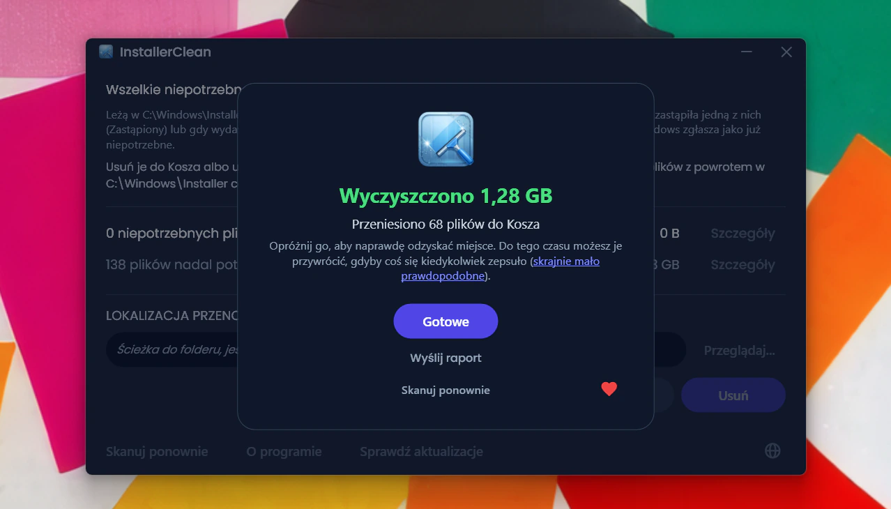
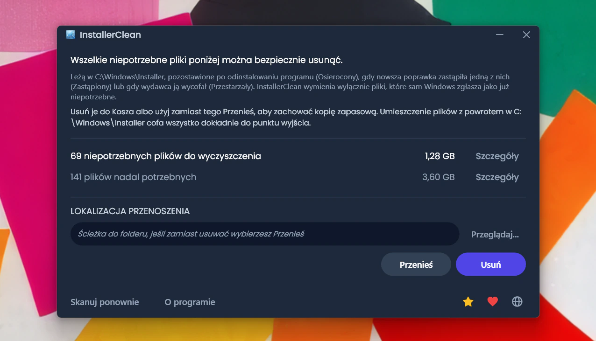
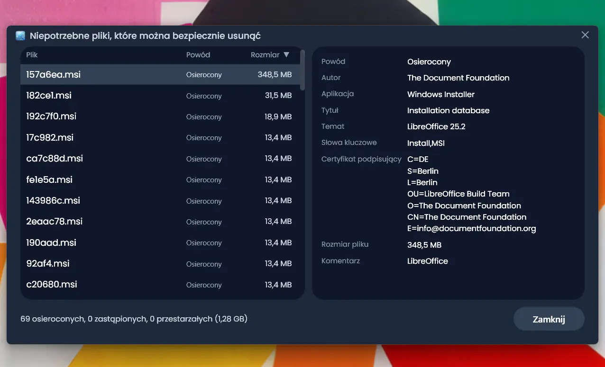
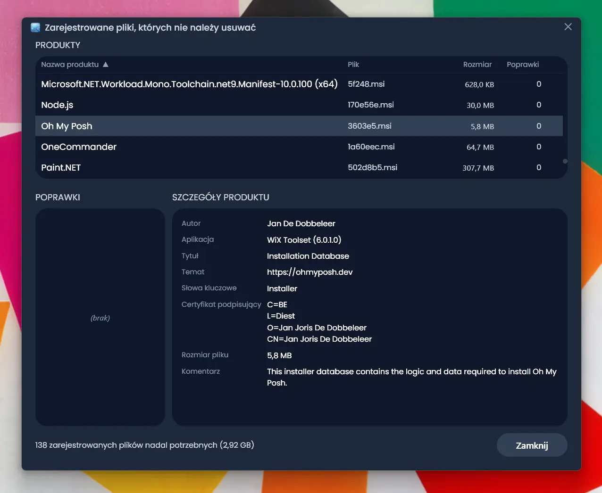
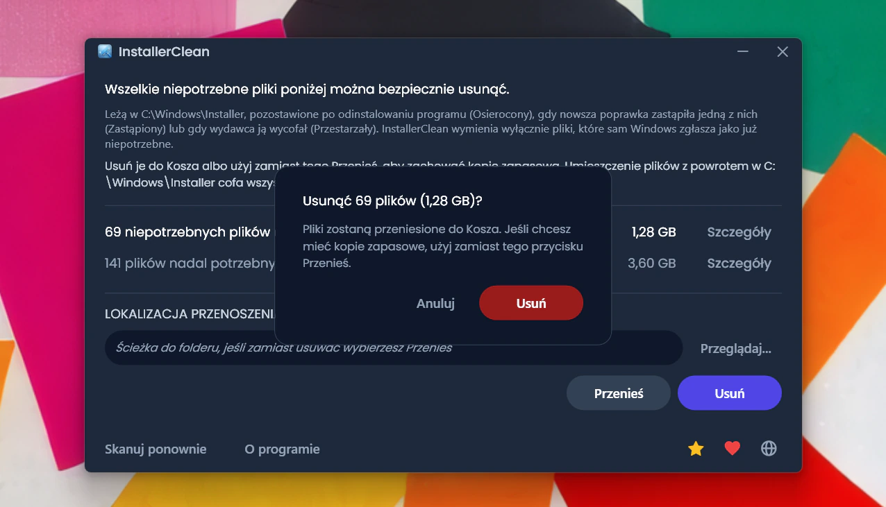
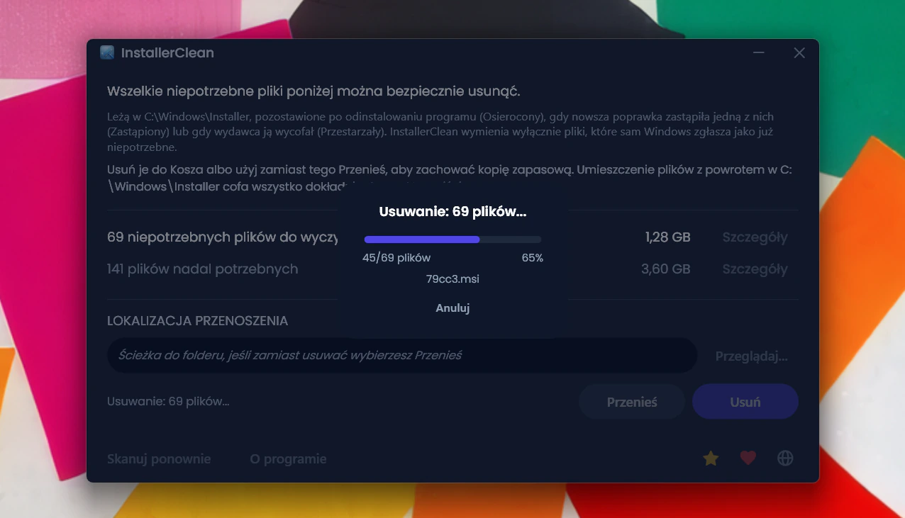
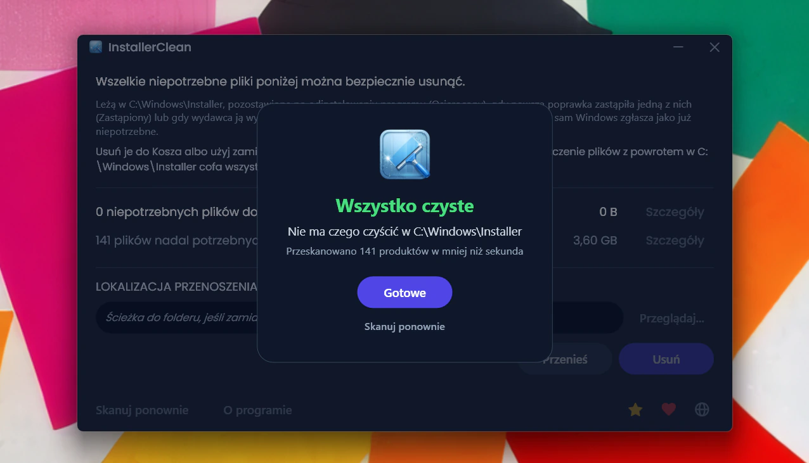
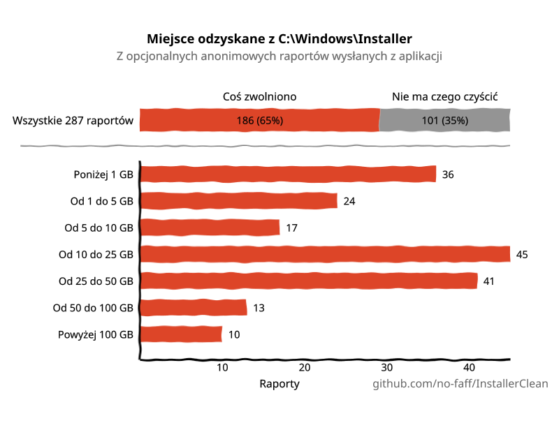

<p align="center">
  <a href="README.md">English</a> · <a href="README.zh-CN.md">简体中文</a> · <a href="README.ru.md">Русский</a> · <a href="README.es.md">Español</a> · <a href="README.ar.md">العربية</a> · <a href="README.ja.md">日本語</a> · <a href="README.pt-BR.md">Português (BR)</a> · <strong>Polski</strong> · <a href="README.tr.md">Türkçe</a> · <a href="README.ko.md">한국어</a> · <a href="README.fr.md">Français</a> · <a href="README.it.md">Italiano</a> · <a href="README.de.md">Deutsch</a> · <a href="README.id.md">Bahasa Indonesia</a> · <a href="README.vi.md">Tiếng Việt</a> · <a href="README.uk.md">Українська</a> · <a href="README.nl.md">Nederlands</a>
</p>

<p align="center">
  
</p>

<p align="center"><em>🎶 What's my line? I'm happy <a href="https://www.youtube.com/watch?v=HM-jHhUZfFI">cleaning Windows</a></em></p>

<h1 align="center">InstallerClean</h1>

<p align="center"><strong>Otwartoźródłowe narzędzie do bezpiecznego oczyszczania <code>C:\Windows\Installer</code>, ukrytego folderu systemu Windows, który po cichu pożera miejsce na dysku.</strong></p>

<p align="center"><em>Uruchamiaj go od wielkiego dzwonu. Może zwolnisz trochę miejsca. Ruszaj dalej, wszystko czyste.</em></p>

<p align="center">
  <a href="LICENSE"></a>
  <a href="https://dotnet.microsoft.com/download/dotnet/10.0"></a>
  <a href="https://github.com/no-faff/InstallerClean/actions/workflows/ci.yml"></a>
  <a href="https://github.com/no-faff/InstallerClean/releases"></a>
  <a href="https://github.com/no-faff/InstallerClean/releases/latest"></a>
  <a href="https://github.com/no-faff/InstallerClean/releases"></a>
</p>



- **Co:** InstallerClean robi jedną rzecz: usuwa niepotrzebne pliki z `C:\Windows\Installer`, ukrytego folderu, którego Windows nigdy nie czyści. Po niemal natychmiastowym skanowaniu mówi ci, czy w ogóle jakieś masz, pokazuje więcej szczegółów ciekawskim i pozwala je usunąć, by zwolnić miejsce na dysku C:. Uruchamiasz go raz i ruszasz dalej.
- **Może jesteś tu, bo:** Użyłeś [WinDirStat](https://github.com/windirstat/windirstat), WizTree albo TreeSize, zobaczyłeś, że `C:\Windows\Installer` zajmuje mnóstwo miejsca, i nie wiedziałeś, co w nim siedzi. InstallerClean to dokładnie to, czego potrzebujesz. Wie, co kryje się w tych plikach o pozornie przypadkowych nazwach, jak `9f05cba.msi`, i szybko mówi ci, które z nich możesz bezpiecznie usunąć.
- **Ile miejsca:** Nadesłane jak dotąd (opcjonalne i anonimowe) raporty pokazują, że <!-- reports-freedpct-start -->62%<!-- reports-freedpct-end --> maszyn miało niepotrzebne pliki do wyczyszczenia. Na tych maszynach mediana zwolnionego miejsca to <!-- reports-median-start -->16,8 GB<!-- reports-median-end --><!-- reports-biggest-start -->, a jedna maszyna odzyskała bagatela 462 GB<!-- reports-biggest-end -->. Pozostałe <!-- reports-nothingpct-start -->38%<!-- reports-nothingpct-end --> nie znalazły nic do usunięcia, co po prostu oznacza, że ich folder Installer był już czysty. Więcej szczegółów w [FAQ](#faq) poniżej.
- **Czy to bezpieczne:** Tak. Pyta samo API Windows Installer, które pliki są nadal potrzebne, i wymienia wyłącznie te, które Windows zgłasza jako już niepotrzebne. Jest otwartoźródłowy (Apache 2.0) i o nic cię nie pyta: bez konta, bez reklam, bez śledzenia, bez telemetrii, bez niczego działającego w tle. Jedyne, co robi w sieci z własnej inicjatywy, to sprawdza przy uruchomieniu, czy na GitHubie jest nowsza wersja, a to możesz wyłączyć.
- **Pobierz:** [Pobierz najnowszą wersję](../../releases/latest). Uruchom; przeklikaj się przez [ostrzeżenie o „nieznanym wydawcy”](#unknown-publisher) i [monit administratora](#admin). Usuń wszelkie niepotrzebne pliki. Gotowe.

## Spis treści

- [Folder, o którym nikt ci nie mówi](#folder-o-którym-nikt-ci-nie-mówi)
- [W poszukiwaniu pomocy](#w-poszukiwaniu-pomocy)
- [Co robi](#co-robi)
- [Zrzuty ekranu](#zrzuty-ekranu)
- [Jak to działa](#jak-to-działa)
- [Czy to bezpieczne?](#czy-to-bezpieczne)
- [Polityka podpisywania kodu](#polityka-podpisywania-kodu)
- [Jeśli jednak brakuje ci pliku w C:\Windows\Installer](#recovery)
- [Dostępność](#dostępność)
- [Czego nie robi](#czego-nie-robi)
- [FAQ](#faq)
- [Pobieranie](#pobieranie)
- [Porównanie z PatchCleaner](#porównanie-z-patchcleaner)
- [Wiersz poleceń](#wiersz-poleceń)
- [Wymagania](#wymagania)
- [Kompilacja ze źródeł](#kompilacja-ze-źródeł)
- [Współtworzenie](#współtworzenie)
- [Wesprzyj projekt](#wesprzyj-projekt)
- [Historia gwiazdek](#historia-gwiazdek)
- [Licencja](#licencja)

---

## Folder, o którym nikt ci nie mówi

Na każdym komputerze z Windowsem jest ukryty folder o nazwie `C:\Windows\Installer`. Za każdym razem, gdy instalujesz oprogramowanie korzystające z systemu Windows Installer albo nakładasz poprawkę na Microsoft Office, Adobe Acrobat, Visual Studio czy dowolną inną aplikację opartą na `.msi`, kopia tego instalatora lub pliku poprawki `.msp` trafia do tego folderu i tam zostaje.

Gdy odinstalowujesz oprogramowanie, pliki zostają. Gdy nowsza poprawka zastępuje starszą, zostają obie. Windows nigdy ich nie sprząta. Oczyszczanie dysku ich nie rusza. DISM służy do zupełnie innego folderu. Z czasem folder rośnie: 1 GB, 5 GB, 20 GB, 50 GB. Na maszynach z dużą ilością oprogramowania korzystającego z MSI (częstym winowajcą jest Acrobat) może [przekroczyć 100 GB](https://www.reddit.com/r/sysadmin/comments/1oxcrmh/acrobat_filling_up_the_cwindowsinstaller_folder/).

To nie są pliki tymczasowe, które same wrócą. To prawdziwy balast: stare instalatory oprogramowania odinstalowanego lata temu i poprawki zastępowane już wielokrotnie. Gdy raz znikną, nie wracają.

**Jeśli szukasz łatwego sposobu na zwolnienie miejsca na dysku w Windowsie, ten folder to dobry punkt wyjścia.** InstallerClean znajduje niepotrzebne pliki i bezpiecznie je usuwa.

## W poszukiwaniu pomocy

Jeśli kiedykolwiek szukałeś pomocy w sprawie tego folderu, pewnie wiesz, jak to wygląda. Ktoś ze 180 GB w `C:\Windows\Installer` pyta, jak go wyczyścić. [Radzą mu uruchomić Oczyszczanie dysku](https://learn.microsoft.com/en-us/answers/questions/4238108/windows-installer-folder-has-occupied-180gb). Próbuje. Zwalnia 600 MB, ale nic z tego folderu (bo Oczyszczanie dysku nie rusza `C:\Windows\Installer`). Wątek cichnie.

> *„Wszystkie wątki, które udało mi się znaleźć, zwykle polecają te same rzeczy, które nie rozwiązują problemu, a potem zamierają.”*
>
> [ksparks519, r/Windows10](https://www.reddit.com/r/Windows10/comments/1bt8c5p/anyone_ever_figure_out_giant_installer_folders/) (przetłumaczono z angielskiego oryginału)

Albo radzą im w ogóle go nie ruszać. W jednym z wątków komuś z folderem Installer o rozmiarze 60 GB powiedziano, żeby [„nie ruszał tego.”](https://www.reddit.com/r/techsupport/comments/1hw4suq/my_windows_installer_folder_is_like_60gb_so_i/) Gdy zapytał, co w takim razie ma zrobić, odpowiedź brzmiała: *„Przecież dopiero co ci powiedziałem.”*

Standardowa porada myli usuwanie plików na chybił trafił (co naprawdę jest niebezpieczne) z usuwaniem plików, o których sam Windows mówi, że już ich nie potrzebuje (co niebezpieczne nie jest). InstallerClean robi to drugie.

## Co robi

1. **Skanuje** `C:\Windows\Installer` w poszukiwaniu plików `.msi` i `.msp`
2. **Odpytuje** API Windows Installer, by ustalić, które pliki są nadal zarejestrowane
3. **Pokazuje**, ile możesz zwolnić i ile jest nadal potrzebne, z opcjonalnymi oknami szczegółów wymieniającymi każdy plik
4. **Usuwa** niepotrzebne pliki: usuwa do Kosza lub przenosi do wybranego przez ciebie folderu

## Zrzuty ekranu

<p>
  <br>
  <em>Pierwsze skanowanie. Idzie bardzo szybko.</em>
  <br><br>
</p>

<p>
  <br>
  <em>Wyniki: ile jest nadal potrzebne, ile można usunąć.</em>
  <br><br>
</p>

<p>
  <br>
  <em>Szczegóły plików, które nie są już potrzebne.</em>
  <br><br>
</p>

<p>
  <br>
  <em>Szczegóły plików nadal potrzebnych, z metadanymi odczytanymi z bazy danych instalatora.</em>
  <br><br>
</p>

<p>
  <br>
  <em>Potwierdzenie przed każdą z akcji. Usuń przenosi do Kosza; Przenieś umieszcza pliki w wybranym przez ciebie miejscu.</em>
  <br><br>
</p>

<p>
  <br>
  <em>Usuwanie w toku. Anuluj przerywa je w połowie.</em>
  <br><br>
</p>

<p>
  <br>
  <em>Po udanym usunięciu.</em>
  <br><br>
</p>

<p>
  <br>
  <em>Po ponownym skanowaniu. Nic już do wyczyszczenia.</em>
  <br><br>
</p>

## Jak to działa

InstallerClean rozpoznaje trzy rodzaje niepotrzebnych plików.

**Osierocone pliki** to instalatory `.msi` (oraz ewentualne poprawki `.msp`) pozostawione po odinstalowaniu oprogramowania. Windows już się do nich nie odwołuje, ale pliki leżą w folderze i zajmują miejsce.

**Zastąpione poprawki** to stare poprawki `.msp`, które zostały zastąpione nowszymi. Windows oznacza je w swojej bazie danych jako zastąpione, ale nigdy ich nie usuwa. To przez Adobe sprawa wraca tak często: każda aktualizacja Acrobata wychodzi jako poprawka do tego samego pierwotnego instalatora, a nie jako osobny nowy instalator, więc na maszynie zostaje po jednej na każdą aktualizację, jaką kiedykolwiek dostała. Office i duże narzędzia deweloperskie narastają tak samo, tylko wolniej.

**Wycofane poprawki** to poprawki `.msp`, które wydawca wycofał lub uznał za przestarzałe, zamiast zastąpić je nowszą wersją. Windows zapisuje także ten stan i również pozostawia plik w folderze.

Aby je znaleźć, InstallerClean wywołuje interfejs COM Windows Installer bezpośrednio przez P/Invoke:

- `MsiEnumProductsEx`, aby wyliczyć każdy zainstalowany produkt
- `MsiEnumPatchesEx`, aby znaleźć wszystkie zarejestrowane poprawki dla każdego produktu
- `MsiGetPatchInfoEx`, aby odczytać stan poprawki (zastosowana, zastąpiona lub wycofana)

Każdy plik `.msi` lub `.msp` w `C:\Windows\Installer`, którego nie przypisuje sobie żaden zarejestrowany produkt, jest osierocony i oznaczany jako do usunięcia. Tak samo każda poprawka, którą baza danych oznacza jako zastąpioną lub wycofaną, a która nie jest wymagana do odinstalowania.

Aplikacja przy każdym skanowaniu czyta te same wpisy również wprost z rejestru, jako drugie, niezależne źródło. Jeśli którykolwiek z dwóch odczytów wróci niekompletny (rzadko, ale przy uszkodzonym stanie instalatora to możliwe), InstallerClean zatrzymuje pliki albo odmawia skanowania, zamiast zgadywać. Ten drugi odczyt dodaje pliki wyłącznie do zbioru „nadal potrzebnych”, nigdy do zbioru „do usunięcia”.

Po zakończeniu przenoszenia lub usuwania puste podfoldery wewnątrz `C:\Windows\Installer` (katalogi, które pamięć podręczna pozostawia po zniknięciu ich zawartości) są usuwane w tym samym przebiegu.

<a id="is-it-safe"></a>
## Czy to bezpieczne?

Tak. InstallerClean odpytuje tę samą bazę danych API Windows Installer, której Windows używa do śledzenia tego, co jest zainstalowane. Jeśli Windows mówi, że plik nie jest już potrzebny, aplikacja mu ufa; nie zgaduje na podstawie nazw plików ani dat.

**O usuwaniu i przenoszeniu.** Pliki, które InstallerClean usuwa, można bezpiecznie usunąć na stałe. **Usuń** przenosi je do Kosza (dostaniesz ostrzeżenie, jeśli jest niedostępny); miejsce na dysku C: odzyskujesz po opróżnieniu Kosza.

Nie musisz mi jednak wierzyć na słowo, że pliki można bezpiecznie usunąć. Dopóki są w Koszu, masz okazję sprawdzić, czy programy korzystające z tego folderu, Office, Acrobat, Visual Studio i podobne, nadal bez problemu się aktualizują i odinstalowują. Jeśli znajdziesz coś zepsutego (skrajnie mało prawdopodobne, a po <!-- downloads-start -->58 000+<!-- downloads-end --> pobraniach jak dotąd nikt nic nie zgłosił), przywróć pliki z Kosza, aby to naprawić. Dla pełnej pewności możesz zamiast tego użyć przycisku **Przenieś**, aby utworzyć kopię zapasową plików w wybranym przez siebie folderze (rzecz jasna wybierz folder na innej partycji lub dysku, jeśli zależy ci na zwolnieniu miejsca na C:). Wystarczy skopiować pliki z powrotem do `C:\Windows\Installer`, aby przywrócić wszystko do poprzedniego stanu (choć niemal na pewno nigdy nie będziesz musiał). Jeśli w nazwie pliku pojawiło się „(1)” (tak się dzieje, gdy przeniesiesz pliki do tego samego folderu dwa razy), usuń je przed skopiowaniem pliku z powrotem.

Jeśli Windows Installer akurat zapisuje do pamięci podręcznej, ma zawieszoną wcześniejszą transakcję lub ma w kolejce zmianę nazwy po ponownym uruchomieniu dotyczącą tej pamięci podręcznej, przyciski Przenieś i Usuń są wyłączone, a konkretny powód jest wyświetlany.

Usługi skanowania, odpytywania, przenoszenia, usuwania, ustawień i oczekującego ponownego uruchomienia są objęte automatycznym zestawem testów uruchamianym przy każdym commicie (zob. plakietkę CI powyżej).

**Weryfikacja pliku binarnego.** InstallerClean jest niepodpisany, ale nie musisz brać na wiarę, że jest bezpieczny:

- Skróty SHA-256 dla każdej wersji są wymienione na [stronie wydań](../../releases/latest).
- VirusTotal: każdy build jest skanowany, a pełne wyniki dla każdego silnika są linkowane na stronie danego wydania, dzięki czemu możesz zobaczyć, jak oceniono każdy plik, i przeskanować go ponownie samodzielnie. Fałszywy alarm aktywny w chwili wydania jest nazwany i wyjaśniony na stronie tego wydania, a gdy producent go wycofa, strona zostaje zaktualizowana.
- Kod źródłowy jest pod adresem [github.com/no-faff/InstallerClean](https://github.com/no-faff/InstallerClean), a CI buduje i testuje każdy commit (zob. zieloną plakietkę CI powyżej).
- Wydania są kompilowane deterministycznie: ustawienia kompilatora sprawiają, że ten sam kod źródłowy i ten sam SDK dają dokładnie te same bajty, a proces wydawniczy odmawia otagowania wersji, jeśli publikowane pliki exe nie zostały zbudowane z czystego drzewa roboczego dokładnie na tym tagu. Możesz więc przełączyć się na ten tag, zbudować wszystko samodzielnie i porównać skróty z opublikowanymi: to dowód, że pobrany plik odpowiada publicznemu kodowi źródłowemu. Najpierw dobierz tę samą wersję SDK (informacje o każdym wydaniu mówią, którą wersją je zbudowano); inna wersja poprawkowa SDK daje inne bajty, co wygląda na niezgodność, a nią nie jest.
- <!-- downloads-start -->58 000+<!-- downloads-end --> pobrań w GitHub, MajorGeeks i Softpedia.
- [MajorGeeks](https://www.majorgeeks.com/files/details/installerclean.html) testuje każde zgłoszenie w maszynie wirtualnej i umieszcza je na liście tylko wtedy, gdy przejdzie ich kontrolę.<br><a href="https://www.majorgeeks.com/files/details/installerclean.html"></a>
- [Softpedia](https://www.softpedia.com/get/System/Hard-Disk-Utils/InstallerClean.shtml) testuje każde wydanie pod kątem wirusów, programów szpiegujących i adware.<br><a href="https://www.softpedia.com/get/System/Hard-Disk-Utils/InstallerClean.shtml"></a>

## Polityka podpisywania kodu

InstallerClean złożył wniosek do [SignPath Foundation](https://signpath.org) o bezpłatne podpisywanie kodu. To program, który podpisuje oprogramowanie open source, żeby przestało trafiać na twój komputer od nieznanego wydawcy. Wniosek czeka na rozpatrzenie, więc na razie pliki do pobrania nie są podpisane, a Windows będzie przed nimi ostrzegał.

Jeśli zostanie przyjęty, każde wydanie będzie opatrzone wierszem, o który prosi SignPath: „free code signing provided by SignPath.io, certificate by SignPath Foundation”. Certyfikat należy do fundacji, a nie do mnie, bo certyfikat musi zostać wystawiony na podmiot prawny, a jednoosobowy projekt nim nie jest. Nie znaczy to, że InstallerClean jest ich ani że mają z nim coś wspólnego poza podpisem.

**Role.** InstallerClean utrzymuje jedna osoba, czyli ja, i wszystkie należą do mnie:

- Autorzy commitów i recenzenci, czyli kto może wprowadzać kod do projektu: ja. Każdy pull request jest sprawdzany przed scaleniem.
- Zatwierdzający, czyli kto może zezwolić na podpisanie wydania: ja.

**Prywatność.** Nie dowiaduję się niczego o tobie ani o twoich plikach, chyba że sam zdecydujesz się wysłać ten całkowicie opcjonalny anonimowy raport, który daje mi tylko znać, że wszystko działa. Bez reklam, bez telemetrii. Poza tym z siecią łączy się tylko po to, żeby przy uruchomieniu sprawdzić wersję (jedno zapytanie do GitHuba, które możesz wyłączyć w oknie O programie); są jeszcze przyciski z odnośnikami do GitHuba i do strony, na której możesz przekazać darowiznę, jeśli masz ochotę. Pełna [polityka prywatności](PRIVACY.md) (po angielsku).

<a id="recovery"></a>
## Jeśli jednak brakuje ci pliku w `C:\Windows\Installer`

InstallerClean usuwa wyłącznie pliki, które sam Windows zgłasza jako już niepotrzebne, więc nigdy nie może być powodem braku pliku. Ale jeśli jakiś już zniknął, InstallerClean to wykrywa i sygnalizuje. Oto jak temu zaradzić.

Pobierz instalator tego programu od jego producenta i uruchom go na istniejącej instalacji; nie odinstalowuj wcześniej. Jeśli możesz, użyj wersji, którą masz teraz, bo Windows może odrzucić inną. To zwykle przywraca plik i nie narusza twoich ustawień. Przeskanuj ponownie w InstallerClean, a ostrzeżenie zniknie, jeśli się udało.

To zwykle działa. Poniżej znajduje się pełniejsze, własne stanowisko Microsoftu: oficjalne szczegóły oraz trudniejsze przypadki, gdy nie jest to takie proste. Nic z tego nie jest sprawką InstallerClean i nie potrafię ulepszyć wskazówek Microsoftu, więc po prostu je przekazuję.

<details>
<summary>Pełniejsze stanowisko Microsoftu</summary>

*Poniższe cytaty Microsoftu pozostają w angielskim oryginale.*

Pełna instrukcja: [Restore missing Windows Installer cache files](https://learn.microsoft.com/en-us/troubleshoot/windows-client/application-management/missing-windows-installer-cache).

*Może nie pojawić się od razu:*
> "If the installer cache is compromised, you may not immediately see problems until you take an action such as uninstalling, repairing, or updating a product."

*Pliki są unikalne dla każdej maszyny, więc nie skopiujesz ich z innego komputera:*
> "Missing files cannot be copied between computers because the files are unique."

*Nie da się też wyciągnąć samego pliku z kopii zapasowej:*
> "To restore the missing files, a full system state restoration is required. It is not possible to replace only the missing files from a previous backup."

*Zalecany sposób odzyskania i jego bezlitosne ograniczenia:*
> "If application files are missing from the Windows Installer Cache, ask the vendor or support team for the application about the missing files. You must follow the procedures or steps recommended by the application vendor to restore the files. In some cases, you may have to rebuild the operating system and reinstall the application to fix the problem."
>
> "Windows support engineers cannot help you recover missing application files from the Windows Installer cache."

*Dlaczego ta sama wersja ma znaczenie:*
> "The upgrade cannot be installed by the Windows Installer service because the program to be upgraded may be missing, or the upgrade may update a different version of the program."

</details>

## Dostępność

InstallerClean jest zaprojektowany tak, aby dało się go w pełni obsługiwać z klawiatury i za pomocą czytnika ekranu.

- **W całości obsługiwany z klawiatury.** Tab dociera do każdego elementu sterującego, a kolumny w oknach szczegółów można sortować z klawiatury, więc nic tutaj nie wymaga myszy. Fokus klawiatury pozostaje widoczny wszędzie tam, gdzie się znajdzie.
- **Narrator i Dostęp głosowy.** Każdy element sterujący ma etykietę, a widoczne słowo na przycisku to słowo, które uruchamia go głosem. Gdy przenoszenie lub usuwanie się zakończy, wynik jest odczytywany na głos.
- **Stworzony do czytania.** Tekst spełnia wymogi kontrastu WCAG AA w całym ciemnym motywie.

Jeśli cokolwiek tutaj ci przeszkadza, [zgłoś problem](../../issues). Problemy z dostępnością to błędy, a nie przypadki brzegowe.

## Czego nie robi

- WinSxS (`C:\Windows\WinSxS`) to inny folder o innych zasadach. Do niego użyj `Dism /Online /Cleanup-Image /StartComponentCleanup` z wiersza poleceń z podwyższonymi uprawnieniami.
- Brak usługi w tle, brak zaplanowanego zadania, brak automatycznego czyszczenia. Aplikacja działa wtedy, gdy ją uruchomisz.
- Nie zmienia ani twoich zainstalowanych programów, ani bazy danych Windows Installer, tylko je odczytuje. Jedyne, co w ogóle zapisuje do rejestru, to jednorazowa rejestracja źródła zdarzeń, której narzędzie wiersza poleceń potrzebuje, aby jego uruchomienia pojawiały się w dzienniku zdarzeń Windows.
- Z własnej inicjatywy nawiązuje tylko jedno połączenie: przy uruchomieniu szybko sprawdza na stronie wydań GitHuba, czy jest nowsza wersja, co możesz wyłączyć w oknie O programie. Cała reszta dzieje się tylko wtedy, gdy mu każesz: opcjonalny anonimowy raport (tylko po to, bym wiedział, że działa) oraz linki do dokumentacji na GitHubie i strony wsparcia, które otwierają się w twojej przeglądarce, jeśli je klikniesz. Sam nigdy niczego nie pobiera.
- Bez pasków narzędzi, bez dołączanego oprogramowania, bez adware.

## FAQ

<a id="reports-stats"></a>
**Czy naprawdę zwolnię GB miejsca?** To zależy od twojej maszyny. Czysta instalacja Windows 11 bez dodatkowego oprogramowania nie ma nic do usunięcia. Długo używana stacja robocza dewelopera albo dowolna maszyna z dużą ilością oprogramowania opartego na MSI (Acrobat, Office, LibreOffice, duże narzędzia deweloperskie) może mieć dziesiątki GB. Tak czy inaczej, dokładnie zobaczysz ile, w chwili gdy ją uruchomisz.

<!-- reports-stats-start (generated; do not hand-edit between these markers) -->
Od wersji v1.8.0 można przysłać krótki anonimowy raport z wyniku. Do tej pory przyszło ich 208 (dzięki wszystkim 🙏), a na tych 62% maszyn, które miały coś do wyczyszczenia, mediana zwolnionego miejsca to 16,8 GB. Jedna maszyna odzyskała aż 462 GB. Oto podsumowanie wyników.

<p align="center">
  <picture>
    <source media="(prefers-color-scheme: dark)" srcset="docs/reports-pl-dark.svg" />
    <source media="(prefers-color-scheme: light)" srcset="docs/reports-pl-light.svg" />
    
  </picture>
</p>

Wysłanie raportu to jedno kliknięcie przycisku w aplikacji i jest całkowicie dobrowolne. Nie ma w nim nic osobistego, a przed wysłaniem widzisz dokładnie to, co zostanie wysłane, o tak:


<!-- reports-stats-end -->

<a id="admin"></a>

**Dlaczego wymaga uprawnień administratora?** `C:\Windows\Installer` jest dostępny tylko dla administratorów. Odczyt tego folderu, odpytywanie bazy danych instalatora oraz przenoszenie lub usuwanie plików, wszystko to ich wymaga, więc aplikacja musi działać jako administrator.

<a id="unknown-publisher"></a>

**Dlaczego Windows pisze „Nieznany wydawca”?** InstallerClean nie jest podpisany cyfrowo, a Windows oznacza pliki pobrane z internetu, więc przy pierwszym uruchomieniu SmartScreen zwykle pokazuje „System Windows ochronił ten komputer”, a wydawca figuruje jako nieznany. Płatny certyfikat do podpisywania kosztuje co roku, a wolę, żeby aplikacja pozostała darmowa, niż płacić za certyfikat, więc złożyłem wniosek do SignPath Foundation, która podpisuje oprogramowanie open source za darmo (zob. [Polityka podpisywania kodu](#polityka-podpisywania-kodu)). Zanim to dojdzie do skutku, kliknij **Więcej informacji**, a następnie **Uruchom mimo to**. Można to zrobić bez obaw: kod źródłowy jest publiczny, a każde wydanie ma linki do VirusTotal i skróty SHA-256, które możesz wcześniej sprawdzić.

**Czy mogę cofnąć usunięcie?** Zwykle tak. Gdy Kosz jest dostępny dla danego dysku, Usuń przenosi do niego pliki i możesz je z Kosza przywrócić. Jeśli Kosz jest niedostępny, aplikacja nigdy sama nie usuwa trwale (zob. [Czy to bezpieczne?](#czy-to-bezpieczne)). A jeśli wolisz mieć drogę powrotną pod własną kontrolą, Przenieś umieszcza pliki w wybranym przez ciebie folderze; usuń je stamtąd, kiedy tylko nabierzesz pewności.

**Czy Windows będzie narzekał, jeśli usunę te pliki?** Nie. InstallerClean usuwa wyłącznie pliki, które sam Windows zgłasza jako już niepotrzebne, więc nic z usuwanego nie jest potrzebne do naprawy, aktualizacji ani odinstalowania programu. Jeśli potrzebny plik mimo wszystko zniknie z `C:\Windows\Installer` w jakiś inny sposób, zob. [Jeśli jednak brakuje ci pliku w C:\Windows\Installer](#recovery).

**Dlaczego bez `Win32_Product` (WMI)?** [`Win32_Product` wyzwala operacje naprawy MSI na każdym produkcie podczas wyliczania](https://gregramsey.net/2012/02/20/win32_product-is-evil/), co może trwać minutami i mocno obciążać dysk. InstallerClean wywołuje API COM Windows Installer bezpośrednio, bez efektów ubocznych.

**Dlaczego nie po prostu skrypt PowerShell?** Krótki skrypt wywołujący `MsiEnumPatchesEx` wystarczy, by *wymienić* poprawki, ale newralgiczne części InstallerClean to właśnie to, co skrypt pomija: klasyfikacja osierocone kontra zastąpione, awaryjny odczyt rejestru dodający pliki wyłącznie do zbioru „nadal potrzebnych” (nigdy do „do usunięcia”), blokada przy oczekującym ponownym uruchomieniu, siatka bezpieczeństwa w postaci przeniesienia w inne miejsce, postęp dla każdego pliku z możliwością anulowania oraz domyślne usuwanie do Kosza zamiast trwałego. Przypadki brzegowe na prawdziwych maszynach z dużą ilością MSI (uszkodzone rejestracje, złącza (junctions) wewnątrz pamięci podręcznej, produkty w `HKU\.DEFAULT`, zawieszone transakcje instalatora) łatwo źle obsłużyć w doraźnym skrypcie. `installerclean-cli` to oblicze bez interfejsu, jeśli zależy ci na skryptowaniu.

**Czy działa na Windows 7 lub 8?** Nietestowane i nieobsługiwane. Przeznaczone dla Windows 10 i 11.

**Czy nadaje się do RMM / masowego wdrażania?** Tak. CLI kończy działanie z odrębnymi kodami dla każdego wyniku (0 sukces, 2 częściowy, 1 twarda awaria, 75 stan przejściowy, 130 dla Ctrl+C przed przetworzeniem jakiegokolwiek pliku; Ctrl+C w trakcie partii kończy się kodem 2, ponieważ praca została wykonana), więc zaplanowane zadanie może ponowić próbę przy 75, nie myląc tego z twardymi awariami. Zapisuje podsumowanie każdego uruchomienia w dzienniku zdarzeń aplikacji i respektuje ten sam muteks pojedynczej instancji co GUI. Instalator także instaluje się po cichu ze standardowymi przełącznikami Inno Setup (`/SILENT` lub `/VERYSILENT`); uruchomienie po instalacji jest pomijane przy instalacjach cichych. Zob. sekcję Wiersz poleceń.

## Pobieranie

Trzy warianty, wybierz jeden:

- **Setup** (`InstallerClean-2.3.0-setup.exe`): zwykły instalator Windows z dołączonym środowiskiem uruchomieniowym .NET 10. Dodaje wpis w menu Start i odinstalowuje się czysto. Schowany wśród programów, więc łatwo go znaleźć za pół roku.
- **Portable** (`InstallerClean-2.3.0-portable.exe`): pojedynczy samodzielny plik exe z dołączonym środowiskiem uruchomieniowym. Bez instalacji, bez deinstalatora. Uruchom, użyj, usuń. Uruchom ponownie, kiedy zechcesz.
- **CLI** (`installerclean-cli.exe`): sama wersja wiersza poleceń, pojedynczy samodzielny plik exe. Bez instalacji, nic nie zostaje potem na maszynie. Wrzuć go na komputer kliencki, uruchom skanowanie lub czyszczenie, usuń. Stworzony do skryptowania, zaplanowanych zadań i masowego wdrażania, gdy chcesz wykonać operacje bez aplikacji desktopowej na komputerze klienta. Zob. [Wiersz poleceń](#wiersz-poleceń), aby poznać argumenty i kody wyjścia.

Od wersji 2.2.0 nazwy plików instalatora i wersji przenośnej zawierają numer wersji, więc pobrana kopia zawsze mówi, czym jest; wersja wiersza poleceń zachowuje zwykłą nazwę `installerclean-cli.exe`, żeby zaplanowane zadania i skrypty, które na nią wskazują, działały dalej mimo aktualizacji.

Pobierz ze [strony wydań](../../releases/latest), a następnie uruchom. Jest niepodpisany, więc Windows pokazuje ostrzeżenie o „nieznanym wydawcy”; [FAQ](#unknown-publisher) wyjaśnia, co zobaczysz i dlaczego jest to bezpieczne.

Aplikacja skanuje automatycznie przy starcie. Przejrzyj wyniki, a następnie kliknij **Usuń** lub **Przenieś**.

Albo zainstaluj przez [winget](https://learn.microsoft.com/windows/package-manager/winget/):

```
winget install NoFaff.InstallerClean
```

Albo zainstaluj przez [Scoop](https://scoop.sh):

```
scoop install installerclean
```

## Porównanie z PatchCleaner

Jeśli już wcześniej szukałeś tego folderu, narzędziem, na które najpewniej trafiłeś, jest [PatchCleaner](https://www.homedev.com.au/free/patchcleaner). Wciąż radzi sobie dobrze, ale stworzyłem InstallerClean, bo PatchCleaner ma zamknięty kod, nie był aktualizowany od marca 2016 roku i domyślnie nie rusza produktów Adobe. Jego sprawdzanie sierot błędnie oznaczało poprawki Adobe, a ich usunięcie psuło aktualizacje Adobe, więc zostawia wszystkie pliki Adobe w spokoju, chyba że wyłączysz filtr. Na maszynach, gdzie Adobe jest największym winowajcą, to właśnie tam jest najwięcej miejsca:

> *„Pobrałem Patchcleaner, żeby usunąć osierocone pliki `.msp`, ale podobno zwolniłoby to tylko 250 MB miejsca. 29 GB plików jest ‚wykluczonych przez filtry’, więc Patchcleaner chyba nie pomaga.”*
>
> HeatherBunny1111, [r/techsupport](https://www.reddit.com/r/techsupport/comments/1qc4tcf/how_to_delete_msp_files_safely/) (przetłumaczono z angielskiego oryginału)

InstallerClean czyta własne zapisy poprawek Windows Installer, więc zamiast ukrywać wszystkie pliki Adobe za hurtowym filtrem, potrafi rozpoznać, które poprawki Windows oznaczył jako zastąpione, i dokładnie tak je opisuje. Oto jak wypada porównanie obu:

| | **InstallerClean** | **PatchCleaner** |
|---|---|---|
| Ostatnia aktualizacja | 2026 (aktywny) | 3 marca 2016 |
| Kod źródłowy | Otwarty kod (Apache 2.0) | Zamknięty kod |
| Środowisko uruchomieniowe | .NET 10 (samodzielne) | .NET + VBScript |
| API | Windows Installer COM (w procesie) | Windows Installer COM (poza procesem, przez VBScript) |
| Wykrywanie zastąpionych poprawek | Tak | Nie |
| Obsługa Adobe | Wykrywa zastąpione poprawki | Domyślnie wyklucza |
| Interfejs | Ciemny motyw (WPF) | Windows Forms |
| Zbieranie danych | Brak | Brak |
| Bezpieczeństwo usuwania | Kosz. Jeśli jest niedostępny, pyta: przenieść zamiast tego czy usunąć trwale | Trwałe, bez Kosza |

> **Uwaga o `Win32_Product`:** Powszechnym, lecz wadliwym sposobem wymieniania zainstalowanych produktów jest `Win32_Product` (WMI), które podczas wyliczania [wyzwala operacje naprawy MSI](https://gregramsey.net/2012/02/20/win32_product-is-evil/) na każdym produkcie. Zarówno InstallerClean, jak i PatchCleaner go unikają. Oba korzystają z interfejsu COM Windows Installer. Nazwa pliku `WMIProducts.vbs` w skrypcie PatchCleaner jest myląca; skrypt używa MSI COM, a nie WMI.

[Ultra Virus Killer (UVK)](https://www.carifred.com/uvk/) również oferuje czyszczenie folderu Installer, jako część swojego modułu System Booster, ale to narzędzie płatne (15-25 USD), a czyszczenie to jedna mała funkcja w znacznie większej aplikacji. InstallerClean jest darmowy, skupiony na jednym i otwarty.

Uniwersalne programy do czyszczenia systemu, takie jak [CCleaner](https://www.ccleaner.com/) i [BleachBit](https://www.bleachbit.org/), nie ruszają `C:\Windows\Installer`. Ten folder wymaga zapytań do API Windows Installer, by odróżnić zarejestrowane pakiety od niepotrzebnych, a zwykły program czyszczący, który po prostu przeszedłby drzewo plików, mógłby popsuć zainstalowane aplikacje. InstallerClean to narzędzie, po które sięgasz, gdy to właśnie ten folder chcesz wyczyścić.

## Wiersz poleceń

InstallerClean obsługuje pracę bez interfejsu, na potrzeby skryptowania i administratorów systemu:

```
Sposób użycia:
  installerclean-cli --help   Pokaż tę pomoc (akceptuje też /?, -h)
  installerclean-cli --version  Wypisz wersję (akceptuje też -v)
  installerclean-cli /s       Tylko skanowanie - lista niepotrzebnych plików
  installerclean-cli /d       Usuń niepotrzebne pliki (Kosz)
  installerclean-cli /m       Przenieś do zapisanej lokalizacji domyślnej
  installerclean-cli /m ŚCIEŻKA  Przenieś do wskazanej ścieżki
```

Aby uruchomić GUI, uruchom `InstallerClean.exe` (lub użyj skrótu w menu Start z instalacji Setup).

Uruchomione bez argumentu lub z nierozpoznaną flagą, `installerclean-cli` wypisuje ten opis użycia i kończy się kodem `1`, więc zaplanowane zadanie, które zgubi swoją flagę, zawodzi w widoczny sposób, zamiast po cichu „udać się”, nie robiąc nic. Jawne `--help`, `/?` lub `-h` wypisuje ten sam opis i kończy się kodem `0`.

`/s` to przebieg próbny: skanuje, wypisuje to, co usunąłby, z nazwami plików i rozmiarami, a następnie kończy działanie. Przydatne do audytu przed czyszczeniem. Kod wyjścia to `0` przy udanym skanowaniu, `1`, jeśli skanowanie zawiedzie, i `130` przy Ctrl+C. Wszystkie pliki znajdują się w `C:\Windows\Installer`.

`/d` i `/m` skanują, a następnie działają. `/d` przenosi pliki do usunięcia do Kosza. `/m` przenosi je do folderu (albo wskazanego w wierszu poleceń, albo domyślnego zapisanego z GUI). Ten zapisany domyślny folder jest przechowywany dla każdego użytkownika, więc zaplanowane zadanie działające jako SYSTEM lub na koncie usługi go nie zobaczy; takie uruchomienia muszą wskazać folder wprost za pomocą `/m PATH`. Kody wyjścia: `0` dla pełnego sukcesu, `2` dla częściowego (część plików się powiodła, część zawiodła), `1` dla całkowitej porażki (skanowanie zawiodło, błędne argumenty albo każdy plik w partii zawiódł), `75` dla stanu przejściowego, który zablokował przebieg (wypisany komunikat wyjaśnia jaki i czy ponowna próba pomoże), `130` dla Ctrl+C przed przetworzeniem jakiegokolwiek pliku (Ctrl+C w trakcie partii kończy się kodem `2`, częściowym, ponieważ praca została wykonana).

Cała komunikacja CLI, w tym komunikaty o błędach i diagnostyczne, trafia do stdout; nie ma osobnego strumienia stderr. Kod wyjścia jest sygnałem czytelnym maszynowo (a wpis w dzienniku zdarzeń aplikacji dla każdego uruchomienia go odzwierciedla), więc skrypt powinien opierać się na kodzie wyjścia, a nie analizować tekst, a `installerclean-cli /s > audit.txt` przechwytuje cały przebieg, łącznie z ewentualnym wierszem błędu.

Wszystkie trzy wymagają wiersza poleceń z podwyższonymi uprawnieniami (administratora). Jeśli zasady grupy blokują monit podniesienia uprawnień UAC, proces odmawia uruchomienia, a Windows zwraca błąd 740 do nadrzędnej powłoki (`$LASTEXITCODE = 740` w PowerShell). `taskkill /pid <pid>` nie wywołuje łagodnego anulowania; muteks pojedynczej instancji jest odzyskiwany przy następnym uruchomieniu przez ścieżkę AbandonedMutexException.

### Planowanie regularnego czyszczenia

Aby czyścić folder według harmonogramu, wskaż `installerclean-cli` w Harmonogramie zadań. Uruchamiaj go jako SYSTEM lub na koncie usługi i z najwyższymi uprawnieniami, żeby dostawał potrzebne podniesienie uprawnień bez interaktywnego monitu, a folder docelowy przenoszenia podawaj w wierszu poleceń, bo domyślny folder zapisany w GUI jest przechowywany dla każdego użytkownika i nie dotyczy przebiegu jako SYSTEM ani na koncie usługi. Comiesięczne przeniesienie do `D:\InstallerBackup`, z kopią CLI umieszczoną w `C:\Tools`, wygląda tak:

```
schtasks /create /tn "InstallerClean monthly" /tr "C:\Tools\installerclean-cli.exe /m D:\InstallerBackup" /sc monthly /ru SYSTEM /rl highest
```

Zadanie czeka na zakończenie przebiegu i zapisuje kod wyjścia jako swój Wynik ostatniego uruchomienia, więc twój system RMM może opierać się na powyższych kodach (`0` pełny sukces, `2` częściowy, `75` stan przejściowy, `1` całkowita porażka) tak samo jak skrypt.

### Dlaczego `installerclean-cli`, a nie `installerclean.exe`?

`InstallerClean.exe` to GUI WPF; nie reaguje na argumenty wiersza poleceń. `installerclean-cli.exe` to osobny program konsolowy, który jest dostarczany w tym samym katalogu instalacyjnym i udostępnia te same operacje skanowania / przenoszenia / usuwania dla PowerShell, cmd i zaplanowanych zadań. Ponieważ jest prawdziwym procesem konsolowym, blokuje wiersz poleceń do czasu zakończenia; przekieruj lub przekaż potokiem jego komunikację tak jak każdy inny program konsolowy exe.

Pobranie Portable zawiera tylko plik exe z GUI. Jeśli chcesz wiersz poleceń bez GUI, pobierz `installerclean-cli.exe` ze [strony wydań](../../releases/latest) i uruchom go bezpośrednio. Instalator Setup również instaluje go obok GUI.

## Wymagania

- Windows 10 (wersja 1607 / kompilacja 14393 lub nowsza, najstarsza obsługiwana przez środowisko uruchomieniowe .NET 10) lub Windows 11
- Uprawnienia administratora (`C:\Windows\Installer` jest tylko dla administratorów)

Zob. [Pobieranie](#pobieranie), aby poznać warianty Setup, Portable i CLI.

## Kompilacja ze źródeł

```
git clone https://github.com/no-faff/InstallerClean.git
cd InstallerClean
dotnet build src/InstallerClean.sln
```

Uruchom testy:

```
dotnet test src/InstallerClean.Tests/
```

## Współtworzenie

Znalazłeś błąd albo masz sugestię? [Zgłoś problem](../../issues) lub rozpocznij [dyskusję](../../discussions). Pull requesty mile widziane. Przed zgłoszeniem uruchom `dotnet test`.

InstallerClean jest teraz w całości dostępny po polsku: aplikacja, instalator, wiersz poleceń i ten plik README. Wszystko to moje najlepsze starania w postaci tłumaczeń maszynowych; nie są idealne, więc udostępniam je w obecnej formie, zamiast czekać, aż sprawdzi je ktoś, dla kogo polski jest językiem ojczystym. Jeśli zauważysz coś, co dałoby się poprawić, chętnie o tym usłyszę, przez [zgłoszenie (issue)](../../issues/new?template=translation_review.md), pull request lub dyskusję. Aplikacja domyślnie otwiera się w języku twojego systemu Windows; w każdej chwili możesz przełączyć ją na angielski za pomocą ikony globusa.

## Wesprzyj projekt

Jeśli InstallerClean pomógł, rozważ [wsparcie No Faff](https://nofaff.netlify.app/support) lub zostawienie gwiazdki na GitHubie.

## Historia gwiazdek

<picture>
  <source media="(prefers-color-scheme: dark)" srcset="docs/star-history-dark.svg" />
  <source media="(prefers-color-scheme: light)" srcset="docs/star-history-light.svg" />
  
</picture>

## Licencja

[Apache 2.0](LICENSE)

---

🎶 [George Formby - When I'm Cleaning Windows](https://www.youtube.com/watch?v=P183Uo5Ust4). Miłego słuchania!
