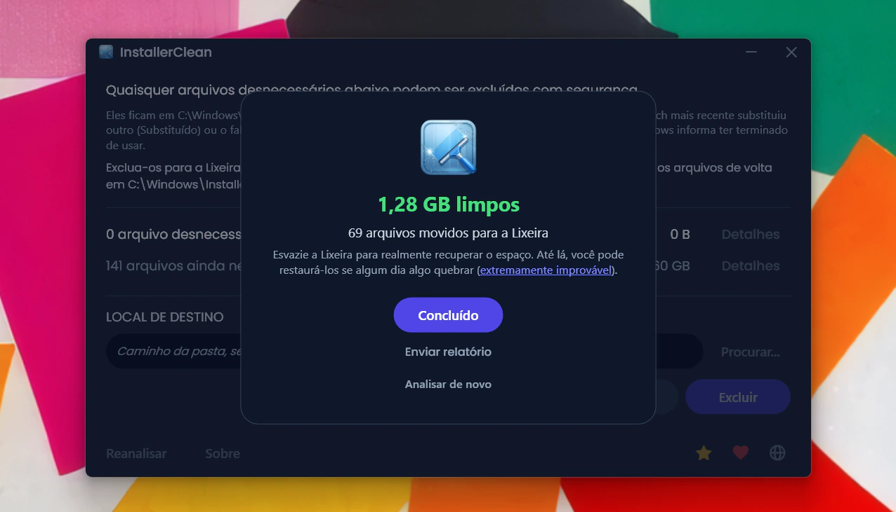
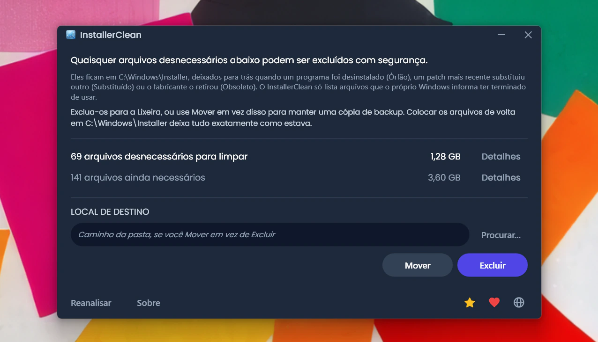
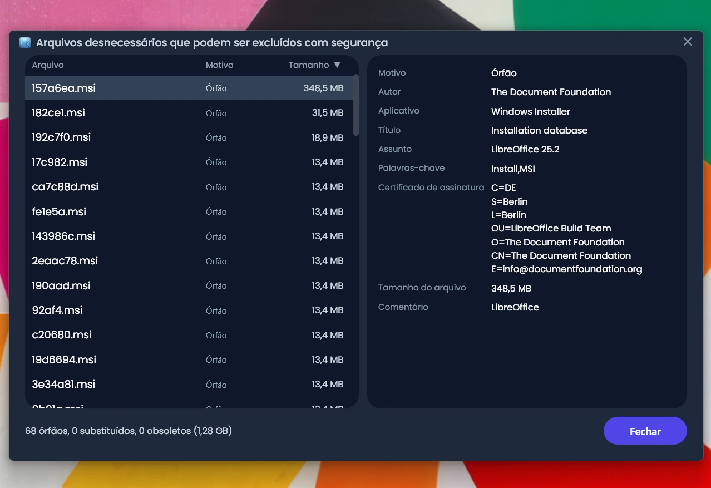
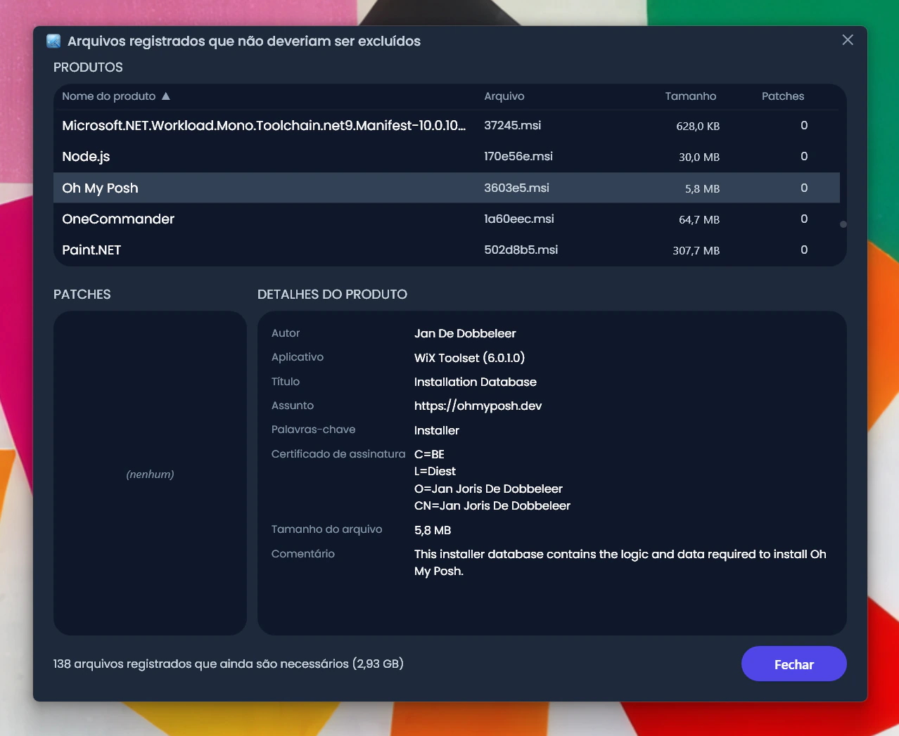
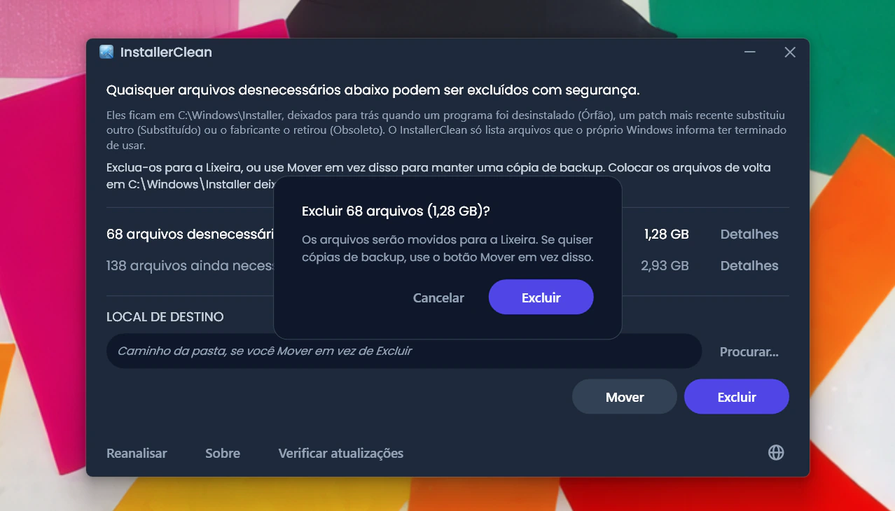
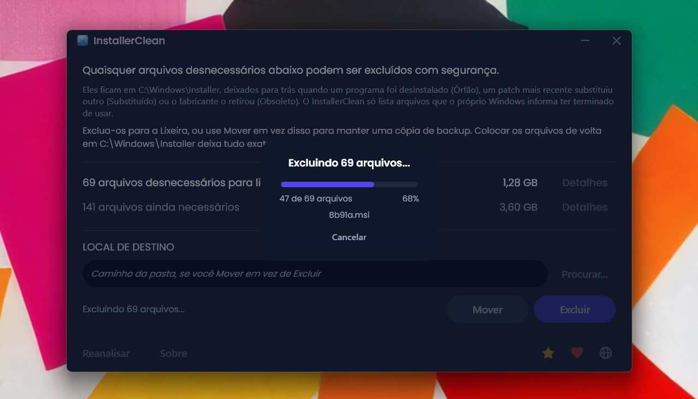
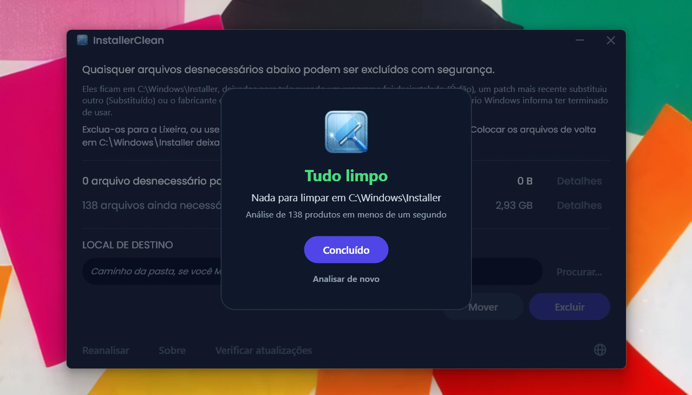
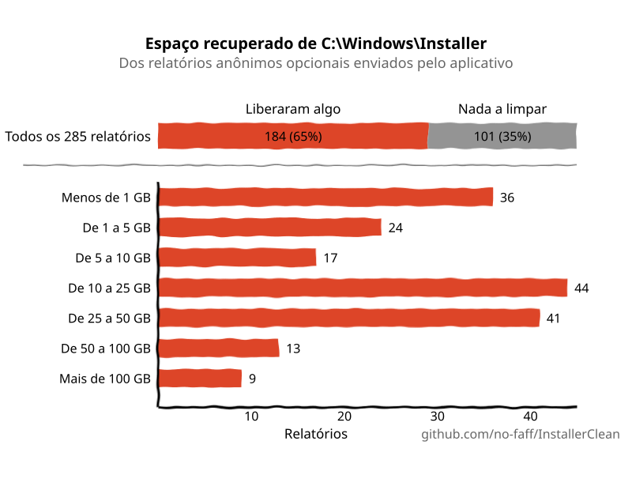

<p align="center">
  <a href="README.md">English</a> · <a href="README.zh-CN.md">简体中文</a> · <a href="README.ru.md">Русский</a> · <a href="README.es.md">Español</a> · <a href="README.ar.md">العربية</a> · <a href="README.ja.md">日本語</a> · <strong>Português (BR)</strong> · <a href="README.pl.md">Polski</a> · <a href="README.tr.md">Türkçe</a> · <a href="README.ko.md">한국어</a> · <a href="README.fr.md">Français</a> · <a href="README.it.md">Italiano</a> · <a href="README.de.md">Deutsch</a> · <a href="README.id.md">Bahasa Indonesia</a> · <a href="README.vi.md">Tiếng Việt</a> · <a href="README.uk.md">Українська</a> · <a href="README.nl.md">Nederlands</a>
</p>

<p align="center">
  
</p>

<p align="center"><em>🎶 What's my line? I'm happy <a href="https://www.youtube.com/watch?v=HM-jHhUZfFI">cleaning Windows</a></em></p>

<h1 align="center">InstallerClean</h1>

<p align="center"><strong>Uma ferramenta de código aberto para limpar com segurança o <code>C:\Windows\Installer</code>, a pasta oculta do Windows que consome silenciosamente o seu espaço em disco.</strong></p>

<p align="center"><em>Use uma vez na vida e outra na morte. Talvez libere um espaço. Siga em frente, leve e limpo.</em></p>

<p align="center">
  <a href="LICENSE"></a>
  <a href="https://dotnet.microsoft.com/download/dotnet/10.0"></a>
  <a href="https://github.com/no-faff/InstallerClean/actions/workflows/ci.yml"></a>
  <a href="https://github.com/no-faff/InstallerClean/releases"></a>
  <a href="https://github.com/no-faff/InstallerClean/releases/latest"></a>
  <a href="https://github.com/no-faff/InstallerClean/releases"></a>
</p>



- **O que faz:** O InstallerClean faz uma coisa só: remove arquivos desnecessários de `C:\Windows\Installer`, uma pasta oculta que o Windows nunca limpa. Depois de uma análise quase instantânea, ele te diz se você tem algum, mostra mais detalhes para os curiosos e deixa você excluí-los para liberar espaço no disco C:. Você usa uma vez e segue em frente.
- **Talvez você esteja aqui porque:** Você usou o [WinDirStat](https://github.com/windirstat/windirstat), o WizTree ou o TreeSize, viu que o `C:\Windows\Installer` estava ocupando muito espaço e não sabia o que tinha ali dentro. O InstallerClean é exatamente o que você precisa. Ele sabe o que há naqueles arquivos com nomes que parecem aleatórios, como `9f05cba.msi`, e te diz rapidamente quais você pode excluir com segurança.
- **Quanto espaço:** Os relatórios (opcionais e anônimos) enviados até agora mostram que <!-- reports-freedpct-start -->59%<!-- reports-freedpct-end --> das máquinas tinham arquivos desnecessários para limpar. Dessas, a mediana liberada é <!-- reports-median-start -->17,4 GB<!-- reports-median-end --><!-- reports-biggest-start --> e a maior chegou a impressionantes 327 GB<!-- reports-biggest-end -->. Para mim, foram 1,28 GB. As outras <!-- reports-nothingpct-start -->41%<!-- reports-nothingpct-end --> não acharam nada para remover, o que só significa que a pasta Installer delas já estava limpa. Mais detalhes nas [Perguntas frequentes](#perguntas-frequentes) abaixo.
- **É seguro:** Sim. Ele pergunta à própria API do Windows Installer quais arquivos ainda são necessários e só lista aqueles que o Windows informa ter terminado de usar. É de código aberto (Apache 2.0) e não pergunta nada sobre você: sem conta, sem anúncios, sem rastreamento, sem telemetria, nada rodando em segundo plano. A única coisa que ele faz na internet por conta própria é consultar o GitHub em busca de uma versão mais recente quando você o executa, e isso você pode desligar.
- **Como obter:** [Baixe a versão mais recente](../../releases/latest). Execute; passe [pelo aviso de "editor desconhecido"](#unknown-publisher) e [pelo prompt de administrador](#admin). Exclua os arquivos desnecessários. Pronto.

## Conteúdo

- [A pasta que ninguém te conta](#a-pasta-que-ninguém-te-conta)
- [A busca por ajuda](#a-busca-por-ajuda)
- [O que ele faz](#o-que-ele-faz)
- [Capturas de tela](#capturas-de-tela)
- [Como funciona](#como-funciona)
- [É seguro?](#é-seguro)
- [Política de assinatura de código](#política-de-assinatura-de-código)
- [Se você estiver mesmo com um arquivo faltando em C:\Windows\Installer](#recovery)
- [Acessibilidade](#acessibilidade)
- [O que ele não faz](#o-que-ele-não-faz)
- [Perguntas frequentes](#perguntas-frequentes)
- [Download](#download)
- [Comparado ao PatchCleaner](#comparado-ao-patchcleaner)
- [Linha de comando](#linha-de-comando)
- [Requisitos](#requisitos)
- [Compilar a partir do código-fonte](#compilar-a-partir-do-código-fonte)
- [Contribuir](#contribuir)
- [Apoie o projeto](#apoie-o-projeto)
- [Histórico de estrelas](#histórico-de-estrelas)
- [Licença](#licença)

---

## A pasta que ninguém te conta

Existe uma pasta oculta em todo PC com Windows chamada `C:\Windows\Installer`. Toda vez que você instala um programa que usa o sistema Windows Installer, ou aplica um patch ao Microsoft Office, Adobe Acrobat, Visual Studio ou a qualquer outro aplicativo baseado em `.msi`, uma cópia desse instalador ou desse arquivo de patch `.msp` vai parar nessa pasta, e fica lá.

Quando você desinstala o programa, os arquivos ficam. Quando um patch mais novo substitui um antigo, os dois ficam. O Windows nunca os limpa. A Limpeza de Disco não toca neles. O DISM cuida de outra pasta, completamente diferente. Com o tempo, a pasta cresce: 1 GB, 5 GB, 20 GB, 50 GB. Em máquinas com muito programa baseado em MSI (o Acrobat é um culpado frequente), ela pode [passar de 100 GB](https://www.reddit.com/r/sysadmin/comments/1oxcrmh/acrobat_filling_up_the_cwindowsinstaller_folder/).

Não são arquivos temporários que voltam sozinhos. São peso morto de verdade: instaladores antigos de programas que você desinstalou anos atrás e patches que já foram substituídos várias vezes. Uma vez removidos, não voltam.

**Se você procura um jeito fácil de liberar espaço em disco no Windows, essa pasta é um bom lugar para começar.** O InstallerClean encontra os arquivos desnecessários e os remove com segurança.

## A busca por ajuda

Se você já procurou ajuda com essa pasta, provavelmente sabe como é. Alguém com 180 GB em `C:\Windows\Installer` pergunta como limpá-la. [Mandam rodar a Limpeza de Disco](https://learn.microsoft.com/en-us/answers/questions/4238108/windows-installer-folder-has-occupied-180gb). A pessoa tenta. Ela libera 600 MB, nenhum deles dessa pasta (porque a Limpeza de Disco não toca em `C:\Windows\Installer`). E o tópico morre.

> *"Todos os tópicos que encontrei tendem a recomendar as mesmas coisas, que não resolvem o problema, e depois morrem."*
>
> [ksparks519, r/Windows10](https://www.reddit.com/r/Windows10/comments/1bt8c5p/anyone_ever_figure_out_giant_installer_folders/) (traduzido do inglês)

Ou então mandam não mexer nela de jeito nenhum. Em um tópico, disseram a alguém com uma pasta Installer de 60 GB para [não mexer nisso](https://www.reddit.com/r/techsupport/comments/1hw4suq/my_windows_installer_folder_is_like_60gb_so_i/). Quando essa pessoa perguntou o que deveria fazer no lugar, a resposta foi: *"Acabei de te dizer."*

O conselho padrão confunde apagar arquivos a esmo (o que é de fato perigoso) com remover arquivos que o próprio Windows declara não precisar mais (o que não é). O InstallerClean faz a segunda coisa.

## O que ele faz

1. **Analisa** o `C:\Windows\Installer` em busca de arquivos `.msi` e `.msp`
2. **Consulta** a API do Windows Installer para descobrir quais arquivos ainda estão registrados
3. **Mostra** quanto você pode liberar e quanto ainda é necessário, com janelas de detalhes opcionais que listam cada arquivo
4. **Remove** os arquivos desnecessários: exclui para a Lixeira ou move para uma pasta que você escolher

## Capturas de tela

<p>
  <br>
  <em>Análise inicial. Muito rápida.</em>
  <br><br>
</p>

<p>
  <br>
  <em>Resultados: quanto ainda é necessário, quanto é removível.</em>
  <br><br>
</p>

<p>
  <br>
  <em>Detalhes dos arquivos que não são mais necessários.</em>
  <br><br>
</p>

<p>
  <br>
  <em>Detalhes dos arquivos ainda necessários, com os metadados lidos do banco de dados do instalador.</em>
  <br><br>
</p>

<p>
  <br>
  <em>Confirmação antes de cada ação. Excluir move para a Lixeira; Mover coloca os arquivos onde você quiser.</em>
  <br><br>
</p>

<p>
  <br>
  <em>A exclusão em andamento. Cancelar a interrompe no meio.</em>
  <br><br>
</p>

<p>
  <br>
  <em>Depois de uma exclusão bem-sucedida.</em>
  <br><br>
</p>

<p>
  <br>
  <em>Depois de uma nova análise. Nada mais para limpar.</em>
  <br><br>
</p>

## Como funciona

O InstallerClean identifica três tipos de arquivos desnecessários.

**Arquivos órfãos** são os instaladores `.msi` (e quaisquer patches `.msp`) deixados para trás depois que você desinstala um programa. O Windows não os referencia mais, mas os arquivos continuam na pasta ocupando espaço.

**Patches substituídos** são patches `.msp` antigos que foram trocados por outros mais novos. O Windows os marca como substituídos no próprio banco de dados, mas nunca os exclui. Isso aparece tanto por causa da Adobe: cada atualização do Acrobat sai como um patch aplicado ao mesmo instalador original, e não como um instalador novo próprio, então a máquina acaba guardando um para cada atualização que já recebeu desde o começo. O Office e as ferramentas de desenvolvimento grandes se acumulam do mesmo jeito, só que mais devagar.

**Patches obsoletos** são patches `.msp` que o fabricante retirou ou descontinuou em vez de substituir por uma versão mais nova. O Windows registra esse estado também e, da mesma forma, deixa o arquivo na pasta.

Para encontrá-los, o InstallerClean chama a interface COM do Windows Installer diretamente, via P/Invoke:

- `MsiEnumProductsEx` para enumerar cada produto instalado
- `MsiEnumPatchesEx` para encontrar todos os patches registrados de cada produto
- `MsiGetPatchInfoEx` para ler o estado de cada patch (aplicado, substituído ou obsoleto)

Qualquer arquivo `.msi` ou `.msp` em `C:\Windows\Installer` que não seja reivindicado por um produto registrado é órfão e marcado como removível. O mesmo vale para qualquer patch que o banco de dados marque como substituído ou obsoleto e que não seja necessário para a desinstalação.

O aplicativo também lê esses mesmos dados diretamente do registro a cada verificação, como uma segunda fonte independente. Se qualquer uma das duas leituras voltar incompleta (raro, mas pode acontecer com um estado do instalador corrompido), o InstallerClean retém arquivos ou recusa a verificação em vez de adivinhar. Essa segunda leitura só adiciona arquivos ao conjunto "ainda necessários", nunca ao conjunto "removíveis".

Depois que um Mover ou Excluir é concluído, as subpastas vazias dentro de `C:\Windows\Installer` (os diretórios que o cache deixa para trás quando o conteúdo some) são removidas na mesma passagem.

<a id="is-it-safe"></a>
## É seguro?

Sim. O InstallerClean consulta o mesmo banco de dados da API do Windows Installer que o próprio Windows usa para controlar o que está instalado. Se o Windows diz que um arquivo não é mais necessário, o aplicativo acredita; ele não fica adivinhando a partir de nomes de arquivo ou datas.

**Sobre Excluir e Mover.** Os arquivos que o InstallerClean exclui podem ser excluídos permanentemente sem risco. **Excluir** move os arquivos para a Lixeira (você será avisado se ela não estiver disponível); você recupera o espaço no seu disco C: quando esvazia a Lixeira.

Ainda assim, você não precisa acreditar na minha palavra de que os arquivos podem ser excluídos sem risco. Enquanto eles estão na Lixeira, você tem a chance de verificar se os aplicativos que usam essa pasta, Office, Acrobat, Visual Studio e afins, continuam atualizando e desinstalando sem problemas. Se você encontrar algo quebrado (extremamente improvável, e até agora nada foi relatado depois de <!-- downloads-start -->50.000+<!-- downloads-end --> downloads), restaure os arquivos pela Lixeira para resolver. Para ter ainda mais segurança, você pode usar **Mover** em vez disso, para fazer um backup dos arquivos em uma pasta que você escolher (obviamente, escolha uma pasta em outra partição ou unidade se o que você quer é liberar espaço em C:). Basta copiar os arquivos de volta para `C:\Windows\Installer` para deixar tudo como estava (embora você quase certamente nunca vá precisar). Se algum arquivo tiver ficado com um "(1)" no nome (isso acontece se você moveu arquivos para a mesma pasta duas vezes), tire isso antes de copiar o arquivo de volta.

Se o Windows Installer estiver gravando no cache naquele momento, tiver uma transação anterior suspensa ou tiver um renomeamento pós-reinicialização na fila apontando para o cache, Mover e Excluir ficam desativados e o motivo específico é exibido.

Os serviços de análise, consulta, movimentação, exclusão, configurações e reinicialização pendente são cobertos por uma suíte de testes automatizados que roda a cada commit (veja o selo de CI acima).

**Verificando o binário.** O InstallerClean não é assinado, mas você não precisa confiar de olhos fechados que ele é seguro:

- Os hashes SHA-256 de cada versão estão listados na [página de versões](../../releases/latest).
- VirusTotal: cada build é escaneado, com os resultados completos por mecanismo vinculados na página da versão, para que você possa ver como cada arquivo pontuou e escaneá-lo de novo você mesmo. Um falso positivo que ainda esteja ativo quando uma versão sai é nomeado e explicado na página daquela versão, e a página é atualizada assim que o fornecedor o retira.
- O código-fonte está em [github.com/no-faff/InstallerClean](https://github.com/no-faff/InstallerClean), e a CI compila e testa cada commit (veja o selo verde de CI acima).
- As versões publicadas são compiladas de forma determinística: as opções do compilador fazem com que o mesmo código-fonte e o mesmo SDK produzam exatamente os mesmos bytes, e o processo de publicação se recusa a criar a tag de uma versão se os exe distribuídos não tiverem sido compilados a partir de uma árvore limpa exatamente nessa tag. Então você pode fazer checkout da tag, compilar você mesmo e comparar os hashes com os publicados: dá para provar que o download corresponde ao código-fonte público. Antes disso, use a mesma versão do SDK (as notas de cada versão dizem com qual ela foi compilada); um patch diferente do SDK produz bytes diferentes, o que parece uma divergência e não é.
- <!-- downloads-start -->50.000+<!-- downloads-end --> downloads entre o GitHub, o MajorGeeks e a Softpedia.
- O [MajorGeeks](https://www.majorgeeks.com/files/details/installerclean.html) testa cada envio em uma máquina virtual e só publica se passar na avaliação deles.<br><a href="https://www.majorgeeks.com/files/details/installerclean.html"></a>
- A [Softpedia](https://www.softpedia.com/get/System/Hard-Disk-Utils/InstallerClean.shtml) testa cada versão em busca de vírus, spyware e adware.<br><a href="https://www.softpedia.com/get/System/Hard-Disk-Utils/InstallerClean.shtml"></a>

## Política de assinatura de código

O InstallerClean se candidatou à [SignPath Foundation](https://signpath.org) para obter assinatura de código gratuita, um programa que assina software de código aberto para que ele deixe de chegar à sua máquina vindo de um editor desconhecido. A candidatura está em análise, então, por enquanto, os downloads daqui não têm assinatura e o Windows vai avisar sobre isso.

Se for aprovada, cada versão vai trazer a linha que a SignPath pede: "free code signing provided by SignPath.io, certificate by SignPath Foundation". O certificado é da fundação, e não meu, porque um certificado precisa ser emitido para uma pessoa jurídica, e um projeto de uma pessoa só não é uma. Isso não quer dizer que o InstallerClean seja deles, nem que eles participem dele além da assinatura.

**Papéis.** O InstallerClean é mantido por uma pessoa só, eu, e todos eles são meus:

- Quem faz commits e quem revisa, ou seja, quem pode colocar código no projeto: eu. Todo pull request é revisado antes de ser mesclado.
- Quem aprova, ou seja, quem pode autorizar a assinatura de uma versão: eu.

**Privacidade.** Eu não fico sabendo nada sobre você nem sobre os seus arquivos, a não ser que você escolha enviar aquele relatório anônimo, que é totalmente opcional e só serve para eu saber que está funcionando. Sem anúncios, sem telemetria. As únicas outras conexões são a checagem de versão quando o aplicativo abre (uma requisição ao GitHub que você pode desligar em Sobre) e os botões que levam ao GitHub e a uma página onde você pode doar, se estiver se sentindo generoso. A [política de privacidade](PRIVACY.md) completa (em inglês).

<a id="recovery"></a>
## Se você estiver mesmo com um arquivo faltando em `C:\Windows\Installer`

O InstallerClean só remove arquivos que o próprio Windows informa não serem mais necessários, então ele nunca pode ser o motivo de um arquivo estar faltando. Mas se um já tiver sumido, o InstallerClean detecta e sinaliza. Veja como resolver.

Baixe o instalador desse programa no site do fabricante e execute-o por cima da sua instalação atual; não desinstale antes. Use a versão que você tem agora, se possível, porque o Windows pode recusar uma diferente. Isso normalmente recoloca o arquivo e deixa as suas configurações intactas. Analise de novo no InstallerClean e o aviso terá sumido, se tiver funcionado.

Isso normalmente funciona. O que vem a seguir é o relato mais completo da própria Microsoft: os detalhes oficiais e os casos mais difíceis, para quando não for tão simples. Nada disso é causado pelo InstallerClean, e eu não tenho como melhorar a orientação da Microsoft, então só estou repassando.

<details>
<summary>A posição mais completa da Microsoft</summary>

*As citações da Microsoft a seguir estão no original em inglês.*

Orientação completa: [Restore missing Windows Installer cache files](https://learn.microsoft.com/en-us/troubleshoot/windows-client/application-management/missing-windows-installer-cache).

*Pode não aparecer de imediato:*
> "If the installer cache is compromised, you may not immediately see problems until you take an action such as uninstalling, repairing, or updating a product."

*Os arquivos são únicos por máquina, então você não pode copiar um de outro PC:*
> "Missing files cannot be copied between computers because the files are unique."

*Você também não consegue restaurar só o arquivo de um backup:*
> "To restore the missing files, a full system state restoration is required. It is not possible to replace only the missing files from a previous backup."

*A recuperação recomendada, e os seus limites diretos:*
> "If application files are missing from the Windows Installer Cache, ask the vendor or support team for the application about the missing files. You must follow the procedures or steps recommended by the application vendor to restore the files. In some cases, you may have to rebuild the operating system and reinstall the application to fix the problem."
>
> "Windows support engineers cannot help you recover missing application files from the Windows Installer cache."

*Por que a mesma versão importa:*
> "The upgrade cannot be installed by the Windows Installer service because the program to be upgraded may be missing, or the upgrade may update a different version of the program."

</details>

## Acessibilidade

O InstallerClean foi feito para ser totalmente utilizável pelo teclado e com leitor de tela.

- **Operável inteiramente pelo teclado.** O Tab alcança todos os controles, e as colunas das janelas de detalhes são ordenadas pelo teclado, então nada aqui precisa de mouse. O foco do teclado fica sempre visível onde quer que esteja.
- **Narrador e Acesso por Voz.** Todos os controles têm rótulo, e a palavra visível em um botão é a palavra que o aciona por voz. Quando um Mover ou Excluir termina, o resultado é lido em voz alta.
- **Feito para ser lido.** O texto atende ao contraste WCAG AA em todo o tema escuro.

Se algo aqui atrapalhar você, [abra uma issue](../../issues). Problemas de acessibilidade são bugs, não casos isolados.

## O que ele não faz

- O WinSxS (`C:\Windows\WinSxS`) é uma pasta diferente, com regras diferentes. Para essa, rode `Dism /Online /Cleanup-Image /StartComponentCleanup` em um prompt elevado.
- Sem serviço em segundo plano, sem tarefa agendada, sem limpeza automática. O aplicativo roda quando você o abre.
- Ele não altera seus programas instalados nem o banco de dados do Windows Installer, apenas os consulta. A única coisa que ele chega a escrever no registro é o cadastro, feito uma única vez, da fonte de eventos de que a ferramenta de linha de comando precisa para que suas execuções apareçam no log de eventos do Windows.
- Ele faz um único tipo de conexão por conta própria: uma consulta rápida à página de versões do GitHub em busca de uma versão mais recente quando você o executa, que dá para desligar em Sobre. Todo o resto só acontece quando você manda: o relatório anônimo opcional (só para eu saber que está funcionando) e links para a documentação no GitHub e para uma página de doação, que abrem no seu navegador se você clicar. Ele nunca baixa nada sozinho.
- Sem barras de ferramentas, sem software empacotado, sem adware.

## Perguntas frequentes

<a id="reports-stats"></a>
**Vou realmente liberar vários GB de espaço?** Depende da sua máquina. Uma instalação limpa do Windows 11 sem programas extras não tem nada para remover. Uma estação de trabalho de desenvolvimento usada há muito tempo, ou qualquer máquina com muito programa baseado em MSI (Acrobat, Office, LibreOffice, ferramentas de desenvolvimento grandes), pode ter dezenas de GB. De um jeito ou de outro, você vê exatamente quanto no momento em que executa.

<!-- reports-stats-start (generated; do not hand-edit between these markers) -->
Desde a v1.8.0 existe a opção de enviar um breve relatório anônimo do resultado. Chegaram 174 até agora (obrigado a todos 🙏) e, das 59% de máquinas que tinham algo a limpar, a mediana liberada é 17,4 GB. Uma delas recuperou nada menos que 327 GB. Veja um resumo dos resultados.

<p align="center">
  <picture>
    <source media="(prefers-color-scheme: dark)" srcset="docs/reports-pt-BR-dark.svg" />
    <source media="(prefers-color-scheme: light)" srcset="docs/reports-pt-BR-light.svg" />
    
  </picture>
</p>

Enviar um relatório é um clique num botão do aplicativo, totalmente opcional. Não vai nada pessoal nele e você vê exatamente o que será enviado, assim:


<!-- reports-stats-end -->

<a id="admin"></a>

**Por que ele pede Administrador?** O `C:\Windows\Installer` é restrito a administradores. Ler a pasta, consultar o banco de dados do Installer e mover ou excluir arquivos exigem isso, então o aplicativo precisa rodar como administrador.

<a id="unknown-publisher"></a>

**Por que o Windows diz "Editor desconhecido"?** O InstallerClean não tem assinatura de código, e o Windows marca os arquivos baixados da internet, então na primeira execução o SmartScreen normalmente mostra "O Windows protegeu o computador", com o editor listado como desconhecido. Um certificado de assinatura pago custa dinheiro todo ano e eu prefiro manter o aplicativo gratuito a pagar por um, então me candidatei à SignPath Foundation, que assina software de código aberto de graça (veja [Política de assinatura de código](#política-de-assinatura-de-código)). Até isso sair, clique em **Mais informações** e depois em **Executar assim mesmo**. Pode fazer sem medo: o código-fonte é público, e cada versão tem links do VirusTotal e hashes SHA-256 que você pode conferir antes.

**Posso desfazer uma exclusão?** Em geral, sim. Quando a Lixeira está disponível para a unidade, Excluir move os arquivos para lá e você pode restaurá-los pela Lixeira. Se a Lixeira não estiver disponível, o aplicativo nunca exclui de vez por conta própria (veja [É seguro?](#é-seguro)). E se você preferir ter uma volta sob o seu controle, Mover coloca os arquivos em uma pasta que você escolher; exclua de lá quando estiver satisfeito.

**O Windows vai reclamar se eu remover esses arquivos?** Não. O InstallerClean só remove os arquivos que o próprio Windows informa ter terminado de usar, então nada do que ele remove é necessário para reparar, atualizar ou desinstalar um programa. Se um arquivo necessário acabar sumindo de `C:\Windows\Installer` por algum outro meio, veja [Se você estiver mesmo com um arquivo faltando em C:\Windows\Installer](#recovery).

**Por que não usar `Win32_Product` (WMI)?** [O `Win32_Product` dispara operações de reparo do MSI em cada produto durante a enumeração](https://gregramsey.net/2012/02/20/win32_product-is-evil/), o que pode levar minutos e sobrecarregar o disco. O InstallerClean chama a API COM do Windows Installer diretamente, sem efeitos colaterais.

**Por que não simplesmente um script PowerShell?** Um script curto que chama `MsiEnumPatchesEx` já basta para *listar* os patches, mas as partes que sustentam o InstallerClean são justamente as que um script passa por cima: a classificação órfão x substituído, a alternativa via registro que só adiciona arquivos ao conjunto "ainda necessários" (nunca ao de "removíveis"), o bloqueio por reinicialização pendente, a rede de segurança do Mover-para-outro-lugar, o progresso por arquivo com cancelamento e o padrão de Lixeira-em-vez-de-exclusão-permanente. Os casos extremos em máquinas reais com muito MSI (registros corrompidos, junções dentro do cache, produtos em `HKU\.DEFAULT`, transações do Installer suspensas) são fáceis de tratar errado em um script improvisado. O `installerclean-cli` é a versão sem interface, caso o que você queira seja scripting.

**Funciona no Windows 7 ou 8?** Não testado e não suportado. O alvo é o Windows 10 e o 11.

**Serve para RMM / implantação em massa?** Sim. A CLI sai com códigos distintos por resultado (0 sucesso, 2 parcial, 1 falha total, 75 transitório, 130 para um Ctrl+C antes de qualquer arquivo ser processado; um Ctrl+C no meio do lote sai com 2, já que houve trabalho concluído), então uma tarefa agendada pode tentar de novo no 75 sem confundi-lo com uma falha total. Ela grava um resumo de cada execução no log de eventos do Aplicativo e respeita o mesmo mutex de instância única que a interface gráfica. O setup também instala de forma silenciosa com as opções padrão do Inno Setup (`/SILENT` ou `/VERYSILENT`); a execução pós-instalação é pulada em instalações silenciosas. Veja a seção Linha de comando.

## Download

Três builds, escolha um:

- **Setup** (`InstallerClean-2.3.0-setup.exe`): um instalador comum do Windows com o runtime do .NET 10 embutido. Adiciona um atalho no menu Iniciar e desinstala sem deixar resíduos. Fica guardadinho nos Programas, fácil de achar daqui a seis meses.
- **Portable** (`InstallerClean-2.3.0-portable.exe`): um único exe autônomo com o runtime embutido. Sem instalação, sem desinstalador. Execute, use, apague. Execute de novo quando quiser.
- **CLI** (`installerclean-cli.exe`): a versão de linha de comando sozinha, um único exe autônomo. Sem instalação, sem deixar nada na máquina depois. Largue num cliente, rode uma análise ou uma limpeza, apague. Feito para scripting, tarefas agendadas e implantação em massa, quando você quer as operações sem um aplicativo de desktop no cliente. Veja [Linha de comando](#linha-de-comando) para os argumentos e códigos de saída.

A partir da 2.2.0, os nomes de arquivo do instalador e da versão portátil trazem o número da versão, então uma cópia baixada sempre diz o que é; a versão de linha de comando mantém o nome simples `installerclean-cli.exe`, para que tarefas agendadas e scripts que apontam para ela continuem funcionando entre atualizações.

Baixe na [página de versões](../../releases/latest) e execute. Ele não é assinado, então o Windows mostra um aviso de "editor desconhecido"; as [Perguntas frequentes](#unknown-publisher) explicam o que você vai ver e por que é seguro.

O aplicativo analisa automaticamente ao iniciar. Veja os resultados e clique em **Excluir** ou **Mover**.

Ou instale pelo [winget](https://learn.microsoft.com/windows/package-manager/winget/):

```
winget install NoFaff.InstallerClean
```

Ou instale pelo [Scoop](https://scoop.sh):

```
scoop install installerclean
```

## Comparado ao PatchCleaner

Se você já procurou por essa pasta antes, a ferramenta que você provavelmente encontrou é o [PatchCleaner](https://www.homedev.com.au/free/patchcleaner). Ele continua firme, mas eu fiz o InstallerClean porque o PatchCleaner tem código fechado, não recebe atualização desde março de 2016 e, por padrão, não mexe em produtos Adobe. A verificação de órfãos dele sinalizava os patches da Adobe por engano, e removê-los quebrava as atualizações da Adobe, então ele deixa todos os arquivos da Adobe em paz, a menos que você desligue o filtro. Nas máquinas onde a Adobe é a maior responsável, isso é a maior parte do espaço:

> *"Baixei o PatchCleaner para excluir os arquivos .msp órfãos, mas aparentemente isso só liberaria 250 MB de espaço. 29 GB dos arquivos estão 'excluídos por filtros', então o PatchCleaner não parece ajudar."*
>
> HeatherBunny1111, [r/techsupport](https://www.reddit.com/r/techsupport/comments/1qc4tcf/how_to_delete_msp_files_safely/) (traduzido do inglês)

O InstallerClean lê os próprios registros de patch do Windows Installer, então, em vez de esconder todos os arquivos da Adobe atrás de um filtro geral, consegue identificar quais patches o Windows marcou como substituídos e os rotula exatamente assim. Veja como os dois se comparam:

| | **InstallerClean** | **PatchCleaner** |
|---|---|---|
| Última atualização | 2026 (ativo) | 3 de março de 2016 |
| Código-fonte | Código aberto (Apache 2.0) | Fechado |
| Runtime | .NET 10 (autônomo) | .NET + VBScript |
| API | Windows Installer COM (em processo) | Windows Installer COM (fora do processo, via VBScript) |
| Detecção de patches substituídos | Sim | Não |
| Tratamento do Adobe | Detecta os patches substituídos | Exclui por padrão |
| Interface | Tema escuro (WPF) | Windows Forms |
| Coleta de dados | Nenhuma | Nenhuma |
| Segurança ao excluir | Lixeira. Se ela não estiver disponível, ele pergunta: mover ou excluir permanentemente | Permanente, sem Lixeira |

> **Uma observação sobre o `Win32_Product`:** A abordagem comum, mas problemática, para listar produtos instalados é o `Win32_Product` (WMI), que [dispara operações de reparo do MSI](https://gregramsey.net/2012/02/20/win32_product-is-evil/) em cada produto durante a enumeração. Tanto o InstallerClean quanto o PatchCleaner evitam isso. Os dois usam a interface COM do Windows Installer. O nome de arquivo `WMIProducts.vbs` no script do PatchCleaner é enganoso; o script usa COM do MSI, não WMI.

O [Ultra Virus Killer (UVK)](https://www.carifred.com/uvk/) também oferece limpeza do Installer como parte do seu módulo System Booster, mas é uma ferramenta paga (US$ 15-25) e a limpeza é um pequeno recurso dentro de um aplicativo bem maior. O InstallerClean é gratuito, focado e de código aberto.

Limpadores de sistema genéricos como o [CCleaner](https://www.ccleaner.com/) e o [BleachBit](https://www.bleachbit.org/) não tocam no `C:\Windows\Installer`. A pasta precisa de consultas à API do Windows Installer para distinguir os pacotes registrados dos desnecessários, e um limpador genérico que apenas percorresse a árvore de arquivos poderia quebrar aplicativos instalados. O InstallerClean é a ferramenta certa quando essa é exatamente a pasta que você quer limpar.

## Linha de comando

O InstallerClean oferece operação sem interface gráfica para uso em scripts e administração de sistemas:

```
Uso:
  installerclean-cli --help      Mostra esta ajuda (aceita também /?, -h)
  installerclean-cli --version   Mostra a versão (aceita também -v)
  installerclean-cli /s          Apenas análise - lista os arquivos desnecessários
  installerclean-cli /d          Exclui os arquivos desnecessários (Lixeira)
  installerclean-cli /m          Move para o local padrão salvo
  installerclean-cli /m CAMINHO  Move para o caminho especificado
```

Para abrir a interface gráfica, execute `InstallerClean.exe` (ou use o atalho do menu Iniciar, se você instalou pelo setup).

Executado sem argumento, ou com uma opção não reconhecida, o `installerclean-cli` mostra esta ajuda e sai com o código `1`, para que uma tarefa agendada que perca a opção falhe de forma visível em vez de ter sucesso silencioso sem fazer nada. Um `--help`, `/?` ou `-h` explícito mostra a mesma ajuda e sai com o código `0`.

`/s` é uma simulação: analisa, lista o que seria removido com nomes e tamanhos, e sai. Útil para auditar antes de limpar. O código de saída é `0` se a análise for bem-sucedida, `1` se ela falhar e `130` em caso de Ctrl+C. Todos os arquivos estão em `C:\Windows\Installer`.

`/d` e `/m` analisam e depois agem. `/d` move os arquivos removíveis para a Lixeira. `/m` os move para uma pasta (ou a que você especificar na linha de comando, ou a padrão salva pela interface gráfica). Esse padrão salvo fica armazenado por usuário, então uma tarefa agendada em execução como SYSTEM ou com uma conta de serviço não vai enxergá-lo; essas execuções precisam informar a pasta explicitamente com `/m PATH`. Códigos de saída: `0` sucesso total, `2` parcial (alguns arquivos deram certo, outros falharam), `1` falha total (a análise falhou, argumentos inválidos ou todos os arquivos do lote falharam), `75` uma condição transitória bloqueou a execução (a mensagem exibida explica qual e se tentar de novo vai ajudar), `130` para um Ctrl+C antes de qualquer arquivo ser processado (um Ctrl+C no meio do lote sai com `2`, parcial, já que houve trabalho concluído).

Toda a saída da CLI, incluindo as mensagens de erro e de diagnóstico, vai para o stdout; não há um fluxo stderr separado. O código de saída é o sinal legível por máquina (e a entrada no log de eventos do Aplicativo de cada execução o reflete), então um script deve se basear no código de saída em vez de analisar o texto, e `installerclean-cli /s > audit.txt` captura a execução inteira, incluindo qualquer linha de erro.

Os três exigem um prompt de comando elevado (administrador). Se a Diretiva de Grupo bloquear o prompt de elevação do UAC, o processo se recusa a iniciar e o Windows retorna o erro 740 para o shell pai (`$LASTEXITCODE = 740` no PowerShell). `taskkill /pid <pid>` não dispara um cancelamento gracioso; o mutex de instância única é recuperado na próxima execução pelo caminho do AbandonedMutexException.

### Agendar uma limpeza periódica

Para limpar em uma programação regular, aponte o Agendador de Tarefas para o `installerclean-cli`. Execute-o como SYSTEM ou com uma conta de serviço e com privilégios mais altos, para que ele consiga a elevação de que precisa sem um prompt interativo, e informe a pasta de destino na linha de comando, porque o padrão salvo pela interface gráfica fica armazenado por usuário e não vale para uma execução como SYSTEM ou com conta de serviço. Para uma movimentação mensal para `D:\InstallerBackup`, com uma cópia da CLI colocada em `C:\Tools`:

```
schtasks /create /tn "InstallerClean monthly" /tr "C:\Tools\installerclean-cli.exe /m D:\InstallerBackup" /sc monthly /ru SYSTEM /rl highest
```

A tarefa fica bloqueada até a execução terminar e registra o código de saída como seu Resultado da Última Execução, então o seu RMM pode se orientar pelos códigos acima (`0` sucesso total, `2` parcial, `75` transitório, `1` falha total) do mesmo jeito que um script faria.

### Por que `installerclean-cli` e não `installerclean.exe`?

O `InstallerClean.exe` é a interface gráfica WPF; ela não responde a argumentos de linha de comando. O `installerclean-cli.exe` é um executável de console separado, entregue no mesmo diretório de instalação, que expõe as mesmas operações de análise / movimentação / exclusão para o PowerShell, o cmd e tarefas agendadas. Como é um processo de console de verdade, ele bloqueia o prompt até terminar; redirecione ou canalize a saída dele como faria com qualquer outro exe de console.

O download portable contém apenas o exe da interface gráfica. Se você quer a linha de comando sem a interface, baixe o `installerclean-cli.exe` na [página de versões](../../releases/latest) e execute-o diretamente. O setup também o instala ao lado da interface gráfica.

## Requisitos

- Windows 10 (versão 1607 / build 14393 ou posterior, a mais antiga compatível com o runtime do .NET 10) ou Windows 11
- Privilégios de administrador (`C:\Windows\Installer` é restrito a administradores)

Veja [Download](#download) para as opções setup, portable e CLI.

## Compilar a partir do código-fonte

```
git clone https://github.com/no-faff/InstallerClean.git
cd InstallerClean
dotnet build src/InstallerClean.sln
```

Rodar os testes:

```
dotnet test src/InstallerClean.Tests/
```

## Contribuir

Encontrou um bug ou tem uma sugestão? [Abra uma issue](../../issues) ou comece uma [discussão](../../discussions). Pull requests são bem-vindas. Por favor, rode `dotnet test` antes de enviar.

O InstallerClean agora está todo em português: o aplicativo, o instalador, a linha de comando e este README. Tudo isso é o meu melhor esforço em tradução automática, então não vai ser perfeito; preferi publicar como está em vez de esperar um falante nativo revisar. Se você notar algo que dê para melhorar, vou adorar saber, seja em uma [issue](../../issues/new?template=translation_review.md), um pull request ou uma [discussão](../../discussions). O aplicativo abre no idioma do seu Windows por padrão, e você pode mudar para o inglês quando quiser pelo ícone de globo.

## Apoie o projeto

Se o InstallerClean te ajudou, considere [apoiar o No Faff](https://nofaff.netlify.app/support) ou deixar uma estrela no GitHub.

## Histórico de estrelas

<picture>
  <source media="(prefers-color-scheme: dark)" srcset="docs/star-history-dark.svg" />
  <source media="(prefers-color-scheme: light)" srcset="docs/star-history-light.svg" />
  
</picture>

## Licença

[Apache 2.0](LICENSE)

---

🎶 [George Formby - When I'm Cleaning Windows](https://www.youtube.com/watch?v=P183Uo5Ust4). Aproveite!
