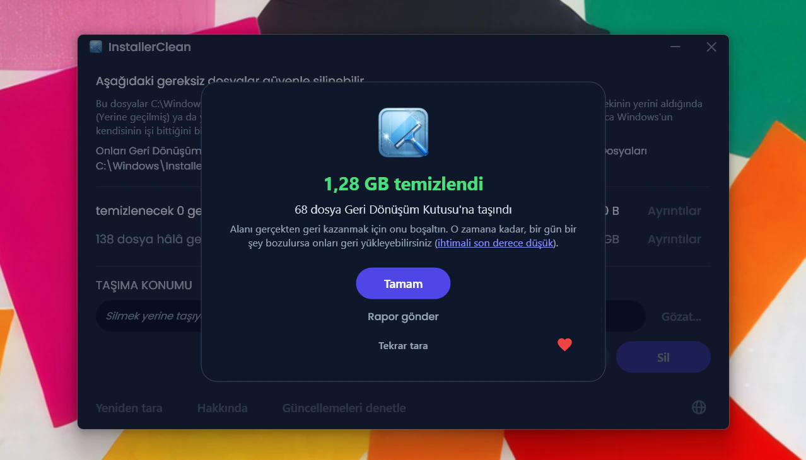
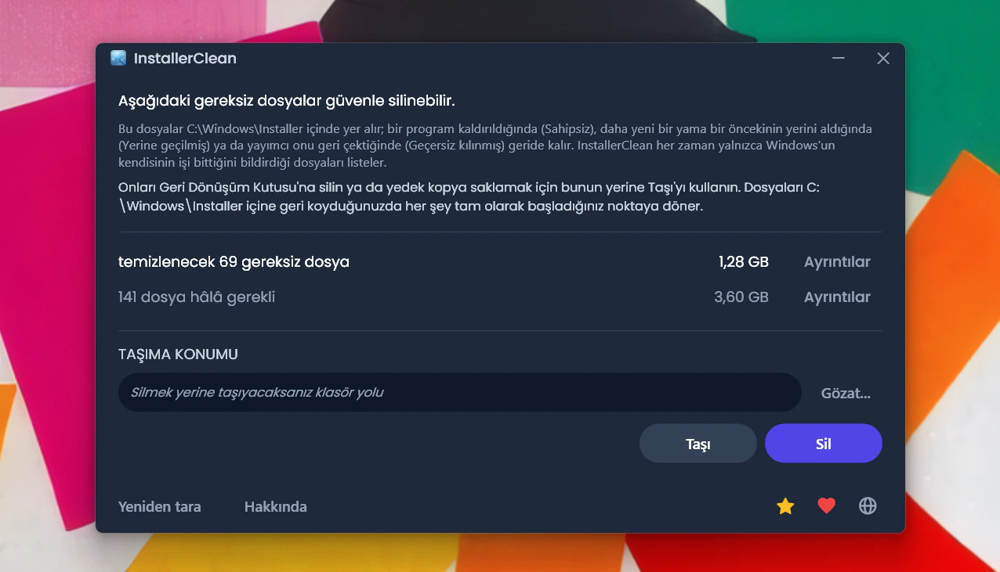
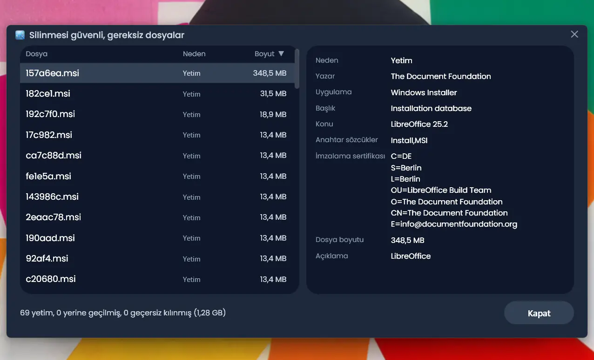
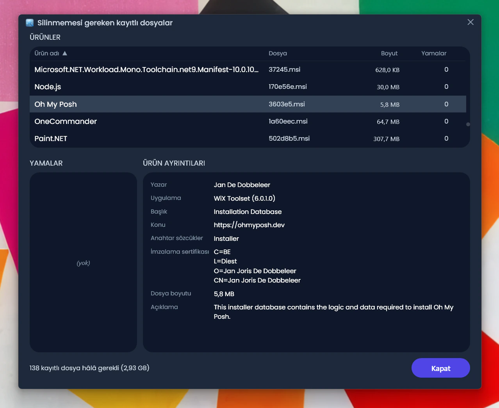
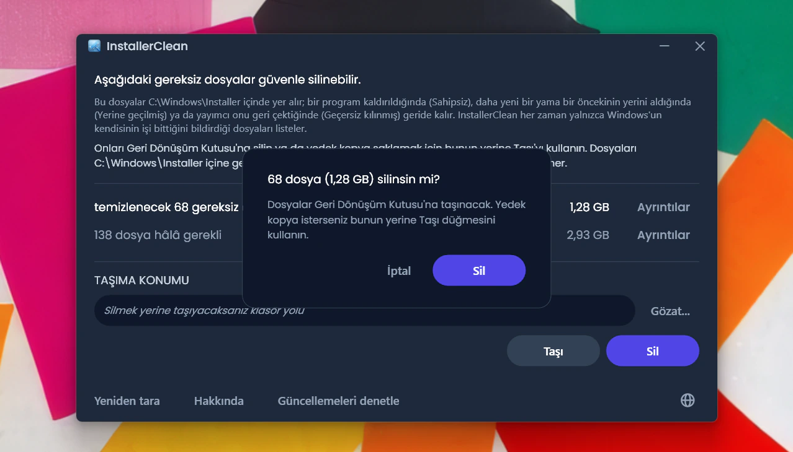
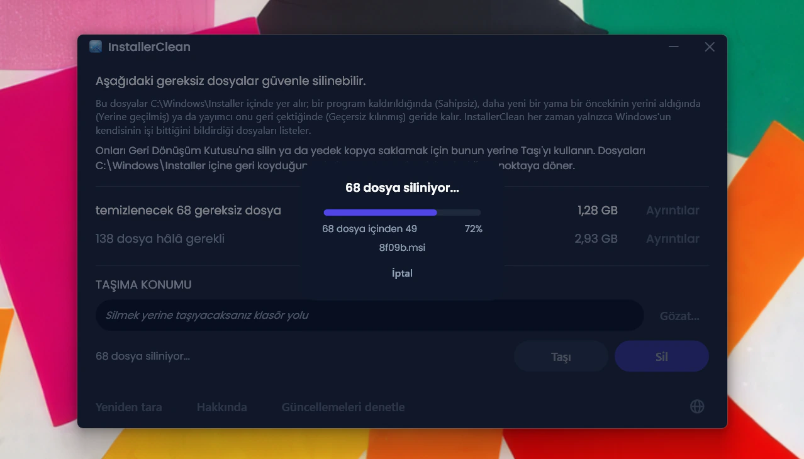
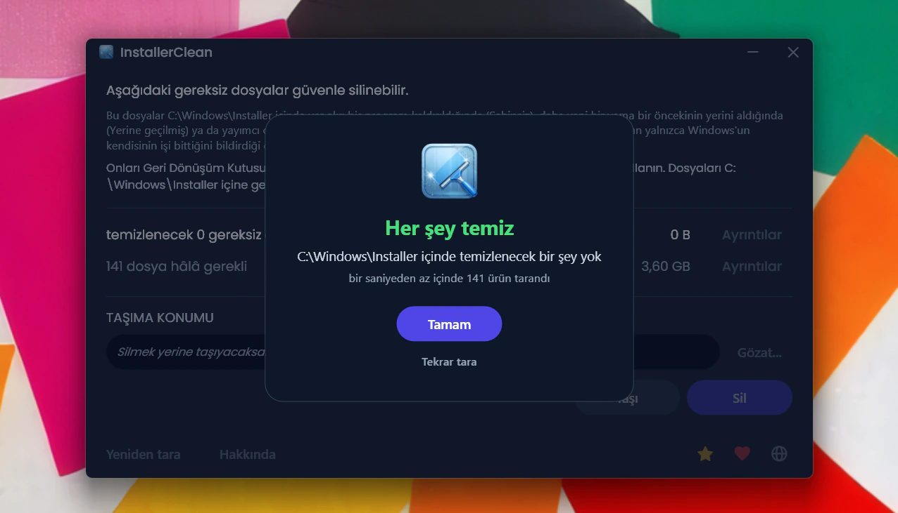
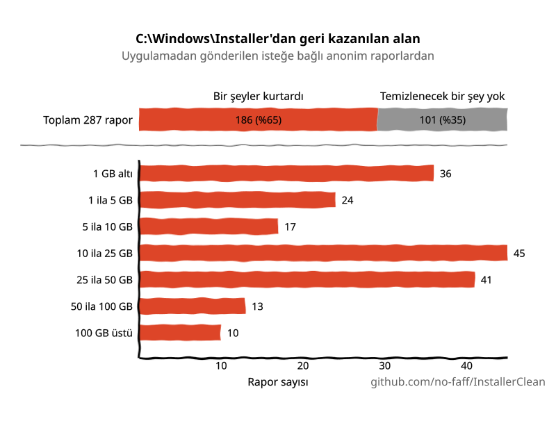

<p align="center">
  <a href="README.md">English</a> · <a href="README.zh-CN.md">简体中文</a> · <a href="README.ru.md">Русский</a> · <a href="README.es.md">Español</a> · <a href="README.ar.md">العربية</a> · <a href="README.ja.md">日本語</a> · <a href="README.pt-BR.md">Português (BR)</a> · <a href="README.pl.md">Polski</a> · <strong>Türkçe</strong> · <a href="README.ko.md">한국어</a> · <a href="README.fr.md">Français</a> · <a href="README.it.md">Italiano</a> · <a href="README.de.md">Deutsch</a> · <a href="README.id.md">Bahasa Indonesia</a> · <a href="README.vi.md">Tiếng Việt</a> · <a href="README.uk.md">Українська</a> · <a href="README.nl.md">Nederlands</a>
</p>

<p align="center">
  
</p>

<p align="center"><em>🎶 What's my line? I'm happy <a href="https://www.youtube.com/watch?v=HM-jHhUZfFI">cleaning Windows</a></em></p>

<h1 align="center">InstallerClean</h1>

<p align="center"><strong><code>C:\Windows\Installer</code> klasörünü, yani disk alanınızı sessizce yiyip bitiren gizli Windows klasörünü güvenle temizlemek için açık kaynaklı bir araç.</strong></p>

<p align="center"><em>Kırk yılda bir çalıştırın. Belki biraz yer açarsınız. Tertemiz, yolunuza devam edin.</em></p>

<p align="center">
  <a href="LICENSE"></a>
  <a href="https://dotnet.microsoft.com/download/dotnet/10.0"></a>
  <a href="https://github.com/no-faff/InstallerClean/actions/workflows/ci.yml"></a>
  <a href="https://github.com/no-faff/InstallerClean/releases"></a>
  <a href="https://github.com/no-faff/InstallerClean/releases/latest"></a>
  <a href="https://github.com/no-faff/InstallerClean/releases"></a>
</p>



- **Ne yapar:** InstallerClean tek bir iş yapar: Windows'un hiç temizlemediği gizli bir klasör olan `C:\Windows\Installer` içindeki gereksiz dosyaları kaldırır. Neredeyse anında biten bir taramanın ardından böyle dosyalarınız olup olmadığını size söyler, merak edenler için daha fazla ayrıntı gösterir ve C: sürücünüzde yer açmak için bunları silmenize olanak tanır. Bir kez kullanır, yolunuza devam edersiniz.
- **Buraya gelme nedeniniz belki de şu:** [WinDirStat](https://github.com/windirstat/windirstat), WizTree ya da TreeSize kullandınız, `C:\Windows\Installer`'ın çok yer kapladığını gördünüz ama içinde ne olduğunu bilmiyordunuz. InstallerClean tam da ihtiyacınız olan şey. `9f05cba.msi` gibi rastgele görünen adlı o dosyaların içinde ne olduğunu bilir ve hangilerini güvenle silebileceğinizi size hızlıca söyler.
- **Ne kadar yer:** Şimdiye dek gönderilen (isteğe bağlı ve anonim) raporlara göre, temizlenecek gereksiz dosyası bulunan makinelerin oranı <!-- reports-freedpct-start -->%56<!-- reports-freedpct-end -->. Bunlarda kurtarılan alanın ortancası <!-- reports-median-start -->19,4 GB<!-- reports-median-end --><!-- reports-biggest-start -->, en büyüğü ise koskoca 327 GB<!-- reports-biggest-end -->. Bende 1,28 GB çıktı. Geri kalan <!-- reports-nothingpct-start -->%44<!-- reports-nothingpct-end --> ise kaldıracak bir şey bulamadı; bu da yalnızca Installer klasörlerinin zaten temiz olduğu anlamına geliyor. Daha fazla ayrıntı aşağıdaki [SSS](#sss) bölümünde.
- **Güvenli mi:** Evet. Hangi dosyaların hâlâ gerekli olduğunu doğrudan Windows Installer API'sine sorar ve yalnızca Windows'un işi bittiğini bildirdiği dosyaları listeler. Açık kaynaklıdır (Apache 2.0) ve sizinle ilgili hiçbir şey sormaz: hesap yok, reklam yok, takip yok, telemetri yok, arka planda çalışan hiçbir şey yok. Kendiliğinden çevrimiçi olarak yaptığı tek şey, siz çalıştırdığınızda GitHub'da daha yeni bir sürüm olup olmadığına bakmaktır; bunu da kapatabilirsiniz.
- **Edinme:** [En son sürümü indirin](../../releases/latest). Çalıştırın; [“bilinmeyen yayımcı” uyarısına](#unknown-publisher) ve [yönetici istemine](#admin) tıklayıp geçin. Gereksiz dosyaları silin. Tamam.

## İçindekiler

- [Kimsenin size bahsetmediği klasör](#kimsenin-size-bahsetmediği-klasör)
- [Yardım arayışı](#yardım-arayışı)
- [Ne yapar](#ne-yapar)
- [Ekran görüntüleri](#ekran-görüntüleri)
- [Nasıl çalışır](#nasıl-çalışır)
- [Güvenli mi?](#güvenli-mi)
- [Kod imzalama politikası](#kod-imzalama-politikası)
- [C:\Windows\Installer'da eksik bir dosyanız varsa](#recovery)
- [Erişilebilirlik](#erişilebilirlik)
- [Neleri yapmaz](#neleri-yapmaz)
- [SSS](#sss)
- [İndirme](#indirme)
- [PatchCleaner ile karşılaştırma](#patchcleaner-ile-karşılaştırma)
- [Komut satırı](#komut-satırı)
- [Gereksinimler](#gereksinimler)
- [Kaynaktan derleme](#kaynaktan-derleme)
- [Katkıda bulunma](#katkıda-bulunma)
- [Projeyi destekleyin](#projeyi-destekleyin)
- [Yıldız geçmişi](#yıldız-geçmişi)
- [Lisans](#lisans)

---

## Kimsenin size bahsetmediği klasör

Her Windows bilgisayarında `C:\Windows\Installer` adlı gizli bir klasör vardır. Windows Installer sistemini kullanan bir yazılım her kurduğunuzda ya da Microsoft Office, Adobe Acrobat, Visual Studio veya `.msi` tabanlı başka bir uygulamaya bir yama uyguladığınızda, o yükleyicinin veya `.msp` yama dosyasının bir kopyası bu klasöre düşer ve orada kalır.

Yazılımı kaldırdığınızda dosyalar kalır. Daha yeni bir yama eskisinin yerini aldığında ikisi birden kalır. Windows onları hiç temizlemez. Disk Temizleme onlara dokunmaz. DISM ise bambaşka bir klasör içindir. Zamanla klasör büyür: 1 GB, 5 GB, 20 GB, 50 GB. MSI kullanan çok sayıda yazılımın olduğu makinelerde (Acrobat sık rastlanan bir suçludur) [100 GB'ı geçebilir](https://www.reddit.com/r/sysadmin/comments/1oxcrmh/acrobat_filling_up_the_cwindowsinstaller_folder/).

Bunlar kendiliğinden geri gelen geçici dosyalar değildir. Gerçek bir ölü yüktürler: yıllar önce kaldırdığınız yazılımlardan kalma eski yükleyiciler ve defalarca yerine yenisi gelmiş yamalar. Bir kez gittiklerinde geri gelmezler.

**Windows'ta disk alanı açmanın kolay bir yolunu arıyorsanız, bu klasör başlamak için iyi bir yer.** InstallerClean gereksiz dosyaları bulup güvenle kaldırır.

## Yardım arayışı

Bu klasörle ilgili daha önce hiç yardım aradıysanız, gidişatı muhtemelen bilirsiniz. `C:\Windows\Installer` klasöründe 180 GB olan biri nasıl temizleneceğini sorar. Ona [Disk Temizleme'yi çalıştırması söylenir](https://learn.microsoft.com/en-us/answers/questions/4238108/windows-installer-folder-has-occupied-180gb). Dener. 600 MB açar, hiçbiri o klasörden değil (çünkü Disk Temizleme `C:\Windows\Installer` klasörüne dokunmaz). Başlık sessizliğe gömülür.

> *“Bulduğum bütün başlıklar genelde sorunu çözmeyen aynı şeyleri öneriyor, sonra da ölüp gidiyor.”*
>
> [ksparks519, r/Windows10](https://www.reddit.com/r/Windows10/comments/1bt8c5p/anyone_ever_figure_out_giant_installer_folders/) (İngilizce orijinalinden çevrilmiştir)

Ya da hiç dokunmamaları söylenir. Bir başlıkta, 60 GB'lık bir Installer klasörü olan birine [“ona dokunma.”](https://www.reddit.com/r/techsupport/comments/1hw4suq/my_windows_installer_folder_is_like_60gb_so_i/) denmiş. Bunun yerine ne yapması gerektiğini sorduğunda ise yanıt şu olmuş: *“Az önce söyledim ya.”*

Sıradan tavsiyeler, dosyaları gelişigüzel silmeyi (ki bu gerçekten tehlikelidir) Windows'un kendisinin artık gerekmediğini söylediği dosyaları kaldırmakla (ki bu tehlikeli değildir) karıştırır. InstallerClean ikincisini yapar.

## Ne yapar

1. `C:\Windows\Installer` klasörünü `.msi` ve `.msp` dosyaları için **tarar**
2. Hangi dosyaların hâlâ kayıtlı olduğunu bulmak için Windows Installer API'sini **sorgular**
3. Ne kadar yer açabileceğinizi ve ne kadarının hâlâ gerekli olduğunu, her dosyayı listeleyen isteğe bağlı ayrıntı pencereleriyle **gösterir**
4. Gereksiz dosyaları **kaldırır**: Geri Dönüşüm Kutusu'na silin ya da seçtiğiniz bir klasöre taşıyın

## Ekran görüntüleri

<p>
  <br>
  <em>İlk tarama. Bu çok hızlıdır.</em>
  <br><br>
</p>

<p>
  <br>
  <em>Sonuçlar: ne kadarı hâlâ gerekli, ne kadarı kaldırılabilir.</em>
  <br><br>
</p>

<p>
  <br>
  <em>Artık gerekli olmayan dosyaların ayrıntıları.</em>
  <br><br>
</p>

<p>
  <br>
  <em>Hâlâ gerekli dosyaların, yükleyici veritabanından okunan meta verilerle birlikte ayrıntıları.</em>
  <br><br>
</p>

<p>
  <br>
  <em>Her iki işlemden önce onay. Sil, Geri Dönüşüm Kutusu'na taşır; Taşı, dosyaları seçtiğiniz bir yere koyar.</em>
  <br><br>
</p>

<p>
  <br>
  <em>Silme işlemi sürerken. İptal, işlemi yarıda durdurur.</em>
  <br><br>
</p>

<p>
  <br>
  <em>Başarılı bir Sil işleminin ardından.</em>
  <br><br>
</p>

<p>
  <br>
  <em>Yeniden tarandıktan sonra. Temizlenecek bir şey kalmadı.</em>
  <br><br>
</p>

## Nasıl çalışır

InstallerClean üç tür gereksiz dosya tanır.

**Yetim dosyalar**, bir yazılımı kaldırdıktan sonra geride kalan `.msi` yükleyicileridir (ve varsa `.msp` yamalarıdır). Windows artık onlara başvurmaz, ama dosyalar klasörde durup yer kaplar.

**Yerine yenisi gelen yamalar**, daha yenileri tarafından değiştirilmiş eski `.msp` yamalarıdır. Windows bunları kendi veritabanında yerine yenisi gelmiş olarak işaretler, ama hiç silmez. Bunun bu kadar sık karşımıza çıkmasının sebebi Adobe: her Acrobat güncellemesi kendi başına yeni bir yükleyici olarak değil, hep aynı asıl yükleyiciye uygulanan bir yama olarak çıkar; böylece makinede bugüne dek gelmiş her güncelleme için bir yama birikir. Office ve büyük geliştirme araçları da aynı şekilde birikir, sadece daha yavaş.

**Geçersiz kılınan yamalar**, yayımcının daha yeni bir sürümle değiştirmek yerine geri çektiği ya da kullanımdan kaldırdığı `.msp` yamalarıdır. Windows bu durumu da kaydeder ve dosyayı yine klasörde bırakır.

Bunları bulmak için InstallerClean, Windows Installer COM arabirimini doğrudan P/Invoke ile çağırır:

- Her kurulu ürünü saymak için `MsiEnumProductsEx`
- Her ürün için kayıtlı tüm yamaları bulmak için `MsiEnumPatchesEx`
- Yama durumunu (uygulanmış, yerine yenisi gelmiş veya geçersiz kılınmış) okumak için `MsiGetPatchInfoEx`

`C:\Windows\Installer` içindeki, kayıtlı bir ürüne ait olmayan her `.msi` veya `.msp` dosyası yetimdir ve kaldırılabilir olarak işaretlenir. Veritabanının yerine yenisi gelmiş ya da geçersiz kılınmış olarak işaretlediği ve kaldırma için gerekmeyen her yama da öyle.

Uygulama her taramada aynı kayıtları doğrudan kayıt defterinden de okur; bu ikinci, bağımsız bir kaynaktır. İki okumadan herhangi biri eksik dönerse (nadirdir, ama bozuk bir Installer durumunda olabilir), InstallerClean tahmin yürütmek yerine dosyaları geride tutar ya da taramayı reddeder. Bu ikinci okuma, dosyaları yalnızca “hâlâ gerekli” kümesine ekler, asla “kaldırılabilir” kümesine değil.

Bir Taşı veya Sil işlemi tamamlandıktan sonra, `C:\Windows\Installer` içindeki boş alt klasörler (önbelleğin, içeriği gittiğinde geride bıraktığı dizinler) aynı geçişte budanır.

<a id="is-it-safe"></a>
## Güvenli mi?

Evet. InstallerClean, Windows'un kurulu olanı izlemek için kendi kullandığı Windows Installer API veritabanını sorgular. Windows bir dosyanın artık gerekli olmadığını söylüyorsa, uygulama buna güvenir; dosya adlarına ya da tarihlere bakarak tahmin yürütmez.

**Sil ve Taşı hakkında.** InstallerClean'in sildiği dosyalar kalıcı olarak silinmesinde sakınca olmayan dosyalardır. **Sil** onları Geri Dönüşüm Kutusu'na taşır (kutu kullanılamıyorsa uyarılırsınız); Geri Dönüşüm Kutusu'nu boşalttığınızda C: sürücünüzdeki alanı geri kazanırsınız.

Yine de dosyaların silinmesinde sakınca olmadığına benim sözüme güvenmek zorunda değilsiniz. Dosyalar Geri Dönüşüm Kutusu'ndayken, bu klasörü kullanan uygulamaların (Office, Acrobat, Visual Studio ve benzerlerinin) hâlâ sorunsuz güncellenip kaldırıldığını kontrol etme fırsatınız olur. Bozulan bir şey bulursanız (ihtimali son derece düşük, üstelik <!-- downloads-start -->49.000+<!-- downloads-end --> indirmenin ardından bugüne dek bildirilmiş tek bir örnek yok), düzeltmek için dosyaları Geri Dönüşüm Kutusu'ndan geri yükleyin. Daha da güvende olmak için bunun yerine **Taşı**'yı kullanabilirsiniz; bu, dosyaları seçtiğiniz bir klasöre yedekler (C: sürücüsünde yer açmak istiyorsanız elbette başka bir bölümde/sürücüde bir klasör seçin). Her şeyi eskisi gibi geri almak için dosyaları `C:\Windows\Installer` klasörüne geri kopyalamanız yeterli (gerçi buna neredeyse kesinlikle hiç ihtiyacınız olmayacak). Bir dosyanın adına “(1)” eklenmişse (dosyaları aynı klasöre iki kez taşıdıysanız böyle olur), dosyayı geri kopyalamadan önce bunu kaldırın.

Windows Installer şu anda önbelleğe yazıyorsa, önceki bir işlemi askıya alınmışsa ya da önbelleği hedefleyen, yeniden başlatma sonrasına sıraya alınmış bir yeniden adlandırma varsa, Taşı ve Sil devre dışı kalır ve nedeni açıkça gösterilir.

Tarama, sorgulama, taşıma, silme, ayarlar ve bekleyen yeniden başlatma hizmetleri, her commit'te çalışan otomatik bir test paketiyle kapsanır (yukarıdaki CI rozetine bakın).

**İkili dosyayı doğrulama.** InstallerClean imzasızdır, ama güvenli olduğuna körü körüne inanmanız gerekmez:

- Her sürümün SHA-256 karmaları [sürümler sayfasında](../../releases/latest) listelenir.
- VirusTotal: her yapı taranır; her motordaki tam sonuçlar ilgili sürümün sayfasında bağlantılanır, böylece her dosyanın nasıl puanlandığını görebilir ve kendiniz yeniden tarayabilirsiniz. Bir sürüm çıkarken hâlâ etkin olan bir yanlış pozitif, o sürümün sayfasında adıyla belirtilir ve açıklanır; üretici geri çektiğinde de sayfa güncellenir.
- Kaynak kod [github.com/no-faff/InstallerClean](https://github.com/no-faff/InstallerClean) adresinde ve CI her commit'i derleyip test ediyor (yukarıdaki yeşil CI rozetine bakın).
- Sürüm yapıları deterministiktir: derleyici ayarları aynı kaynak kodun ve aynı SDK'nın hep aynı baytları üretmesini sağlar; ayrıca yayımlanan exe dosyaları tam o etiketteki temiz bir çalışma ağacından derlenmemişse yayım süreci o sürüme etiket koymayı reddeder. Yani o etikete geçip kendiniz derleyebilir, karmaları yayımlananlarla karşılaştırabilirsiniz: indirdiğiniz dosyanın herkese açık kaynak kodla eşleştiği böylece kanıtlanmış olur. Önce SDK sürümünü tutturun (her sürümün notlarında hangisiyle derlendiği yazar); farklı bir SDK yaması farklı baytlar üretir; bu, uyuşmazlık gibi görünür ama değildir.
- GitHub, MajorGeeks ve Softpedia üzerinden <!-- downloads-start -->49.000+<!-- downloads-end --> indirme.
- [MajorGeeks](https://www.majorgeeks.com/files/details/installerclean.html) her gönderimi bir sanal makinede test eder ve yalnızca incelemelerinden geçerse listeler.<br><a href="https://www.majorgeeks.com/files/details/installerclean.html"></a>
- [Softpedia](https://www.softpedia.com/get/System/Hard-Disk-Utils/InstallerClean.shtml) her sürümü virüs, casus yazılım ve reklam yazılımı için test eder.<br><a href="https://www.softpedia.com/get/System/Hard-Disk-Utils/InstallerClean.shtml"></a>

## Kod imzalama politikası

InstallerClean, ücretsiz kod imzalama için [SignPath Foundation](https://signpath.org)'a başvurdu; bu, açık kaynak yazılımları imzalayarak onların makinenize bilinmeyen bir yayımcıdan gelmesine son veren bir program. Başvuru henüz sonuçlanmadı, dolayısıyla buradaki indirmeler şimdilik imzasız ve Windows bunlar için uyarı verecek.

Kabul edilirse her sürüm, SignPath'in istediği şu satırı taşıyacak: “free code signing provided by SignPath.io, certificate by SignPath Foundation”. Sertifika bana değil vakfa ait, çünkü bir sertifikanın tüzel bir kişiliğe düzenlenmesi gerekir ve tek kişilik bir proje tüzel kişilik değildir. Bu, InstallerClean'in onlara ait olduğu ya da imzalamanın ötesinde projeye karıştıkları anlamına gelmez.

**Roller.** InstallerClean'i tek bir kişi, yani ben sürdürüyorum ve rollerin hepsi bende:

- Commit edenler ve gözden geçirenler, yani projeye kimin kod ekleyebileceği: ben. Her çekme isteği birleştirilmeden önce gözden geçirilir.
- Onaylayanlar, yani bir sürümün imzalanmasına kimin izin verebileceği: ben.

**Gizlilik.** Ne sizin hakkınızda ne de dosyalarınız hakkında hiçbir şey öğrenmiyorum; tamamen isteğe bağlı olan o anonim raporu göndermeyi kendiniz seçmediğiniz sürece, ki o rapor da bana yalnızca uygulamanın çalıştığını bildiriyor. Reklam yok, telemetri yok. Bunun dışındaki tek bağlantılar, uygulama açılırken yapılan sürüm denetimi (GitHub'a tek bir istek; Hakkında penceresinden kapatabilirsiniz) ve GitHub'a ve cömert hissederseniz bağış yapabileceğiniz bir sayfaya götüren düğmeler. [Gizlilik politikasının](PRIVACY.md) tamamı (İngilizce).

<a id="recovery"></a>
## C:\Windows\Installer'da eksik bir dosyanız varsa

InstallerClean yalnızca Windows'un kendisinin artık gerekmediğini bildirdiği dosyaları kaldırır, dolayısıyla bir dosyanın eksik olmasının nedeni asla o olamaz. Ama bir tanesi çoktan gitmişse, InstallerClean bunu fark eder ve işaretler. Çözümü şöyle.

O programın yükleyicisini üreticisinden indirin ve mevcut kurulumunuzun üzerine çalıştırın; önce kaldırmayın. Mümkünse şu an sahip olduğunuz sürümü kullanın, çünkü Windows farklı bir sürümü geri çevirebilir. Bu genellikle dosyayı yerine koyar ve ayarlarınıza dokunmaz. InstallerClean'de yeniden tarayın; işe yaradıysa uyarı kaybolacaktır.

Bu çoğunlukla işe yarar. Sonrasındaki, Microsoft'un kendi daha ayrıntılı açıklamasıdır: resmi ayrıntılar ve işin o kadar basit olmadığı daha zorlu durumlar. Hiçbiri InstallerClean'in işi değil ve Microsoft'un kılavuzunu geliştiremem, ben sadece aktarıyorum.

<details>
<summary>Microsoft'un daha ayrıntılı görüşü</summary>

*Aşağıdaki Microsoft alıntıları İngilizce orijinalindedir.*

Tam kılavuz: [Restore missing Windows Installer cache files](https://learn.microsoft.com/en-us/troubleshoot/windows-client/application-management/missing-windows-installer-cache).

*Sorun hemen ortaya çıkmayabilir:*
> "If the installer cache is compromised, you may not immediately see problems until you take an action such as uninstalling, repairing, or updating a product."

*Dosyalar her makineye özgüdür, bu yüzden başka bir bilgisayardan kopyalayamazsınız:*
> "Missing files cannot be copied between computers because the files are unique."

*Dosyayı yalnızca bir yedekten de geri alamazsınız:*
> "To restore the missing files, a full system state restoration is required. It is not possible to replace only the missing files from a previous backup."

*Önerilen kurtarma yöntemi ve onun açık sınırları:*
> "If application files are missing from the Windows Installer Cache, ask the vendor or support team for the application about the missing files. You must follow the procedures or steps recommended by the application vendor to restore the files. In some cases, you may have to rebuild the operating system and reinstall the application to fix the problem."
>
> "Windows support engineers cannot help you recover missing application files from the Windows Installer cache."

*Aynı sürümün neden önemli olduğu:*
> "The upgrade cannot be installed by the Windows Installer service because the program to be upgraded may be missing, or the upgrade may update a different version of the program."

</details>

## Erişilebilirlik

InstallerClean, tümüyle klavyeden ve bir ekran okuyucusuyla kullanılabilecek şekilde yapılmıştır.

- **Baştan sona klavyeyle kullanılabilir.** Sekme tuşu her denetime ulaşır ve ayrıntı pencerelerinin sütunları klavyeden sıralanır, dolayısıyla burada hiçbir şey fare gerektirmez. Klavye odağı, nereye giderse gitsin görünür kalır.
- **Ekran Okuyucusu ve Sesli erişim.** Her denetim etiketlidir ve bir düğmenin üzerinde görünen sözcük, onu sesle çalıştıran sözcüktür. Bir Taşı veya Sil işlemi bittiğinde sonuç sesli okunur.
- **Okunmak için yapıldı.** Metin, koyu temanın her yerinde WCAG AA kontrastını karşılar.

Burada bir şey size engel oluyorsa, [bir konu açın](../../issues). Erişilebilirlik sorunları uç durumlar değil, hatalardır.

## Neleri yapmaz

- WinSxS (`C:\Windows\WinSxS`) farklı kurallara sahip farklı bir klasördür. Onun için, yükseltilmiş bir komut isteminden `Dism /Online /Cleanup-Image /StartComponentCleanup` komutunu çalıştırın.
- Arka plan hizmeti yok, zamanlanmış görev yok, otomatik temizlik yok. Uygulama yalnızca siz başlattığınızda çalışır.
- Yüklü programlarınızı ya da Windows Installer veritabanını değiştirmez, yalnızca okur. Kayıt defterine yazdığı tek şey, komut satırı aracının çalıştırmalarının Windows Olay Günlüğü'nde görünebilmesi için ihtiyaç duyduğu tek seferlik olay kaynağı kaydıdır.
- Kendiliğinden kurduğu tek bir bağlantı türü var: siz çalıştırdığınızda GitHub'ın sürümler sayfasında daha yeni bir sürüm olup olmadığına hızlıca bakması; bunu Hakkında penceresinden kapatabilirsiniz. Geri kalan her şey yalnızca siz söylediğinizde olur: isteğe bağlı anonim rapor (yalnızca çalıştığını bana bildirmek için) ve GitHub belgelerine ve bir bağış sayfasına giden, tıklarsanız tarayıcınızda açılan bağlantılar. Kendi başına hiçbir şey indirmez.
- Araç çubuğu yok, paketlenmiş yazılım yok, reklam yazılımı yok.

## SSS

<a id="reports-stats"></a>
**Gerçekten GB'larca yer açar mıyım?** Bu makinenize bağlı. Ek yazılımı olmayan temiz bir Windows 11 kurulumunda kaldırılacak bir şey yoktur. Uzun süredir kullanılan bir geliştirici iş istasyonu ya da çok sayıda MSI tabanlı yazılımı (Acrobat, Office, LibreOffice, büyük geliştirme araçları) olan herhangi bir makine, onlarca GB barındırabilir. Her hâlükârda, çalıştırdığınız anda tam olarak ne kadar olduğunu görürsünüz.

<!-- reports-stats-start (generated; do not hand-edit between these markers) -->
v1.8.0'dan beri sonucu kısa ve anonim bir raporla gönderme seçeneği var. Şimdiye dek 162 rapor geldi (herkese teşekkürler 🙏); temizlenecek bir şeyi olan makinelerin oranı %56 ve bunlarda kurtarılan alanın ortancası 19,4 GB. Bir makine tam tamına 327 GB geri kazandı. Sonuçların özeti şöyle.

<p align="center">
  <picture>
    <source media="(prefers-color-scheme: dark)" srcset="docs/reports-tr-dark.svg" />
    <source media="(prefers-color-scheme: light)" srcset="docs/reports-tr-light.svg" />
    
  </picture>
</p>

Rapor göndermek, uygulamada bir düğmeye basmaktan ibaret ve tamamen isteğe bağlı. İçinde kişisel hiçbir şey yok; gönderilecek olanı size aynen gösterir, şöyle:


<!-- reports-stats-end -->

<a id="admin"></a>

**Neden Yönetici istiyor?** `C:\Windows\Installer` yöneticilere kilitlidir. Onu okumak, Installer veritabanını sorgulamak ve dosyaları taşımak ya da silmek için bunların hepsi gereklidir, dolayısıyla uygulama yönetici olarak çalışmak zorundadır.

<a id="unknown-publisher"></a>

**Windows neden “Bilinmeyen yayımcı” diyor?** InstallerClean kod imzalı değil ve Windows internetten indirilen dosyaları işaretliyor; bu yüzden ilk çalıştırmada Windows SmartScreen genellikle “Windows kişisel bilgisayarınızı korudu” gösterir ve yayımcıyı bilinmeyen olarak listeler. Ücretli bir imzalama sertifikası her yıl para tutar ve ben bunun için ödeme yapmaktansa uygulamayı ücretsiz tutmayı yeğliyorum; bu yüzden açık kaynak yazılımları karşılıksız imzalayan SignPath Foundation'a başvurdum (bkz. [Kod imzalama politikası](#kod-imzalama-politikası)). O sonuçlanana kadar **Ek bilgi**'ye, ardından **Yine de çalıştır**'a tıklayın. Bunu yapmak güvenlidir: kaynak kod herkese açık ve her sürümde önceden kontrol edebileceğiniz VirusTotal bağlantıları ve SHA-256 karmaları var.

**Bir Sil işlemini geri alabilir miyim?** Genellikle, evet. Sürücü için Geri Dönüşüm Kutusu kullanılabilir olduğunda Sil dosyaları oraya taşır ve onları kutudan geri yükleyebilirsiniz. Kutu kullanılamıyorsa, uygulama kendi başına asla kalıcı olarak silmez (bkz. [Güvenli mi?](#güvenli-mi)). Ve denetimi sizde olan bir geri dönüş yolu isterseniz, Taşı dosyaları seçtiğiniz bir klasöre koyar; içiniz rahat ettiğinde onları oradan silersiniz.

**Bu dosyaları kaldırırsam Windows şikâyet eder mi?** Hayır. InstallerClean her zaman yalnızca Windows'un kendisinin işi bittiğini bildirdiği dosyaları kaldırır, dolayısıyla kaldırdığı hiçbir şey bir programı onarmak, güncellemek ya da kaldırmak için gerekli değildir. Başka bir yolla `C:\Windows\Installer` klasöründen gerekli bir dosya gerçekten eksilirse, [C:\Windows\Installer'da eksik bir dosyanız varsa](#recovery) bölümüne bakın.

**Neden `Win32_Product` (WMI) yok?** [`Win32_Product`, sayım sırasında her üründe MSI onarım işlemlerini tetikler](https://gregramsey.net/2012/02/20/win32_product-is-evil/), bu da dakikalar sürebilir ve diski ağır yükleyebilir. InstallerClean, Windows Installer COM API'sini hiçbir yan etki olmadan doğrudan çağırır.

**Neden basitçe bir PowerShell betiği değil?** `MsiEnumPatchesEx` çağıran kısa bir betik yamaları *listelemeye* yeter, ama InstallerClean'in yük taşıyan parçaları bir betiğin geçiştirdiği yerlerdir: yetim-mi-yoksa-yerine-yenisi-mi-gelmiş sınıflandırması, dosyaları yalnızca “hâlâ gerekli” kümesine ekleyen (asla “kaldırılabilir” kümesine değil) kayıt defteri yedeği, bekleyen yeniden başlatma engeli, başka bir yere taşıma güvenlik ağı, iptal edilebilen dosya başına ilerleme ve kalıcı-silme-yerine-Geri-Dönüşüm-Kutusu varsayılanı. Çok sayıda MSI barındıran gerçek makinelerdeki uç durumlar (bozuk kayıtlar, önbellek içindeki bağlantılar, `HKU\.DEFAULT` içindeki ürünler, askıya alınmış Installer işlemleri) gelişigüzel bir betikte kolayca yanlış ele alınır. `installerclean-cli`, istediğiniz şey betik yazmaksa, arayüzsüz yüzdür.

**Windows 7 veya 8'de çalışır mı?** Test edilmedi ve desteklenmiyor. Windows 10 ve 11 hedeflenir.

**RMM / toplu dağıtım için uygun mu?** Evet. CLI, sonuca göre ayrı kodlarla çıkar (0 başarı, 2 kısmi, 1 ağır başarısızlık, 75 geçici, herhangi bir dosya işlenmeden önce bir Ctrl+C için 130; toplu işin ortasına denk gelen bir Ctrl+C ise 2 ile çıkar, çünkü iş yapılmıştır), böylece zamanlanmış bir görev, ağır başarısızlıklarla karıştırmadan 75'te yeniden deneyebilir. Her çalıştırma için Uygulama olay günlüğüne bir özet yazar ve GUI ile aynı tek örnek muteksine uyar. Kurulum da Inno Setup'ın standart anahtarlarıyla (`/SILENT` veya `/VERYSILENT`) sessizce kurulur; sessiz kurulumlarda kurulum sonrası başlatma atlanır. Komut satırı bölümüne bakın.

<a id="indirme"></a>
## İndirme

Üç yapı, birini seçin:

- **Kurulum** (`InstallerClean-2.3.0-setup.exe`): .NET 10 çalışma zamanı paketlenmiş, sıradan bir Windows yükleyicisi. Başlat menüsüne bir giriş ekler ve temizce kaldırılır. Programların arasına yerleştirilir, böylece altı ay sonra bulması kolay olur.
- **Taşınabilir** (`InstallerClean-2.3.0-portable.exe`): çalışma zamanı paketlenmiş, tek bir kendi kendine yeten exe. Kurulum yok, kaldırıcı yok. Çalıştırın, kullanın, silin. Ne zaman isterseniz tekrar çalıştırın.
- **CLI** (`installerclean-cli.exe`): komut satırı sürümü tek başına, tek bir kendi kendine yeten exe. Kurulum yok, sonrasında makinede hiçbir şey kalmaz. Bir istemciye bırakın, bir tarama ya da temizlik çalıştırın, silin. Betik yazma, zamanlanmış görevler ve istemcide bir masaüstü uygulaması olmadan işlemleri istediğiniz toplu dağıtım için yapıldı. Argümanlar ve çıkış kodları için [Komut satırı](#komut-satırı) bölümüne bakın.

2.2.0'dan itibaren kurulum ve taşınabilir sürümlerin dosya adları sürüm numarasını taşıyor, böylece indirilen bir kopya ne olduğunu her zaman söylüyor; komut satırı aracı ise sade `installerclean-cli.exe` adını koruyor, ki ona işaret eden zamanlanmış görevler ve betikler güncellemeler boyunca çalışmayı sürdürsün.

[Sürümler sayfasından](../../releases/latest) indirin, sonra çalıştırın. İmzasızdır, dolayısıyla Windows “bilinmeyen yayımcı” uyarısı gösterir; [SSS](#unknown-publisher) ne göreceğinizi ve neden güvenli olduğunu açıklar.

Uygulama başlangıçta otomatik tarar. Sonuçları gözden geçirin, sonra **Sil** ya da **Taşı**'ya tıklayın.

Ya da [winget](https://learn.microsoft.com/windows/package-manager/winget/) ile kurun:

```
winget install NoFaff.InstallerClean
```

Ya da [Scoop](https://scoop.sh) ile kurun:

```
scoop install installerclean
```

## PatchCleaner ile karşılaştırma

Bu klasörü daha önce arattıysanız, büyük olasılıkla karşınıza çıkmış olan araç [PatchCleaner](https://www.homedev.com.au/free/patchcleaner) olacaktır. Hâlâ gayet iyi gidiyor, ama InstallerClean'i yaptım çünkü PatchCleaner kapalı kaynaklı, Mart 2016'dan beri güncelleme almadı ve varsayılan olarak Adobe ürünlerine dokunmuyor. Yetim denetimi Adobe'nin yamalarını yanlışlıkla işaretliyordu ve onları kaldırmak Adobe'nin güncellemelerini bozuyordu, bu yüzden filtreyi kapatmadıkça tüm Adobe dosyalarını rahat bırakıyor. Adobe'nin en büyük suçlu olduğu makinelerde ise alanın çoğu orada:

> *“Yetim `.msp` dosyalarını silmek için Patchcleaner'ı indirdim, ama görünüşe göre bu yalnızca 250 MB yer açacakmış. Dosyaların 29 GB'ı ‘filtreler tarafından hariç tutulmuş’, yani Patchcleaner pek işe yaramıyor gibi.”*
>
> HeatherBunny1111, [r/techsupport](https://www.reddit.com/r/techsupport/comments/1qc4tcf/how_to_delete_msp_files_safely/) (İngilizce orijinalinden çevrilmiştir)

InstallerClean, Windows Installer'ın kendi yama kayıtlarını okur; dolayısıyla bütün Adobe dosyalarını toptan bir filtrenin arkasına saklamak yerine, Windows'un yerine yenisi geldi diye işaretlediği yamaları ayırt eder ve tam olarak öyle etiketler. İkisi şöyle karşılaştırılır:

| | **InstallerClean** | **PatchCleaner** |
|---|---|---|
| Son güncelleme | 2026 (etkin) | 3 Mart 2016 |
| Kaynak kod | Açık kaynak (Apache 2.0) | Kapalı kaynak |
| Çalışma zamanı | .NET 10 (kendi kendine yeten) | .NET + VBScript |
| API | Windows Installer COM (süreç içi) | Windows Installer COM (VBScript ile süreç dışı) |
| Yerine yenisi gelen yama algılama | Var | Yok |
| Adobe işleme | Yerine yenisi gelen yamaları algılar | Varsayılan olarak hariç tutar |
| Arayüz | Koyu tema (WPF) | Windows Forms |
| Veri toplama | Yok | Yok |
| Silme güvenliği | Geri Dönüşüm Kutusu. Kullanılamıyorsa, sorar: bunun yerine taşı ya da kalıcı olarak sil | Kalıcı, Geri Dönüşüm Kutusu yok |

> **`Win32_Product` hakkında bir not:** Kurulu ürünleri listelemek için yaygın ama bozuk olan yaklaşım, sayım sırasında [her üründe MSI onarım işlemlerini tetikleyen](https://gregramsey.net/2012/02/20/win32_product-is-evil/) `Win32_Product` (WMI) yaklaşımıdır. Hem InstallerClean hem de PatchCleaner ondan kaçınır. İkisi de Windows Installer COM arabirimini kullanır. PatchCleaner'ın betiğindeki `WMIProducts.vbs` dosya adı yanıltıcıdır; betik WMI değil, MSI COM kullanır.

[Ultra Virus Killer (UVK)](https://www.carifred.com/uvk/) de System Booster modülünün bir parçası olarak Installer temizliği sunar, ama bu ücretli bir araçtır (15-25 USD) ve temizlik, çok daha büyük bir uygulamanın içindeki küçük bir özelliktir. InstallerClean ücretsiz, odaklı ve açık kaynaklıdır.

[CCleaner](https://www.ccleaner.com/) ve [BleachBit](https://www.bleachbit.org/) gibi genel amaçlı sistem temizleyiciler `C:\Windows\Installer` klasörüne dokunmaz. Bu klasör, kayıtlı paketleri gereksizlerinden ayırmak için Windows Installer API sorguları gerektirir ve yalnızca dosya ağacında gezinen genel bir temizleyici kurulu uygulamaları bozabilir. InstallerClean, gerçekten temizlenmesini istediğiniz klasör bu olduğunda başvuracağınız araçtır.

## Komut satırı

InstallerClean, betik yazma ve sistem yöneticisi kullanımı için arayüzsüz çalışmayı destekler:

```
Kullanım:
  installerclean-cli --help     Bu yardımı göster (/?, -h de kabul edilir)
  installerclean-cli --version  Sürümü yazdır (-v de kabul edilir)
  installerclean-cli /s         Yalnızca tara - gereksiz dosyaları listele
  installerclean-cli /d         Gereksiz dosyaları sil (Geri Dönüşüm Kutusu)
  installerclean-cli /m         Kayıtlı varsayılan konuma taşı
  installerclean-cli /m YOL     Belirtilen yola taşı
```

GUI'yi başlatmak için `InstallerClean.exe` çalıştırın (ya da kurulumdan gelen Başlat menüsü kısayolunu kullanın).

`installerclean-cli` argümansız ya da tanınmayan bir bayrakla çalıştırılırsa, bu kullanımı yazdırır ve `1` ile çıkar, böylece bayrağını düşüren zamanlanmış bir görev, hiçbir şey yapmadan sessizce “başarılı olmak” yerine görünür biçimde başarısız olur. Açık bir `--help`, `/?` veya `-h` aynı kullanımı yazdırır ve `0` ile çıkar.

`/s` bir deneme çalıştırmasıdır: tarar, kaldıracağı şeyleri dosya adları ve boyutlarıyla listeler, sonra çıkar. Temizlikten önce denetlemek için kullanışlıdır. Çıkış kodu başarılı bir taramada `0`, tarama başarısız olursa `1` ve Ctrl+C'de `130`'dur. Tüm dosyalar `C:\Windows\Installer` içindedir.

`/d` ve `/m` tarar ve ardından harekete geçer. `/d` kaldırılabilir dosyaları Geri Dönüşüm Kutusu'na taşır. `/m` onları bir klasöre taşır (ya komut satırında belirttiğiniz birine, ya da GUI'den kaydedilmiş varsayılana). Kaydedilen bu varsayılan, kullanıcı başına saklanır, dolayısıyla SYSTEM ya da bir hizmet hesabı olarak çalışan zamanlanmış bir görev onu göremez; bu tür çalıştırmaların klasörü `/m PATH` ile açıkça belirtmesi gerekir. Çıkış kodları: tam başarı için `0`, kısmi için `2` (bazı dosyalar başarılı, bazıları başarısız), tam başarısızlık için `1` (tarama başarısız, hatalı argümanlar ya da toplu işteki her dosya başarısız), çalıştırmayı engelleyen geçici bir durum için `75` (yazdırılan ileti hangisi olduğunu ve yeniden denemenin yardımcı olup olmayacağını açıklar), herhangi bir dosya işlenmeden önce bir Ctrl+C için `130` (toplu işin ortasına denk gelen bir Ctrl+C, iş yapıldığından `2` ile, yani kısmi olarak çıkar).

CLI'nin tüm çıktısı, hata ve tanılama iletileri dahil, stdout'a gider; ayrı bir stderr akışı yoktur. Çıkış kodu makinece okunabilen sinyaldir (ve çalıştırma başına Uygulama olay günlüğü girişi onu yansıtır), dolayısıyla bir betik metni ayrıştırmak yerine çıkış koduna göre hareket etmelidir ve `installerclean-cli /s > audit.txt` varsa herhangi bir hata satırı dahil çalıştırmanın tamamını yakalar.

Üçü de yükseltilmiş (yönetici) bir komut istemi gerektirir. Bir Grup İlkesi UAC yükseltme istemini engellerse, süreç başlamayı reddeder ve Windows üst kabuğa 740 hatası döndürür (PowerShell'de `$LASTEXITCODE = 740`). `taskkill /pid <pid>` düzgün bir iptal tetiklemez; tek örnek muteksi, AbandonedMutexException yolu üzerinden bir sonraki çalıştırma tarafından kurtarılır.

### Düzenli bir temizliği zamanlama

Düzenli aralıklarla temizlemek için Görev Zamanlayıcı'yı `installerclean-cli`'ye yönlendirin. Onu SYSTEM olarak ya da bir hizmet hesabıyla ve en yüksek ayrıcalıklarla çalıştırın ki etkileşimli bir istem olmadan ihtiyaç duyduğu yükseltmeyi alsın; taşıma hedefini de komut satırında verin, çünkü GUI'den kaydedilen varsayılan kullanıcı başına saklanır ve SYSTEM ya da hizmet hesabı çalıştırmalarında geçerli olmaz. CLI'nin bir kopyası `C:\Tools` içindeyken `D:\InstallerBackup` klasörüne aylık taşıma şöyle görünür:

```
schtasks /create /tn "InstallerClean monthly" /tr "C:\Tools\installerclean-cli.exe /m D:\InstallerBackup" /sc monthly /ru SYSTEM /rl highest
```

Görev, çalıştırma bitene kadar bloke olur ve çıkış kodunu Son Çalıştırma Sonucu olarak kaydeder; böylece RMM'iniz de yukarıdaki kodlara (`0` tam başarı, `2` kısmi, `75` geçici, `1` tam başarısızlık) tıpkı bir betiğin yapacağı gibi dayanabilir.

### Neden `installerclean-cli`, `installerclean.exe` değil?

`InstallerClean.exe` WPF GUI'sidir; komut satırı argümanlarına yanıt vermez. `installerclean-cli.exe`, aynı kurulum dizininde bulunan ve aynı tarama / taşıma / silme işlemlerini PowerShell, cmd ve zamanlanmış görevlere sunan ayrı bir konsol yürütülebilir dosyasıdır. Gerçek bir konsol süreci olduğundan, bitene kadar istemi bloke eder; çıktısını diğer her konsol exe'sinde olduğu gibi yönlendirin ya da bir boruyla aktarın.

Taşınabilir indirme yalnızca GUI exe'sini içerir. Komut satırını GUI olmadan istiyorsanız, `installerclean-cli.exe` dosyasını [sürümler sayfasından](../../releases/latest) indirip doğrudan çalıştırın. Kurulum da onu GUI ile birlikte kurar.

## Gereksinimler

- Windows 10 (sürüm 1607 / derleme 14393 veya üzeri, .NET 10 çalışma zamanının desteklediği en eskisi) ya da Windows 11
- Yönetici ayrıcalıkları (`C:\Windows\Installer` yalnızca yöneticilere açıktır)

Kurulum, taşınabilir ve CLI yapı seçenekleri için [İndirme](#indirme) bölümüne bakın.

## Kaynaktan derleme

```
git clone https://github.com/no-faff/InstallerClean.git
cd InstallerClean
dotnet build src/InstallerClean.sln
```

Testleri çalıştırın:

```
dotnet test src/InstallerClean.Tests/
```

## Katkıda bulunma

Bir hata mı buldunuz ya da bir öneriniz mi var? [Bir konu açın](../../issues) ya da bir [tartışma](../../discussions) başlatın. Çekme istekleri memnuniyetle karşılanır. Lütfen göndermeden önce `dotnet test` çalıştırın.

InstallerClean artık baştan sona Türkçe: uygulama, kurulum, komut satırı ve bu README. Bunların hepsi elimden gelenin en iyisi olan makine çevirileri; kusursuz olmayacaklar, bu yüzden anadili Türkçe olan birinin gözden geçirmesini beklemek yerine oldukları gibi yayımladım. Geliştirilebilecek bir şey fark ederseniz, bir [konu](../../issues/new?template=translation_review.md), bir çekme isteği ya da bir tartışma yoluyla bana iletmenizden memnuniyet duyarım. Uygulama varsayılan olarak Windows dilinizde açılır; küre simgesiyle istediğiniz zaman İngilizceye geçebilirsiniz.

## Projeyi destekleyin

InstallerClean işinize yaradıysa, [No Faff'ı desteklemeyi](https://nofaff.netlify.app/support) ya da GitHub'da bir yıldız bırakmayı düşünün.

## Yıldız geçmişi

<picture>
  <source media="(prefers-color-scheme: dark)" srcset="docs/star-history-dark.svg" />
  <source media="(prefers-color-scheme: light)" srcset="docs/star-history-light.svg" />
  
</picture>

## Lisans

[Apache 2.0](LICENSE)

---

🎶 [George Formby - When I'm Cleaning Windows](https://www.youtube.com/watch?v=P183Uo5Ust4). Keyfini çıkarın!
