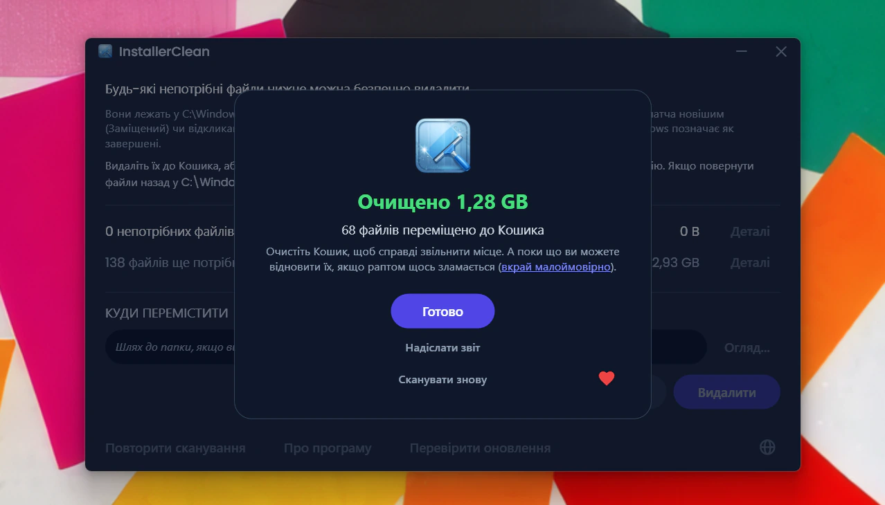
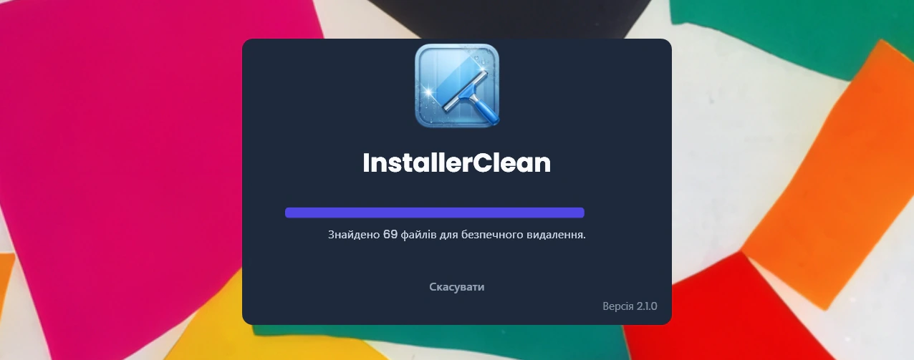
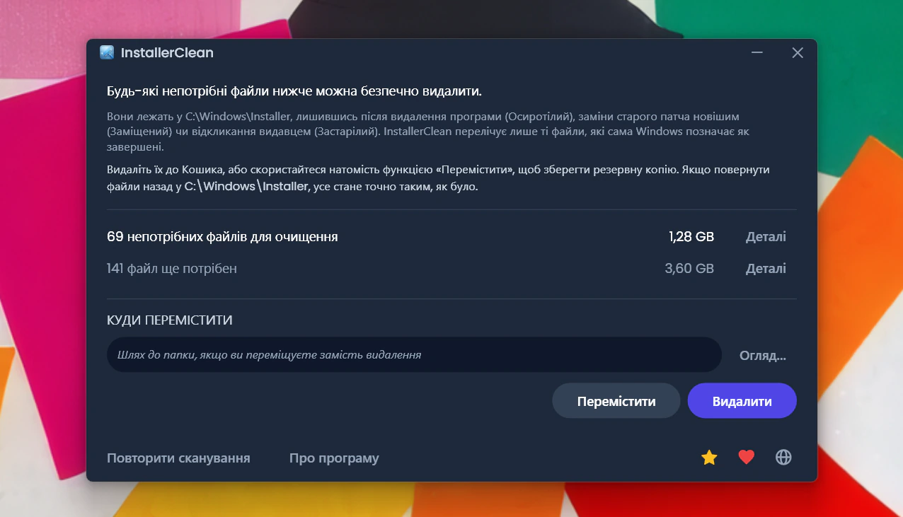
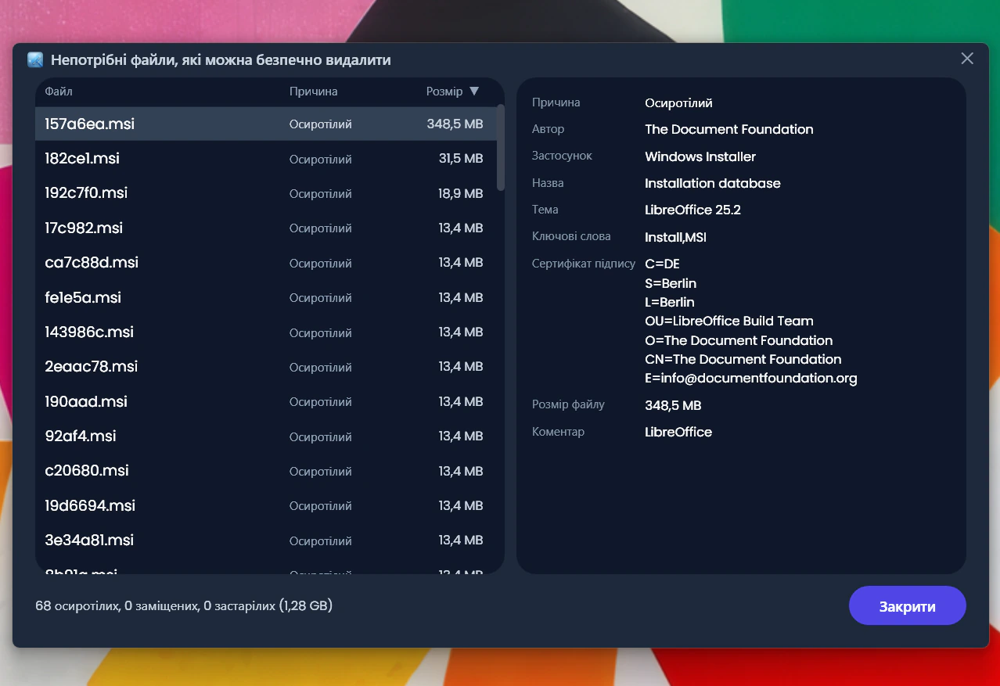
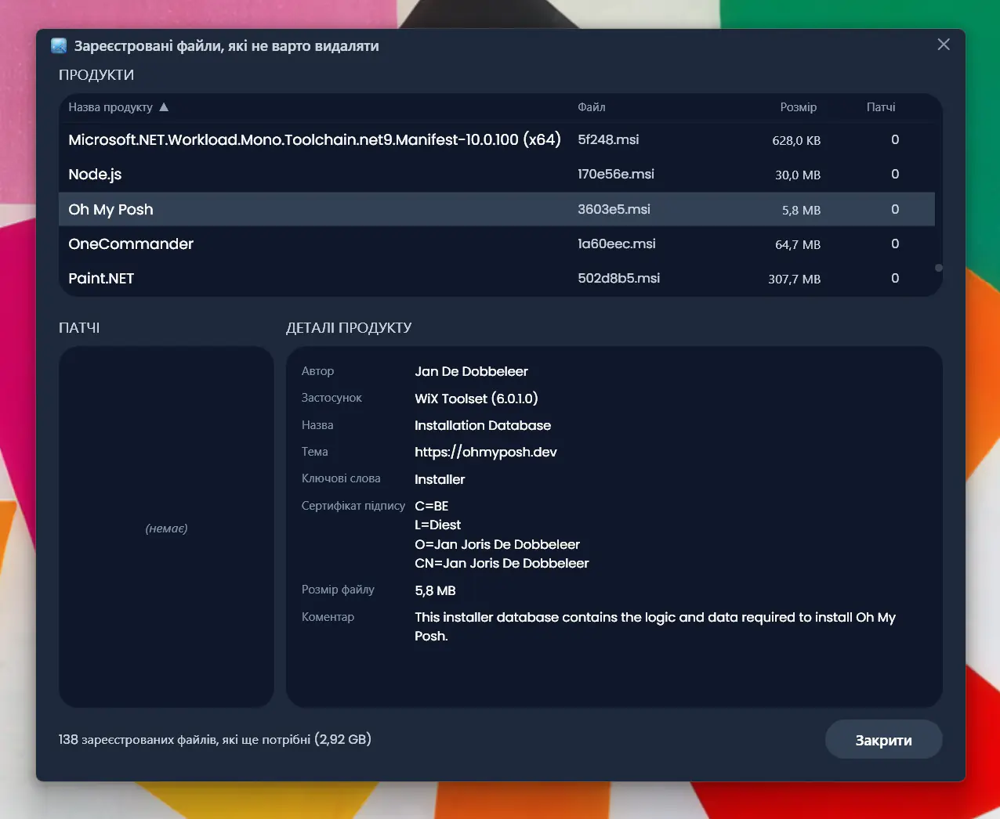
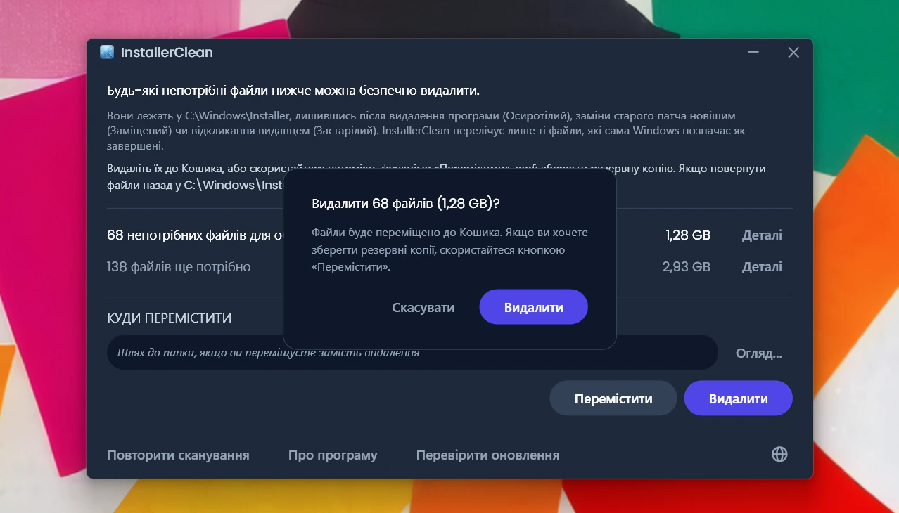
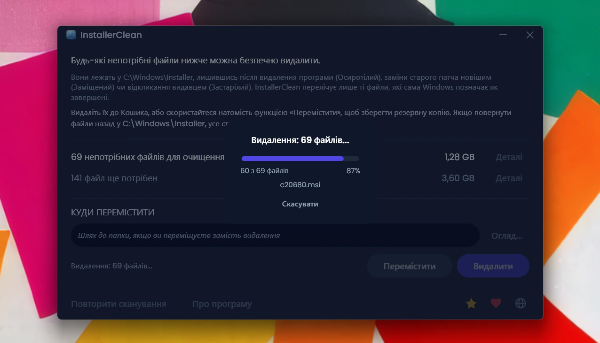
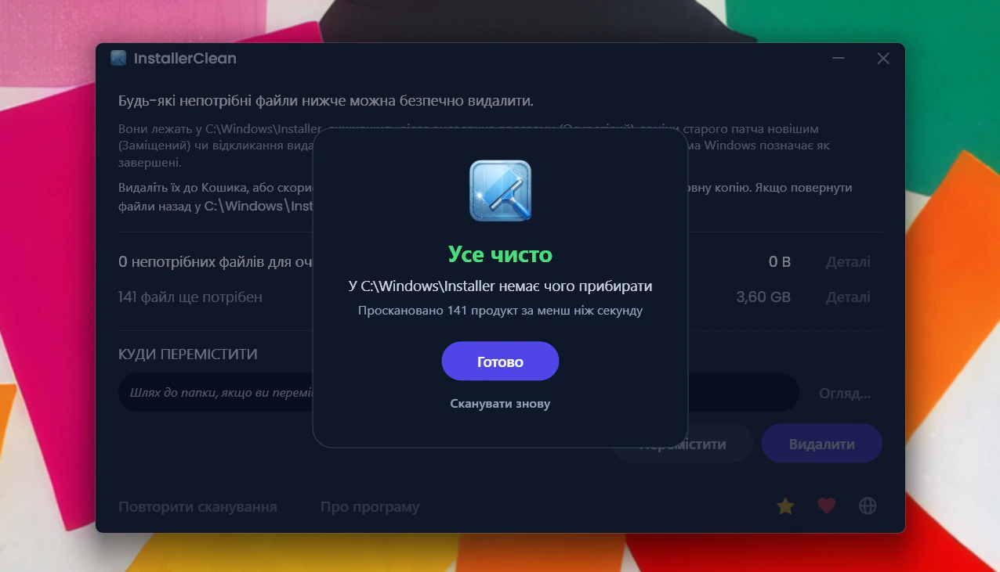
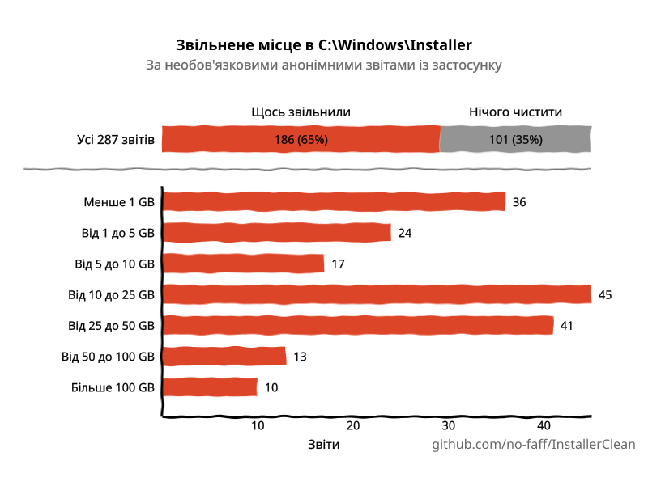

<p align="center">
  <a href="README.md">English</a> · <a href="README.zh-CN.md">简体中文</a> · <a href="README.ru.md">Русский</a> · <a href="README.es.md">Español</a> · <a href="README.ar.md">العربية</a> · <a href="README.ja.md">日本語</a> · <a href="README.pt-BR.md">Português (BR)</a> · <a href="README.pl.md">Polski</a> · <a href="README.tr.md">Türkçe</a> · <a href="README.ko.md">한국어</a> · <a href="README.fr.md">Français</a> · <a href="README.it.md">Italiano</a> · <a href="README.de.md">Deutsch</a> · <a href="README.id.md">Bahasa Indonesia</a> · <a href="README.vi.md">Tiếng Việt</a> · <strong>Українська</strong> · <a href="README.nl.md">Nederlands</a>
</p>

<p align="center">
  
</p>

<p align="center"><em>🎶 What's my line? I'm happy <a href="https://www.youtube.com/watch?v=HM-jHhUZfFI">cleaning Windows</a></em></p>

<h1 align="center">InstallerClean</h1>

<p align="center"><strong>Інструмент з відкритим кодом для безпечного очищення <code>C:\Windows\Installer</code>, прихованої папки Windows, яка тихцем з'їдає місце на вашому диску.</strong></p>

<p align="center"><em>Запускайте вряди-годи. Може, звільните трохи місця. Рушайте далі, чисто й легко.</em></p>

<p align="center">
  <a href="LICENSE"></a>
  <a href="https://dotnet.microsoft.com/download/dotnet/10.0"></a>
  <a href="https://github.com/no-faff/InstallerClean/actions/workflows/ci.yml"></a>
  <a href="https://github.com/no-faff/InstallerClean/releases"></a>
  <a href="https://github.com/no-faff/InstallerClean/releases/latest"></a>
  <a href="https://github.com/no-faff/InstallerClean/releases"></a>
</p>



- **Що це:** InstallerClean робить одну річ: видаляє непотрібні файли з `C:\Windows\Installer`, прихованої папки, яку Windows ніколи не очищає. Після майже миттєвого сканування воно повідомляє, чи є у вас такі файли, показує більше деталей для допитливих і дає змогу видалити їх, щоб звільнити місце на диску C:. Ви запускаєте його один раз і йдете далі.
- **Можливо, ви тут ось чому:** ви скористалися [WinDirStat](https://github.com/windirstat/windirstat), WizTree чи TreeSize, побачили, як багато місця займає `C:\Windows\Installer`, і не знали, що там усередині. InstallerClean — це саме те, що вам потрібно. Воно знає, що міститься в тих файлах із випадковими на вигляд іменами на кшталт `9f05cba.msi`, і швидко підкаже, які з них можна безпечно видалити.
- **Скільки місця:** Надіслані досі (необов'язкові й анонімні) звіти показують, що <!-- reports-freedpct-start -->64%<!-- reports-freedpct-end --> машин мали непотрібні файли для очищення. Серед них медіана звільненого — <!-- reports-median-start -->16,8 GB<!-- reports-median-end --><!-- reports-biggest-start -->, а на одній машині звільнилося цілих 462 GB<!-- reports-biggest-end -->. Решта <!-- reports-nothingpct-start -->36%<!-- reports-nothingpct-end --> не знайшли чого видаляти, що просто означає, що їхня папка Installer уже була чистою. Докладніше у [FAQ](#faq) нижче.
- **Чи це безпечно:** Так. Воно запитує саму Windows Installer API, які файли ще потрібні, і перелічує лише ті, які Windows позначає як завершені. Це відкритий код (Apache 2.0), і воно нічого про вас не питає: без облікового запису, без реклами, без стеження, без телеметрії, нічого не працює у фоні. Єдине, що воно робить в інтернеті з власної ініціативи, — під час запуску перевіряє на GitHub, чи немає новішої версії, і це можна вимкнути.
- **Звідки взяти:** [Завантажте найновіший реліз](../../releases/latest). Запустіть; пройдіть через [попередження про «невідомого видавця»](#unknown-publisher) і [запит на права адміністратора](#admin). Видаліть усі непотрібні файли. Готово.

## Зміст

- [Папка, про яку вам ніхто не розповідає](#папка-про-яку-вам-ніхто-не-розповідає)
- [Пошук допомоги](#пошук-допомоги)
- [Що воно робить](#що-воно-робить)
- [Знімки екрана](#знімки-екрана)
- [Як це працює](#як-це-працює)
- [Чи це безпечно?](#чи-це-безпечно)
- [Політика підписування коду](#політика-підписування-коду)
- [Якщо у вас усе ж бракує файлу в C:\Windows\Installer](#recovery)
- [Доступність](#доступність)
- [Чого воно не робить](#чого-воно-не-робить)
- [FAQ](#faq)
- [Завантаження](#завантаження)
- [Порівняння з PatchCleaner](#порівняння-з-patchcleaner)
- [Командний рядок](#командний-рядок)
- [Вимоги](#вимоги)
- [Збирання з вихідного коду](#збирання-з-вихідного-коду)
- [Внесок](#внесок)
- [Підтримати проєкт](#підтримати-проєкт)
- [Історія зірок](#історія-зірок)
- [Ліцензія](#ліцензія)

---

## Папка, про яку вам ніхто не розповідає

На кожному ПК з Windows є прихована папка з назвою `C:\Windows\Installer`. Щоразу, коли ви встановлюєте програму, яка використовує систему Windows Installer, або застосовуєте патч до Microsoft Office, Adobe Acrobat, Visual Studio чи будь-якого іншого застосунку на основі `.msi`, копія того інсталятора або файлу патча `.msp` потрапляє до цієї папки, і лишається там.

Коли ви видаляєте програму, файли лишаються. Коли новіший патч заміщує старіший, лишаються обидва. Windows ніколи їх не прибирає. Очищення диска їх не чіпає. DISM призначений для зовсім іншої папки. З часом папка росте: 1 GB, 5 GB, 20 GB, 50 GB. На машинах із великою кількістю програм на основі MSI (Acrobat, частий винуватець) вона може [перевищити 100 GB](https://www.reddit.com/r/sysadmin/comments/1oxcrmh/acrobat_filling_up_the_cwindowsinstaller_folder/).

Це не тимчасові файли, що повертаються самі собою. Це справжній мертвий вантаж: старі інсталятори програм, які ви видалили багато років тому, і патчі, замінені вже по кілька разів. Щойно вони зникають, назад не повертаються.

**Якщо ви шукаєте простий спосіб звільнити місце на диску у Windows, ця папка, гарне місце, щоб почати.** InstallerClean знаходить непотрібні файли й безпечно їх прибирає.

## Пошук допомоги

Якщо ви колись шукали допомоги з цією папкою, то, мабуть, знаєте, як це буває. Хтось зі 180 GB у `C:\Windows\Installer` запитує, як її очистити. Йому [радять запустити Очищення диска](https://learn.microsoft.com/en-us/answers/questions/4238108/windows-installer-folder-has-occupied-180gb). Він пробує. Воно звільняє 600 MB, жодного з тієї папки (бо Очищення диска не чіпає `C:\Windows\Installer`). Гілка стихає.

> *«Усі гілки, які я знаходив, зазвичай радять те саме, що не вирішує проблеми, а потім завмирають.»*
>
> [ksparks519, r/Windows10](https://www.reddit.com/r/Windows10/comments/1bt8c5p/anyone_ever_figure_out_giant_installer_folders/) (перекладено з англійського оригіналу)

Або ж їм радять взагалі її не чіпати. В одній гілці комусь із папкою Installer на 60 GB сказали [«не чіпай її»](https://www.reddit.com/r/techsupport/comments/1hw4suq/my_windows_installer_folder_is_like_60gb_so_i/). Коли він запитав, що ж робити натомість, відповідь була: *«Я ж тобі щойно сказав».*

Звичайна порада плутає видалення файлів навмання (що справді небезпечно) з прибиранням файлів, які сама Windows вважає більше не потрібними (що небезпеки не несе). InstallerClean робить друге.

## Що воно робить

1. **Сканує** `C:\Windows\Installer` у пошуках файлів `.msi` та `.msp`
2. **Запитує** Windows Installer API, щоб з'ясувати, які файли ще зареєстровані
3. **Показує**, скільки можна звільнити й скільки ще потрібно, з необов'язковими вікнами деталей, що перелічують кожен файл
4. **Прибирає** непотрібні файли: видалити до Кошика або перемістити в обрану вами папку

## Знімки екрана

<p>
  <br>
  <em>Початкове сканування. Це дуже швидко.</em>
  <br><br>
</p>

<p>
  <br>
  <em>Результати: скільки ще потрібно, скільки можна прибрати.</em>
  <br><br>
</p>

<p>
  <br>
  <em>Деталі файлів, які більше не потрібні.</em>
  <br><br>
</p>

<p>
  <br>
  <em>Деталі файлів, які ще потрібні, з метаданими, прочитаними з бази даних інсталятора.</em>
  <br><br>
</p>

<p>
  <br>
  <em>Підтвердження перед будь-якою дією. «Видалити» переміщує до Кошика; «Перемістити» кладе файли в обране вами місце.</em>
  <br><br>
</p>

<p>
  <br>
  <em>Видалення триває. «Скасувати» зупиняє його на півдорозі.</em>
  <br><br>
</p>

<p>
  <br>
  <em>Після успішного видалення.</em>
  <br><br>
</p>

<p>
  <br>
  <em>Після повторного сканування. Прибирати більше нічого.</em>
  <br><br>
</p>

## Як це працює

InstallerClean розрізняє три види непотрібних файлів.

**Осиротілі файли** — це інсталятори `.msi` (та будь-які патчі `.msp`), що лишаються після видалення програм. Windows на них більше не посилається, але файли лежать у папці й займають місце.

**Заміщені патчі** — це старі патчі `.msp`, на зміну яким прийшли новіші. Windows позначає їх як заміщені у власній базі даних, але ніколи не видаляє. Так часто це трапляється саме через Adobe: кожне оновлення Acrobat виходить як патч до того самого початкового інсталятора, а не як окремий новий інсталятор, тож на машині осідає по патчу на кожне оновлення, яке вона отримала за весь час. Office і великі інструменти розробки накопичуються так само, лише повільніше.

**Застарілі патчі** — це патчі `.msp`, які видавець відкликав або визнав застарілими, а не замінив новішою версією. Windows фіксує і цей стан, і так само лишає файл у папці.

Щоб знайти їх, InstallerClean звертається до COM-інтерфейсу Windows Installer безпосередньо через P/Invoke:

- `MsiEnumProductsEx`, щоб перелічити кожен встановлений продукт
- `MsiEnumPatchesEx`, щоб знайти всі зареєстровані патчі для кожного продукту
- `MsiGetPatchInfoEx`, щоб прочитати стан патча (застосований, заміщений чи застарілий)

Будь-який файл `.msi` чи `.msp` у `C:\Windows\Installer`, який не належить жодному зареєстрованому продукту, є осиротілим і позначається як такий, що його можна видалити. Так само й будь-який патч, який база даних позначає як заміщений чи застарілий і який не потрібен для видалення.

Під час кожного сканування програма читає ті самі записи ще й безпосередньо з реєстру — це друге, незалежне джерело. Якщо будь-яке з двох читань повертається неповним (рідко, але таке трапляється за пошкодженого стану інсталятора), InstallerClean притримує файли або відмовляється від сканування, а не вгадує. Це друге читання лише додає файли до набору «ще потрібних», ніколи до набору «тих, що можна видалити».

Після завершення переміщення чи видалення порожні підпапки в `C:\Windows\Installer` (каталоги, які кеш лишає по собі, коли їхній вміст зник) прибираються в тому самому проході.

<a id="is-it-safe"></a>
## Чи це безпечно?

Так. InstallerClean запитує ту саму базу даних Windows Installer API, яку сама Windows використовує, щоб відстежувати встановлене. Якщо Windows каже, що файл більше не потрібен, програма їй довіряє; вона не вгадує за іменами файлів чи датами.

**Про видалення та переміщення.** Файли, які InstallerClean видаляє, можна безпечно видалити назавжди. **Видалити** переміщує їх до Кошика (вас попередять, якщо він недоступний); місце на диску C: ви отримуєте назад, коли спорожнюєте Кошик.

Утім, вам не обов'язково вірити мені на слово, що файли безпечно видаляти. Поки вони в Кошику, ви маєте змогу перевірити, що програми, які користуються цією папкою, Office, Acrobat, Visual Studio тощо, і далі оновлюються та видаляються без проблем. Якщо ви виявите, що щось зламалося (вкрай малоймовірно, і після <!-- downloads-start -->63 000+<!-- downloads-end --> завантажень поки що не надійшло жодного повідомлення), відновіть файли з Кошика, щоб це виправити. Щоб бути геть спокійним, можна натомість скористатися кнопкою **Перемістити**, аби зробити резервну копію файлів у папці на ваш вибір (звісно, оберіть папку на іншому розділі чи диску, якщо хочете звільнити місце на C:). Просто скопіюйте файли назад до `C:\Windows\Installer`, щоб повернути все як було (хоча вам майже напевно ніколи це не знадобиться). Якщо в назві файлу з'явилося «(1)» (так буває, якщо перемістити файли до тієї самої папки двічі), приберіть його, перш ніж копіювати файл назад.

Якщо Windows Installer саме зараз пише в кеш, має призупинену попередню транзакцію або поставлене в чергу перейменування після перезавантаження, націлене на кеш, переміщення та видалення вимикаються, і показується конкретна причина.

Служби сканування, запиту, переміщення, видалення, налаштувань і перевірки очікуваного перезавантаження покриті автоматизованим набором тестів, який виконується на кожен коміт (див. значок CI вище).

**Перевірка двійкового файлу.** InstallerClean не підписано, але вам не доведеться вірити на слово, що це безпечно:

- Хеші SHA-256 для кожного релізу наведено на [сторінці релізів](../../releases/latest).
- VirusTotal: кожну збірку скановано, а повні результати за кожним рушієм пов'язано зі сторінкою відповідного релізу, тож ви можете побачити, як оцінено кожен файл, і повторно перевірити його самостійно. Хибне спрацювання, чинне на момент виходу релізу, називають і пояснюють на сторінці того релізу, а коли виробник його скасовує, сторінку оновлюють.
- Вихідний код на [github.com/no-faff/InstallerClean](https://github.com/no-faff/InstallerClean), а CI збирає й тестує кожен коміт (див. зелений значок CI вище).
- Релізні збірки детерміновані: налаштування компілятора роблять так, що той самий вихідний код і той самий SDK дають ті самі байти, а процес випуску відмовляється ставити тег на версію, якщо оприлюднені exe зібрано не з чистого робочого дерева саме на цьому тегу. Тож ви можете перемкнутися на тег, зібрати все самотужки й звірити хеші з оприлюдненими: це доказ, що завантажений файл відповідає відкритому вихідному коду. Спершу візьміть ту саму версію SDK (у примітках до кожного релізу зазначено, з яким його зібрано); інший патч SDK дає інші байти, і це виглядає як розбіжність, хоча нею не є.
- <!-- downloads-start -->63 000+<!-- downloads-end --> завантажень через GitHub, MajorGeeks і Softpedia.
- [MajorGeeks](https://www.majorgeeks.com/files/details/installerclean.html) перевіряє кожну подачу у віртуальній машині й додає її до каталогу лише після проходження перевірки.<br><a href="https://www.majorgeeks.com/files/details/installerclean.html"></a>
- [Softpedia](https://www.softpedia.com/get/System/Hard-Disk-Utils/InstallerClean.shtml) перевіряє кожен реліз на віруси, шпигунське та рекламне ПЗ.<br><a href="https://www.softpedia.com/get/System/Hard-Disk-Utils/InstallerClean.shtml"></a>

## Політика підписування коду

InstallerClean подав заявку до [SignPath Foundation](https://signpath.org) на безкоштовне підписування коду. Це програма, яка підписує програмне забезпечення з відкритим кодом, щоб воно перестало потрапляти на ваш комп'ютер від невідомого видавця. Заявка на розгляді, тож поки що файли тут не підписані й Windows попереджатиме про них.

Якщо її схвалять, кожен реліз нестиме рядок, про який просить SignPath: «free code signing provided by SignPath.io, certificate by SignPath Foundation». Сертифікат належить фондові, а не мені, бо сертифікат мусить бути виданий юридичній особі, а проєкт однієї людини нею не є. Це не означає, що InstallerClean їхній або що вони причетні до нього поза підписуванням.

**Ролі.** InstallerClean веде одна людина, я, і всі вони на мені:

- Ті, хто вносить код, і ті, хто його рецензує, тобто хто може додавати код до проєкту, — це я. Кожен pull request проходить перевірку перед злиттям.
- Ті, хто затверджує, тобто хто може дозволити підписати реліз, — це я.

**Приватність.** Я не дізнаюся нічого ні про вас, ні про ваші файли, хіба що ви самі вирішите надіслати той цілком необов'язковий анонімний звіт, який лише дає мені знати, що все працює. Ні реклами, ні телеметрії. Єдині інші з'єднання — це перевірка версії під час запуску програми (один запит до GitHub, який можна вимкнути у вікні «Про програму») і кнопки з посиланнями на GitHub та на сторінку, де можна зробити пожертву, якщо вам того захочеться. Повна [політика приватності](PRIVACY.md) (англійською).

<a id="recovery"></a>
## Якщо у вас усе ж бракує файлу в `C:\Windows\Installer`

InstallerClean видаляє лише ті файли, які сама Windows позначає як більше не потрібні, тож воно ніколи не може бути причиною того, що файл зник. Але якщо якийсь уже зник, InstallerClean помічає це й попереджає вас. Ось як це виправити.

Завантажте інсталятор тієї програми в її виробника та запустіть його поверх наявної інсталяції; не видаляйте програму спершу. Якщо можете, використайте ту версію, що у вас зараз, бо Windows може відхилити іншу. Зазвичай це повертає файл на місце й не чіпає ваші налаштування. Проскануйте в InstallerClean ще раз, і якщо спрацювало, попередження зникне.

Зазвичай це працює. Далі йде власний, докладніший виклад Microsoft: офіційні подробиці та складніші випадки, коли все не так просто. Нічого з цього не спричинене InstallerClean, і я не можу покращити настанови Microsoft, тож просто передаю їх вам.

<details>
<summary>Докладніша позиція Microsoft</summary>

*Наведені нижче цитати Microsoft подано в англійському оригіналі.*

Повний посібник: [Restore missing Windows Installer cache files](https://learn.microsoft.com/en-us/troubleshoot/windows-client/application-management/missing-windows-installer-cache).

*Це може проявитися не одразу:*
> "If the installer cache is compromised, you may not immediately see problems until you take an action such as uninstalling, repairing, or updating a product."

*Файли унікальні для кожного комп'ютера, тож скопіювати потрібний з іншого ПК не вийде:*
> "Missing files cannot be copied between computers because the files are unique."

*Витягнути лише цей файл із резервної копії теж не можна:*
> "To restore the missing files, a full system state restoration is required. It is not possible to replace only the missing files from a previous backup."

*Рекомендований спосіб відновлення і його суворі межі:*
> "If application files are missing from the Windows Installer Cache, ask the vendor or support team for the application about the missing files. You must follow the procedures or steps recommended by the application vendor to restore the files. In some cases, you may have to rebuild the operating system and reinstall the application to fix the problem."
>
> "Windows support engineers cannot help you recover missing application files from the Windows Installer cache."

*Чому важлива та сама версія:*
> "The upgrade cannot be installed by the Windows Installer service because the program to be upgraded may be missing, or the upgrade may update a different version of the program."

</details>

## Доступність

InstallerClean створено так, щоб ним можна було повністю користуватися з клавіатури та з програмою зчитування з екрана.

- **Повне керування з клавіатури.** Клавіша Tab дістається до кожного елемента керування, а стовпці у вікнах із деталями сортуються з клавіатури, тож тут нічого не потребує миші. Фокус клавіатури лишається видимим, хоч би де він опинявся.
- **Екранний диктор і Голосовий доступ.** Кожен елемент керування має підпис, а видиме слово на кнопці — це те саме слово, яке активує її голосом. Коли переміщення чи видалення завершується, результат озвучується вголос.
- **Зроблено для читання.** Текст відповідає контрастності WCAG AA в усій темній темі.

Якщо щось тут вам заважає, [створіть issue](../../issues). Проблеми з доступністю — це помилки, а не граничні випадки.

## Чого воно не робить

- WinSxS (`C:\Windows\WinSxS`) — це інша папка з іншими правилами. Для неї запустіть `Dism /Online /Cleanup-Image /StartComponentCleanup` з командного рядка з підвищеними правами.
- Жодної фонової служби, жодного запланованого завдання, жодного автоочищення. Програма працює тоді, коли ви її запускаєте.
- Вона не змінює ні встановлені програми, ні базу даних Windows Installer, а лише читає їх. Єдине, що вона взагалі записує до реєстру, — це одноразова реєстрація джерела подій, потрібна інструменту командного рядка, щоб його запуски з'являлися в журналі подій Windows.
- Сама, без вашої участі, вона встановлює лише один вид з'єднання: під час запуску швидко дивиться на сторінці релізів GitHub, чи немає новішої версії, і це можна вимкнути у вікні «Про програму». Усе інше відбувається лише тоді, коли ви цього забажаєте: необов'язковий анонімний звіт (просто щоб я знав, що вона працює) і посилання на документацію в GitHub та сторінку пожертв, які відкриваються у вашому браузері, якщо ви на них натиснете. Сама вона нічого не завантажує.
- Жодних панелей інструментів, жодного стороннього ПЗ у комплекті, жодного рекламного ПЗ.

## FAQ

<a id="reports-stats"></a>
**Чи справді я звільню гігабайти місця?** Залежить від вашої машини. Чиста інсталяція Windows 11 без додаткових програм не має чого видаляти. Робоча станція розробника з тривалим стажем або будь-яка машина з великою кількістю програм на основі MSI (Acrobat, Office, LibreOffice, великі інструменти розробки) може мати десятки GB. Хай там як, ви побачите точну кількість тієї ж миті, щойно її запустите.

<!-- reports-stats-start (generated; do not hand-edit between these markers) -->
Починаючи з v1.8.0 можна надіслати короткий анонімний звіт про результат. Наразі надійшло 236 (дякуємо всім 🙏), і серед тих 64% машин, яким було що почистити, медіана звільненого — 16,8 GB. На одній машині звільнилося аж 462 GB. Ось зведення результатів.

<p align="center">
  <picture>
    <source media="(prefers-color-scheme: dark)" srcset="docs/reports-uk-dark.svg" />
    <source media="(prefers-color-scheme: light)" srcset="docs/reports-uk-light.svg" />
    
  </picture>
</p>

Надіслати звіт — це одне натискання кнопки в застосунку, і це цілком на ваш розсуд. Нічого особистого в ньому немає, а перед надсиланням вам показують саме те, що піде, ось так:


<!-- reports-stats-end -->

<a id="admin"></a>

**Чому вона вимагає прав адміністратора?** `C:\Windows\Installer` закрита для всіх, крім адміністраторів. Читання папки, запит до бази даних інсталятора, переміщення чи видалення файлів, усе це потребує таких прав, тож програма мусить працювати від імені адміністратора.

<a id="unknown-publisher"></a>

**Чому Windows каже «Невідомий видавець»?** InstallerClean не має цифрового підпису, а Windows позначає файли, завантажені з інтернету, тож під час першого запуску Windows SmartScreen зазвичай показує «Система Windows захистила ваш комп'ютер», а видавця подає як невідомого. Платний сертифікат для підписання щороку коштує грошей, і я радше залишу програму безкоштовною, ніж платитиму за нього, тож я подав заявку до SignPath Foundation, яка підписує програмне забезпечення з відкритим кодом безкоштовно (див. [Політику підписування коду](#політика-підписування-коду)). Поки її не схвалено, натисніть **Докладніше**, а потім **Виконати в будь-якому випадку**. Це безпечно: вихідний код відкритий, і кожен реліз має посилання на VirusTotal та хеші SHA-256, які можна перевірити заздалегідь.

**Чи можна скасувати видалення?** Зазвичай так. Коли Кошик доступний для диска, «Видалити» переміщує файли туди, і ви можете відновити їх із Кошика. Якщо Кошик недоступний, програма ніколи не видаляє назавжди сама собою (див. [Чи це безпечно?](#чи-це-безпечно)). А якщо ви волієте мати контрольований вами шлях назад, «Перемістити» кладе файли в обрану вами папку; видаляйте їх звідти, коли будете певні.

**Чи скаржитиметься Windows, якщо я приберу ці файли?** Ні. InstallerClean прибирає лише ті файли, які сама Windows позначає як завершені, тож ніщо з прибраного не потрібне для відновлення, оновлення чи видалення програми. Якщо потрібний файл усе ж зникне з `C:\Windows\Installer` якимось іншим чином, див. [Якщо у вас усе ж бракує файлу в C:\Windows\Installer](#recovery).

**Чому не `Win32_Product` (WMI)?** [`Win32_Product` запускає операції відновлення MSI для кожного продукту під час перелічення](https://gregramsey.net/2012/02/20/win32_product-is-evil/), що може тривати хвилини й сильно навантажувати диск. InstallerClean звертається до Windows Installer COM API безпосередньо, без побічних ефектів.

**Чому б не просто скрипт PowerShell?** Короткого скрипта, що викликає `MsiEnumPatchesEx`, досить, щоб *перелічити* патчі, але несучі частини InstallerClean — це саме те, що скрипт оминає: класифікація «осиротілий проти заміщеного», запасне читання реєстру, яке лише додає файли до набору «ще потрібних» (ніколи до «тих, що можна видалити»), блокування за очікуваного перезавантаження, страхувальна сітка переміщення в інше місце, поетапний поступ для кожного файлу з можливістю скасування та усталений вибір Кошика замість остаточного видалення. Граничні випадки на реальних машинах із великою кількістю MSI (пошкоджені реєстрації, з'єднання-junction усередині кеша, продукти в `HKU\.DEFAULT`, призупинені транзакції інсталятора) легко обробити неправильно в одноразовому скрипті. `installerclean-cli` — це безінтерфейсне обличчя, якщо вам потрібне саме скриптування.

**Чи працює воно на Windows 7 або 8?** Не перевірено й не підтримується. Розраховано на Windows 10 та 11.

**Чи підходить вона для RMM / масового розгортання?** Так. CLI завершується з окремими кодами для кожного результату (0, успіх, 2, частково, 1, серйозна помилка, 75, тимчасова умова, 130 для Ctrl+C до обробки будь-якого файлу; Ctrl+C, що стається посеред пакета, завершується кодом 2, оскільки роботу вже виконано), тож заплановане завдання може повторити спробу на 75, не плутаючи це із серйозними помилками. Вона пише підсумок кожного запуску до журналу подій «Програма» і дотримується того самого м'ютекса єдиного екземпляра, що й графічний інтерфейс. Інсталятор також встановлюється тихо зі стандартними ключами Inno Setup (`/SILENT` або `/VERYSILENT`); запуск після встановлення пропускається за тихих інсталяцій. Див. розділ «Командний рядок».

## Завантаження

Три збірки, оберіть одну:

- **Setup** (`InstallerClean-2.3.0-setup.exe`): звичайний інсталятор Windows із вбудованим середовищем виконання .NET 10. Додає запис у меню «Пуск» і чисто видаляється. Акуратно складений серед програм, щоб його легко було знайти за півроку.
- **Portable** (`InstallerClean-2.3.0-portable.exe`): єдиний самодостатній exe із вбудованим середовищем виконання. Без встановлення, без деінсталятора. Запустіть, скористайтеся, видаліть. Запускайте знову коли завгодно.
- **CLI** (`installerclean-cli.exe`): версія для командного рядка окремо, єдиний самодостатній exe. Без встановлення, нічого не лишається на машині по тому. Закиньте її на клієнт, виконайте сканування чи очищення, видаліть. Створено для скриптування, запланованих завдань і масового розгортання, коли вам потрібні операції без застосунку з робочим столом на клієнті. Див. [Командний рядок](#командний-рядок) щодо аргументів і кодів виходу.

Починаючи з 2.2.0, імена файлів встановлювача та портативної версії містять номер версії, тож завантажена копія завжди каже, що вона таке; інструмент командного рядка зберігає просте ім'я `installerclean-cli.exe`, щоб заплановані завдання та скрипти, які на нього вказують, працювали й після оновлень.

Завантажте зі [сторінки релізів](../../releases/latest) та запустіть. Програма не підписана, тож Windows показує попередження про «невідомого видавця»; [FAQ](#unknown-publisher) пояснює, що ви побачите і чому це безпечно.

Програма сканує автоматично під час запуску. Перегляньте результати, а потім натисніть **Видалити** або **Перемістити**.

Або встановіть через [winget](https://learn.microsoft.com/windows/package-manager/winget/):

```
winget install NoFaff.InstallerClean
```

Або встановіть через [Scoop](https://scoop.sh):

```
scoop install installerclean
```

## Порівняння з PatchCleaner

Якщо ви вже шукали цю папку раніше, найімовірніше, ви натрапили на [PatchCleaner](https://www.homedev.com.au/free/patchcleaner). Він і досі тримається, але я зробив InstallerClean, бо PatchCleaner має закритий код, не оновлювався з березня 2016 року і за замовчуванням не чіпає продукти Adobe. Його перевірка осиротілих файлів помилково позначала патчі Adobe, а їх видалення ламало оновлення Adobe, тож він лишає всі файли Adobe в спокої, поки ви не вимкнете фільтр. На машинах, де Adobe, найбільший винуватець, саме там і більшість місця:

> *«Я завантажила PatchCleaner, щоб видалити осиротілі файли .msp, але, схоже, це звільнить лише 250 MB. 29 GB файлів „виключено фільтрами", тож PatchCleaner, здається, не допомагає.»*
>
> HeatherBunny1111, [r/techsupport](https://www.reddit.com/r/techsupport/comments/1qc4tcf/how_to_delete_msp_files_safely/) (перекладено з англійського оригіналу)

InstallerClean читає власні записи патчів Windows Installer, тож замість того, щоб суцільним фільтром ховати всі файли Adobe, він визначає, які патчі Windows позначила як заміщені, і маркує їх саме так. Ось як ці два інструменти порівнюються:

| | **InstallerClean** | **PatchCleaner** |
|---|---|---|
| Останнє оновлення | 2026 (активний) | 3 березня 2016 |
| Вихідний код | Відкритий код (Apache 2.0) | Закритий код |
| Середовище виконання | .NET 10 (самодостатній) | .NET + VBScript |
| API | Windows Installer COM (у процесі) | Windows Installer COM (поза процесом, через VBScript) |
| Виявлення заміщених патчів | Так | Ні |
| Робота з Adobe | Виявляє заміщені патчі | Виключає за замовчуванням |
| Інтерфейс | Темна тема (WPF) | Windows Forms |
| Збір даних | Немає | Немає |
| Безпека видалення | Кошик. Якщо він недоступний, питає: перемістити натомість чи видалити назавжди | Назавжди, без Кошика |

> **Примітка про `Win32_Product`:** Поширений, але хибний підхід до перелічення встановлених продуктів — це `Win32_Product` (WMI), який [запускає операції відновлення MSI](https://gregramsey.net/2012/02/20/win32_product-is-evil/) для кожного продукту під час перелічення. І InstallerClean, і PatchCleaner його уникають. Обидва використовують COM-інтерфейс Windows Installer. Ім'я файлу `WMIProducts.vbs` у скрипті PatchCleaner вводить в оману; скрипт використовує MSI COM, а не WMI.

[Ultra Virus Killer (UVK)](https://www.carifred.com/uvk/) теж пропонує очищення Installer як частину свого модуля System Booster, але це платний інструмент (15-25 USD), і очищення — це одна маленька функція всередині значно більшого застосунку. InstallerClean безкоштовний, зосереджений і з відкритим кодом.

Універсальні системні очищувачі на кшталт [CCleaner](https://www.ccleaner.com/) і [BleachBit](https://www.bleachbit.org/) не чіпають `C:\Windows\Installer`. Папка потребує запитів до Windows Installer API, щоб відрізнити зареєстровані пакети від непотрібних, а загальний очищувач, який просто обходить дерево файлів, міг би зламати встановлені програми. InstallerClean — це той інструмент, до якого варто звернутися, коли треба прибрати саме цю папку.

## Командний рядок

InstallerClean підтримує роботу без інтерфейсу для скриптування та використання системними адміністраторами:

```
Використання:
  installerclean-cli --help   Показати цю довідку (також приймає /?, -h)
  installerclean-cli --version  Вивести версію (також приймає -v)
  installerclean-cli /s       Лише сканувати, перелічити непотрібні файли
  installerclean-cli /d       Видалити непотрібні файли (Кошик)
  installerclean-cli /m       Перемістити в збережене типове розташування
  installerclean-cli /m ШЛЯХ  Перемістити за вказаним шляхом
```

Щоб запустити графічний інтерфейс, виконайте `InstallerClean.exe` (або скористайтеся ярликом у меню «Пуск» зі встановлення через Setup).

Запустіть без аргументу або з нерозпізнаним прапорцем, і `installerclean-cli` виведе цю довідку та завершиться з кодом `1`, тож заплановане завдання, що загубило свій прапорець, помітно зазнає невдачі, а не мовчки «успішно» нічого не зробить. Явні `--help`, `/?` чи `-h` виводять ту саму довідку й завершуються з кодом `0`.

`/s` — це пробний запуск: сканує, перелічує те, що видалив би, з іменами файлів і розмірами, а потім завершується. Корисно для перевірки перед очищенням. Код виходу, `0` за успішного сканування, `1`, якщо сканування не вдалося, і `130` за Ctrl+C. Усі файли в `C:\Windows\Installer`.

`/d` і `/m` сканують, а потім діють. `/d` переміщує файли, які можна видалити, до Кошика. `/m` переміщує їх у папку (або ту, яку ви вкажете в командному рядку, або типову, збережену з графічного інтерфейсу). Це збережене типове значення зберігається для кожного користувача, тож заплановане завдання, що виконується від імені SYSTEM або облікового запису служби, його не побачить; таким запускам потрібно вказувати папку явно через `/m PATH`. Коди виходу: `0`, повний успіх, `2`, частковий (частина файлів вдалася, частина ні), `1`, цілковита невдача (сканування не вдалося, неправильні аргументи або кожен файл у пакеті зазнав невдачі), `75`, тимчасова умова, що заблокувала запуск (виведене повідомлення пояснює, яка саме й чи допоможе повторна спроба), `130`, Ctrl+C до обробки будь-якого файлу (Ctrl+C, що стається посеред пакета, завершується кодом `2`, частково, оскільки роботу вже виконано).

Увесь вивід CLI, зокрема повідомлення про помилки й діагностику, іде до stdout; окремого потоку stderr немає. Код виходу — це машиночитаний сигнал (і запис у журналі подій «Програма» для кожного запуску його віддзеркалює), тож скрипт має орієнтуватися на код виходу, а не розбирати текст, а `installerclean-cli /s > audit.txt` захоплює весь запуск разом із будь-яким рядком помилки.

Усі три потребують командного рядка з підвищеними правами (адміністратора). Якщо групова політика блокує запит UAC на підвищення прав, процес відмовляється запускатися, і Windows повертає помилку 740 батьківській оболонці (`$LASTEXITCODE = 740` у PowerShell). `taskkill /pid <pid>` не запускає коректного скасування; м'ютекс єдиного екземпляра відновлюється наступним запуском через шлях AbandonedMutexException.

### Регулярне очищення за розкладом

Щоб очищати папку за розкладом, спрямуйте «Планувальник завдань» на `installerclean-cli`. Запускайте його від імені SYSTEM або облікового запису служби й з найвищими правами, щоб він отримував потрібне підвищення прав без інтерактивного запиту, а папку призначення вказуйте в командному рядку: типове значення, збережене з графічного інтерфейсу, зберігається для кожного користувача й до запуску від SYSTEM чи облікового запису служби не застосовується. Щомісячне переміщення до `D:\InstallerBackup`, коли копія CLI лежить у `C:\Tools`:

```
schtasks /create /tn "InstallerClean monthly" /tr "C:\Tools\installerclean-cli.exe /m D:\InstallerBackup" /sc monthly /ru SYSTEM /rl highest
```

Завдання чекає, доки запуск завершиться, і записує код виходу як «Результат останнього запуску», тож ваша RMM-система може орієнтуватися на наведені вище коди (`0` — повний успіх, `2` — частковий, `75` — тимчасова умова, `1` — цілковита невдача) так само, як це робив би скрипт.

### Чому `installerclean-cli`, а не `installerclean.exe`?

`InstallerClean.exe` — це графічний інтерфейс WPF; він не реагує на аргументи командного рядка. `installerclean-cli.exe` — це окремий консольний виконуваний файл, що постачається в тому самому каталозі встановлення й надає ті самі операції сканування / переміщення / видалення для PowerShell, cmd і запланованих завдань. Оскільки це справжній консольний процес, він блокує командний рядок, доки не завершиться; перенаправляйте чи передавайте конвеєром його вивід, як у будь-якого іншого консольного exe.

Завантаження Portable містить лише exe графічного інтерфейсу. Якщо вам потрібен командний рядок без графічного інтерфейсу, завантажте `installerclean-cli.exe` зі [сторінки релізів](../../releases/latest) і запустіть напряму. Setup також встановлює його поруч із графічним інтерфейсом.

## Вимоги

- Windows 10 (версія 1607 / збірка 14393 або новіша, найстаріша, яку підтримує середовище виконання .NET 10) або Windows 11
- Права адміністратора (`C:\Windows\Installer` доступна лише адміністраторам)

Див. [Завантаження](#завантаження) щодо варіантів збірок Setup, Portable та CLI.

## Збирання з вихідного коду

```
git clone https://github.com/no-faff/InstallerClean.git
cd InstallerClean
dotnet build src/InstallerClean.sln
```

Запустіть тести:

```
dotnet test src/InstallerClean.Tests/
```

## Внесок

Знайшли помилку чи маєте пропозицію? [Створіть issue](../../issues) або розпочніть [обговорення](../../discussions). Pull requests вітаються. Будь ласка, запустіть `dotnet test` перед поданням.

Тепер InstallerClean повністю доступний українською: сам застосунок, інсталятор, командний рядок і цей README. Усе це машинний переклад, який я зробив якнайкраще, тож він не бездоганний; я випустив його як є, а не чекав, поки його перевірить носій мови. Якщо ви помітите щось, що можна покращити, я буду радий про це почути, в [issue](../../issues/new?template=translation_review.md), pull request чи обговоренні. За замовчуванням програма відкривається мовою вашої Windows; перемкнутися на англійську можна будь-коли значком глобуса.

## Підтримати проєкт

Якщо InstallerClean допоміг, подумайте про те, щоб [підтримати No Faff](https://nofaff.netlify.app/support) або лишити зірку на GitHub.

## Історія зірок

<picture>
  <source media="(prefers-color-scheme: dark)" srcset="docs/star-history-dark.svg" />
  <source media="(prefers-color-scheme: light)" srcset="docs/star-history-light.svg" />
  
</picture>

## Ліцензія

[Apache 2.0](LICENSE)

---

🎶 [George Formby - When I'm Cleaning Windows](https://www.youtube.com/watch?v=P183Uo5Ust4). Насолоджуйтесь!
