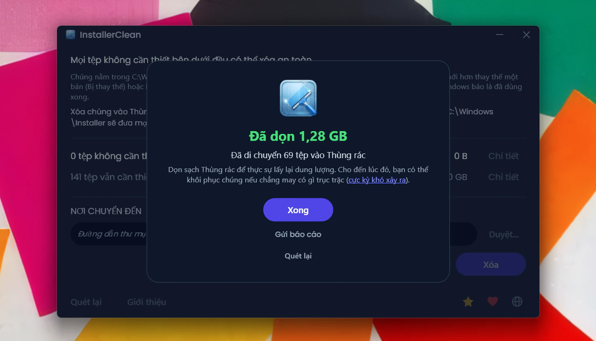
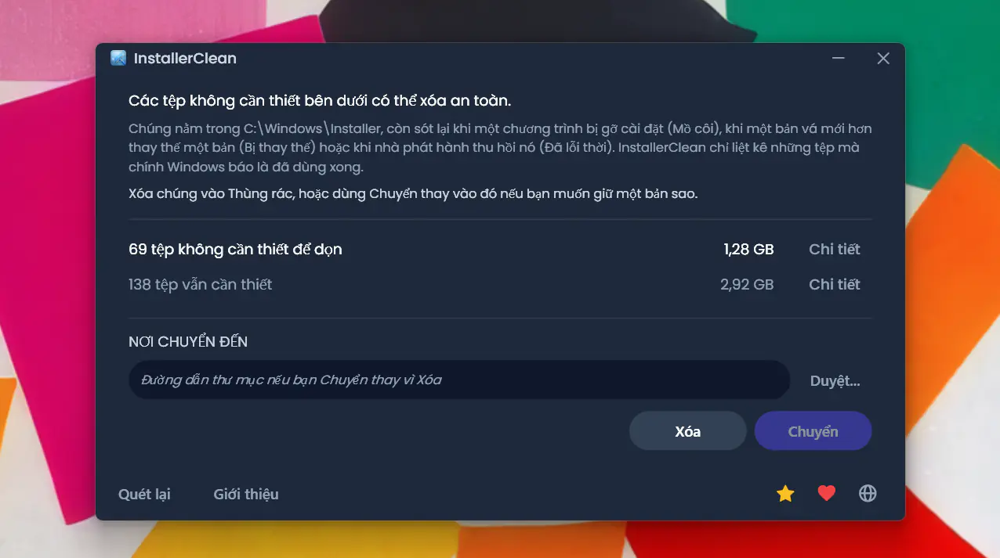
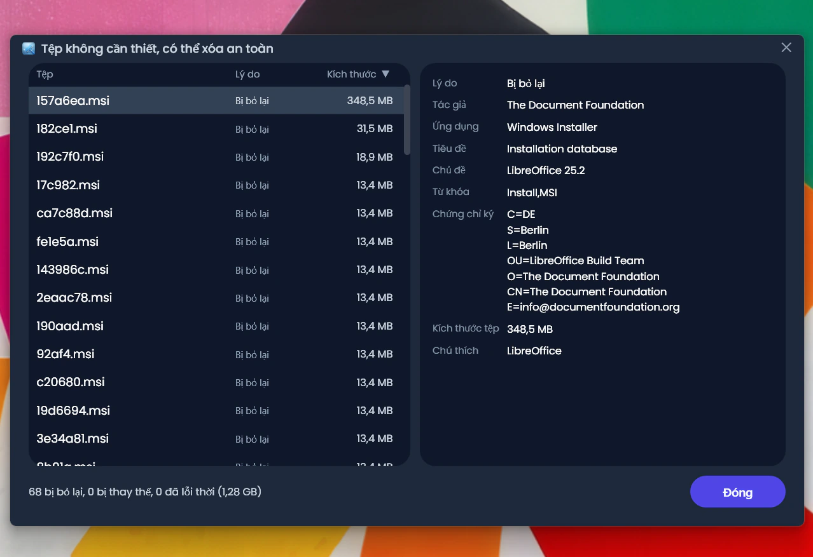
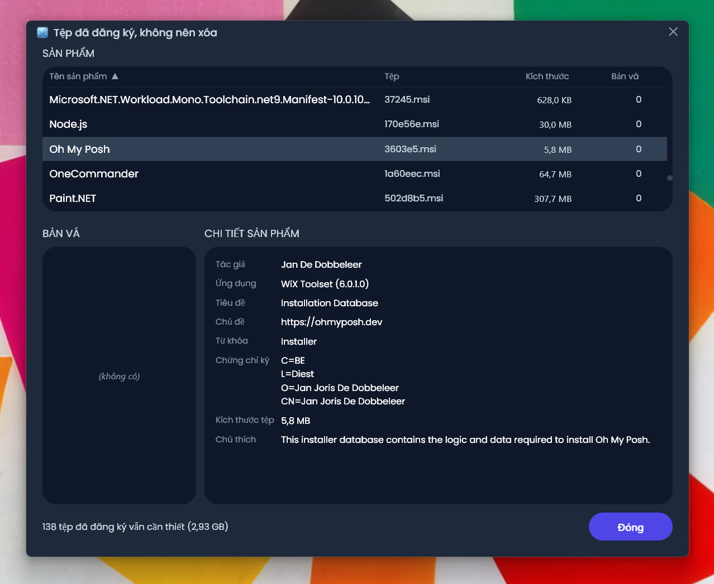
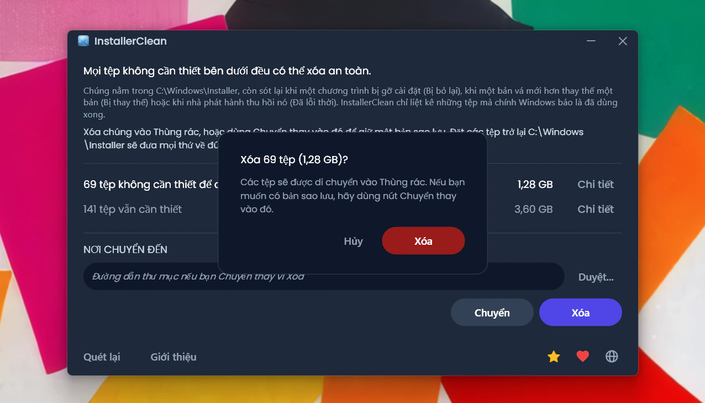
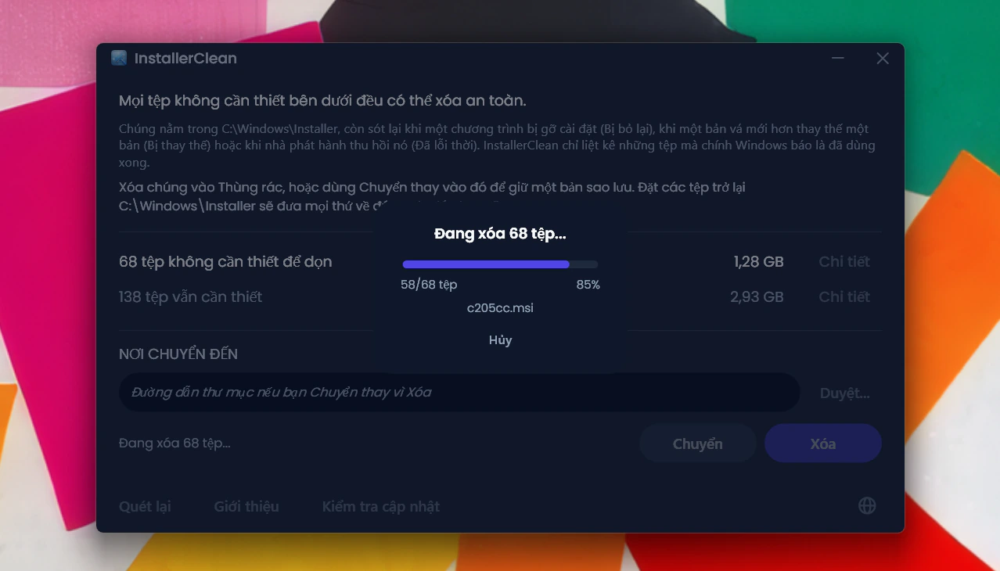

<p align="center">
  <a href="README.md">English</a> · <a href="README.zh-CN.md">简体中文</a> · <a href="README.ru.md">Русский</a> · <a href="README.es.md">Español</a> · <a href="README.ar.md">العربية</a> · <a href="README.ja.md">日本語</a> · <a href="README.pt-BR.md">Português (BR)</a> · <a href="README.pl.md">Polski</a> · <a href="README.tr.md">Türkçe</a> · <a href="README.ko.md">한국어</a> · <a href="README.fr.md">Français</a> · <a href="README.it.md">Italiano</a> · <a href="README.de.md">Deutsch</a> · <a href="README.id.md">Bahasa Indonesia</a> · <strong>Tiếng Việt</strong> · <a href="README.uk.md">Українська</a> · <a href="README.nl.md">Nederlands</a>
</p>

<p align="center">
  
</p>

<p align="center"><em>🎶 What's my line? I'm happy <a href="https://www.youtube.com/watch?v=HM-jHhUZfFI">cleaning Windows</a></em></p>

<h1 align="center">InstallerClean</h1>

<p align="center"><strong>Một công cụ mã nguồn mở giúp dọn dẹp an toàn <code>C:\Windows\Installer</code>, thư mục ẩn của Windows đang âm thầm ngốn dung lượng đĩa của bạn.</strong></p>

<p align="center"><em>Năm thì mười họa mới dùng đến. Biết đâu dọn ra được chút dung lượng. Rồi nhẹ nhõm bước tiếp.</em></p>

<p align="center">
  <a href="LICENSE"></a>
  <a href="https://dotnet.microsoft.com/download/dotnet/10.0"></a>
  <a href="https://github.com/no-faff/InstallerClean/actions/workflows/ci.yml"></a>
  <a href="https://github.com/no-faff/InstallerClean/releases"></a>
  <a href="https://github.com/no-faff/InstallerClean/releases/latest"></a>
  <a href="https://github.com/no-faff/InstallerClean/releases"></a>
</p>



- **Là gì:** InstallerClean chỉ làm một việc: nó loại bỏ những tệp không cần thiết khỏi `C:\Windows\Installer`, một thư mục ẩn mà Windows không bao giờ dọn dẹp. Sau một lần quét gần như tức thì, nó cho bạn biết bạn có tệp như vậy hay không, hiển thị thêm chi tiết cho ai tò mò, và cho phép bạn xóa chúng để giải phóng dung lượng trên ổ C:. Bạn dùng một lần rồi thôi.
- **Có lẽ bạn đến đây vì:** Bạn đã dùng [WinDirStat](https://github.com/windirstat/windirstat), WizTree hoặc TreeSize, thấy `C:\Windows\Installer` chiếm rất nhiều dung lượng mà không biết bên trong có gì. InstallerClean chính là thứ bạn cần. Nó biết những tệp có tên trông ngẫu nhiên như `9f05cba.msi` chứa gì, và nhanh chóng cho bạn biết tệp nào có thể xóa an toàn.
- **Giải phóng được bao nhiêu:** Các báo cáo (tùy chọn và ẩn danh) gửi về cho đến nay cho thấy <!-- reports-freedpct-start -->54%<!-- reports-freedpct-end --> số máy có tệp không cần thiết để dọn. Trong số đó, trung vị giải phóng được là <!-- reports-median-start -->19,9 GB<!-- reports-median-end --><!-- reports-biggest-start --> và bốn máy dọn được nhiều nhất là 327, 228, 162 và 152 GB<!-- reports-biggest-end -->. Với tôi thì được 1,28 GB. <!-- reports-nothingpct-start -->46%<!-- reports-nothingpct-end --> còn lại không tìm thấy gì để loại bỏ, điều đó chỉ có nghĩa là thư mục Installer của họ vốn đã sạch. Xem thêm chi tiết trong phần [FAQ](#faq) bên dưới.
- **Có an toàn không:** Có. Nó hỏi chính API Windows Installer xem những tệp nào vẫn còn cần, và chỉ liệt kê những tệp Windows báo là đã dùng xong. Nó là mã nguồn mở (Apache 2.0) và không hỏi gì về bạn: không tài khoản, không quảng cáo, không theo dõi, không thu thập dữ liệu, không có gì chạy ngầm. Việc duy nhất nó tự mình làm trên mạng là kiểm tra GitHub xem có phiên bản mới hơn không mỗi khi bạn chạy nó, và bạn có thể tắt việc đó.
- **Tải về:** [Tải bản phát hành mới nhất](../../releases/latest). Chạy nó; bấm qua [cảnh báo “Nhà phát hành không xác định”](#unknown-publisher) và [lời nhắc quyền quản trị](#admin). Xóa mọi tệp không cần thiết. Xong.

## Nội dung

- [Thư mục không ai nói cho bạn biết](#thư-mục-không-ai-nói-cho-bạn-biết)
- [Đi tìm trợ giúp](#đi-tìm-trợ-giúp)
- [Nó làm gì](#nó-làm-gì)
- [Ảnh chụp màn hình](#ảnh-chụp-màn-hình)
- [Cách hoạt động](#cách-hoạt-động)
- [Có an toàn không?](#có-an-toàn-không)
- [Nếu bạn thật sự thiếu một tệp trong C:\Windows\Installer](#recovery)
- [Khả năng tiếp cận](#khả-năng-tiếp-cận)
- [Những gì nó không làm](#những-gì-nó-không-làm)
- [FAQ](#faq)
- [Tải về](#tải-về)
- [So với PatchCleaner](#so-với-patchcleaner)
- [Dòng lệnh](#dòng-lệnh)
- [Yêu cầu](#yêu-cầu)
- [Biên dịch từ mã nguồn](#biên-dịch-từ-mã-nguồn)
- [Đóng góp](#đóng-góp)
- [Ủng hộ dự án](#ủng-hộ-dự-án)
- [Lịch sử lượt sao](#lịch-sử-lượt-sao)
- [Giấy phép](#giấy-phép)

---

## Thư mục không ai nói cho bạn biết

Trên mọi máy tính Windows đều có một thư mục ẩn tên là `C:\Windows\Installer`. Mỗi lần bạn cài phần mềm dùng hệ thống Windows Installer, hoặc áp dụng một bản vá cho Microsoft Office, Adobe Acrobat, Visual Studio hay bất kỳ ứng dụng nào dựa trên `.msi` khác, một bản sao của trình cài đặt đó hoặc tệp vá `.msp` sẽ được đưa vào thư mục này, và ở lại đó.

Khi bạn gỡ cài đặt phần mềm, các tệp vẫn còn. Khi một bản vá mới thay thế bản cũ, cả hai đều còn. Windows không bao giờ dọn chúng đi. Disk Cleanup không đụng tới chúng. DISM thì dành cho một thư mục hoàn toàn khác. Theo thời gian, thư mục này phình to: 1 GB, 5 GB, 20 GB, 50 GB. Trên những máy có nhiều phần mềm dùng MSI (Acrobat là thủ phạm thường gặp), nó có thể [vượt quá 100 GB](https://www.reddit.com/r/sysadmin/comments/1oxcrmh/acrobat_filling_up_the_cwindowsinstaller_folder/).

Đây không phải những tệp tạm tự quay lại. Chúng là gánh nặng thật sự: những trình cài đặt cũ của phần mềm bạn đã gỡ từ nhiều năm trước, và những bản vá đã bị thay thế nhiều lần. Một khi đã xóa, chúng không quay lại nữa.

**Nếu bạn đang tìm một cách dễ dàng để giải phóng dung lượng đĩa trên Windows, thư mục này là một nơi tốt để bắt đầu.** InstallerClean tìm những tệp không cần thiết và loại bỏ chúng một cách an toàn.

## Đi tìm trợ giúp

Nếu bạn từng tìm cách xử lý thư mục này, hẳn bạn biết nó diễn ra thế nào. Một người có 180 GB trong `C:\Windows\Installer` hỏi cách dọn nó. Họ [được khuyên chạy Disk Cleanup](https://learn.microsoft.com/en-us/answers/questions/4238108/windows-installer-folder-has-occupied-180gb). Họ thử. Nó dọn được 600 MB, không phần nào trong số đó từ thư mục kia (vì Disk Cleanup không đụng tới `C:\Windows\Installer`). Rồi chủ đề rơi vào im lặng.

> *“Tất cả các chủ đề tôi tìm được đều có xu hướng khuyên cùng những thứ chẳng giải quyết được vấn đề, rồi sau đó chết hẳn.”*
>
> [ksparks519, r/Windows10](https://www.reddit.com/r/Windows10/comments/1bt8c5p/anyone_ever_figure_out_giant_installer_folders/) (dịch từ nguyên văn tiếng Anh)

Hoặc họ được bảo là đừng đụng vào nó. Trong một chủ đề, một người có thư mục Installer 60 GB được bảo là [“đừng nghịch vào nó.”](https://www.reddit.com/r/techsupport/comments/1hw4suq/my_windows_installer_folder_is_like_60gb_so_i/) Khi họ hỏi vậy nên làm gì thay vào đó, câu trả lời là: *“Tôi vừa nói rồi đấy.”*

Lời khuyên thường gặp nhầm lẫn giữa việc xóa tệp một cách bừa bãi (vốn thật sự nguy hiểm) với việc loại bỏ những tệp mà chính Windows nói là không còn cần nữa (vốn không nguy hiểm). InstallerClean làm việc thứ hai.

## Nó làm gì

1. **Quét** `C:\Windows\Installer` để tìm các tệp `.msi` và `.msp`
2. **Truy vấn** API Windows Installer để biết tệp nào vẫn còn được đăng ký
3. **Hiển thị** bạn có thể giải phóng bao nhiêu và còn cần giữ lại bao nhiêu, với các cửa sổ chi tiết tùy chọn liệt kê từng tệp
4. **Loại bỏ** những tệp không cần thiết: xóa vào Thùng rác, hoặc chuyển sang một thư mục bạn chọn

## Ảnh chụp màn hình

<p>
  <br>
  <em>Lần quét đầu. Việc này rất nhanh.</em>
  <br><br>
</p>

<p>
  <br>
  <em>Kết quả: còn cần giữ bao nhiêu, có thể loại bỏ bao nhiêu.</em>
  <br><br>
</p>

<p>
  <br>
  <em>Chi tiết những tệp không còn cần nữa.</em>
  <br><br>
</p>

<p>
  <br>
  <em>Chi tiết những tệp vẫn cần giữ, với siêu dữ liệu đọc từ cơ sở dữ liệu trình cài đặt.</em>
  <br><br>
</p>

<p>
  <br>
  <em>Xác nhận trước cả hai thao tác. Xóa sẽ di chuyển vào Thùng rác; Chuyển đặt các tệp ở nơi bạn chọn.</em>
  <br><br>
</p>

<p>
  <br>
  <em>Quá trình xóa đang chạy. Hủy sẽ dừng giữa chừng.</em>
  <br><br>
</p>

<p>
  <br>
  <em>Sau khi Xóa thành công.</em>
  <br><br>
</p>

<p>
  <br>
  <em>Sau khi quét lại. Không còn gì để dọn.</em>
  <br><br>
</p>

## Cách hoạt động

InstallerClean nhận diện ba loại tệp không cần thiết.

**Tệp mồ côi** là các trình cài đặt `.msi` (và những bản vá `.msp` nếu có) còn sót lại sau khi bạn gỡ phần mềm. Windows không còn tham chiếu tới chúng, nhưng các tệp vẫn nằm trong thư mục và chiếm chỗ.

**Bản vá bị thay thế** là những bản vá `.msp` cũ đã bị bản mới hơn thay thế. Windows đánh dấu chúng là đã bị thay thế trong cơ sở dữ liệu của mình nhưng không bao giờ xóa. Những nhà cung cấp phát hành bản vá thường xuyên (Acrobat, Office, các công cụ phát triển lớn) tích tụ bản vá bị thay thế vô tận.

**Bản vá đã lỗi thời** là những bản vá `.msp` mà nhà phát hành đã thu hồi hoặc ngừng dùng thay vì thay thế bằng phiên bản mới hơn. Windows cũng ghi nhận trạng thái đó, và cũng để tệp lại trong thư mục.

Để tìm chúng, InstallerClean gọi trực tiếp giao diện COM của Windows Installer thông qua P/Invoke:

- `MsiEnumProductsEx` để liệt kê mọi sản phẩm đã cài
- `MsiEnumPatchesEx` để tìm tất cả bản vá đã đăng ký của mỗi sản phẩm
- `MsiGetPatchInfoEx` để đọc trạng thái bản vá (đã áp dụng, đã bị thay thế hoặc đã lỗi thời)

Bất kỳ tệp `.msi` hoặc `.msp` nào trong `C:\Windows\Installer` mà không được sản phẩm đã đăng ký nào nhận là của mình thì đều là tệp mồ côi và bị đánh dấu là có thể loại bỏ. Tương tự với bất kỳ bản vá nào mà cơ sở dữ liệu đánh dấu là đã bị thay thế hoặc đã lỗi thời và không cần thiết cho việc gỡ cài đặt.

Ứng dụng còn đọc chính những bản ghi đó trực tiếp từ registry trong mỗi lần quét, như một nguồn thứ hai, độc lập. Nếu một trong hai lần đọc trả về dữ liệu không đầy đủ (hiếm, nhưng có thể xảy ra khi trạng thái trình cài đặt bị hỏng), InstallerClean sẽ giữ tệp lại hoặc từ chối lượt quét thay vì đoán. Lần đọc thứ hai này chỉ thêm tệp vào nhóm “vẫn cần giữ”, không bao giờ thêm vào nhóm “có thể loại bỏ”.

Sau khi một thao tác Chuyển hoặc Xóa hoàn tất, các thư mục con rỗng bên trong `C:\Windows\Installer` (những thư mục mà bộ nhớ đệm để lại khi nội dung đã biến mất) được dọn luôn trong cùng lượt đó.

<a id="is-it-safe"></a>
## Có an toàn không?

Có. InstallerClean truy vấn chính cơ sở dữ liệu API Windows Installer mà Windows dùng để theo dõi những gì đã được cài. Nếu Windows nói một tệp không còn cần nữa, ứng dụng tin vào điều đó; nó không phỏng đoán dựa trên tên tệp hay ngày tháng.

**Về Xóa và Chuyển.** Những tệp InstallerClean xóa có thể xóa vĩnh viễn một cách an toàn. **Xóa** sẽ di chuyển chúng vào Thùng rác (bạn sẽ được cảnh báo nếu Thùng rác không khả dụng); bạn lấy lại dung lượng trên ổ C: khi dọn sạch Thùng rác.

Tuy nhiên, bạn không cần phải tin lời tôi rằng các tệp đó an toàn để xóa. Khi chúng còn trong Thùng rác, bạn có cơ hội kiểm tra xem những ứng dụng dùng thư mục này, như Office, Acrobat, Visual Studio và tương tự, vẫn cập nhật và gỡ cài đặt bình thường hay không. Nếu bạn phát hiện có gì đó hỏng (cực kỳ khó xảy ra, và cho đến nay chưa có báo cáo nào sau <!-- downloads-start -->47.000+<!-- downloads-end --> lượt tải), hãy khôi phục các tệp từ Thùng rác để khắc phục. Để cho thật chắc, bạn có thể dùng **Chuyển** thay vào đó, để sao lưu các tệp vào một thư mục bạn chọn (tất nhiên hãy chọn thư mục trên một phân vùng/ổ đĩa khác nếu bạn muốn giải phóng dung lượng trên C:). Chỉ cần chép các tệp trở lại `C:\Windows\Installer` là mọi thứ về như cũ (dù gần như chắc chắn bạn sẽ không bao giờ cần đến). Nếu tên một tệp bị thêm “(1)” (điều đó xảy ra nếu bạn chuyển tệp vào cùng một thư mục hai lần), hãy bỏ phần đó đi trước khi chép tệp trở lại.

Nếu Windows Installer đang ghi vào bộ nhớ đệm, có một giao dịch trước đó đang bị tạm dừng, hoặc có một thao tác đổi tên sau khi khởi động lại đang xếp hàng nhắm vào bộ nhớ đệm, thì Chuyển và Xóa bị vô hiệu hóa và lý do cụ thể sẽ được hiển thị.

Các dịch vụ quét, truy vấn, chuyển, xóa, cài đặt và kiểm tra khởi động lại đang chờ đều được bao phủ bởi một bộ kiểm thử tự động chạy ở mỗi lần commit (xem huy hiệu CI ở trên).

**Kiểm chứng tệp nhị phân.** InstallerClean không được ký số, nhưng bạn không phải tin một cách mù quáng rằng nó an toàn:

- Mã băm SHA-256 của mỗi bản phát hành được liệt kê trên [trang phát hành](../../releases/latest).
- VirusTotal: mỗi bản dựng đều được quét, với kết quả đầy đủ theo từng công cụ được liên kết trên trang phát hành của bản đó, để bạn có thể xem từng tệp được chấm điểm ra sao và tự quét lại. Một báo động giả còn hiệu lực vào lúc một bản phát hành ra mắt sẽ được nêu đích danh và giải thích trên trang của bản phát hành đó, và trang đó được cập nhật ngay khi hãng gỡ bỏ nó.
- Mã nguồn nằm tại [github.com/no-faff/InstallerClean](https://github.com/no-faff/InstallerClean) và CI biên dịch và kiểm thử mọi lần commit (xem huy hiệu CI màu xanh ở trên).
- Các bản dựng phát hành có tính tất định: thiết lập của trình biên dịch khiến cùng một mã nguồn và cùng một SDK luôn cho ra đúng những byte như nhau, còn quy trình phát hành thì từ chối gắn tag cho một phiên bản nếu các tệp exe phát hành không được dựng từ một cây làm việc sạch đúng tại tag đó. Vậy nên bạn có thể checkout tag đó, tự dựng lấy rồi đối chiếu mã băm với mã băm đã công bố: có thể chứng minh được rằng tệp bạn tải về khớp với mã nguồn công khai. Trước hết hãy dùng đúng phiên bản SDK (ghi chú của mỗi bản phát hành cho biết nó được dựng bằng SDK nào); một bản vá SDK khác sẽ cho ra byte khác, trông như không khớp nhưng thực ra không phải vậy.
- <!-- downloads-start -->47.000+<!-- downloads-end --> lượt tải trên GitHub, MajorGeeks và Softpedia.
- [MajorGeeks](https://www.majorgeeks.com/files/details/installerclean.html) kiểm tra mỗi lần gửi trong một máy ảo và chỉ đăng nếu nó vượt qua được phần đánh giá của họ.<br><a href="https://www.majorgeeks.com/files/details/installerclean.html"></a>
- [Softpedia](https://www.softpedia.com/get/System/Hard-Disk-Utils/InstallerClean.shtml) kiểm tra mỗi bản phát hành để phát hiện virus, phần mềm gián điệp và phần mềm quảng cáo.<br><a href="https://www.softpedia.com/get/System/Hard-Disk-Utils/InstallerClean.shtml"></a>

<a id="recovery"></a>
## Nếu bạn thật sự thiếu một tệp trong `C:\Windows\Installer`

InstallerClean chỉ loại bỏ những tệp mà chính Windows báo là không còn cần nữa, nên nó không bao giờ có thể là nguyên nhân khiến một tệp bị thiếu. Nhưng nếu một tệp đã biến mất sẵn, InstallerClean sẽ phát hiện và đánh dấu nó. Đây là cách khắc phục.

Tải trình cài đặt của chương trình đó từ nhà sản xuất và chạy nó đè lên bản cài đặt hiện có của bạn; đừng gỡ cài đặt trước. Hãy dùng đúng phiên bản bạn đang có nếu được, vì Windows có thể từ chối một phiên bản khác. Cách này thường đặt tệp trở lại và không động đến cài đặt của bạn. Quét lại trong InstallerClean và cảnh báo sẽ biến mất nếu nó có tác dụng.

Cách này thường có tác dụng. Phần tiếp theo là trình bày đầy đủ hơn của chính Microsoft: chi tiết chính thức, và những trường hợp khó hơn khi mọi việc không đơn giản như vậy. Không điều nào trong đó là do InstallerClean gây ra, và tôi không thể cải thiện hướng dẫn của Microsoft, nên tôi chỉ truyền đạt lại.

<details>
<summary>Trình bày đầy đủ hơn của Microsoft</summary>

*Các trích dẫn của Microsoft dưới đây được giữ nguyên văn tiếng Anh.*

Hướng dẫn đầy đủ: [Restore missing Windows Installer cache files](https://learn.microsoft.com/en-us/troubleshoot/windows-client/application-management/missing-windows-installer-cache).

*Vấn đề có thể không xuất hiện ngay:*
> "If the installer cache is compromised, you may not immediately see problems until you take an action such as uninstalling, repairing, or updating a product."

*Các tệp là duy nhất cho từng máy, nên bạn không thể chép một tệp từ PC khác:*
> "Missing files cannot be copied between computers because the files are unique."

*Bạn cũng không thể lấy riêng tệp đó ra từ một bản sao lưu:*
> "To restore the missing files, a full system state restoration is required. It is not possible to replace only the missing files from a previous backup."

*Cách khôi phục được khuyến nghị, và những giới hạn thẳng thắn của nó:*
> "If application files are missing from the Windows Installer Cache, ask the vendor or support team for the application about the missing files. You must follow the procedures or steps recommended by the application vendor to restore the files. In some cases, you may have to rebuild the operating system and reinstall the application to fix the problem."
>
> "Windows support engineers cannot help you recover missing application files from the Windows Installer cache."

*Vì sao cùng phiên bản lại quan trọng:*
> "The upgrade cannot be installed by the Windows Installer service because the program to be upgraded may be missing, or the upgrade may update a different version of the program."

</details>

## Khả năng tiếp cận

InstallerClean được xây dựng để có thể sử dụng hoàn toàn bằng bàn phím và với trình đọc màn hình.

- **Thao tác bằng bàn phím xuyên suốt.** Phím Tab tới được mọi điều khiển, và các cột trong cửa sổ chi tiết có thể sắp xếp bằng bàn phím, nên ở đây không có gì cần đến chuột. Tiêu điểm bàn phím luôn hiện rõ ở bất cứ nơi nào nó dừng lại.
- **Trình tường thuật và Truy nhập bằng giọng nói.** Mọi điều khiển đều có nhãn, và từ ngữ hiển thị trên một nút chính là từ kích hoạt nút đó bằng giọng nói. Khi một thao tác Chuyển hoặc Xóa hoàn tất, kết quả được đọc to lên.
- **Được làm để dễ đọc.** Văn bản đạt độ tương phản WCAG AA trên toàn bộ giao diện tối.

Nếu có điều gì ở đây cản trở bạn, hãy [mở một issue](../../issues). Các vấn đề về khả năng tiếp cận là lỗi, không phải trường hợp ngoại lệ hiếm gặp.

## Những gì nó không làm

- WinSxS (`C:\Windows\WinSxS`) là một thư mục khác với những quy tắc khác. Với thư mục đó, hãy chạy `Dism /Online /Cleanup-Image /StartComponentCleanup` từ một dấu nhắc lệnh có quyền nâng cao.
- Không có dịch vụ chạy ngầm, không có tác vụ theo lịch, không tự động dọn. Ứng dụng chỉ chạy khi bạn khởi động nó.
- Nó không thay đổi các chương trình đã cài đặt của bạn hay cơ sở dữ liệu Windows Installer, chỉ đọc chúng. Thứ duy nhất nó từng ghi vào Registry là việc đăng ký nguồn sự kiện, chỉ làm một lần, mà công cụ dòng lệnh cần đến để các lần chạy của nó hiện ra trong Nhật ký Sự kiện Windows.
- Nó tự mình tạo đúng một loại kết nối: mỗi khi bạn chạy, nó xem nhanh trang phát hành của GitHub có phiên bản mới hơn không, và bạn có thể tắt việc này trong cửa sổ Giới thiệu. Mọi thứ khác chỉ xảy ra khi bạn yêu cầu: báo cáo ẩn danh tùy chọn (chỉ để cho tôi biết nó đang hoạt động) và các liên kết tới tài liệu trên GitHub cùng một trang quyên góp, sẽ mở trong trình duyệt của bạn nếu bạn bấm vào. Nó không bao giờ tự tải về bất cứ thứ gì.
- Không thanh công cụ, không phần mềm đi kèm, không phần mềm quảng cáo.

## FAQ

<a id="reports-stats"></a>
**Tôi có thật sự giải phóng được hàng GB dung lượng không?** Còn tùy máy của bạn. Một bản Windows 11 cài mới không có phần mềm nào thêm thì chẳng có gì để loại bỏ. Một máy trạm của lập trình viên dùng lâu năm, hoặc bất kỳ máy nào có nhiều phần mềm dựa trên MSI (Acrobat, Office, LibreOffice, các công cụ phát triển lớn), có thể có hàng chục GB. Dù sao đi nữa, bạn sẽ thấy chính xác là bao nhiêu ngay khi chạy nó.

<!-- reports-stats-start (generated; do not hand-edit between these markers) -->
Trong số 156 báo cáo mọi người đã gửi về (cảm ơn 🙏) kể từ khi v1.8.0 thêm tùy chọn này, 54% số máy có thứ để dọn. Cụ thể là bao nhiêu:

| Dung lượng giải phóng | Báo cáo | |
|---|---|---|
| Dưới 1 GB | 13 | █████████████ |
| 1 đến 5 GB | 9 | █████████ |
| 5 đến 10 GB | 9 | █████████ |
| 10 đến 25 GB | 21 | █████████████████████ |
| 25 đến 50 GB | 24 | ████████████████████████ |
| 50 đến 100 GB | 5 | █████ |
| Trên 100 GB | 4 | ████ |
<!-- reports-stats-end -->

<details>
<summary>Những báo cáo đó đến từ nút “Gửi báo cáo” tùy chọn. Đây là những gì bạn thấy trước khi có bất cứ thứ gì được gửi đi.</summary>


</details>

<a id="admin"></a>

**Vì sao nó cần quyền Administrator?** `C:\Windows\Installer` bị khóa, chỉ quản trị viên mới truy cập được. Việc đọc thư mục, truy vấn cơ sở dữ liệu trình cài đặt và chuyển hay xóa tệp đều cần quyền đó, nên ứng dụng buộc phải chạy với quyền quản trị.

<a id="unknown-publisher"></a>

**Vì sao Windows báo “Nhà phát hành không xác định”?** Vì InstallerClean không được ký số, và Windows đánh dấu các tệp tải về từ internet, nên trong lần chạy đầu tiên Windows SmartScreen thường hiện “Windows đã bảo vệ PC của bạn” với nhà phát hành ghi là không xác định. Một chứng chỉ ký số tốn tiền mỗi năm, và tôi thà giữ ứng dụng miễn phí còn hơn phải trả tiền cho nó. Hãy bấm **Thông tin khác**, rồi **Vẫn chạy**. Làm vậy là an toàn: mã nguồn là công khai, và mỗi bản phát hành đều có liên kết VirusTotal và mã băm SHA-256 mà bạn có thể kiểm tra trước.

**Tôi có thể hoàn tác một lần Xóa không?** Thường là có. Khi Thùng rác khả dụng cho ổ đĩa đó, Xóa sẽ di chuyển tệp vào đó và bạn có thể khôi phục chúng từ Thùng rác. Nếu Thùng rác không khả dụng, ứng dụng không bao giờ tự ý xóa vĩnh viễn (xem [Có an toàn không?](#có-an-toàn-không)). Và nếu bạn muốn có một lối quay lại do chính mình kiểm soát, Chuyển sẽ đặt các tệp vào một thư mục bạn chọn; hãy xóa chúng khỏi đó bất cứ khi nào bạn thấy yên tâm.

**Windows có phàn nàn nếu tôi loại bỏ những tệp này không?** Không. InstallerClean chỉ loại bỏ những tệp mà chính Windows báo là đã dùng xong, nên không có gì nó loại bỏ lại cần cho việc sửa chữa, cập nhật hay gỡ cài đặt một chương trình. Nếu một tệp cần thiết bị thiếu khỏi `C:\Windows\Installer` vì một lý do nào khác, hãy xem [Nếu bạn thật sự thiếu một tệp trong C:\Windows\Installer](#recovery).

**Vì sao không dùng `Win32_Product` (WMI)?** [`Win32_Product` kích hoạt các thao tác sửa chữa MSI trên mọi sản phẩm trong lúc liệt kê](https://gregramsey.net/2012/02/20/win32_product-is-evil/), việc này có thể mất vài phút và gây tải nặng cho ổ đĩa. InstallerClean gọi trực tiếp API COM của Windows Installer mà không gây tác dụng phụ nào.

**Sao không dùng luôn một script PowerShell?** Một script ngắn gọi `MsiEnumPatchesEx` là đủ để *liệt kê* các bản vá, nhưng những phần cốt lõi của InstallerClean lại là những thứ một script bỏ qua: việc phân loại mồ côi và bị thay thế, phương án dự phòng bằng registry vốn chỉ thêm tệp vào nhóm “vẫn cần giữ” (không bao giờ vào nhóm “có thể loại bỏ”), việc chặn khi đang chờ khởi động lại, lưới an toàn Chuyển-đi-nơi-khác, tiến trình theo từng tệp có thể hủy, và mặc định đưa-vào-Thùng-rác-thay-vì-xóa-vĩnh-viễn. Các trường hợp ngoại lệ trên những máy thật sự nhiều MSI (đăng ký hỏng, junction bên trong bộ nhớ đệm, sản phẩm trong `HKU\.DEFAULT`, giao dịch trình cài đặt bị tạm dừng) rất dễ bị xử lý sai trong một script làm vội. `installerclean-cli` là bộ mặt không giao diện nếu bạn muốn viết script.

**Nó có chạy trên Windows 7 hay 8 không?** Chưa được kiểm thử và không được hỗ trợ. Hướng đến Windows 10 và 11.

**Nó có phù hợp cho RMM / triển khai hàng loạt không?** Có. CLI thoát với các mã riêng biệt theo từng kết quả (0 thành công, 2 một phần, 1 thất bại nặng, 75 tạm thời, 130 cho trường hợp Ctrl+C trước khi xử lý bất kỳ tệp nào; một lần Ctrl+C rơi vào giữa lô sẽ thoát 2, vì đã có việc được thực hiện), nhờ vậy một tác vụ theo lịch có thể thử lại khi gặp 75 mà không lẫn nó với những thất bại nặng. Nó ghi một bản tóm tắt cho mỗi lần chạy vào nhật ký sự kiện Application và tôn trọng cùng một mutex một-thực-thể như GUI. Trình cài đặt cũng cài đặt im lặng với các tham số chuẩn của Inno Setup (`/SILENT` hoặc `/VERYSILENT`); việc khởi chạy sau cài đặt được bỏ qua khi cài im lặng. Xem phần Dòng lệnh.

## Tải về

Ba bản dựng, chọn một:

- **Setup** (`InstallerClean-2.3.0-setup.exe`): một trình cài đặt Windows thông thường, đã đóng gói sẵn .NET 10 runtime. Thêm một mục vào Start Menu và gỡ cài đặt gọn gàng. Được xếp vào danh sách chương trình để bạn dễ tìm lại sau sáu tháng nữa.
- **Portable** (`InstallerClean-2.3.0-portable.exe`): một tệp exe độc lập duy nhất đã đóng gói sẵn runtime. Không cài đặt, không có trình gỡ. Chạy, dùng, rồi xóa. Chạy lại bất cứ khi nào.
- **CLI** (`installerclean-cli.exe`): riêng bản dòng lệnh, một tệp exe độc lập duy nhất. Không cài đặt, không để lại gì trên máy sau đó. Thả nó lên một máy khách, chạy một lần quét hay một lần dọn, rồi xóa. Được tạo ra cho việc viết script, các tác vụ theo lịch và triển khai hàng loạt, khi bạn muốn thực hiện các thao tác mà không cần ứng dụng desktop trên máy khách. Xem [Dòng lệnh](#dòng-lệnh) để biết các tham số và mã thoát.

Từ 2.2.0, tên tệp của bản cài đặt và bản portable có kèm số phiên bản, nên một bản đã tải về luôn cho biết nó là gì; công cụ dòng lệnh vẫn giữ tên đơn giản `installerclean-cli.exe` để các tác vụ theo lịch và script đang trỏ tới nó tiếp tục chạy qua các lần cập nhật.

Tải từ [trang phát hành](../../releases/latest), rồi chạy. Nó không được ký số, nên Windows hiện cảnh báo “Nhà phát hành không xác định”; phần [FAQ](#unknown-publisher) giải thích bạn sẽ thấy gì và vì sao nó an toàn.

Ứng dụng tự động quét khi khởi động. Hãy xem lại kết quả, rồi bấm **Xóa** hoặc **Chuyển**.

Hoặc cài qua [winget](https://learn.microsoft.com/windows/package-manager/winget/):

```
winget install NoFaff.InstallerClean
```

Hoặc cài qua [Scoop](https://scoop.sh):

```
scoop install installerclean
```

## So với PatchCleaner

Nếu bạn từng tìm hiểu về thư mục này, công cụ nhiều khả năng bạn đã gặp nhất là [PatchCleaner](https://www.homedev.com.au/free/patchcleaner). Nó vẫn còn hoạt động tốt, nhưng tôi làm InstallerClean vì PatchCleaner là mã nguồn đóng, không có bản cập nhật nào kể từ tháng 3 năm 2016, và theo mặc định thì không đụng đến các sản phẩm Adobe. Phần kiểm tra tệp mồ côi của nó đánh dấu nhầm các bản vá của Adobe, và việc loại bỏ chúng làm hỏng các bản cập nhật của Adobe, nên nó để yên mọi tệp Adobe trừ khi bạn tắt bộ lọc đi. Trên những máy mà Adobe là thủ phạm tệ nhất, đó lại chính là phần lớn dung lượng:

> *“Tôi đã tải Patchcleaner về để xóa các tệp .msp mồ côi, nhưng hóa ra việc đó chỉ giải phóng được 250 MB dung lượng. 29 GB tệp bị ‘loại trừ bởi bộ lọc’, nên Patchcleaner có vẻ chẳng giúp được gì.”*
>
> HeatherBunny1111, [r/techsupport](https://www.reddit.com/r/techsupport/comments/1qc4tcf/how_to_delete_msp_files_safely/) (dịch từ nguyên văn tiếng Anh)

InstallerClean đọc chính bản ghi bản vá của Windows Installer, nên thay vì giấu mọi tệp của Adobe sau một bộ lọc cào bằng, nó biết được bản vá nào Windows đã đánh dấu là bị thay thế, và ghi nhãn đúng như vậy. Đây là so sánh giữa hai công cụ:

| | **InstallerClean** | **PatchCleaner** |
|---|---|---|
| Cập nhật gần nhất | 2026 (đang hoạt động) | 3 tháng 3 năm 2016 |
| Mã nguồn | Mã nguồn mở (Apache 2.0) | Mã nguồn đóng |
| Runtime | .NET 10 (độc lập) | .NET + VBScript |
| API | Windows Installer COM (trong tiến trình) | Windows Installer COM (ngoài tiến trình, qua VBScript) |
| Phát hiện bản vá bị thay thế | Có | Không |
| Xử lý Adobe | Phát hiện bản vá bị thay thế | Loại trừ theo mặc định |
| Giao diện | Giao diện tối (WPF) | Windows Forms |
| Thu thập dữ liệu | Không | Không |
| An toàn khi xóa | Thùng rác. Nếu không khả dụng, nó hỏi: chuyển đi nơi khác hay xóa vĩnh viễn | Vĩnh viễn, không có Thùng rác |

> **Một lưu ý về `Win32_Product`:** Cách phổ biến nhưng lỗi để liệt kê các sản phẩm đã cài là `Win32_Product` (WMI), vốn [kích hoạt các thao tác sửa chữa MSI](https://gregramsey.net/2012/02/20/win32_product-is-evil/) trên mọi sản phẩm trong lúc liệt kê. Cả InstallerClean lẫn PatchCleaner đều tránh nó. Cả hai đều dùng giao diện COM của Windows Installer. Tên tệp `WMIProducts.vbs` trong script của PatchCleaner gây hiểu nhầm; script đó dùng MSI COM, không phải WMI.

[Ultra Virus Killer (UVK)](https://www.carifred.com/uvk/) cũng cung cấp tính năng dọn dẹp Installer như một phần của mô-đun System Booster, nhưng đó là công cụ trả phí (15-25 USD) và phần dọn dẹp chỉ là một tính năng nhỏ bên trong một ứng dụng lớn hơn nhiều. InstallerClean thì miễn phí, tập trung và mã nguồn mở.

Các trình dọn dẹp hệ thống đa dụng như [CCleaner](https://www.ccleaner.com/) và [BleachBit](https://www.bleachbit.org/) không đụng đến `C:\Windows\Installer`. Thư mục này cần đến các truy vấn API Windows Installer để phân biệt gói đã đăng ký với gói không cần thiết, và một trình dọn dẹp chung chung chỉ duyệt cây tệp có thể làm hỏng các ứng dụng đã cài. InstallerClean là công cụ để dùng đến khi đó đúng là thư mục bạn muốn dọn.

## Dòng lệnh

InstallerClean hỗ trợ vận hành không giao diện cho việc viết script và quản trị hệ thống:

```
Cách dùng:
  installerclean-cli --help        Hiển thị trợ giúp này (cũng nhận /?, -h)
  installerclean-cli --version     In ra phiên bản (cũng nhận -v)
  installerclean-cli /s            Chỉ quét - liệt kê các tệp không cần thiết
  installerclean-cli /d            Xóa các tệp không cần thiết (Thùng rác)
  installerclean-cli /m            Chuyển tới vị trí mặc định đã lưu
  installerclean-cli /m ĐƯỜNG_DẪN  Chuyển tới đường dẫn được chỉ định
```

Để khởi chạy GUI, hãy chạy `InstallerClean.exe` (hoặc dùng lối tắt trong Start Menu từ bản cài đặt).

Chạy mà không có tham số, hoặc với một cờ không được nhận, thì `installerclean-cli` in ra phần cách dùng này và thoát với mã `1`, nhờ vậy một tác vụ theo lịch bị rớt mất cờ sẽ thất bại một cách rõ ràng thay vì âm thầm “thành công” mà chẳng làm gì. Một lệnh `--help`, `/?` hay `-h` rõ ràng sẽ in ra cùng phần cách dùng đó và thoát với mã `0`.

`/s` là một lần chạy thử: nó quét, liệt kê những gì nó sẽ loại bỏ kèm tên tệp và kích thước, rồi thoát. Hữu ích để rà soát trước khi dọn. Mã thoát là `0` khi quét thành công, `1` nếu quét thất bại và `130` khi Ctrl+C. Tất cả các tệp đều nằm trong `C:\Windows\Installer`.

`/d` và `/m` quét rồi mới hành động. `/d` di chuyển các tệp có thể loại bỏ vào Thùng rác. `/m` chuyển chúng vào một thư mục (hoặc thư mục bạn chỉ định trên dòng lệnh, hoặc thư mục mặc định đã lưu từ GUI). Giá trị mặc định đã lưu đó được lưu theo từng người dùng, nên một tác vụ theo lịch chạy dưới quyền SYSTEM hoặc một tài khoản dịch vụ sẽ không thấy nó; những lần chạy như vậy phải chỉ định thư mục một cách rõ ràng bằng `/m PATH`. Mã thoát: `0` cho thành công hoàn toàn, `2` cho một phần (một số tệp thành công, một số thất bại), `1` cho thất bại toàn bộ (quét thất bại, tham số sai hoặc mọi tệp trong lô đều thất bại), `75` cho một tình huống tạm thời đã chặn lần chạy (thông báo in ra giải thích đó là gì và liệu thử lại có ích không), `130` cho một lần Ctrl+C trước khi xử lý bất kỳ tệp nào (một lần Ctrl+C rơi vào giữa lô sẽ thoát `2`, tức một phần, vì đã có việc được thực hiện).

Toàn bộ đầu ra của CLI, bao gồm các thông báo lỗi và chẩn đoán, đều đi tới stdout; không có luồng stderr riêng. Mã thoát là tín hiệu mà máy đọc được (và mục nhật ký sự kiện Application cho mỗi lần chạy phản ánh đúng mã đó), nên một script nên dựa vào mã thoát thay vì phân tích văn bản, và `installerclean-cli /s > audit.txt` ghi lại toàn bộ lần chạy kể cả dòng lỗi nếu có.

Cả ba đều cần một dấu nhắc lệnh có quyền nâng cao (quản trị viên). Nếu Group Policy chặn lời nhắc nâng quyền UAC thì tiến trình từ chối khởi động và Windows trả về lỗi 740 cho shell cha (`$LASTEXITCODE = 740` trong PowerShell). `taskkill /pid <pid>` không kích hoạt việc hủy êm; mutex một-thực-thể được lần chạy kế tiếp khôi phục qua đường AbandonedMutexException.

### Lên lịch dọn dẹp định kỳ

Để dọn dẹp theo lịch, hãy trỏ Task Scheduler tới `installerclean-cli`. Chạy nó dưới quyền SYSTEM hoặc một tài khoản dịch vụ với quyền cao nhất, để nó nhận được quyền nâng cao cần thiết mà không cần lời nhắc tương tác, và chỉ định thư mục đích của việc di chuyển ngay trên dòng lệnh, vì giá trị mặc định lưu từ GUI được lưu theo từng người dùng và không áp dụng cho lần chạy dưới quyền SYSTEM hay tài khoản dịch vụ. Để mỗi tháng chuyển sang `D:\InstallerBackup`, với một bản sao của CLI đặt tại `C:\Tools`:

```
schtasks /create /tn "InstallerClean monthly" /tr "C:\Tools\installerclean-cli.exe /m D:\InstallerBackup" /sc monthly /ru SYSTEM /rl highest
```

Tác vụ sẽ chờ đến khi lần chạy kết thúc và ghi mã thoát vào Last Run Result của nó, nên hệ thống RMM của bạn có thể dựa vào các mã ở trên (`0` thành công hoàn toàn, `2` một phần, `75` tạm thời, `1` thất bại toàn bộ) đúng như cách một script vẫn làm.

### Vì sao là `installerclean-cli` chứ không phải `installerclean.exe`?

`InstallerClean.exe` là GUI WPF; nó không phản hồi các tham số dòng lệnh. `installerclean-cli.exe` là một tệp thực thi console riêng, đi kèm trong cùng thư mục cài đặt và cung cấp đúng các thao tác quét / chuyển / xóa cho PowerShell, cmd và các tác vụ theo lịch. Vì nó là một tiến trình console thật, nó chặn dấu nhắc cho đến khi xong; hãy chuyển hướng hoặc nối ống đầu ra của nó như với bất kỳ tệp exe console nào khác.

Bản tải portable chỉ chứa tệp exe của GUI. Nếu bạn muốn dòng lệnh mà không cần GUI, hãy tải `installerclean-cli.exe` từ [trang phát hành](../../releases/latest) và chạy trực tiếp. Trình cài đặt cũng cài nó cùng với GUI.

## Yêu cầu

- Windows 10 (phiên bản 1607 / build 14393 trở lên, phiên bản cũ nhất mà .NET 10 runtime hỗ trợ) hoặc Windows 11
- Quyền quản trị viên (`C:\Windows\Installer` chỉ dành cho quản trị viên)

Xem [Tải về](#tải-về) để biết các tùy chọn bản dựng setup, portable và CLI.

## Biên dịch từ mã nguồn

```
git clone https://github.com/no-faff/InstallerClean.git
cd InstallerClean
dotnet build src/InstallerClean.sln
```

Chạy các bài kiểm thử:

```
dotnet test src/InstallerClean.Tests/
```

## Đóng góp

Tìm thấy lỗi hay có đề xuất? Hãy [mở một issue](../../issues) hoặc bắt đầu một [thảo luận](../../discussions). Pull request luôn được hoan nghênh. Vui lòng chạy `dotnet test` trước khi gửi.

Giờ đây InstallerClean đã có đầy đủ bằng tiếng Việt: ứng dụng, trình cài đặt, dòng lệnh và cả README này. Tất cả đều là bản dịch máy mà tôi đã cố gắng hết sức; chúng sẽ không hoàn hảo, nên tôi phát hành nguyên trạng thay vì chờ người bản ngữ kiểm tra. Nếu bạn thấy có chỗ nào có thể cải thiện, tôi rất vui nếu bạn cho tôi biết, qua một [issue](../../issues/new?template=translation_review.md), một pull request hoặc một thảo luận. Ứng dụng mặc định mở bằng ngôn ngữ Windows của bạn; bạn có thể chuyển sang tiếng Anh bất cứ lúc nào bằng biểu tượng quả địa cầu.

## Ủng hộ dự án

Nếu InstallerClean đã giúp ích, hãy cân nhắc [ủng hộ No Faff](https://nofaff.netlify.app/support) hoặc để lại một sao trên GitHub.

## Lịch sử lượt sao

<picture>
  <source media="(prefers-color-scheme: dark)" srcset="docs/star-history-dark.svg" />
  <source media="(prefers-color-scheme: light)" srcset="docs/star-history-light.svg" />
  
</picture>

## Giấy phép

[Apache 2.0](LICENSE)

---

🎶 [George Formby - When I'm Cleaning Windows](https://www.youtube.com/watch?v=sfmAeijj5cM). Chúc bạn vui vẻ!
